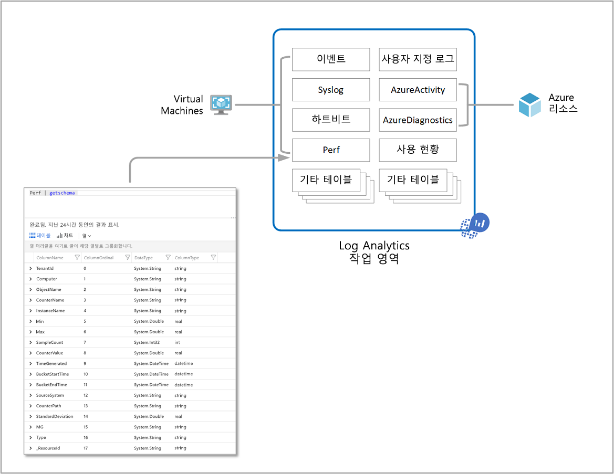
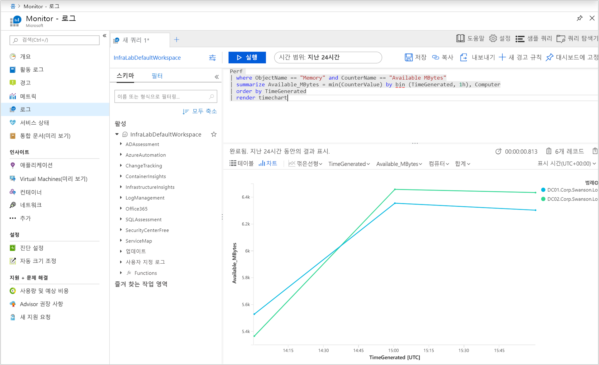
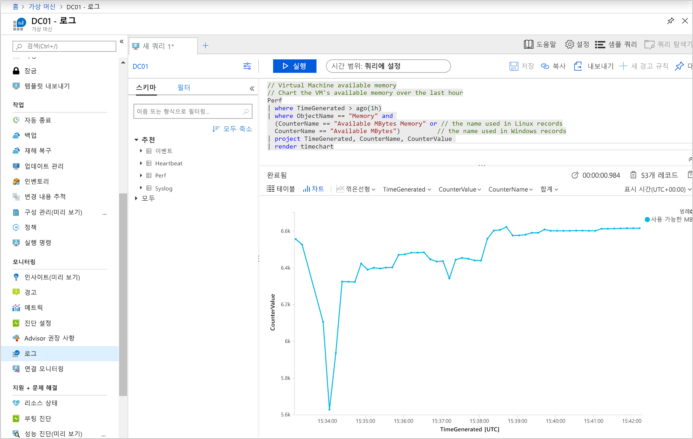
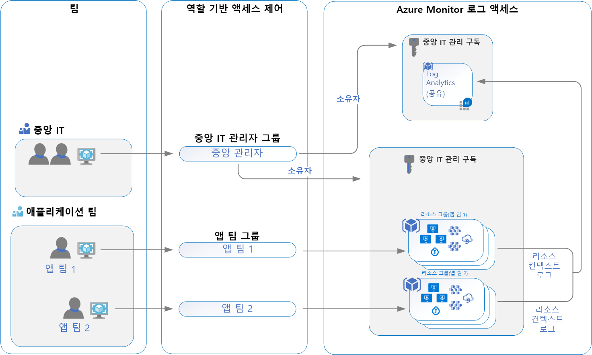

# <a name="designing-your-azure-monitor-logs-deployment"></a>Azure Monitor 로그 배포 디자인

Azure Monitor는 Azure 리소스 및 데이터를 수집 하 고 집계 하 여 관리 경계 역할을 하는 컨테이너에 해당 하는 Log Analytics 작업 영역에 [로그](data-platform-logs.md) 데이터를 저장 합니다. Azure 구독에 하나 이상의 작업 영역을 배포할 수 있지만, 조직에서 요구 하는 비용 효율적이 고 관리 하기 쉽고 확장 가능한 배포를 제공 하기 위해 초기 배포가 지침에 부합 하는지 확인 하기 위해 몇 가지 사항을 고려해 야 합니다.

작업 영역의 데이터는 여러 종류의 데이터를 저장 하 고 데이터를 생성 하는 리소스에 따라 고유한 속성 집합이 있는 테이블로 구성 됩니다. 대부분의 데이터 소스는 Log Analytics 작업 영역에서 자체 테이블에 기록 합니다.



Log Analytics 작업 영역이 제공하는 정보:

* 데이터 저장소에 대 한 지리적 위치입니다.
* 권장 되는 디자인 전략 중 하나에 따라 다른 사용자에 게 액세스 권한을 부여 하 여 데이터를 격리 합니다.
* [가격 책정 계층](./manage-cost-storage.md#changing-pricing-tier), [보존](./manage-cost-storage.md#change-the-data-retention-period)및 [데이터 50,](./manage-cost-storage.md#manage-your-maximum-daily-data-volume)같은 설정의 구성에 대 한 범위입니다.

이 문서에서는 디자인 및 마이그레이션 고려 사항, 액세스 제어 개요 및 IT 조직에 권장 되는 디자인 구현을 이해 하는 방법에 대 한 자세한 개요를 제공 합니다.


## <a name="important-considerations-for-an-access-control-strategy"></a>액세스 제어 전략에 대 한 중요 고려 사항

필요한 작업 영역 수를 확인 하는 것은 다음 요구 사항 중 하나 이상에 의해 영향을 받습니다.

* 글로벌 회사이며 데이터 주권 또는 규정 준수 때문에 특정 지역에 저장된 로그 데이터가 필요합니다.
* Azure를 사용하고 있으며 작업 영역을 자신이 관리하는 Azure 리소스와 같은 지역에 두어서 아웃바운드 데이터 전송 요금을 피하려고 합니다.
* 여러 부서 또는 비즈니스 그룹을 관리 하 고, 각각의 데이터는 볼 수 있지만 다른 데이터는 볼 수 없도록 합니다. 또한 통합 된 부서간 부서 또는 비즈니스 그룹 보기에 대 한 비즈니스 요구 사항은 없습니다.

현재 IT 조직은 중앙 집중화 된 분산 또는 두 구조의 하이브리드 내에서 모델링 됩니다. 결과적으로 다음 작업 영역 배포 모델은 이러한 조직 구조 중 하나에 매핑하는 데 일반적으로 사용 됩니다.

* **중앙 집중식**: 모든 로그는 중앙 작업 영역에 저장 되 고 단일 팀에서 관리 하며, 팀 별 차별화 된 액세스를 제공 하는 Azure Monitor 합니다. 이 시나리오에서는 리소스를 관리 하 고, 리소스를 검색 하 고, 로그를 상호 연결 하는 것이 쉽습니다. 작업 영역은 구독의 여러 리소스에서 수집 된 데이터의 양에 따라 크게 증가할 수 있으며, 다른 사용자에 대 한 액세스 제어를 유지 하기 위한 추가 관리 오버 헤드가 있습니다. 이 모델을 "허브 및 스포크" 라고 합니다.
* **분산**: 각 팀은 자신이 소유 하 고 관리 하는 리소스 그룹에서 만들어진 자체 작업 영역을 포함 하며, 로그 데이터는 리소스에 따라 분리 됩니다. 이 시나리오에서는 작업 영역을 안전 하 게 유지할 수 있으며 액세스 제어는 리소스 액세스와 일치 하지만 로그를 상호 연결 하는 것은 어렵습니다. 많은 리소스를 광범위 하 게 확인 해야 하는 사용자는 의미 있는 방식으로 데이터를 분석할 수 없습니다.
* **하이브리드**: 많은 조직에서 두 배포 모델을 동시에 구현 하므로 보안 감사 규정 준수 요구 사항은이 시나리오를 더 복잡 하 게 합니다. 이로 인해 일반적으로 로그 범위에서 간격이 있는 복잡 하 고, 비용이 많이 들고, 유지 관리가 어렵습니다.

Log Analytics 에이전트를 사용하여 데이터를 수집할 때 에이전트 배포를 계획하려면 다음 사항을 잘 알고 있어야 합니다.

* Windows 에이전트에서 데이터를 수집하기 위해 System Center Operations Manager 관리 그룹에 보고하는 동안에도 [하나 이상의 작업 영역에 보고하도록 각 에이전트를 구성](../../azure-monitor/platform/agent-windows.md)할 수 있습니다. Windows 에이전트는 최대 4개의 작업 영역에 보고할 수 있습니다.
* Linux 에이전트는 멀티호밍을 지원하지 않으며 단일 작업 영역에만 보고할 수 있습니다.

System Center Operations Manager 2012 R2 이상을 사용하는 경우

* 각 Operations Manager 관리 그룹을 [하나의 작업 영역에만 연결](../platform/om-agents.md)할 수 있습니다. 
* 관리 그룹에 보고하는 Linux 컴퓨터는 Log Analytics 작업 영역에 직접 보고하도록 구성해야 합니다. Linux 컴퓨터가 이미 작업 영역에 직접 보고하고 있으며 Operations Manager로 모니터링하려는 경우 다음 단계에 따라 [Operations Manager 관리 그룹에 보고](agent-manage.md#configure-agent-to-report-to-an-operations-manager-management-group)하세요. 
* Windows 컴퓨터에 Log Analytics Windows 에이전트를 설치하고 작업 영역과 통합된 Operations Manager 및 다른 작업 영역 모두에 보고하도록 할 수 있습니다.

## <a name="access-control-overview"></a>액세스 제어 개요

RBAC (역할 기반 액세스 제어)를 사용 하면 작업 영역에서 모니터링 데이터를 사용 하는 데 필요한 액세스 권한만 사용자 및 그룹에 부여할 수 있습니다. 이렇게 하면 단일 작업 영역을 사용 하 여 모든 리소스에서 사용 하도록 설정 된 수집 된 데이터를 저장 하는 IT 조직 운영 모델에 맞출 수 있습니다. 예를 들어 Azure Vm (가상 머신)에서 호스트 되는 인프라 서비스를 담당 하는 팀에 대 한 액세스 권한을 부여 하면 Vm에서 생성 된 로그에만 액세스할 수 있습니다. 이는 새로운 리소스 컨텍스트 로그 모델에 따라 다음과 같이 수행 됩니다. 이 모델의 기준은 Azure 리소스에서 내보낸 모든 로그 레코드에 대 한 것 이며,이 리소스에 자동으로 연결 됩니다. 로그는 리소스에 따라 범위 지정 및 RBAC를 고려 하는 중앙 작업 영역으로 전달 됩니다.

사용자가 액세스할 수 있는 데이터는 다음 표에 나열 된 요소 조합에 따라 결정 됩니다. 각에 대해서는 아래 섹션에서 설명 합니다.

| 요소 | Description |
|:---|:---|
| [액세스 모드](#access-mode) | 사용자가 작업 영역에 액세스 하는 데 사용 하는 방법입니다.  사용 가능한 데이터의 범위와 적용 되는 액세스 제어 모드를 정의 합니다. |
| [액세스 제어 모드](#access-control-mode) | 사용 권한이 작업 영역에 적용 되는지 아니면 리소스 수준에서 적용 되는지를 정의 하는 작업 영역에 대 한 설정입니다. |
| [권한](manage-access.md) | 작업 영역 또는 리소스의 개별 사용자 또는 사용자 그룹에 적용 되는 권한입니다. 사용자가 액세스할 수 있는 데이터를 정의 합니다. |
| [테이블 수준 RBAC](manage-access.md#table-level-rbac) | 액세스 모드 또는 액세스 제어 모드에 관계 없이 모든 사용자에 게 적용 되는 선택적인 세부적인 권한입니다. 사용자가 액세스할 수 있는 데이터 형식을 정의 합니다. |

## <a name="access-mode"></a>액세스 모드

*액세스 모드* 는 사용자가 Log Analytics 작업 영역에 액세스 하는 방법을 나타내며 사용자가 액세스할 수 있는 데이터의 범위를 정의 합니다. 

사용자는 데이터에 액세스 하는 두 가지 옵션을 사용할 수 있습니다.

* **작업 영역-컨텍스트**: 권한이 있는 작업 영역에서 모든 로그를 볼 수 있습니다. 이 모드의 쿼리는 작업 영역에 있는 모든 테이블의 모든 데이터로 범위가 지정 됩니다. 이는 Azure Portal의 **Azure Monitor** 메뉴에서 **로그** 를 선택 하는 경우 처럼 작업 영역을 범위로 사용 하 여 로그에 액세스할 때 사용 되는 액세스 모드입니다.

    

* **리소스-컨텍스트**: Azure Portal의 리소스 메뉴에서 **로그** 를 선택 하는 경우와 같이 특정 리소스, 리소스 그룹 또는 구독에 대 한 작업 영역에 액세스 하는 경우 액세스 권한이 있는 모든 테이블의 리소스에 대 한 로그를 볼 수 있습니다. 이 모드의 쿼리는 해당 리소스와 연결 된 데이터만으로 범위가 지정 됩니다. 이 모드는 세분화 된 RBAC도 가능 하 게 합니다.

    

    > [!NOTE]
    > 로그는 관련 리소스와 올바르게 연결 된 경우에만 리소스 컨텍스트 쿼리에서 사용할 수 있습니다. 현재 다음과 같은 리소스에는 제한이 있습니다.
    > - Azure 외부의 컴퓨터
    > - Service Fabric
    > - Application Insights
    >
    > 쿼리를 실행 하 고 관심이 있는 레코드를 검사 하 여 로그가 리소스와 제대로 연결 되어 있는지 테스트할 수 있습니다. [_ResourceId](log-standard-properties.md#_resourceid) 속성에 올바른 리소스 ID가 있으면 리소스 중심 쿼리에서 데이터를 사용할 수 있습니다.

Azure Monitor는 로그 검색을 수행 하는 컨텍스트에 따라 올바른 모드를 자동으로 결정 합니다. 범위는 항상 Log Analytics의 왼쪽 위 섹션에 표시 됩니다.

### <a name="comparing-access-modes"></a>액세스 모드 비교

다음 표에서는 액세스 모드를 요약 합니다.

| 문제 | 작업 영역-컨텍스트 | 리소스-컨텍스트 |
|:---|:---|:---|
| 각 모델의 용도는 무엇 인가요? | 중앙 관리. 다양 한 리소스에 액세스 해야 하는 데이터 수집 및 사용자를 구성 해야 하는 관리자입니다. 또한 현재 Azure 외부의 리소스에 대 한 로그에 액세스 해야 하는 사용자에 게 필요 합니다. | 응용 프로그램 팀. 모니터링 되는 Azure 리소스의 관리자입니다. |
| 사용자가 로그를 보려면 어떻게 해야 하나요? | 작업 영역에 대 한 사용 권한. [작업 영역 사용 권한을 사용 하 여 액세스 관리](manage-access.md#manage-access-using-workspace-permissions)에서 **작업 영역 권한** 을 참조 하세요. | 리소스에 대 한 읽기 액세스입니다. [Azure 권한을 사용 하 여 액세스 관리](manage-access.md#manage-access-using-azure-permissions)에서 **리소스 권한** 을 참조 하세요. 사용 권한을 상속 하거나 (예: 포함 하는 리소스 그룹에서) 리소스에 직접 할당할 수 있습니다. 리소스에 대 한 로그에 대 한 사용 권한이 자동으로 할당 됩니다. |
| 권한 범위는 무엇 인가요? | 환경이. 작업 영역에 대 한 액세스 권한이 있는 사용자는 작업 영역에 있는 모든 로그를 권한이 있는 테이블에서 쿼리할 수 있습니다. [테이블 액세스 제어](manage-access.md#table-level-rbac) 를 참조 하세요. | Azure 리소스. 사용자는 모든 작업 영역에서 액세스할 수 있는 특정 리소스, 리소스 그룹 또는 구독에 대 한 로그를 쿼리할 수 있지만 다른 리소스에 대해서는 로그를 쿼리할 수 없습니다. |
| 사용자가 로그에 액세스 하려면 어떻게 해야 하나요? | <ul><li>**Azure Monitor** 메뉴에서 **로그** 를 시작 합니다.</li></ul> <ul><li>**Log Analytics 작업 영역**에서 **로그** 를 시작 합니다.</li></ul> <ul><li>Azure Monitor [통합 문서](../visualizations.md#workbooks)</li></ul> | <ul><li>Azure 리소스의 메뉴에서 **로그** 시작</li></ul> <ul><li>**Azure Monitor** 메뉴에서 **로그** 를 시작 합니다.</li></ul> <ul><li>**Log Analytics 작업 영역**에서 **로그** 를 시작 합니다.</li></ul> <ul><li>Azure Monitor [통합 문서](../visualizations.md#workbooks)</li></ul> |

## <a name="access-control-mode"></a>액세스 제어 모드

*액세스 제어 모드* 는 작업 영역에 대 한 사용 권한이 결정 되는 방법을 정의 하는 각 작업 영역에 대 한 설정입니다.

* **작업 영역 권한 필요**:이 제어 모드에서는 세분화 된 RBAC를 허용 하지 않습니다. 사용자가 작업 영역에 액세스 하려면 작업 영역 또는 특정 테이블에 대 한 권한을 부여 받아야 합니다.

    사용자가 작업 영역 컨텍스트 모드를 따라 작업 영역에 액세스 하는 경우 액세스 권한이 부여 된 모든 테이블의 모든 데이터에 액세스할 수 있습니다. 사용자가 리소스 컨텍스트 모드를 따라 작업 영역에 액세스 하는 경우 액세스 권한이 부여 된 모든 테이블의 해당 리소스에 대 한 데이터에만 액세스할 수 있습니다.

    3 월 2019 일 이전에 만든 모든 작업 영역에 대 한 기본 설정입니다.

* **리소스 또는 작업 영역 권한 사용**:이 제어 모드를 사용 하면 세분화 된 RBAC를 사용할 수 있습니다. 사용자는 Azure 사용 권한을 할당 하 여 볼 수 있는 리소스와 연결 된 데이터에만 액세스 권한을 부여할 수 있습니다 `read` . 

    사용자가 작업 영역 컨텍스트 모드에서 작업 영역에 액세스 하는 경우 작업 영역 권한이 적용 됩니다. 사용자가 리소스 컨텍스트 모드에서 작업 영역에 액세스 하면 리소스 권한만 확인 되 고 작업 영역 권한은 무시 됩니다. 작업 영역 권한에서 제거 하 고 해당 리소스 권한을 인식할 수 있도록 허용 하 여 사용자에 대해 RBAC를 사용 하도록 설정 합니다.

    3 월 2019 일 이후에 만들어진 모든 작업 영역에 대 한 기본 설정입니다.

    > [!NOTE]
    > 사용자에 게 작업 영역에 대 한 리소스 권한만 있으면 작업 영역 액세스 모드가 **리소스 또는 작업 영역 권한 사용**으로 설정 된 것으로 가정 하 여 리소스 컨텍스트 모드를 사용 하 여 작업 영역에 액세스할 수 있습니다.

포털에서 또는 PowerShell을 사용 하 여 액세스 제어 모드를 변경 하거나 리소스 관리자 템플릿을 사용 하는 방법에 대 한 자세한 내용은 [액세스 제어 모드 구성](manage-access.md#configure-access-control-mode)을 참조 하세요.

## <a name="ingestion-volume-rate-limit"></a>수집 볼륨 률 제한

Azure Monitor는 점점 더 빠른 속도로 매달 테라바이트 단위의 데이터를 보내는 수천 명의 고객을 처리하는 대규모 데이터 서비스입니다. 기본 수집 율 임계값은 작업 영역 당 **6gb/분** 으로 설정 됩니다. 실제 크기는 로그 길이와 압축 비율에 따라 데이터 형식에 따라 달라질 수 있으므로이 값은 근사치입니다. 이 제한은 에이전트 또는 [데이터 수집기 API](data-collector-api.md)에서 전송 된 데이터에는 적용 되지 않습니다.

데이터를 더 높은 속도로 단일 작업 영역으로 보내는 경우 일부 데이터가 삭제 되 고, 임계값을 계속 초과 하는 동안 6 시간 마다 이벤트가 작업 영역에서 *작업* 테이블로 전송 됩니다. 수집 볼륨이 계속 해 서 속도 제한을 초과 하거나 곧 도달할 것으로 예상 되는 경우에는 전자 메일을 보내거나 지원 요청을 열어 작업 영역에 대 한 증가를 요청할 수 있습니다 LAIngestionRate@microsoft.com .
 
작업 영역에서 이러한 이벤트에 대해 알리려면 0 보다 많은 결과 클 경고 논리 기반을 사용 하는 다음 쿼리를 사용 하 여 [로그 경고 규칙](alerts-log.md) 을 만듭니다.

``` Kusto
Operation
|where OperationCategory == "Ingestion"
|where Detail startswith "The rate of data crossed the threshold"
``` 


## <a name="recommendations"></a>권장 사항



이 시나리오는 IT 조직 구독의 단일 작업 영역 설계로, 데이터 주권 또는 규정 준수의 제약을 받지 않거나, 리소스가 배포 된 지역에 매핑해야 하는 경우를 다룹니다. 이를 통해 조직 보안 및 IT 관리자 팀은 Azure 액세스 관리 및 보다 안전한 액세스 제어와의 향상 된 통합을 활용할 수 있습니다.

다른 팀에서 유지 관리 하는 인프라 및 응용 프로그램을 지 원하는 인프라와 응용 프로그램을 지 원하는 모든 리소스, 모니터링 솔루션 및 VM용 Azure Monitor Application Insights 정보는 IT 조직 중앙 공유 작업 영역에 수집 된 로그 데이터를 전달 하도록 구성 됩니다. 각 팀의 사용자에 게 액세스 권한이 부여 된 리소스에 대 한 로그에 대 한 액세스 권한이 부여 됩니다.

작업 영역 아키텍처를 배포한 후에는 [Azure Policy](../../governance/policy/overview.md)를 사용 하 여 Azure 리소스에 적용할 수 있습니다. 정책을 정의 하 고 Azure 리소스에 대 한 준수를 보장 하는 방법을 제공 하므로 모든 리소스 로그를 특정 작업 영역으로 보낼 수 있습니다. 예를 들어, Azure 가상 머신 또는 가상 머신 확장 집합을 사용 하면 작업 영역 준수 및 보고서 결과를 평가 하는 기존 정책을 사용 하거나 비준수 인 경우 사용자 지정 하 여 수정할 수 있습니다.  

## <a name="workspace-consolidation-migration-strategy"></a>작업 영역 통합 마이그레이션 전략

이미 여러 작업 영역을 배포 하 고 리소스 컨텍스트 액세스 모델에 통합 하려는 고객의 경우 권장 되는 액세스 모델로 마이그레이션하기 위한 증분 방법을 사용 하는 것이 좋으며,이를 신속 하 게 또는 적극적으로 시도 하지 않는 것이 좋습니다. 적절 한 타임 라인을 따르는 계획, 마이그레이션, 유효성 검사 및 사용 중지에 대 한 단계별 접근 방식을 따르는 경우에는 계획 되지 않은 인시던트 또는 클라우드 작업에 예기치 않은 영향을 피할 수 있습니다. 규정 준수 또는 비즈니스 이유에 대 한 데이터 보존 정책이 없는 경우 프로세스 중에 마이그레이션하는 작업 영역에 데이터를 보존 하는 적절 한 기간을 평가 해야 합니다. 공유 작업 영역에 보고할 리소스를 다시 구성 하는 동안 필요에 따라 원래 작업 영역에서 데이터를 분석할 수 있습니다. 마이그레이션이 완료 되 면 보존 기간이 끝나기 전에 원본 작업 영역에 데이터를 유지 하도록 관리 하려면 삭제 하지 마세요.

이 모델로의 마이그레이션을 계획 하는 동안 다음 사항을 고려 하십시오.

* 준수 해야 하는 데이터 보존에 대 한 산업 규정 및 내부 정책을 이해 합니다.
* 응용 프로그램 팀이 기존 리소스 컨텍스트 기능 내에서 작업할 수 있는지 확인 합니다.
* 프로덕션 환경에서 구현 하기 전에 개발 환경에서 응용 프로그램 팀 및 테스트에 대 한 리소스에 부여 된 액세스를 확인 합니다.
* **리소스 또는 작업 영역 권한 사용**을 사용 하도록 작업 영역을 구성 합니다.
* 작업 영역을 읽고 쿼리할 수 있는 응용 프로그램 팀을 제거 합니다.
* 원본 작업 영역에 배포 된 컨테이너 및/또는 VM용 Azure Monitor, Automation 계정, 업데이트 관리, Vm 시작/중지 등의 관리 솔루션에 대 한 Azure Monitor 등의 모니터링 솔루션을 사용 하 고 구성 합니다.

## <a name="next-steps"></a>다음 단계

이 가이드에서 권장 하는 보안 권한 및 제어를 구현 하려면 [로그에 대 한 액세스 관리](manage-access.md)를 검토 하세요.
