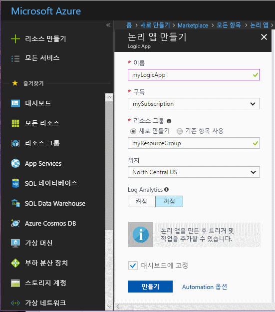
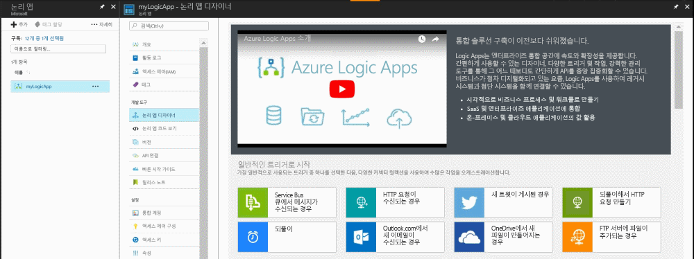
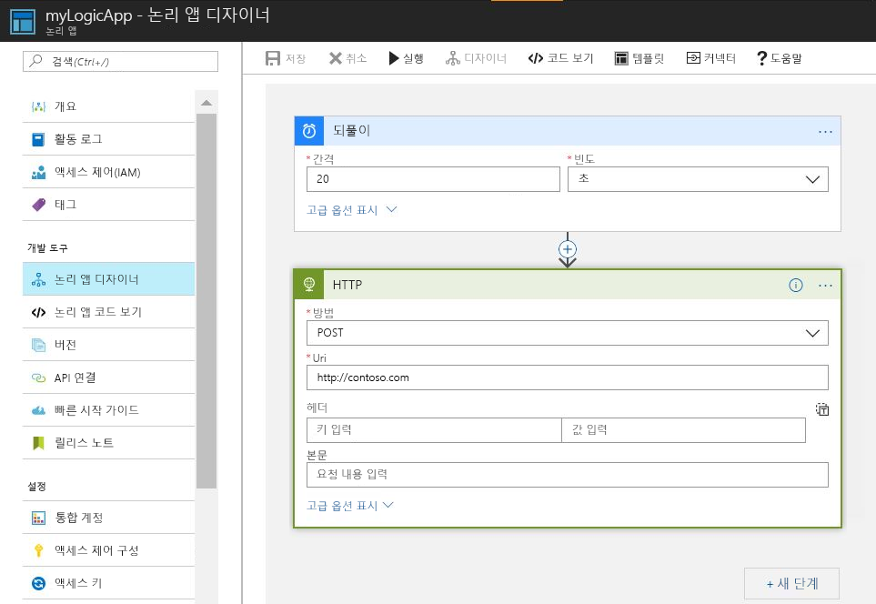
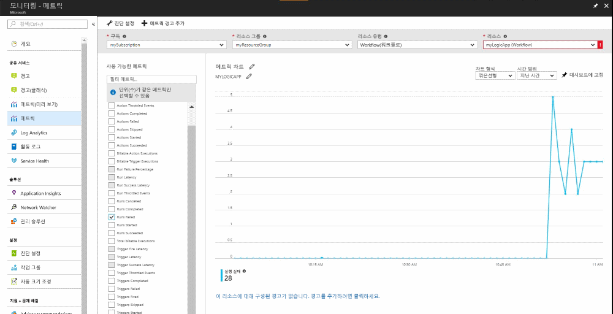
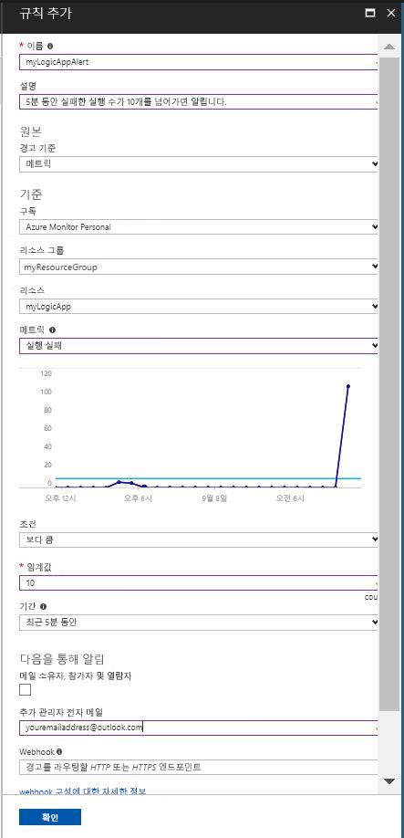

# 메트릭 값이 조건을 충족할 경우 알림 받기

Azure Monitor를 통해 많은 Azure 리소스에 대한 메트릭을 사용할 수 있습니다. 이러한 메트릭은 해당 리소스의 성능 및 상태를 전달합니다. 대부분의 경우 메트릭 값은 리소스에 문제가 있음을 가리킬 수 있습니다. 비정상적인 동작을 모니터링하고 문제가 발생할 경우 이를 알리는 메트릭 공고를 만들 수 있습니다. 이 빠른 시작에서는 논리 앱을 만들고 작업을 만들며 논리 앱에 대한 메트릭을 시각화하는 과정을 안내합니다. 그런 다음 경고를 만들고 논리 앱 리소스에 대한 메트릭의 알림을 수신하는 과정을 거칩니다.

메트릭 및 메트릭 경고에 대한 자세한 내용은 [Azure Monitor 메트릭 개요](../../azure-monitor/platform/data-collection.md) 및 [Azure Monitor 경고 개요](./alerts-overview.md)를 참조하세요. 

Azure 구독이 아직 없는 경우 시작하기 전에 [체험](https://azure.microsoft.com/free/) 계정을 만듭니다.

## Azure Portal에 로그인

[Azure Portal](https://portal.azure.com/)에 로그인합니다.

## 논리 앱 만들기

1. Azure Portal의 왼쪽 위에 있는 **리소스 만들기** 단추를 클릭합니다.

2. **논리 앱**을 검색하여 선택합니다. **만들기** 단추를 클릭합니다.

3. 이름으로 myLogicApp 및 리소스 그룹 myResourceGroup을 입력합니다. 구독을 사용합니다.  기본 위치를 사용합니다. **대시보드에 고정** 옵션을 선택합니다.  완료되면 **만들기**를 클릭합니다. 

      

4. 논리 앱은 대시보드에 고정되어야 합니다. 클릭하여 논리 앱으로 이동합니다.

5. 논리 앱 패널에서 **논리 앱 디자이너**를 선택합니다.

       

6. 다음 다이어그램에 표시된 대로 값을 설정합니다.

     

7. 디자이너에서 **되풀이** 트리거를 선택합니다.

8. 간격을 20으로, 빈도를 초로 설정하여 논리 앱이 20초마다 트리거되도록 합니다.

9. **새 단계** 단추를 클릭하고 **작업 추가**를 선택합니다.

10. **HTTP** 옵션을 선택하고 **HTTP-HTTP**를 선택합니다.

11. **메서드**를 POST로, **Uri**를 원하는 웹 주소로 설정합니다.

12. **저장**을 클릭합니다.

13. 논리 앱 실행 작업이 발생할 때까지 최대 5분이 걸릴 수 있습니다.  

## 논리 앱에 대한 메트릭 보기

1. 왼쪽 탐색 창에서 **모니터** 옵션을 클릭합니다.

2. **메트릭** 탭을 선택하고 논리 앱에 대한 **구독**, **리소스 그룹**, **리소스 종류** 및 **리소스** 정보를 입력합니다.

3. 메트릭 목록에서 **실행 실패함**을 선택합니다.

4. 차트의 **시간 범위**를 수정하여 지난 시간에 대한 데이터를 표시합니다.

5. 이제 지난 시간 동안 논리 앱이 시작된 총 실행 횟수가 플롯된 차트가 표시됩니다. 차트가 표시되지 않으면 위의 단계에서 5분 이상 기다렸는지 확인합니다. 그런 다음, 브라우저를 새로 고칩니다. 

    

## 논리 앱에 대한 메트릭 경고 만들기

1.  메트릭 패널의 오른쪽 상단에서 **메트릭 경고 추가** 단추를 클릭합니다.

2. 메트릭 경고 이름을 'myLogicAppAlert'로 지정하고 경고에 대한 간략한 설명을 제공합니다.

3. 메트릭 경고에 대한 **조건**을 '다음 값보다 큼'으로 설정하고 **임계값**을 '10'으로, **기간**을 'Over the last 5 minutes(지난 5분 동안)'로 설정합니다.

4. 마지막으로, **추가 관리자 전자 메일** 아래에 이메일 주소를 입력합니다. 이 경고는 5분 이내에 논리 앱이 10회 이상 실행 실패한 경우 전자 메일을 수신하도록 합니다.

    

## 논리 앱에 대한 메트릭 경고 알림 받기
1. 잠시 후 'Microsoft Azure Alerts'로부터 경고가 '활성화'되었음을 알리는 전자 메일을 받게 됩니다.

2. 논리 앱으로 돌아가 되풀이 트리거를 간격을 1로, 빈도를 시간으로 수정합니다.

3. 몇 분 이내에 'Microsoft Azure Alerts'로부터 경고가 '해결'되었음을 알리는 전자 메일을 받게 됩니다.

## 리소스 정리

이 컬렉션의 다른 빠른 시작은 이 빠른 시작을 기반으로 구성됩니다. 다음 빠른 시작 또는 자습서를 사용하여 계속하려는 경우 이 빠른 시작에서 만든 리소스를 정리하지 않습니다. 계속하지 않으려는 경우 다음 단계에 따라 이 빠른 시작에서 만든 모든 리소스를 Azure Portal에서 삭제합니다.

1. Azure Portal의 왼쪽 메뉴에서 **모니터**를 클릭합니다.

2. **경고** 탭을 선택하고 이 빠른 시작 가이드에서 만든 경고를 찾아 클릭합니다.

3. 메트릭 경고 패널에서 **삭제**를 클릭합니다.

4. Azure Portal의 왼쪽 메뉴에서 **논리 앱**을 검색한 후 **논리 앱**을 클릭합니다.

5. 패널의 텍스트 상자에서 이 빠른 시작에서 만든 논리 앱을 클릭한 후 **삭제**를 클릭합니다.

## 다음 단계

이 빠른 시작에서는 리소스에 대한 메트릭 경고를 만드는 방법에 대해 알아보았습니다. 메트릭 경고에 대한 자세한 내용을 보려면 경고에 대한 개요를 클릭합니다.

> [!div class="nextstepaction"]
> [Azure Monitor 구독 작업 경고](./../../azure-monitor/platform/quick-audit-notify-action-subscription.md )

