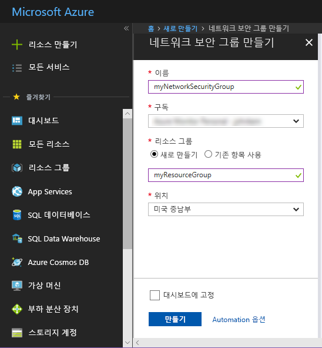
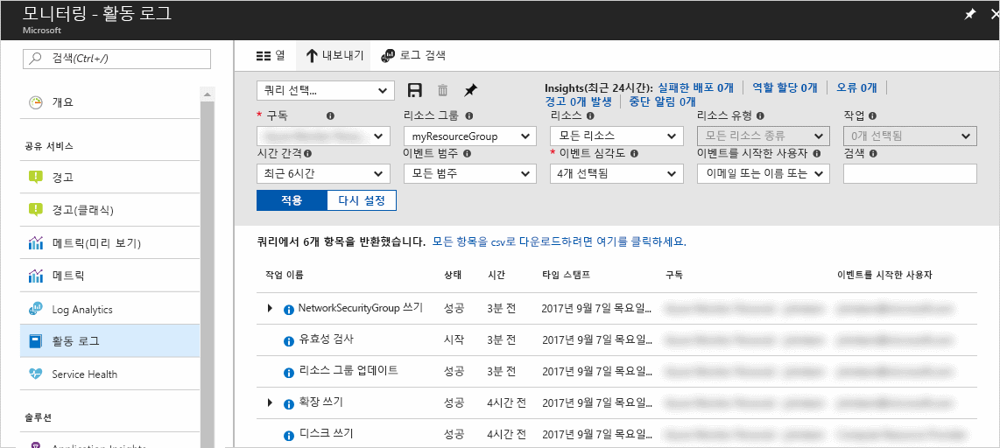
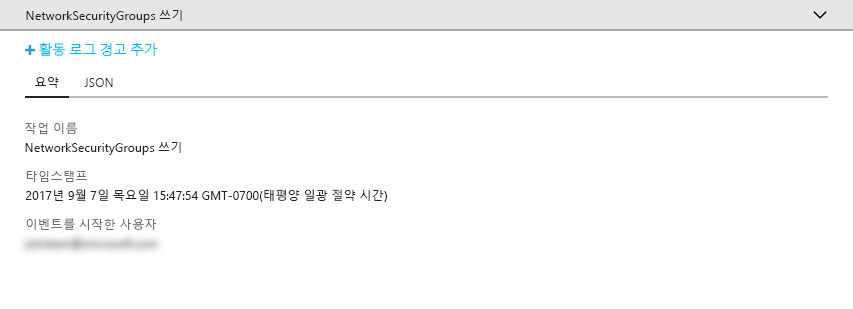
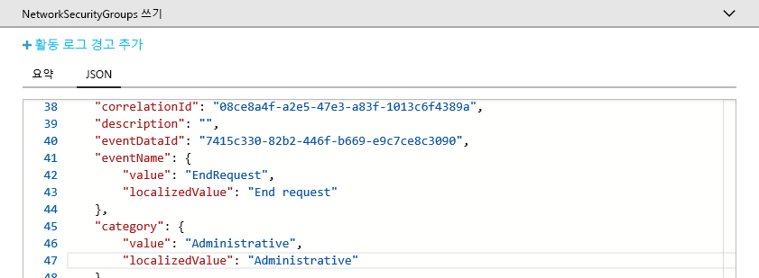
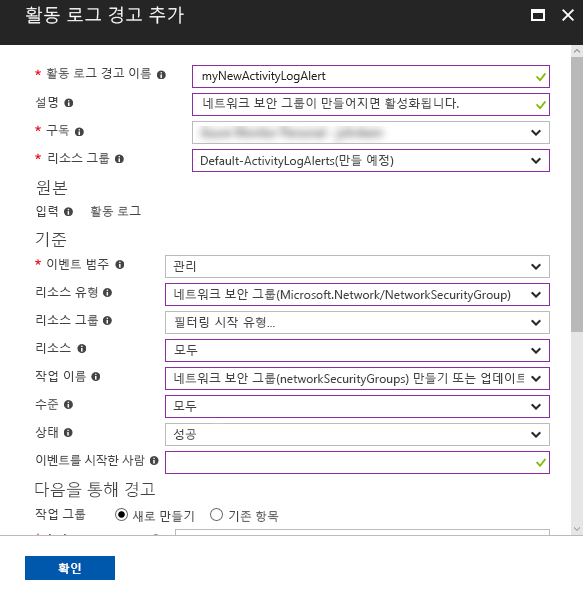
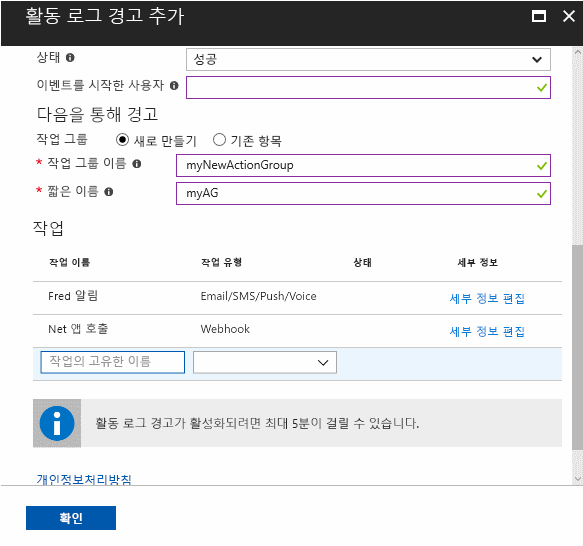

# Azure 구독에서 중요한 작업에 대한 알림 감사 및 수신

**Azure 활동 로그**는 Azure에서 구독 수준 이벤트 기록을 제공합니다. *누가*, *어떤* 리소스를 *언제* 만들고, 업데이트하거나 삭제했는지에 대한 정보를 제공합니다. **활동 로그 경고**를 만들어 경고 조건과 일치하는 활동이 발생했을 때 전자 메일, SMS 또는 webhook 알림을 받을 수 있습니다. 이 빠른 시작은 간단한 네트워크 보안 그룹을 만들고 활동 로그를 탐색하여 발생한 이벤트를 파악한 다음, 앞으로 진행할 네트워크 보안 그룹이 만들어질 때 알림을 받도록 활동 로그 경고를 작성하는 과정을 안내합니다.

Azure 구독이 아직 없는 경우 시작하기 전에 [체험](https://azure.microsoft.com/free/) 계정을 만듭니다.

## Azure Portal에 로그인

[Azure Portal](https://portal.azure.com/)에 로그인합니다.

## 네트워크 보안 그룹 만들기

1. Azure Portal의 왼쪽 위에 있는 **리소스 만들기** 단추를 클릭합니다.

2. **네트워킹**을 선택하고 **네트워크 보안 그룹**을 선택합니다.

3. **이름**으로 “myNetworkSG”를 입력하고 **myResourceGroup**이라는 새 리소스 그룹을 만듭니다. **만들기** 단추를 클릭합니다.

    

## 포털에서 활동 로그 찾아보기

이제 네트워크 보안 그룹을 만드는 방법을 설명하는 활동 로그에 이벤트가 추가되었습니다. 다음 지침에 따라 이벤트를 식별합니다.

1. 왼쪽 탐색 목록에 있는 **모니터** 단추를 클릭합니다. 그러면 활동 로그 섹션이 열립니다. 이 섹션에는 사용자가 구독의 리소스에 대해 수행한 모든 작업 기록이 포함되어 있으며 **리소스 그룹**, **Timespan** 및 **범주**와 같은 여러 속성으로 필터링 가능합니다.

2. **활동 로그** 섹션에서 **리소스 그룹** 드롭다운을 클릭하고 **myResourceGroup**을 선택합니다. **Timespan** 드롭다운을 **지난 1시간**으로 변경합니다. **적용**을 클릭합니다.

    

3. 표시된 이벤트 테이블에서 **NetworkSecurityGroups 쓰기** 이벤트를 클릭합니다.

## 활동 로그에서 이벤트 찾아보기

표시되는 섹션에는 이름, 타임스탬프, 수행한 사용자 또는 애플리케이션 등 수행한 작업에 대한 기본 세부 정보가 포함됩니다.

전체 이벤트 세부 정보를 확인하려면 **JSON** 탭을 클릭합니다. 여기에는 사용자 또는 애플리케이션이 작업을 수행하기 위한 권한을 부여 받는 방법, 이벤트 범주 및 수준, 작업 상태에 대한 정보가 포함됩니다.

## 활동 로그 경고 만들기

1. **요약** 탭을 클릭하여 이벤트 요약으로 돌아갑니다.

2. 표시되는 요약 섹션에서 **활동 로그 경고 추가**를 클릭합니다.

    

3. 표시되는 섹션에서 활동 로그 경고에 이름 및 설명을 제공합니다.

4. **조건** 아래에서 **이벤트 범주**가 **관리**로, **리소스 종류**가 **네트워크 보안 그룹**으로, **작업 이름**이 **네트워크 보안 그룹 만들기 또는 업데이트**로, **상태**가 **성공함**으로, 다른 모든 조건 필드가 비어 있거나 **모두**로 설정되어 있는지 확인합니다. 조건은 새 이벤트가 활동 로그에 나타날 때 경고를 활성화해야 하는지 여부를 결정하는 데 사용되는 규칙을 정의합니다.

    

5. **다음을 통해 경고** 아래에서 **새** 작업 그룹을 선택하고 작업 그룹에 대한 **이름** 및 **짧은 이름**을 제공합니다. 작업 그룹은 경고가 활성화될 때 수행된 작업 집합을 정의합니다(기준이 새 이벤트와 일치하는 경우).

6. **작업** 아래에서 작업의 **이름**, **작업 유형**(예: 이메일, SMS 또는 웹후크), 특정 작업 유형에 대한 **세부 정보**(예: webhook URL, 이메일 주소 또는 SMS 번호)를 제공하여 하나 이상의 작업을 추가합니다.

    

7. **확인**을 클릭하여 활동 로그 경고를 저장합니다.

## 활동 로그 경고 테스트

> [!NOTE]
> 활동 로그 경고를 완전히 사용하도록 설정하는 데 약 5분이 소요됩니다. 활동 로그 경고를 완전히 사용하도록 설정하기 전에 발생하는 새 이벤트에 대해서는 알림이 보장되지 않습니다.
>
>

경고를 테스트하려면 **네트워크 보안 그룹 만들기**에 대한 이전 섹션을 반복하지만 이 네트워크 보안 그룹에는 다른 이름을 지정하고 기존 리소스 그룹을 다시 사용합니다. 몇 분 안에 네트워크 보안 그룹이 생성되었다는 알림을 받게 됩니다.

## 리소스 정리

더 이상 필요하지 않은 경우, 리소스 그룹 및 네트워크 보안 그룹을 삭제합니다. 이렇게 하려면 포털의 위쪽에 있는 검색 상자에 만든 리소스 그룹의 이름을 입력하고 리소스 그룹의 이름을 클릭합니다. 표시된 섹션에서 **리소스 그룹 삭제** 단추를 클릭하고 리소스 그룹 이름을 입력하고 **삭제**를 클릭합니다.

## 다음 단계

이 빠른 시작에서는 활동 로그 이벤트를 생성하는 작업을 수행한 다음 나중에 이 작업이 다시 발생할 때 알림을 받을 활동 로그 경고를 만들었습니다. 그런 다음 해당 작업을 다시 수행하여 경고를 테스트했습니다. Azure에서는 지난 90일 동안의 활동 로그 이벤트를 제공합니다. 이벤트를 90일 이상 보존해야 할 경우 활동 로그 데이터를 다른 모니터링 데이터와 함께 보관하세요.

> [!div class="nextstepaction"]
> [모니터링 데이터 보관](./../../azure-monitor/learn/tutorial-archive-data.md)

