# 빠른 시작: Azure NetApp Files 설정 및 NFS 볼륨 만들기 

이 문서에서는 신속하게 Azure NetApp Files를 설정하고 볼륨을 만드는 방법을 보여줍니다. 

이 빠른 시작에서는 다음 항목을 설정합니다.

- Azure NetApp Files 및 NetApp 리소스 공급 기업 등록
- NetApp 계정
- 용량 풀
- Azure NetApp Files에 대한 NFS 볼륨

Azure 구독이 아직 없는 경우 시작하기 전에 [체험 계정](https://azure.microsoft.com/free/?WT.mc_id=A261C142F)을 만듭니다.

## 시작하기 전에 

> [!IMPORTANT] 
> Azure NetApp Files 서비스에 대한 액세스 권한을 부여받아야 합니다.  서비스에 대한 액세스를 요청하려면 [Azure NetApp Files 대기 목록 제출 페이지](https://forms.office.com/Pages/ResponsePage.aspx?id=v4j5cvGGr0GRqy180BHbR8cq17Xv9yVBtRCSlcD_gdVUNUpUWEpLNERIM1NOVzA5MzczQ0dQR1ZTSS4u)를 참조하세요.  계속하려면 Azure NetApp Files 팀의 공식 확인 이메일을 받아야 합니다. 

## Azure NetApp Files 및 NetApp 리소스 공급자 등록

1. Azure Portal의 오른쪽 위 모서리에 있는 Azure Cloud Shell 아이콘을 클릭합니다.

    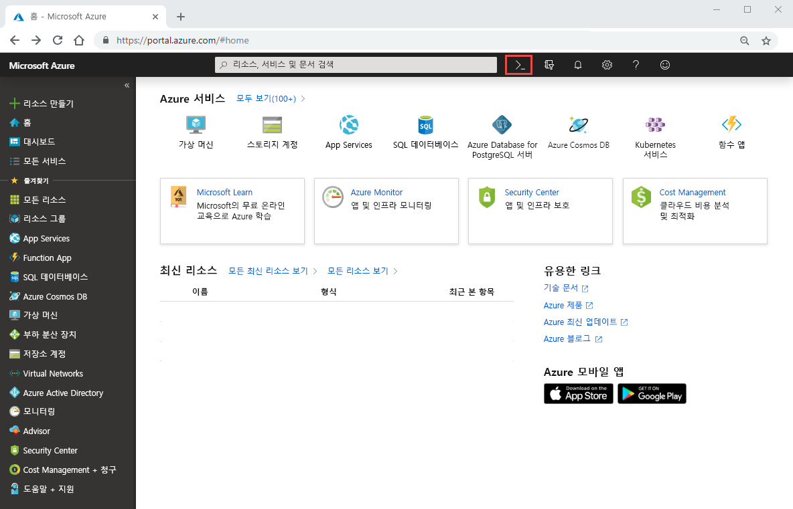

2. 다음과 같이 Azure NetApp Files의 허용 목록에 포함된 구독을 지정합니다.
    
        az account set --subscription <subscriptionId>

3. 다음과 같이 Azure 리소스 공급자를 등록합니다. 
    
        az provider register --namespace Microsoft.NetApp --wait  

    등록 프로세스는 완료하는 데 다소 시간이 걸릴 수 있습니다.

## NetApp 계정 만들기

1. Azure Portal의 검색 상자에 **Azure NetApp Files**를 입력한 다음, 나타나는 목록에서 **Azure NetApp Files**를 선택합니다.

      

2. **+ 추가**를 클릭하여 새 NetApp 계정을 만듭니다.

     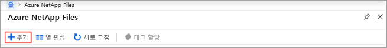

3. [새 NetApp 계정] 창에서 다음 정보를 입력합니다. 
   1. 계정 이름으로 **myaccount1**을 입력합니다. 
   2. 구독을 선택합니다.
   3. **새로 만들기**를 선택하여 새 리소스 그룹을 만듭니다. 리소스 그룹 이름으로 **myRG1**을 입력합니다. **확인**을 클릭합니다. 
   4. 계정 위치를 선택합니다.  

      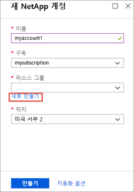  

      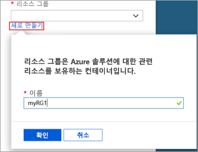

4. **만들기**를 클릭하여 새 NetApp 계정을 만듭니다.

## 용량 풀 설정

1. Azure NetApp Files 관리 블레이드에서 NetApp 계정(**myaccount1**)을 선택합니다.

    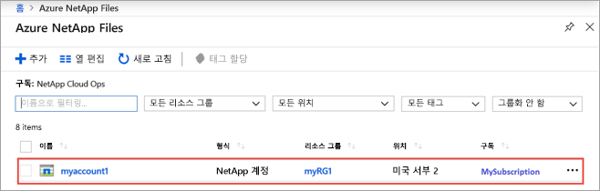  

2. NetApp 계정의 Azure NetApp Files 관리 블레이드에서 **용량 풀**을 클릭합니다.

    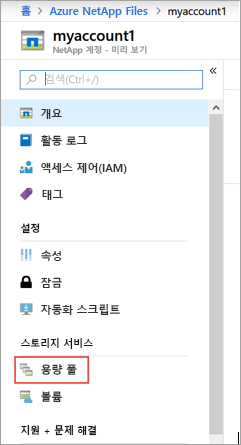  

3. **+ 풀 추가**를 클릭합니다. 

    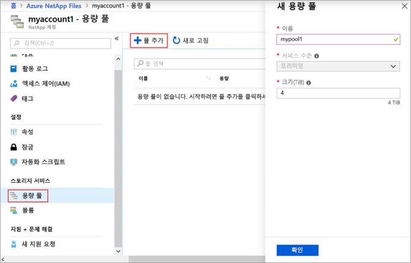  

4. 다음과 같은 용량 풀 정보를 입력합니다. 
    1. 풀 이름으로 **mypool1**을 입력합니다.
    2. 서비스 수준으로 **프리미엄**을 선택합니다. 
    3. 풀 크기로 **4(TiB)** 를 지정합니다. 

5. **확인**을 클릭합니다.

## Azure NetApp Files에 대한 NFS 볼륨 만들기

1. NetApp 계정의 Azure NetApp Files 관리 블레이드에서 **볼륨**을 클릭합니다.

    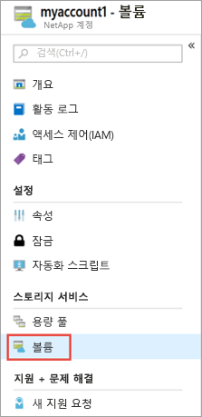  

2. **+ 볼륨 추가**를 클릭합니다.

    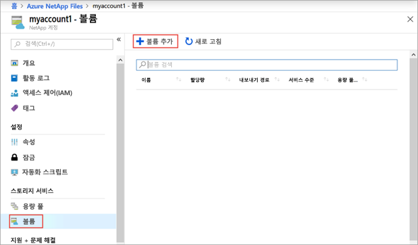  

3. 볼륨 만들기 창에서 다음과 같은 볼륨 정보를 입력합니다. 
   1. 볼륨 이름으로 **myvol1**을 입력합니다. 
   3. 용량 풀을 선택합니다(**mypool1**).
   4. 할당량은 기본값을 사용합니다. 
   5. 가상 네트워크 아래에서 **새로 만들기**를 클릭하여 새 Azure 가상 네트워크(Vnet)를 만듭니다.  다음 정보를 입력합니다.
       * Vnet 이름으로 **myvnet1**을 입력합니다.
       * 설정의 주소 공간을 지정합니다(예: 10.7.0.0/16).
       * 서브넷 이름으로 **myANFsubnet**을 입력합니다.
       * 서브넷 주소 범위를 지정합니다(예: 10.7.0.0/24). 전용 서브넷은 다른 리소스와 공유할 수 없습니다.
       * 서브넷 위임으로 **Microsoft.NetApp/volumes**를 선택합니다.
       * **확인**을 클릭하여 Vnet을 만듭니다.
   6. 서브넷에서, 새로 만든 Vnet(**myvnet1**)을 대리자 서브넷으로 선택합니다.

      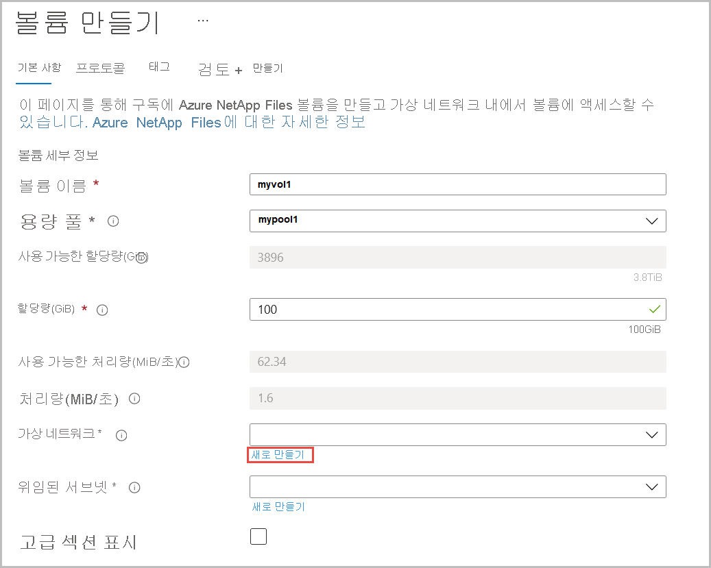  

      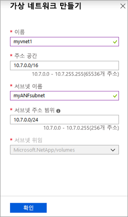  

4. **프로토콜**을 클릭한 다음, **NFS**를 볼륨에 대한 프로토콜 유형으로 선택합니다.   

    볼륨의 내보내기 경로를 만드는 데 사용할 파일 경로로 **myfilepath1**을 입력합니다. 

    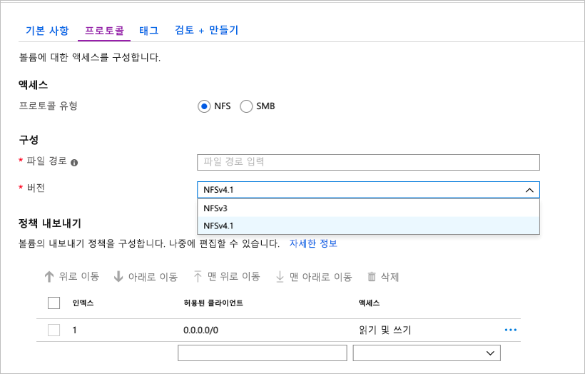

5. **검토 + 만들기**를 클릭합니다.

    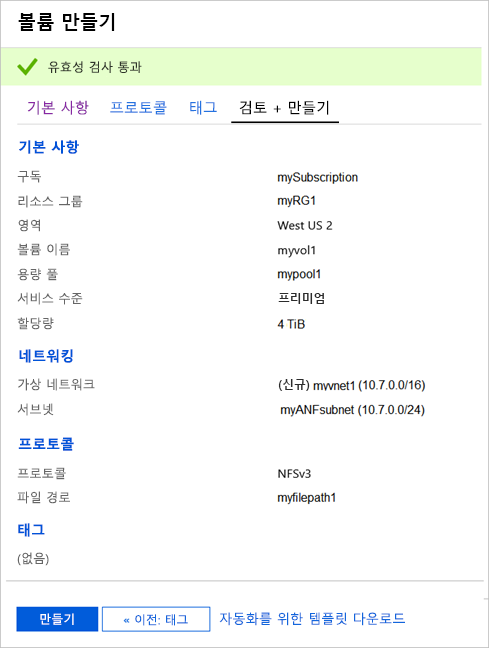  

5. 볼륨의 정보를 검토한 다음, **만들기**를 클릭합니다.  
    만든 볼륨은 볼륨 블레이드에 표시됩니다.

      

## 리소스 정리

완료되면 원하는 경우 리소스 그룹을 삭제할 수 있습니다. 리소스 그룹을 삭제하면 다시 되돌릴 수 없습니다.  

> [!IMPORTANT]
> 리소스 그룹 내의 모든 리소스가 영구적으로 삭제되고 취소할 수 없습니다. 

1. Azure Portal의 검색 상자에 **Azure NetApp Files**를 입력한 다음, 나타나는 목록에서 **Azure NetApp Files**를 선택합니다.

2. 구독 목록에서 삭제하려는 리소스 그룹(myRG1)을 클릭합니다. 

    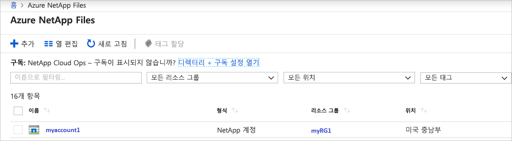

3. 리소스 그룹 페이지에서 **리소스 그룹 삭제**를 클릭합니다.

    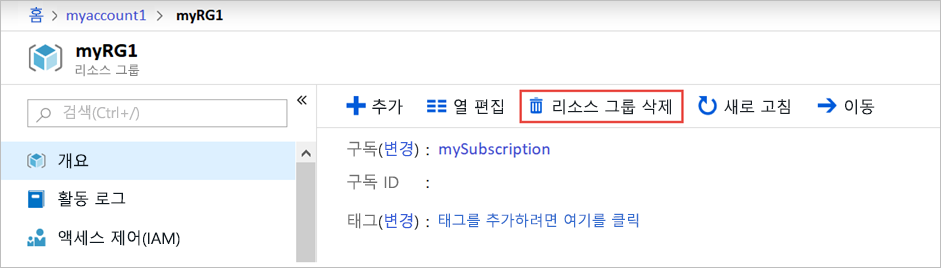 

    창이 하나 열리고 리소스 그룹과 함께 삭제될 리소스에 대한 경고가 표시됩니다.

4. 리소스 그룹의 이름(myRG1)을 입력하고 리소스 그룹 및 포함된 모든 리소스를 영구적으로 삭제할 것인지 확인한 다음, **삭제**를 클릭합니다.

    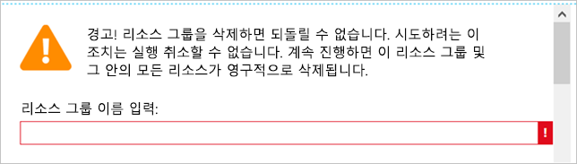 

## 다음 단계  

> [!div class="nextstepaction"]
> [Azure NetApp Files를 사용하여 볼륨 관리](azure-netapp-files-manage-volumes.md)  
