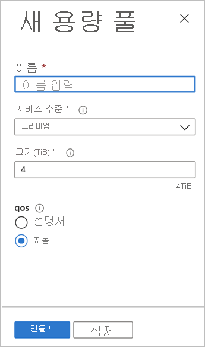

# 용량 풀 설정

용량 풀 설정을 통해 볼륨을 만들 수 있습니다.  

## 시작하기 전에 

NetApp 계정을 만들어야 합니다.   

[NetApp 계정 만들기](azure-netapp-files-create-netapp-account.md)

## 단계 

1. NetApp 계정의 관리 블레이드로 이동한 다음, 탐색 창에서 **용량 풀**을 클릭합니다.  
    
    

2. **+ 풀 추가**를 클릭하여 새 용량 풀을 만듭니다.   
    새 용량 풀 창이 나타납니다.

3. 새 용량 풀에 대한 다음과 같은 정보를 제공합니다.  
   * **Name**  
     용량 풀의 이름을 지정합니다.  
     용량 풀 이름은 각 NetApp 계정에 대해 고유해야 합니다.

   * **서비스 수준**   
     이 필드는 용량 풀에 대한 대상 성능을 보여줍니다.  
     용량 풀의 서비스 수준을 [**프리미엄**](azure-netapp-files-service-levels.md#Premium) 또는 [**표준**](azure-netapp-files-service-levels.md#Standard)으로 지정합니다.

   * **크기**     
     구입하려는 용량 풀의 크기를 지정합니다.        
     최소 용량 풀 크기는 4TiB입니다. 4TiB의 배수인 크기로 풀을 만들 수 있습니다.   
      
     

4. **확인**을 클릭합니다.

## 다음 단계 

- [Azure NetApp Files에 대한 서비스 수준](azure-netapp-files-service-levels.md)
- 여러 서비스 수준의 가격은 [Azure NetApp Files 가격 책정 페이지](https://azure.microsoft.com/pricing/details/storage/netapp/)를 참조하세요.
- [Azure NetApp Files에 서브넷 위임](azure-netapp-files-delegate-subnet.md)
