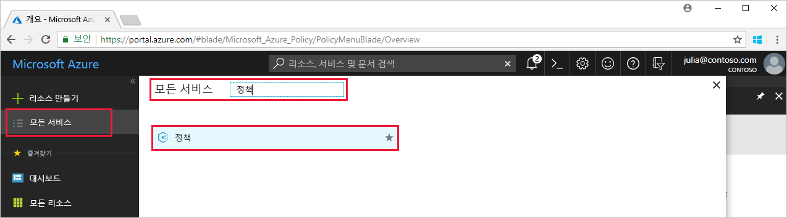

# Azure 환경에서 규정 비준수 리소스를 식별하는 정책 할당 만들기

Azure의 규정 준수를 이해하는 첫 번째 단계는 리소스 상태를 식별하는 것입니다. 이 빠른 시작은 Managed Disks를 사용하지 않는 가상 머신을 식별하는 정책 할당 만들기 과정을 단계별로 안내합니다.

이 프로세스가 끝나면 관리 디스크를 사용하지 않는 가상 머신이 식별됩니다. 이 가상 머신은 정책 할당의 *비규격*입니다.

Azure 구독이 아직 없는 경우 시작하기 전에 [체험](https://azure.microsoft.com/free/) 계정을 만듭니다.

## 정책 할당 만들기

이 빠른 시작에서 정책 할당을 만들고 *관리 디스크가 없는 Virtual Machines 감사* 정책 정의를 할당합니다.

1. **모든 서비스**를 클릭한 후 **정책**을 검색하고 선택하여 Azure Portal에서 Azure Policy 서비스를 시작합니다.

   

2. Azure Policy 페이지의 왼쪽에서 **할당**을 선택합니다. 할당은 특정 범위 내에서 수행하도록 할당된 정책입니다.
3. **정책 - 할당** 창의 위쪽에서 **정책 할당**을 선택합니다.

   

4. **정책 할당** 페이지에서 줄임표를 클릭하고 구독(필수) 및 리소스 그룹(선택 사항)을 선택하여 **범위**를 선택합니다. 범위는 정책 할당이 적용되는 리소스 또는 리소스 그룹을 결정합니다.  그 후 **범위** 페이지의 맨 위에서 **선택**을 클릭합니다.

   이 예제에서는 **Contoso 구독**을 사용합니다. 구독을 사용합니다.

5. 하나 이상의 구독(범위를 한 구독으로 지정한 경우) 또는 리소스 그룹의 특정 리소스(두 범위 지정 경우)를 제외하려면 정책 할당에서 **제외**를 구성하면 됩니다. 지금은 비워 둡니다.

6. **정책 정의** 줄임표를 선택하여 사용 가능한 정의 목록을 엽니다. Azure Policy에는 사용 가능한 기본 제공 정책 정의가 이미 제공되고 있습니다. 다음과 같은 여러 기본 제공 정책 정의를 사용할 수 있습니다.

   - 태그 및 해당 값 강제 적용
   - 태그 및 해당 값 적용
   - SQL Server 버전 12.0 필요

    사용 가능한 모든 기본 제공 정책 목록은 [정책 템플릿](json-samples.md)을 참조하세요.

7. 정책 정의 목록을 검색하여 *관리 디스크를 사용하지 않는 VM 감사* 정의를 찾습니다. 해당 정책을 클릭하고 **선택**을 클릭합니다.

   

8. 선택한 이름이 **할당 이름**에 자동으로 채워지지만, 할당 이름을 변경할 수 있습니다. 이 예에서는 *관리 디스크를 사용하지 않는 VM 감사*를 사용합니다. 선택적인 **설명**을 추가할 수도 있습니다. 설명은 이 정책 할당에 대한 세부 정보를 제공합니다.

9. **할당**을 클릭합니다.

이제 규정 비준수 리소스를 식별하여 환경의 준수 상태를 파악할 준비가 되었습니다.

## 규정 비준수 리소스 식별

페이지 왼쪽에서 **준수**를 선택하고 앞에서 만든 **관리 디스크를 사용하지 않는 감사 VM** 정책 할당을 찾습니다.

이 새 할당을 준수하지 않는 기존 리소스가 있는 경우 **비준수 리소스** 아래에 표시됩니다.

기존 리소스에 대해 조건을 평가한 결과 이것이 사실로 확인된 경우 해당 리소스는 정책 비준수 항목으로 표시됩니다. 다음 표는 여러 정책 효과가 조건 평가와 함께 작동하여 어떤 준수 상태로 이어지는지 보여줍니다. Azure Portal에서는 평가 논리는 표시되지 않지만 준수 상태 결과가 표시됩니다. 규정 준수 상태 결과는 준수 또는 비준수입니다.

| **리소스 상태** | **효과** | **정책 평가** | **규정 준수 상태** |
| --- | --- | --- | --- |
| exists | Deny, Audit, Append\*, DeployIfNotExist\*, AuditIfNotExist\* | True | 비준수 |
| exists | Deny, Audit, Append\*, DeployIfNotExist\*, AuditIfNotExist\* | False | 준수 |
| 새로 만들기 | Audit, AuditIfNotExist\* | True | 비준수 |
| 새로 만들기 | Audit, AuditIfNotExist\* | False | 준수 |

\* Append, DeployIfNotExist 및 AuditIfNotExist 효과는 IF 문이 TRUE여야 합니다. 또한 이 효과는 비준수가 되려면 존재 조건이 FALSE가 되어야 합니다. TRUE인 경우 IF 조건이 관련 리소스에 대한 존재 조건의 평가를 트리거합니다.

## 리소스 정리

이 컬렉션의 다른 가이드는 이 빠른 시작에 기반하여 작성되었습니다. 후속 자습서를 계속 사용하려면 이 빠른 시작에서 만든 리소스를 정리하지 마세요. 계속하지 않으려는 경우 다음 단계에 따라 이 빠른 시작에서 만든 모든 리소스를 Azure Portal에서 삭제합니다.

1. Azure Policy 페이지 왼쪽에서 **준수**(또는 **할당**)를 선택하고 앞에서 만든 **관리 디스크를 사용하지 않는 감사 VM** 정책 할당을 찾습니다.

2. **관리 디스크를 사용하지 않는 VM 감사** 정책 할당을 마우스 오른쪽 단추로 클릭하고 **할당 삭제**를 선택합니다.

   

## 다음 단계

이 빠른 시작에서는 범위에 정책 정의를 할당하고 규정 준수 보고서를 평가했습니다. 정책 정의는 범위 내 모든 리소스가 준수 상태가 되게 하며, 그렇지 못한 리소스를 파악합니다.

정책 할당에 대해 자세히 알아보고 **앞으로** 만들 리소스에서 정책을 준수하도록 하려면 다음 자습서를 계속 진행하세요.

> [!div class="nextstepaction"]
> [정책 만들기 및 관리](create-manage-policy.md)