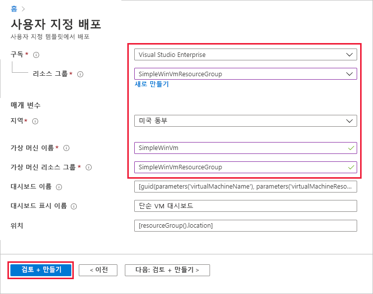
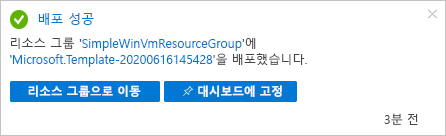
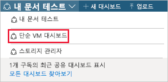
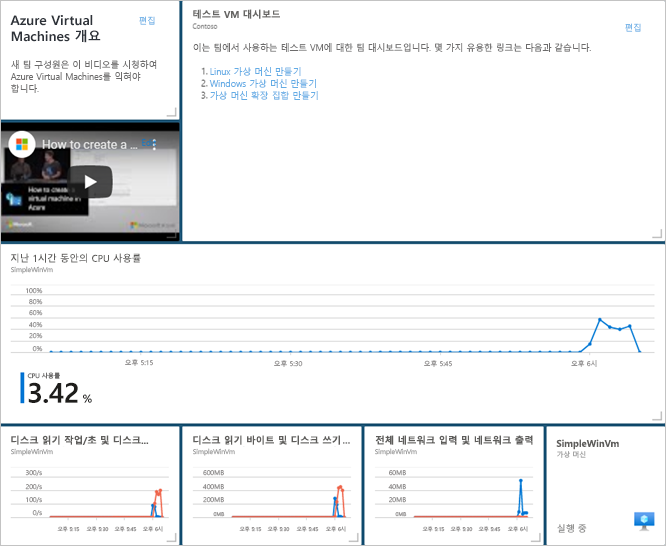
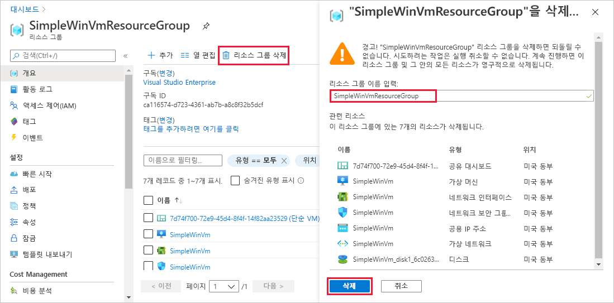

# <a name="quickstart-create-a-dashboard-in-the-azure-portal-by-using-an-arm-template"></a>빠른 시작: ARM 템플릿을 사용하여 Azure Portal에서 대시보드 만들기

Azure Portal의 대시보드는 클라우드 리소스에 대해 집중적으로 구성된 보기입니다. 이 빠른 시작에서는 대시보드를 만들기 위해 ARM 템플릿(Azure Resource Manager 템플릿)을 배포하는 과정을 다루고 있습니다. 대시보드는 VM(가상 머신)의 성능뿐만 아니라 일부 정적 정보 및 링크도 보여 줍니다.

[!INCLUDE [About Azure Resource Manager](../../includes/resource-manager-quickstart-introduction.md)]

환경이 필수 구성 요소를 충족하고 ARM 템플릿 사용에 익숙한 경우 **Azure에 배포** 단추를 선택합니다. 그러면 Azure Portal에서 템플릿이 열립니다.

[](https://portal.azure.com/#create/Microsoft.Template/uri/https%3A%2F%2Fraw.githubusercontent.com%2FAzure%2Fazure-quickstart-templates%2Fmaster%2F101-azure-portal-dashboard%2Fazuredeploy.json)

## <a name="prerequisites"></a>필수 구성 요소

- Azure 구독이 아직 없는 경우 시작하기 전에 [체험 계정](https://azure.microsoft.com/free/?WT.mc_id=A261C142F)을 만듭니다.
- 기존 VM

## <a name="create-a-virtual-machine"></a>가상 머신 만들기

이 빠른 시작의 다음 부분에서 만드는 대시보드에는 기존 VM이 필요합니다. 다음 단계에 따라 VM을 만듭니다.

1. Azure Portal에서 Cloud Shell을 선택합니다.

    

1. 다음 명령을 복사하고 명령 프롬프트에 입력하여 리소스 그룹을 만듭니다.

    ```powershell
    New-AzResourceGroup -Name SimpleWinVmResourceGroup -Location EastUS
    ```

    

1. 다음 명령을 복사하고 명령 프롬프트에 입력하여 리소스 그룹에 VM을 만듭니다.

    ```powershell
    New-AzVm `
        -ResourceGroupName "SimpleWinVmResourceGroup" `
        -Name "SimpleWinVm" `
        -Location "East US" 
    ```

1. VM에 대한 사용자 이름과 암호를 입력합니다. 새 사용자 이름 및 암호입니다. 예를 들어 Azure에 로그인하는 데 사용하는 계정이 아닙니다. 자세한 내용은 [사용자 이름 요구 사항](../virtual-machines/windows/faq.md#what-are-the-username-requirements-when-creating-a-vm) 및 [암호 요구 사항](../virtual-machines/windows/faq.md#what-are-the-password-requirements-when-creating-a-vm)을 참조하세요.

    이제 VM 배포가 시작되고 완료하는 데 일반적으로 몇 분 정도 걸립니다. 배포가 완료되면 다음 섹션으로 이동합니다.

## <a name="review-the-template"></a>템플릿 검토

이 빠른 시작에서 사용되는 템플릿은 [Azure 빠른 시작 템플릿](https://azure.microsoft.com/resources/templates/101-azure-portal-dashboard/)에서 나온 것입니다. 이 문서의 템플릿이 너무 길어서 여기에 표시할 수 없습니다. 템플릿을 보려면 [azuredeploy.json](https://raw.githubusercontent.com/Azure/azure-quickstart-templates/master/101-azure-portal-dashboard/azuredeploy.json)을 참조하세요. Azure 리소스 하나는 템플릿, [Microsoft.Portal/dashboards](/azure/templates/microsoft.portal/dashboards)에 정의되어 있으며, Azure Portal에서 대시보드를 만듭니다.

## <a name="deploy-the-template"></a>템플릿 배포

1. 다음 이미지를 선택하고 Azure에 로그인하여 템플릿을 엽니다.

    [](https://portal.azure.com/#create/Microsoft.Template/uri/https%3A%2F%2Fraw.githubusercontent.com%2FAzure%2Fazure-quickstart-templates%2Fmaster%2F101-azure-portal-dashboard%2Fazuredeploy.json)

1. 다음 값을 선택하거나 입력한 다음, **검토 + 만들기**를 선택합니다.

    

    지정되지 않은 경우 기본값을 사용하여 대시보드를 만듭니다.

    * **구독**: Azure 구독을 선택합니다.
    * **리소스 그룹**: **SimpleWinVmResourceGroup**을 선택합니다.
    * **위치**: **미국 동부**를 선택합니다.
    * **가상 머신 이름**: **SimpleWinVm**을 입력합니다.
    * **가상 머신 리소스 그룹**: **SimpleWinVmResourceGroup**을 입력합니다.

1. **만들기** 또는 **구매**를 선택합니다. 대시보드가 성공적으로 배포되면 다음과 같이 알림을 받게 됩니다.

    

Azure Portal은 템플릿을 배포하는데 사용되었습니다. Azure Portal 외에도 Azure PowerShell, Azure CLI 및 REST API를 사용할 수 있습니다. 다른 배포 방법을 알아보려면 [템플릿 배포](../azure-resource-manager/templates/deploy-powershell.md)를 참조하세요.

## <a name="review-deployed-resources"></a>배포된 리소스 검토

대시보드가 성공적으로 만들어졌고 VM에서 데이터를 볼 수 있는지 확인합니다.

1. Azure Portal에서 **대시보드**를 선택합니다.

    

1. 대시보드 페이지에서 **단순 VM 대시보드**를 선택합니다.

    

1. ARM 템플릿에서 만든 대시보드를 검토합니다. 일부 콘텐츠는 정적이지만 처음에 만든 VM의 성능을 표시하는 차트도 있습니다.

    

## <a name="clean-up-resources"></a>리소스 정리

VM 및 연결된 대시보드를 제거하려면 해당 대시보드를 포함하는 리소스 그룹을 삭제합니다.

1. Azure Portal에서 **SimpleWinVmResourceGroup**을 검색한 다음, 검색 결과에서 선택합니다.

1. **SimpleWinVmResourceGroup** 페이지에서 **리소스 그룹 삭제**를 선택하고, 확인할 리소스 그룹 이름을 입력한 다음, **삭제**를 선택합니다.

    

## <a name="next-steps"></a>다음 단계

Azure Portal에서 대시보드에 대한 자세한 내용은 다음을 참조하세요.

> [!div class="nextstepaction"]
> [Azure Portal에서 대시보드 만들기 및 공유](azure-portal-dashboards.md)