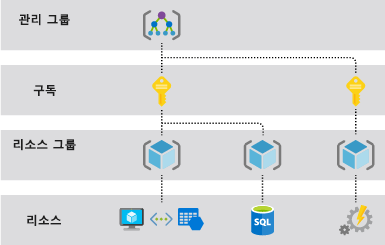

# <a name="azure-resource-manager-overview"></a>Azure Resource Manager 개요

Azure Resource Manager는 Azure용 배포 및 관리 서비스입니다. Azure 구독에서 리소스를 생성, 업데이트 및 삭제할 수 있게 해주는 일관적인 관리 레이어를 제공합니다. 여기의 액세스 제어, 감사 및 태깅 기능을 사용하여 배포 후 리소스를 보호 및 정리할 수 있습니다.

포털, PowerShell, Azure CLI, REST API 또는 클라이언트 SDK를 통해 작업을 수행하면 Azure Resource Manager API가 요청을 처리합니다. 모든 요청이 동일한 API를 통해 처리되므로 모든 여러 도구에서 일관적인 결과 및 기능을 볼 수 있습니다. 포털에서 사용할 수 있는 모든 기능은 PowerShell, Azure CLI, Azure REST API 및 클라이언트 SDK를 통해서도 사용 가능합니다. API를 통해 처음 릴리스된 기능은 처음 릴리스된 지 180일 이내에 포털에 표시됩니다.

다음 그림에서는 모든 도구가 Azure Resource Manager API와 상호 작용하는 방법을 보여 줍니다. API는 요청을 인증하고 권한을 부여하는 리소스 관리자 서비스에 요청을 전달합니다. 그런 다음, Resource Manager는 적절한 서비스로 요청을 라우팅합니다.


## <a name="terminology"></a>용어

Azure Resource Manager가 처음이라면 익숙하지 않은 용어가 있을 수 있습니다.

* **리소스** - Azure를 통해 사용할 수 있는 관리 가능한 항목입니다. 리소스의 예로는 가상 머신, 스토리지 계정, 웹앱, 데이터베이스 및 가상 네트워크가 있습니다.
* **리소스 그룹** - Azure 솔루션에 관련된 리소스를 보유하는 컨테이너입니다. 리소스 그룹은 그룹으로 관리하려는 리소스만 포함합니다. 조직에 가장 적합한 내용에 따라 리소스 그룹에 리소스를 어떻게 할당할지 결정합니다. [리소스 그룹](#resource-groups)을 참조하세요.
* **리소스 공급자** - Azure 리소스를 제공하는 서비스입니다. 예를 들어 일반적인 리소스 공급자는 가상 머신 리소스를 제공하는 **Microsoft.Compute**입니다. **Microsoft.Storage**는 또 다른 일반적인 리소스 공급자입니다. [리소스 공급자](#resource-providers)를 참조하세요.
* **Resource Manager 템플릿** - 리소스 그룹 또는 구독에 배포한 하나 이상의 리소스를 정의하는 JSON(JavaScript Object Notation) 파일입니다. 템플릿은 리소스를 일관되고 반복적으로 배포하는 데 사용할 수 있습니다. [템플릿 배포](#template-deployment)를 참조하세요.
* **선언적 구문** - 항목을 만드는 프로그래밍 명령의 시퀀스를 작성하지 않고도 "만들려는 대상은 다음과 같습니다"라고 선언하는 구문입니다. Resource Manager 템플릿은 선언적 구문의 예입니다. 파일에서 Azure에 배포하는 인프라에 대한 속성을 정의합니다.

## <a name="the-benefits-of-using-resource-manager"></a>리소스 관리자를 사용할 경우의 이점

리소스 관리자는 다음과 같은 여러 이점이 있습니다.

* 이 리소스를 개별적으로 처리하는 것이 아니라 솔루션에 대한 모든 리소스를 그룹으로 배포, 관리 및 모니터링할 수 있습니다.
* 개발 수명 주기 내내 솔루션을 반복적으로 배포하며 안심하고 일관된 상태로 리소스를 배포할 수 있습니다.
* 스크립트가 아닌 선언적 템플릿을 통해 인프라를 관리할 수 있습니다.
* 올바른 순서로 배포되므로 리소스 간의 종속성을 정의할 수 있습니다.
* 역할 기반 Access Control(RBAC)가 관리 플랫폼으로 통합되기 때문에 리소스 그룹의 모든 서비스에 대해 Access Control를 적용할 수 있습니다.
* 리소스에 태그를 적용하여 구독에서 모든 리소스를 논리적으로 구성할 수 있습니다.
* 같은 태그를 공유하는 리소스 그룹에 대한 비용을 확인하여 조직의 청구를 명확히 할 수 있습니다.

## <a name="understand-management-scope"></a>관리 범위 이해

Azure는 네 가지 관리 범위 수준인 [관리 그룹](../governance/management-groups/index.md), 구독, [리소스 그룹](#resource-groups) 및 리소스를 제공합니다. 다음 그림은 세 가지 계층의 예를 보여 줍니다.



이러한 범위 수준에서 관리 설정을 적용합니다. 선택한 수준은 설정이 적용되는 범위를 결정합니다. 하위 수준은 상위 수준의 설정을 상속합니다. 예를 들어 구독에 [정책](../governance/policy/overview.md)을 적용하면 해당 정책이 구독의 모든 리소스 그룹 및 리소스에 적용됩니다. 리소스 그룹에 정책을 적용하면 해당 정책이 리소스 그룹 및 모든 리소스에 적용됩니다. 그러나 다른 리소스 그룹에는 해당 정책 할당이 적용되지 않습니다.

## <a name="guidance"></a>지침

다음 제안으로 솔루션으로 작업할 때 Resource Manager를 완벽하게 활용할 수 있습니다.

* 명령적 명령을 사용하는 대신 리소스 관리자 템플릿의 선언적 구문을 통해 인프라를 정의하고 배포합니다.
* 템플릿에서 모든 배포 및 구성 단계를 정의합니다. 솔루션을 설정하기 위해 수동 단계가 없어야 합니다.
* 명령적 명령을 실행하여 앱 또는 컴퓨터를 시작하거나 중지하는 등 리소스를 관리합니다.
* 리소스 그룹에서 동일한 수명 주기로 리소스를 정렬합니다. 리소스의 모든 다른 구성에 태그를 사용합니다.

엔터프라이즈에서 리소스 관리자를 사용하여 구독을 효과적으로 관리할 수 있는 방법에 대한 지침은 [Azure 엔터프라이즈 스캐폴드 - 규범적 구독 거버넌스](/azure/architecture/cloud-adoption-guide/subscription-governance?toc=%2fazure%2fazure-resource-manager%2ftoc.json)를 참조하세요.

Resource Manager 템플릿을 만드는 방법에 대한 권장 사항은 [Azure Resource Manager 템플릿 모범 사례](template-best-practices.md)를 참조하세요.

## <a name="resource-groups"></a>리소스 그룹
리소스 그룹을 정의할 때 고려해야 할 몇 가지 중요한 요인이 있습니다.

* 그룹에서 모든 리소스는 동일한 수명 주기를 공유해야 합니다. 리소스를 함께 배포, 업데이트, 삭제합니다. 데이터베이스 서버와 같은 하나의 리소스에 다양한 배포 주기가 존재하는 경우 다른 리소스 그룹에 있어야 합니다.
* 각 리소스는 하나의 리소스 그룹에만 있을 수 있습니다.
* 언제든지 리소스 그룹에 리소스를 추가하거나 제거할 수 있습니다.
* 특정 리소스 그룹에서 다른 그룹에 리소스를 이동할 수 있습니다. 자세한 내용을 보려면 [새 리소스 그룹 또는 구독으로 리소스 이동](resource-group-move-resources.md)을 참조하세요.
* 리소스 그룹은 다른 지역에 있는 리소스를 포함할 수 있습니다.
* 관리 작업에 대한 Access Control 범위를 지정하는 데 리소스 그룹을 사용할 수 있습니다.
* 리소스는 다른 리소스 그룹의 리소스와 상호 작용할 수 있습니다. 이 상호 작용은 두 개의 리소스가 관련되어 있지만 동일한 수명 주기를 공유하지 않는 경우에 일반적입니다(예: 데이터베이스에 연결된 웹앱).

리소스 그룹을 만들 때 해당 리소스 그룹의 위치를 제공해야 합니다. 리소스 그룹에 위치가 필요한 이유는 무엇인지 궁금할 수 있습니다. 리소스의 위치가 리소스 그룹과 다른 경우 리소스 그룹 위치가 중요한 이유는 무엇인가요? 리소스 그룹은 리소스에 대한 메타데이터를 저장합니다. 따라서 리소스 그룹의 위치를 지정하면 메타데이터가 저장된 위치를 지정하게 됩니다. 규정 준수 때문에 특정 지역에 데이터가 저장되는지 확인해야 합니다.

리소스 그룹의 지역이 일시적으로 사용할 수 없는 경우 메타데이터를 사용할 수 없기 때문에 리소스 그룹의 리소스를 업데이트할 수 없습니다. 다른 지역에 있는 리소스는 여전히 예상대로 작동하지만 업데이트는 불가능합니다. 위험을 최소화하려면 동일한 지역에 있는 리소스 그룹 및 리소스를 찾습니다.

## <a name="resource-providers"></a>리소스 공급자

각 리소스 공급자는 이러한 리소스로 작업하는 일련의 리소스 및 작업을 제공합니다. 예를 들어 키와 암호를 저장하려는 경우 **Microsoft.KeyVault** 리소스 공급자로 작업합니다. 이 리소스 공급자는 키 자격 증명 모음을 만드는 데 **자격 증명 모음**이라는 리소스 유형을 제공합니다.

리소스 종류의 이름은 **{resource-provider}/{resource-type}** 양식입니다. 키 자격 증명 모음의 리소스 유형은 **Microsoft.KeyVault/vaults**입니다.

리소스 배포를 시작하기 전에 사용 가능한 리소스 공급자를 이해해야 합니다. 리소스 공급자 및 리소스의 이름을 알고 있으면 Azure에 배포하려는 리소스를 정의할 수 있습니다. 또한 각 리소스 종류에 대한 유효한 위치와 API 버전을 알아야 합니다. 자세한 내용은 [리소스 공급자 및 형식](resource-manager-supported-services.md)을 참조하세요.

리소스 공급자가 제공하는 모든 작업에 대한 자세한 내용은 [Azure REST API](/rest/api/azure/)를 참조하세요.

## <a name="template-deployment"></a>템플릿 배포

Resource Manager로 Azure 솔루션의 인프라 및 구성을 정의하는 템플릿을 JSON 형식으로 만들 수 있습니다. 템플릿을 사용하여 수명 주기 내내 솔루션을 반복적으로 배포하고 안심하고 일관된 상태로 리소스를 배포할 수 있습니다.

템플릿의 형식 및 템플릿을 생성하는 방법에 대해 알아보려면 [Azure Resource Manager 템플릿의 구조 및 구문 이해](resource-group-authoring-templates.md)를 참조하세요. 리소스 유형의 JSON 구문을 보려면 [Azure Resource Manager 템플릿에서 리소스 정의](/azure/templates/)를 참조하세요.

Resource Manager는 템플릿을 다른 요청처럼 처리합니다. 템플릿을 구문 분석하고 해당 구문을 적절한 리소스 공급자에 대한 REST API 작업으로 변환합니다. 예를 들어 리소스 관리자가 다음 리소스 정의로 템플릿을 받는 경우:

```json
"resources": [
  {
    "apiVersion": "2016-01-01",
    "type": "Microsoft.Storage/storageAccounts",
    "name": "mystorageaccount",
    "location": "westus",
    "sku": {
      "name": "Standard_LRS"
    },
    "kind": "Storage",
    "properties": {
    }
  }
]
```

Microsoft.Storage 리소스 공급자에게 전송되는 다음 REST API 작업으로 정의를 변환합니다.

```HTTP
PUT
https://management.azure.com/subscriptions/{subscriptionId}/resourceGroups/{resourceGroupName}/providers/Microsoft.Storage/storageAccounts/mystorageaccount?api-version=2016-01-01
REQUEST BODY
{
  "location": "westus",
  "properties": {
  }
  "sku": {
    "name": "Standard_LRS"
  },
  "kind": "Storage"
}
```

템플릿 및 리소스 그룹을 정의하는 방법은 사용자 및 솔루션을 관리하려는 방법에 전적으로 달려 있습니다. 예를 들어 단일 템플릿을 통해 3계층 애플리케이션을 단일 리소스 그룹에 배포할 수 있습니다.


그러나 단일 템플릿에서 전체 인프라를 정의할 필요가 없습니다. 대부분 배포 요구 사항을 대상, 목적에 특정 템플릿 집합으로 나누는 것이 좋습니다. 서로 다른 솔루션에 이러한 템플릿을 쉽게 다시 사용할 수 있습니다. 특정 솔루션을 배포하려면 모든 필수 템플릿에 연결하는 마스터 템플릿을 만듭니다. 다음 이미지는 세 개의 중첩된 템플릿을 포함하는 부모 템플릿을 통해 3계층 솔루션을 배포하는 방법을 보여 줍니다.


계층이 별도 수명 주기를 갖도록 계획하는 경우 3계층을 별도 리소스 그룹에 배포할 수 있습니다. 리소스는 다른 리소스 그룹의 리소스에 계속해서 연결될 수 있습니다.


중첩된 템플릿에 대한 자세한 내용은 [Azure Resource Manager에서 연결된 템플릿 사용](resource-group-linked-templates.md)을 참조하세요.

리소스가 올바른 순서로 생성되도록 Azure Resource Manager가 종속성을 분석합니다. 한 리소스가 다른 리소스(예: 디스크에 대한 저장소 계정을 필요로 하는 가상 머신)의 값에 의존하는 경우 종속성을 설정합니다. 자세한 정보는 [Azure 리소스 관리자 템플릿에서 종속성 정의](resource-group-define-dependencies.md)를 참조하세요.

또한 인프라의 업데이트에 대한 템플릿을 사용할 수 있습니다. 예를 들어 솔루션에 리소스를 추가할 수 있으며 이미 배포된 리소스에 대한 구성 규칙을 추가할 수 있습니다. 템플릿이 이미 존재하는 리소스를 정의하는 경우 Resource Manager는 리소스를 새로 만드는 대신 기존 리소스를 업데이트합니다.

Resource Manager는 설치에 포함되지 않은 특정 소프트웨어를 설치하는 등의 추가 작업을 할 때 시나리오에 대한 확장을 제공합니다. DSC, Chef 또는 Puppet와 같은 구성 관리 서비스를 이미 사용 중인 경우 확장을 사용하여 해당 서비스로 작업을 계속할 수 있습니다. 가상 머신 확장에 대한 자세한 내용은 [가상 머신 확장 및 기능 정보](../virtual-machines/windows/extensions-features.md?toc=%2fazure%2fvirtual-machines%2fwindows%2ftoc.json)를 참조하세요.

포털에서 솔루션을 만들 때 자동으로 솔루션에 배포 템플릿을 포함합니다. 솔루션용 템플릿으로 시작하고 특정 요구 사항에 맞게 사용자 지정할 수 있기 때문에 서식 파일을 처음부터 새로 만들 필요가 없습니다. 샘플은 [빠른 시작: Azure Portal을 사용하여 Azure Resource Manager 템플릿 만들기 및 배포](./resource-manager-quickstart-create-templates-use-the-portal.md)를 참조하세요. 리소스 그룹의 현재 상태를 내보내거나 특정 배포에 사용된 템플릿을 검토하여 기존 리소스 그룹에 대한 템플릿을 검색할 수도 있습니다. [내보낸 템플릿](./manage-resource-groups-portal.md#export-resource-groups-to-templates)을 살펴보면 템플릿 구문에 대해 알아보는 데 도움이 됩니다.

마지막으로 템플릿은 앱에 대한 소스 코드의 일부가 됩니다. 소스 코드 리포지토리를 확인하고 앱이 발전하면 업데이트할 수 있습니다. Visual Studio를 통해 템플릿을 편집할 수 있습니다.

템플릿을 정의하면 Azure에 리소스를 배포할 준비가 되었습니다. 리소스를 배포하려면 다음을 참조하세요.

* [Resource Manager 템플릿과 Azure PowerShell로 리소스 배포](resource-group-template-deploy.md)
* [Resource Manager 템플릿과 Azure CLI로 리소스 배포](resource-group-template-deploy-cli.md)
* [Resource Manager 템플릿과 Azure Portal로 리소스 배포](resource-group-template-deploy-portal.md)
* [Resource Manager 템플릿과 Resource Manager REST API로 리소스 배포](resource-group-template-deploy-rest.md)

## <a name="safe-deployment-practices"></a>안전한 배포 사례

복잡한 서비스를 Azure에 배포할 때 여러 지역에 서비스를 배포하고, 다음 단계를 진행하기 전에 해당 상태를 확인해야 합니다. [Azure 배포 관리자](deployment-manager-overview.md)를 사용하여 서비스의 단계적 출시를 조정합니다. 서비스의 출시를 준비하여 모든 지역에 배포되기 전에 잠재적인 문제를 찾을 수 있습니다. 이러한 예방 조치가 필요하지 않은 경우 이전 섹션의 배포 작업이 더 나은 옵션입니다.

배포 관리자는 현재 공개 미리 보기로 제공됩니다.

## <a name="resiliency-of-azure-resource-manager"></a>Azure Resource Manager의 복원력

Azure Resource Manager 서비스는 복원력 및 지속적인 가용성을 위해 설계되었습니다. REST API의 Resource Manager 및 제어 평면 작업(management.azure.com에 전송된 요청)은 다음과 같습니다.

* 하위 지역에 분산됩니다. 일부 서비스는 지역적입니다.

* 여러 가용성 영역이 있는 위치에서 가용성 영역(지역도 포함)으로 분산됩니다.

* 단일 논리 데이터 센터에 종속되지 않습니다.

* 유지 관리 작업을 위해 다운되지 않습니다.

이 복원력은 Resource Manager를 통해 요청을 수신하는 서비스에 적용됩니다. 예를 들어 Key Vault는 이 복원력의 이점을 사용합니다.

[!INCLUDE [arm-tutorials-quickstarts](../../includes/resource-manager-tutorials-quickstarts.md)]

## <a name="next-steps"></a>다음 단계

이 문서에서는 Azure에서 리소스 배포, 관리 및 액세스 제어용 Azure Resource Manager 사용 방법을 알아보았습니다. 첫 번째 Azure Resource Manager 템플릿을 만드는 방법을 알아보려면 다음 문서로 진행합니다.

> [!div class="nextstepaction"]
> [빠른 시작: Azure Portal을 사용하여 Azure Resource Manager 템플릿 만들기 및 배포](./resource-manager-quickstart-create-templates-use-the-portal.md)
