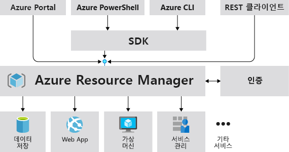
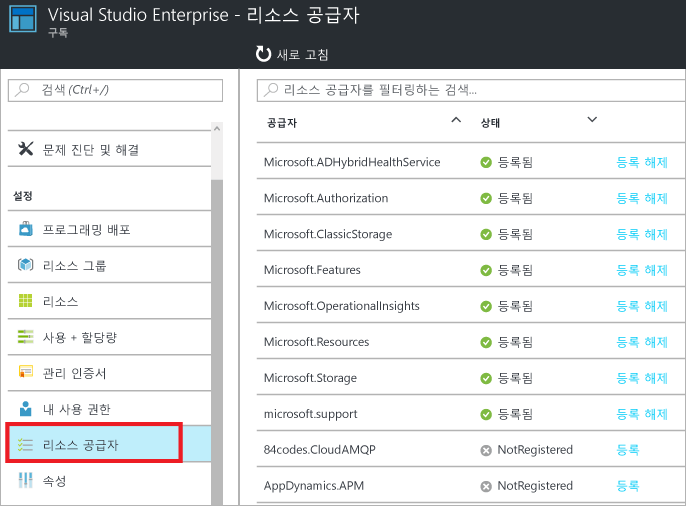
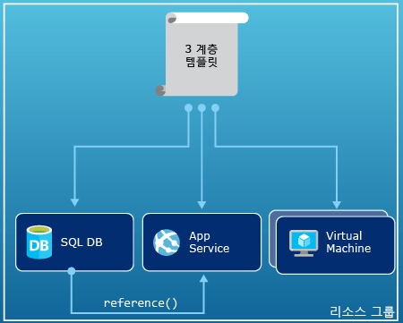
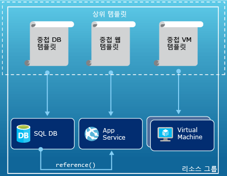
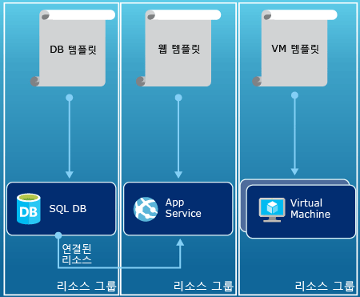

# <a name="azure-resource-manager-overview"></a>Azure Resource Manager 개요
응용 프로그램에 대한 인프라는 일반적으로 가상 컴퓨터, 저장소 계정 및 가상 네트워크 또는 웹앱, 데이터베이스, 데이터베이스 서버 및 타사 서비스 등의 많은 구성 요소를 만듭니다. 이러한 구성 요소를 별도 엔터티로 표시하지 않으면, 대신 관련된 단일 엔터티의 상호 종속적으로 부분으로 표시됩니다. 그룹으로 배포, 관리 및 모니터링하려고 합니다. Azure 리소스 관리자를 사용하면 솔루션에서 리소스를 그룹으로 사용할 수 있습니다. 조정된 단일 작업에서 솔루션에 대한 모든 리소스를 배포, 업데이트 또는 삭제할 수 있습니다. 배포용 템플릿을 사용하고 이 템플릿을 테스트, 스테이징 및 프로덕션과 같은 여러 환경에서 사용할 수 있습니다. 리소스 관리자는 보안, 감사 및 태그 기능을 제공하여 배포 후에 리소스를 관리할 수 있습니다. 

## <a name="terminology"></a>용어
Azure Resource Manager가 처음이라면 익숙하지 않은 용어가 있을 수 있습니다.

* **리소스** - Azure를 통해 사용할 수 있는 관리 가능한 항목입니다. 몇 가지 일반적인 리소스는 가상 컴퓨터, 저장소 계정, 웹앱, 데이터베이스 및 가상 네트워크이지만 더 많은 종류가 있습니다.
* **리소스 그룹** - Azure 솔루션에 관련된 리소스를 보유하는 컨테이너입니다. 리소스 그룹에는 솔루션에 대한 모든 리소스 또는 그룹으로 관리하려는 해당 리소스만 포함될 수 있습니다. 사용자의 조직에 가장 적합한 내용에 따라 리소스 그룹에 리소스를 어떻게 할당할지 결정합니다. [리소스 그룹](#resource-groups)을 참조하세요.
* **리소스 공급자** - Resource Manager를 통해 배포하고 관리할 수 있는 리소스를 제공하는 서비스입니다. 각 리소스 공급자는 배포된 리소스로 작업하기 위한 작업을 제공합니다. 몇 가지 일반 리소스 공급자는 가상 컴퓨터 리소스를 제공하는 Microsoft.Compute, 저장소 계정 리소스를 제공하는 Microsoft.Storage 및 웹앱에 관련된 리소스를 제공하는 Microsoft.Web입니다. [리소스 공급자](#resource-providers)를 참조하세요.
* **Resource Manager 템플릿** - 리소스 그룹에 배포한 하나 이상의 리소스를 정의하는 JSON(JavaScript Object Notation) 파일입니다. 또한 배포된 리소스 간의 종속성을 정의합니다. 템플릿은 리소스를 일관되고 반복적으로 배포하는 데 사용할 수 있습니다. [템플릿 배포](#template-deployment)를 참조하세요.
* **선언적 구문** - 항목을 만드는 프로그래밍 명령의 시퀀스를 작성하지 않고도 "만들려는 대상은 다음과 같습니다"라고 선언하는 구문입니다. Resource Manager 템플릿은 선언적 구문의 예입니다. 파일에서 Azure에 배포하는 인프라에 대한 속성을 정의합니다. 

## <a name="the-benefits-of-using-resource-manager"></a>리소스 관리자를 사용할 경우의 이점
리소스 관리자는 다음과 같은 여러 이점이 있습니다.

* 이 리소스를 개별적으로 처리하는 것이 아니라 솔루션에 대한 모든 리소스를 그룹으로 배포, 관리 및 모니터링할 수 있습니다.
* 개발 수명 주기 내내 솔루션을 반복적으로 배포하며 안심하고 일관된 상태로 리소스를 배포할 수 있습니다.
* 스크립트가 아닌 선언적 템플릿을 통해 인프라를 관리할 수 있습니다.
* 올바른 순서로 배포되므로 리소스 간의 종속성을 정의할 수 있습니다.
* 역할 기반 액세스 제어(RBAC)가 관리 플랫폼으로 통합되기 때문에 리소스 그룹의 모든 서비스에 대해 액세스 제어를 적용할 수 있습니다.
* 리소스에 태그를 적용하여 구독에서 모든 리소스를 논리적으로 구성할 수 있습니다.
* 같은 태그를 공유하는 리소스 그룹에 대한 비용을 확인하여 조직의 청구를 명확히 할 수 있습니다.  

리소스 관리자는 솔루션을 배포 및 관리하는 새로운 방식을 제공합니다. 이전의 배포 모델을 사용한 경우 변경 사항을 알아보려면 [리소스 관리자 배포 및 클래식 배포 이해](resource-manager-deployment-model.md)를 참조하세요.

## <a name="consistent-management-layer"></a>일관적인 관리 계층
리소스 관리자는 Azure PowerShell, Azure CLI, Azure 포털, REST API 및 개발 도구를 통해 수행하는 작업에 대한 일관적인 관리 계층을 제공합니다. 모든 도구는 작업의 공통 집합을 사용합니다. 가장 적합한 도구를 사용하며 혼동 없이 서로 교환해서 사용할 수 있습니다. 

다음 그림에서는 모든 도구가 동일한 Azure Resource Manager API와 상호 작용하는 방법을 보여 줍니다. API는 요청을 인증하고 권한을 부여하는 리소스 관리자 서비스에 요청을 전달합니다. 그런 다음 리소스 관리자는 적절한 리소스 공급자에게 요청을 라우팅합니다.



## <a name="guidance"></a>인도
다음 제안으로 솔루션으로 작업할 때 Resource Manager를 완벽하게 활용할 수 있습니다.

1. 명령적 명령을 사용하는 대신 리소스 관리자 템플릿의 선언적 구문을 통해 인프라를 정의하고 배포합니다.
2. 템플릿에서 모든 배포 및 구성 단계를 정의합니다. 솔루션을 설정하기 위해 수동 단계가 없어야 합니다.
3. 명령적 명령을 실행하여 앱 또는 컴퓨터를 시작하거나 중지하는 등 리소스를 관리합니다.
4. 리소스 그룹에서 동일한 수명 주기로 리소스를 정렬합니다. 리소스의 모든 다른 구성에 태그를 사용합니다.

템플릿에 대한 권장 사항은 [Azure Resource Manager 템플릿 생성 모범 사례](resource-manager-template-best-practices.md)를 참조하세요.

엔터프라이즈에서 리소스 관리자를 사용하여 구독을 효과적으로 관리할 수 있는 방법에 대한 지침은 [Azure 엔터프라이즈 스캐폴드 - 규범적 구독 거버넌스](resource-manager-subscription-governance.md)를 참조하세요.

## <a name="resource-groups"></a>리소스 그룹
리소스 그룹을 정의할 때 고려해야 할 몇 가지 중요한 요인이 있습니다.

1. 그룹에서 모든 리소스는 동일한 수명 주기를 공유해야 합니다. 리소스를 함께 배포, 업데이트, 삭제합니다. 데이터베이스 서버와 같은 하나의 리소스에 다양한 배포 주기가 존재하는 경우 다른 리소스 그룹에 있어야 합니다.
2. 각 리소스는 하나의 리소스 그룹에만 있을 수 있습니다.
3. 언제든지 리소스 그룹에 리소스를 추가하거나 제거할 수 있습니다.
4. 특정 리소스 그룹에서 다른 그룹에 리소스를 이동할 수 있습니다. 자세한 내용을 보려면 [새 리소스 그룹 또는 구독으로 리소스 이동](resource-group-move-resources.md)을 참조하세요.
5. 리소스 그룹을 다른 지역에 상주하는 리소스를 포함할 수 있습니다.
6. 관리 작업에 대한 액세스 제어 범위를 지정하는 데 리소스 그룹을 사용할 수 있습니다.
7. 리소스는 다른 리소스 그룹의 리소스와 상호 작용할 수 있습니다. 이 상호 작용은 두 개의 리소스가 관련되어 있지만 동일한 수명 주기를 공유하지 않는 경우에 일반적입니다(예: 데이터베이스에 연결된 웹앱).

리소스 그룹을 만들 때 해당 리소스 그룹의 위치를 제공해야 합니다. 리소스 그룹에 위치가 필요한 이유는 무엇인지 궁금할 수 있습니다. 리소스의 위치가 리소스 그룹과 다른 경우 리소스 그룹 위치가 중요한 이유는 무엇인가요? 리소스 그룹은 리소스에 대한 메타데이터를 저장합니다. 따라서 리소스 그룹의 위치를 지정하면 메타데이터가 저장된 위치를 지정하게 됩니다. 규정 준수 때문에 특정 지역에 데이터가 저장되는지 확인해야 합니다.

## <a name="resource-providers"></a>리소스 공급자
각 리소스 공급자는 Azure 서비스를 사용하는 일련의 리소스 및 작업을 제공합니다. 예를 들어 키와 암호를 저장하려는 경우 **Microsoft.KeyVault** 리소스 공급자로 작업합니다. 이 리소스 공급자는 키 자격 증명 모음을 만드는 데 **자격 증명 모음**이라는 리소스 유형을 제공합니다. 

리소스 배포를 시작하기 전에 사용 가능한 리소스 공급자를 이해해야 합니다. 리소스 공급자 및 리소스의 이름을 알고 있으면 Azure에 배포하려는 리소스를 정의할 수 있습니다.

포털을 통해 모든 리소스 공급자를 볼 수 있습니다. 구독에 대한 블레이드에서 **리소스 공급자**를 선택합니다.



다음 PowerShell cmdlet을 사용하여 모든 리소스 공급자를 검색합니다.

```powershell
Get-AzureRmResourceProvider -ListAvailable
```

또는 Azure CLI 2.0으로 다음 명령을 사용하여 모든 리소스 공급자를 검색합니다.

```azurecli
az provider list
```

사용해야 하는 리소스 공급자의 반환된 목록을 살펴볼 수 있습니다.

리소스 공급자에 대한 세부 정보를 가져오려면 명령에 공급자 네임스페이스를 추가합니다. 이 명령은 리소스 공급자에 지원되는 리소스 유형 및 지원되는 위치와 각 리소스 유형에 대한 API 버전을 반환합니다. 다음 PowerShell cmdlet은 Microsoft.Compute에 대한 세부 정보를 가져옵니다.

```powershell
(Get-AzureRmResourceProvider -ProviderNamespace Microsoft.Compute).ResourceTypes
```

또는 Azure CLI 2.0으로 다음 명령을 사용하여 Microsoft.Compute에 지원되는 리소스 유형, 위치 및 API 버전을 검색합니다.

```azurecli
az provider show --namespace Microsoft.Compute
```

자세한 내용은 [Resource Manager 공급자, 지역, API 버전 및 스키마](resource-manager-supported-services.md)를 참조하세요.

## <a name="template-deployment"></a>템플릿 배포
Resource Manager로 Azure 솔루션의 인프라 및 구성을 정의하는 템플릿을 JSON 형식으로 만들 수 있습니다. 템플릿을 사용하여 수명 주기 내내 솔루션을 반복적으로 배포하고 안심하고 일관된 상태로 리소스를 배포할 수 있습니다. 포털에서 솔루션을 만들 때 자동으로 솔루션에 배포 템플릿을 포함합니다. 솔루션용 템플릿으로 시작하고 특정 요구 사항에 맞게 사용자 지정할 수 있기 때문에 서식 파일을 처음부터 새로 만들 필요가 없습니다. 리소스 그룹의 현재 상태를 내보내거나 특정 배포에 사용된 템플릿을 검토하여 기존 리소스 그룹에 대한 템플릿을 검색할 수 있습니다. [내보낸 템플릿](resource-manager-export-template.md)을 살펴보면 템플릿 구문에 대해 알아보는 데 도움이 됩니다.

템플릿의 형식 및 템플릿을 생성하는 방법에 대해 알아보려면 [첫 번째 Azure Resource Manager 템플릿 만들기](resource-manager-create-first-template.md)를 참조하세요. 리소스 유형의 JSON 구문을 보려면 [Azure Resource Manager 템플릿에서 리소스 정의](/azure/templates/)를 참조하세요.

리소스 관리자는 다른 요청과 같이 템플릿을 처리합니다([일관적인 관리 계층](#consistent-management-layer)에 대한 이미지 참조). 템플릿을 구문 분석하고 해당 구문을 적절한 리소스 공급자에 대한 REST API 작업으로 변환합니다. 예를 들어 리소스 관리자가 다음 리소스 정의로 템플릿을 받는 경우:

```json
"resources": [
  {
    "apiVersion": "2016-01-01",
    "type": "Microsoft.Storage/storageAccounts",
    "name": "mystorageaccount",
    "location": "westus",
    "sku": {
      "name": "Standard_LRS"
    },
    "kind": "Storage",
    "properties": {
    }
  }
]
```

Microsoft.Storage 리소스 공급자에게 전송되는 다음 REST API 작업으로 정의를 변환합니다.

```HTTP
PUT
https://management.azure.com/subscriptions/{subscriptionId}/resourceGroups/{resourceGroupName}/providers/Microsoft.Storage/storageAccounts/mystorageaccount?api-version=2016-01-01
REQUEST BODY
{
  "location": "westus",
  "properties": {
  }
  "sku": {
    "name": "Standard_LRS"
  },   
  "kind": "Storage"
}
```

템플릿 및 리소스 그룹을 정의하는 방법은 사용자 및 솔루션을 관리하려는 방법에 전적으로 달려 있습니다. 예를 들어 단일 템플릿을 통해 3계층 응용 프로그램을 단일 리소스 그룹에 배포할 수 있습니다.



그러나 단일 템플릿에서 전체 인프라를 정의할 필요가 없습니다. 대부분 배포 요구 사항을 대상, 목적에 특정 템플릿 집합으로 나누는 것이 좋습니다. 서로 다른 솔루션에 이러한 템플릿을 쉽게 다시 사용할 수 있습니다. 특정 솔루션을 배포하려면 모든 필수 템플릿에 연결하는 마스터 템플릿을 만듭니다. 다음 이미지는 세 개의 중첩된 템플릿을 포함하는 부모 템플릿을 통해 3계층 솔루션을 배포하는 방법을 보여 줍니다.



계층이 별도 수명 주기를 갖도록 계획하는 경우 3계층을 별도 리소스 그룹에 배포할 수 있습니다. 리소스는 다른 리소스 그룹의 리소스에 계속해서 연결될 수 있습니다.



템플릿 설계에 대한 더 많은 제안은 [Azure Resource Manager 템플릿 설계의 패턴](best-practices-resource-manager-design-templates.md)을 참조하세요. 중첩된 템플릿에 대한 자세한 내용은 [Azure Resource Manager에서 연결된 템플릿 사용](resource-group-linked-templates.md)을 참조하세요.

배포 자동화에 대한 4가지 시리즈는 [Azure 가상 컴퓨터에 대한 응용 프로그램 배포 자동화](../virtual-machines/virtual-machines-windows-dotnet-core-1-landing.md?toc=%2fazure%2fvirtual-machines%2fwindows%2ftoc.json)를 참조하세요. 이 시리즈에서는 응용 프로그램 아키텍처, 액세스 및 보안, 가용성 및 규모, 응용 프로그램 배포에 대해 다룹니다.

리소스가 올바른 순서로 생성되도록 Azure Resource Manager가 종속성을 분석합니다. 한 리소스가 다른 리소스(예: 디스크에 대한 저장소 계정을 필요로 하는 가상 컴퓨터)의 값에 의존하는 경우 종속성을 설정합니다. 자세한 정보는 [Azure 리소스 관리자 템플릿에서 종속성 정의](resource-group-define-dependencies.md)를 참조하세요.

또한 인프라의 업데이트에 대한 템플릿을 사용할 수 있습니다. 예를 들어 솔루션에 리소스를 추가할 수 있으며 이미 배포된 리소스에 대한 구성 규칙을 추가할 수 있습니다. 템플릿에서 리소스 만들기를 지정하지만 해당 리소스가 이미 존재하는 경우 Azure Resource Manager는 새 자산을 만드는 대신 업데이트를 수행합니다. Azure 리소스 관리자는 새 것과 동일한 상태로 기존 자산을 업데이트합니다.  

리소스 관리자는 설치에 포함되지 않은 특정 소프트웨어를 설치하는 등의 추가 작업을 할 때 시나리오에 대한 확장을 제공합니다. DSC, Chef 또는 Puppet와 같은 구성 관리 서비스를 이미 사용 중인 경우 확장을 사용하여 해당 서비스로 작업을 계속할 수 있습니다. 가상 컴퓨터 확장에 대한 자세한 내용은 [가상 컴퓨터 확장 및 기능 정보](../virtual-machines/virtual-machines-windows-extensions-features.md?toc=%2fazure%2fvirtual-machines%2fwindows%2ftoc.json)를 참조하세요. 

마지막으로 템플릿은 앱에 대한 소스 코드의 일부가 됩니다. 소스 코드 리포지토리를 확인하고 앱이 발전하면 업데이트할 수 있습니다. Visual Studio를 통해 템플릿을 편집할 수 있습니다.

템플릿을 정의하면 Azure에 리소스를 배포할 준비가 되었습니다. 리소스를 배포하는 명령은 다음을 참조하세요.

* [Resource Manager 템플릿과 Azure PowerShell로 리소스 배포](resource-group-template-deploy.md)
* [Resource Manager 템플릿과 Azure CLI로 리소스 배포](resource-group-template-deploy-cli.md)
* [Resource Manager 템플릿과 Azure Portal로 리소스 배포](resource-group-template-deploy-portal.md)
* [Resource Manager 템플릿과 Resource Manager REST API로 리소스 배포](resource-group-template-deploy-rest.md)

## <a name="tags"></a>태그들
리소스 관리자는 관리 또는 청구에 대한 요구 사항에 따라 리소스를 분류할 수 있는 태그 지정 기능을 제공합니다. 리소스 그룹 및 리소스의 복잡한 컬렉션이 있고 해당 자산을 사용자에게 가장 적합한 방식으로 시각화할 필요가 있을 때 태그를 사용합니다. 예를 들어 조직에서 비슷한 역할을 제공하거나 동일한 부서에 속한 리소스를 태그로 지정할 수 있습니다. 조직의 사용자는 태그 없이 나중에 식별하고 관리하기 어려울 수 있는 여러 리소스를 만들 수 있습니다. 예를 들어 특정 프로젝트에 대한 모든 리소스를 삭제하려고 할 수 있습니다. 해당 리소스가 프로젝트에 대해 태그가 지정되지 않은 경우 수동으로 찾아야 합니다. 태그를 지정하는 작업은 구독에서 불필요한 비용을 줄일 수 있는 좋은 방법입니다. 

리소스는 태그를 공유하는 동일한 리소스 그룹에 있을 필요가 없습니다. 조직의 모든 사용자가 실수로 약간 다른 태그 (예: "dept" 대신 "department")를 적용하지 않고 일반 태그를 사용하는지 확인하려면 사용자 고유의 태그 분류를 만들 수 있습니다.

다음 예제에서는 가상 컴퓨터에 적용된 태그를 보여 줍니다.

```json
"resources": [    
  {
    "type": "Microsoft.Compute/virtualMachines",
    "apiVersion": "2015-06-15",
    "name": "SimpleWindowsVM",
    "location": "[resourceGroup().location]",
    "tags": {
        "costCenter": "Finance"
    },
    ...
  }
]
```

태그 값을 사용하는 모든 리소스를 검색하려면 다음 PowerShell cmdlet을 사용합니다.

```powershell
Find-AzureRmResource -TagName costCenter -TagValue Finance
```

또는 다음 Azure CLI 2.0 명령을 사용합니다.

```azurecli
az resource list --tag costCenter=Finance
```

Azure Portal을 통해 태그가 지정된 리소스를 볼 수도 있습니다.

구독에 대한 [사용 현황 보고서](../billing/billing-understand-your-bill.md)는 태그 이름 및 값을 포함하며 이를 통해 태그별 비용을 알아낼 수 있습니다. 태그에 대한 자세한 내용은 [태그를 사용하여 Azure 리소스 구성](resource-group-using-tags.md)을 참조하십시오.

## <a name="access-control"></a>액세스 제어
리소스 관리자를 사용하면 조직에 대한 특정 작업에 액세스하는 사람을 제어할 수 있습니다. 고유하게 관리 플랫폼으로 RBAC(역할 기반 액세스 제어)를 통합하고 해당 액세스 제어를 리소스 그룹에서 모든 서비스에 적용합니다. 

역할 기반 액세스 제어로 작업하는 경우를 이해하기 위한 두 가지 주요 개념이 있습니다.

* 역할 정의 - 사용 권한 집합을 설명하고 여러 할당에 사용할 수 있습니다.
* 역할 할당 - 특정 범위(구독, 리소스 그룹 또는 리소스)에 대한 ID(사용자 또는 그룹)로 정의를 연결합니다. 할당은 더 낮은 범위로 상속됩니다.

미리 정의된 플랫폼 및 리소스 특정 역할에 사용자를 추가할 수 있습니다. 예를 들어 사용자가 리소스를 변경하지 않고 보도록 허용하는 읽기 권한자를 호출하는 미리 정의된 역할의 장점을 활용할 수 있습니다. 이 유형의 액세스를 필요로 하는 조직의 사용자를 읽기 권한자 역할에 추가하고 구독, 리소스 그룹 또는 리소스에 역할을 적용합니다.

Azure는 다음 4개의 플랫폼 역할을 제공합니다.

1. 소유자는 액세스를 제외한 모든 것을 관리할 수 있음
2. 참여자는 액세스를 제외한 모든 것을 관리할 수 있음
3. 읽기 권한자는 모든 항목을 볼 수 있지만 변경할 수 없음
4. 사용자 액세스 관리자는 Azure 리소스에 대한 사용자 액세스를 관리할 수 있음

Azure는 몇 가지 리소스 특정 역할도 제공합니다. 몇 가지 일반적인 경우는 다음과 같습니다.

1. 가상 컴퓨터 참가자는 가상 컴퓨터를 관리할 수 있지만 그에 대한 액세스 권한을 부여할 수 없고 연결된 가상 네트워크 또는 저장소 계정을 관리할 수 없음
2. 네트워크 참가자는 모든 네트워크 리소스를 관리할 수 있지만 그에 대한 액세스 권한을 부여할 수 없음
3. 저장소 계정 참가자는 저장소 계정을 관리할 수 있지만 그에 대한 액세스 권한을 부여할 수 없음
4. SQL Server 참가자는 해당 보안 관련 정책을 제외한 SQL 서버 및 데이터베이스를 관리할 수 있음
5. 웹 사이트 참가자는 웹 사이트를 관리할 수 있으나 여기에 연결된 웹 계획은 관리할 수 없음

역할 및 허용되는 작업의 전체 목록은 [RBAC: 기본 제공 역할](../active-directory/role-based-access-built-in-roles.md)을 참조하세요. 역할 기반 액세스 제어에 대한 자세한 내용은 [Azure 역할 기반 액세스 제어](../active-directory/role-based-access-control-configure.md)를 참조하세요. 

경우에 따라 리소스에 액세스하는 코드 또는 스크립트를 실행하려고 하지만 사용자의 자격 증명으로 실행하지 않으려 할 수 있습니다. 대신, 응용 프로그램에 대한 서비스 주체를 호출하는 ID를 만들고 서비스 주체에 대한 적절한 역할을 할당하려고 합니다. Resource Manager를 사용하면 응용 프로그램에 대한 자격 증명을 만들고 프로그래밍 방식으로 응용 프로그램을 인증할 수 있습니다. 서비스 주체를 만드는 방법에 대해 알아보려면 다음 항목 중 하나를 참조하세요.

* [Azure PowerShell을 사용하여 리소스에 액세스하는 서비스 주체 만들기](resource-group-authenticate-service-principal.md)
* [Azure CLI를 사용하여 리소스에 액세스하는 서비스 주체 만들기](resource-group-authenticate-service-principal-cli.md)
* [포털을 사용하여 리소스에 액세스할 수 있는 Active Directory 응용 프로그램 및 서비스 주체 만들기](resource-group-create-service-principal-portal.md)

또한 사용자가 삭제 및 수정하는 것을 방지하기 위해 명시적으로 중요한 리소스를 잠글 수 있습니다. 자세한 내용은 [Azure 리소스 관리자를 사용하여 리소스 잠그기](resource-group-lock-resources.md)를 참조하세요.

## <a name="activity-logs"></a>활동 로그
Resource Manager는 리소스를 만들거나 수정 또는 삭제하는 모든 작업을 기록합니다. 활동 로그를 사용하여 문제를 해결할 때 오류를 찾거나 조직의 사용자가 리소스를 수정한 방법을 모니터링할 수 있습니다. 로그를 보려면 리소스 그룹에 대한 **설정** 블레이드에서 **활동 로그**를 선택합니다. 작업을 시작한 사용자를 포함하여 여러 다른 값으로 로그를 필터링할 수 있습니다. 활동 로그 작업에 대한 내용은 [Azure 리소스 관리를 위한 활동 로그 보기](resource-group-audit.md)를 참조하세요.

## <a name="customized-policies"></a>사용자 지정된 정책
리소스 관리자를 사용하면 리소스를 관리하기 위해 사용자 지정된 정책을 만들 수 있습니다. 만든 정책의 유형에는 다양한 시나리오가 포함될 수 있습니다. 리소스에 대한 명명 규칙을 적용하거나 배포할 수 있는 리소스의 형식 및 인스턴스를 제한하거나 리소스 종류를 호스트할 수 있는 지역을 제한할 수 있습니다. 부서별로 청구를 구성하기 위해 리소스에 대한 태그 값이 필요할 수 있습니다. 구독에서 비용을 절감하고 일관성을 유지하는 데 도움이 되는 정책을 만들 수 있습니다. 

JSON을 사용하여 정책을 정의하고 구독 전체 또는 리소스 그룹 내에서 해당 정책을 적용합니다. 정책은 리소스 유형에 적용되기 때문에 역할 기반 액세스 제어와 다릅니다.

다음 예제에서는 모든 리소스에 costCenter 태그가 포함되는지를 지정하여 태그 일관성을 보장하는 정책을 보여 줍니다.

```json
{
  "if": {
    "not" : {
      "field" : "tags",
      "containsKey" : "costCenter"
    }
  },
  "then" : {
    "effect" : "deny"
  }
}
```

더 다양한 유형의 정책을 만들 수 있습니다. 자세한 내용은 [정책을 사용하여 리소스 및 컨트롤 액세스 관리](resource-manager-policy.md)를 참조하세요.

## <a name="sdks"></a>SDK
Azure SDK는 여러 언어 및 플랫폼에 사용할 수 있습니다.
이러한 언어 구현은 각각 해당 에코 시스템 패키지 관리자 및 GitHub를 통해 사용할 수 있습니다.

이러한 SDK의 각 코드는 Azure RESTful API 사양에서 생성됩니다.
이러한 사양은 오픈 소스이며 Swagger 2.0 사양을 기반으로 합니다.
SDK 코드는 AutoRest라는 오픈 소스 프로젝트를 통해 생성됩니다.
AutoRest는 이러한 RESTful API 사양을 여러 언어의 클라이언트 라이브러리로 변환합니다.
SDK에서 생성된 코드의 어떤 측면을 개선하려면, SDK를 만드는 전체 도구는 오픈되어 자유롭게 사용 가능하고 광범위하게 채택된 API 사양 형식에 기반으로 해야 합니다.

다음은 오픈 소스 SDK 리포지토리입니다. 피드백, 문제 및 끌어오기 요청을 환영합니다.

[.NET](https://github.com/Azure/azure-sdk-for-net) | [Java](https://github.com/Azure/azure-sdk-for-java) | [Node.js](https://github.com/Azure/azure-sdk-for-node) | [PHP](https://github.com/Azure/azure-sdk-for-php) | [Python](https://github.com/Azure/azure-sdk-for-python) | [Ruby](https://github.com/Azure/azure-sdk-ruby)

> [!NOTE]
> SDK가 필요한 기능을 제공하지 않는 경우 [Azure REST API](https://docs.microsoft.com/rest/api/resources/) 에 직접 요청할 수 있습니다.
> 
> 

## <a name="samples"></a>샘플
### <a name="net"></a>.NET
* [Azure 리소스 및 리소스 그룹 관리](https://azure.microsoft.com/documentation/samples/resource-manager-dotnet-resources-and-groups/)
* [템플릿을 사용하여 SSH 사용 VM 배포](https://azure.microsoft.com/documentation/samples/resource-manager-dotnet-template-deployment/)

### <a name="java"></a>자바
* [Azure 리소스 관리](https://azure.microsoft.com/documentation/samples/resources-java-manage-resource/)
* [Azure 리소스 그룹 관리](https://azure.microsoft.com/documentation/samples/resources-java-manage-resource-group/)
* [템플릿을 사용하여 SSH 사용 VM 배포](https://azure.microsoft.com/documentation/samples/resources-java-deploy-using-arm-template/)

### <a name="nodejs"></a>Node.js
* [Azure 리소스 및 리소스 그룹 관리](https://azure.microsoft.com/documentation/samples/resource-manager-node-resources-and-groups/)
* [템플릿을 사용하여 SSH 사용 VM 배포](https://azure.microsoft.com/documentation/samples/resource-manager-node-template-deployment/)

### <a name="python"></a>파이썬
* [Azure 리소스 및 리소스 그룹 관리](https://azure.microsoft.com/documentation/samples/resource-manager-python-resources-and-groups/)
* [템플릿을 사용하여 SSH 사용 VM 배포](https://azure.microsoft.com/documentation/samples/resource-manager-python-template-deployment/)

### <a name="ruby"></a>루비
* [Azure 리소스 및 리소스 그룹 관리](https://azure.microsoft.com/documentation/samples/resource-manager-ruby-resources-and-groups/)
* [템플릿을 사용하여 SSH 사용 VM 배포](https://azure.microsoft.com/documentation/samples/resource-manager-ruby-template-deployment/)

이러한 샘플 외에도 갤러리 샘플을 통해 검색할 수 있습니다.

[.NET](https://azure.microsoft.com/documentation/samples/?service=azure-resource-manager&platform=dotnet) | [Java](https://azure.microsoft.com/documentation/samples/?service=azure-resource-manager&platform=java) | [Node.js](https://azure.microsoft.com/documentation/samples/?service=azure-resource-manager&platform=nodejs) | [Python](https://azure.microsoft.com/documentation/samples/?service=azure-resource-manager&platform=python) | [Ruby](https://azure.microsoft.com/documentation/samples/?service=azure-resource-manager&platform=ruby)

## <a name="next-steps"></a>다음 단계
* 템플릿으로 작업하는 방법에 대한 간단한 소개는 [기존 리소스에서 Azure Resource Manager 템플릿 내보내기](resource-manager-export-template.md)를 참조하세요.
* 템플릿을 만드는 자세한 연습은 [첫 번째 Azure Resource Manager 템플릿 만들기](resource-manager-create-first-template.md)를 참조하세요.
* 템플릿에서 사용할 수 있는 함수를 이해하려면 [템플릿 함수](resource-group-template-functions.md)
* Resource Manager로 Visual Studio를 사용하는 방법에 대한 정보는 [Visual Studio를 통해 Azure 리소스 그룹 생성 및 배포](vs-azure-tools-resource-groups-deployment-projects-create-deploy.md)를 참조하세요.

이 개요에 대한 비디오 데모는 다음과 같습니다.

>[!VIDEO https://channel9.msdn.com/Blogs/Azure-Documentation-Shorts/Azure-Resource-Manager-Overview/player]


[powershellref]: https://docs.microsoft.com/powershell/resourcemanager/azurerm.resources/v3.2.0/azurerm.resources

