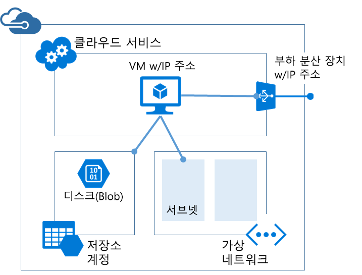

# <a name="azure-resource-manager-vs-classic-deployment-understand-deployment-models-and-the-state-of-your-resources"></a>Azure Resource Manager 및 클래식 배포: 배포 모델 및 리소스 상태 이해

> [!NOTE]
> 이 문서에서 제공된 정보는 클래식 배포에서 Azure Resource Manager 배포로 마이그레이션하는 경우에만 사용됩니다.

이 문서에서는 Azure Resource Manager 및 클래식 배포 모델에 대해 알아봅니다. Resource Manager와 클래식 배포 모델은 Azure 솔루션을 배포하고 관리하는 별개의 두 가지 방식을 나타냅니다. 서로 다른 두 가지 API 집합을 통해 작업하며, 배포된 리소스에는 중요한 차이점이 있습니다. 두 가지 모델은 서로 호환되지 않습니다. 이 문서에서는 이러한 차이점을 설명합니다.

리소스의 배포와 관리를 단순화하기 위해 새 리소스 모두에 대해 Resource Manager를 사용하는 것이 좋습니다. 가능하면 기존 리소스도 Resource Manager를 통해 다시 배포하는 것이 좋습니다.

Resource Manager를 새로이 경험하는 경우 먼저 [Azure Resource Manager 개요](resource-group-overview.md)에 정의된 용어를 검토할 수도 있습니다.

[!INCLUDE [updated-for-az](../../includes/updated-for-az.md)]

## <a name="history-of-the-deployment-models"></a>배포 모델 내역
Azure에서는 원래 클래식 배포 모델만 제공했습니다. 이 모델에서는 각 리소스가 독립적으로 존재하며 관련 리소스를 함께 그룹화할 방법이 없습니다. 대신, 어떤 리소스로 솔루션 또는 애플리케이션이 구성되었는지를 수동으로 추적하고 통합된 방식으로 이를 관리해야 했습니다. 솔루션을 배포하기 위해 포털을 통해 각 리소스를 개별적으로 만들거나 모든 리소스를 정확한 순서로 배포하는 스크립트를 만들어야 했습니다. 솔루션을 삭제하려면 각 리소스를 개별적으로 삭제해야 했습니다. 관련 리소스에 대한 액세스 제어 정책을 쉽게 적용 및 업데이트할 수 없었습니다. 마지막으로 리소스를 모니터링하고 청구를 관리하는 데 도움이 되는 조건으로 레이블을 지정하기 위한 태그를 리소스에 적용할 수 없었습니다.

2014년에 Azure에서 리소스 그룹의 개념을 추가한 Resource Manager를 소개했습니다. 리소스 그룹은 공통 수명 주기를 공유하는 리소스의 컨테이너입니다. 리소스 관리자 배포 모델에는 여러 이점을 제공합니다.

* 솔루션에 대한 모든 서비스를 개별적으로 처리하는 것이 아니라 이러한 서비스를 그룹으로 배포, 관리 및 모니터링할 수 있습니다.
* 수명 주기 내내 솔루션을 반복적으로 배포하며 안심하고 일관된 상태로 리소스를 배포할 수 있습니다.
* 리소스 그룹의 모든 리소스에 액세스 제어를 적용할 수 있으며 새 리소스를 리소스 그룹에 추가할 때 해당 정책이 자동으로 적용됩니다.
* 리소스에 태그를 적용하여 구독에서 모든 리소스를 논리적으로 구성할 수 있습니다.
* JSON(JavaScript Object Notation)을 사용하여 솔루션에 대한 인프라를 정의할 수 있습니다. JSON 파일을 Resource Manager 템플릿이라고 합니다.
* 올바른 순서로 배포되므로 리소스 간의 종속성을 정의할 수 있습니다.

리소스 관리자를 추가할 때 모든 리소스는 기본 리소스 그룹에 소급 추가되었습니다. 이제 클래식 배포를 통해 리소스를 만들 경우, 배포 시 해당 리소스 그룹을 지정하지 않은 경우에도 리소스가 해당 서비스에 대한 기본 리소스 그룹 내에서 자동으로 생성됩니다. 그러나 리소스 그룹 내에 존재한다 해도도 리소스 관리자 모델로 변환되었음을 의미하지는 않습니다.

## <a name="understand-support-for-the-models"></a>모델에 대한 지원 이해

다음의 세 가지 시나리오를 알고 있어야 합니다.

1. Cloud Services는 Resource Manager 배포 모델을 지원하지 않습니다.
2. 가상 머신, 저장소 계정 및 가상 네트워크는 Resource Manager 및 클래식 배포 모델을 모두 지원합니다.
3. 다른 모든 Azure 서비스는 Resource Manager를 지원합니다.

가상 머신, 저장소 계정 및 가상 네트워크의 경우 클래식 배포를 통해 리소스를 만든 경우 기존 작업을 통해 계속 작업해야 합니다. Resource Manager 배포를 통해 가상 컴퓨터, 저장소 계정 또는 가상 네트워크를 만든 경우 Resource Manager 작업을 계속 사용해야 합니다. 이러한 차이는 구독에서 Resource Manager 및 클래식 배포를 통해 만든 리소스가 혼합되는 경우에는 혼동을 줄 수 있습니다. 리소스가 동일한 작업을 지원하지 않기 때문에 이러한 리소스 조합은 예기치 않은 결과를 만들 수 있습니다.

어떤 경우에는 Resource Manager 명령으로 클래식 배포를 통해 만들어지는 리소스에 대한 정보를 검색하거나, 클래식 리소스를 다른 리소스 그룹으로 이동하는 것과 같은 관리 작업을 수행할 수 있습니다. 하지만 이 경우 해당 형식이 Resource Manager 작업을 지원한다는 느낌을 주어서는 안됩니다. 예를 들어 클래식 배포로 만든 가상 컴퓨터가 포함된 리소스 그룹이 있다고 가정합니다. 다음 Resource Manager PowerShell 명령을 실행하는 경우

```powershell
Get-AzResource -ResourceGroupName ExampleGroup -ResourceType Microsoft.ClassicCompute/virtualMachines
```

다음 예제에서는 가상 컴퓨터를 반환합니다.

```powershell
Name              : ExampleClassicVM
ResourceId        : /subscriptions/{guid}/resourceGroups/ExampleGroup/providers/Microsoft.ClassicCompute/virtualMachines/ExampleClassicVM
ResourceName      : ExampleClassicVM
ResourceType      : Microsoft.ClassicCompute/virtualMachines
ResourceGroupName : ExampleGroup
Location          : westus
SubscriptionId    : {guid}
```

그러나 Resource Manager cmdlet **Get-AzVM**만 Resource Manager를 통해 배포된 가상 머신을 반환합니다. 다음 명령은 클래식 배포를 통해 만든 가상 컴퓨터를 반환하지 않습니다.

```powershell
Get-AzVM -ResourceGroupName ExampleGroup
```

리소스 관리자를 통해 만든 리소스만이 태그를 지원합니다. 클래식 리소스에 태그를 적용할 수 없습니다.

## <a name="changes-for-compute-network-and-storage"></a>계산, 네트워크 및 스토리지에 대한 변경 내용
다음 그림에서는 Resource Manager를 통해 배포되는 계산, 네트워크 및 스토리지 리소스를 보여 줍니다.


리소스 간의 관계는 다음과 같습니다.

* 모든 리소스는 리소스 그룹 내에 존재합니다.
* 가상 컴퓨터는 SRP(스토리지 리소스 공급자)에서 Blob 스토리지(필수)에 디스크를 저장하도록 정의된 특정 Storage 계정에 따라 달라집니다.
* 가상 머신은 네트워크 리소스 공급자(필수)에서 정의된 특정 NIC 및 Compute 리소스 공급자(선택 사항)에서 정의된 가용성 집합을 참조합니다.
* NIC는 가상 머신의 할당된 IP 주소(필수), 가상 머신에 대한 가상 네트워크의 서브넷(필수) 및 NSG(네트워크 보안 그룹)(선택)를 참조합니다.
* 가상 네트워크의 서브넷은 NSG(선택)를 참조합니다.
* 부하 분산 장치 인스턴스는 가상 머신의 NIC(선택)를 포함하는 IP 주소의 백 엔드 풀을 참조하며, 로드 분산 장치 공용 또는 개인 IP 주소(선택 사항)를 참조합니다.

클래식 배포를 위한 구성 요소 및 해당 관계는 다음과 같습니다.



가상 머신을 호스트팅하는 기존 솔루션에 포함되는 구성 요소는 다음과 같습니다.

* 가상 머신 호스팅(계산)을 위한 컨테이너 역할을 하는 데 필요한 클라우드 서비스. 가상 머신은 NIC(네트워크 인터페이스 카드) 및 Azure에서 할당된 IP 주소와 함께 자동으로 제공됩니다. 또한 클라우드 서비스는 외부 부하 분산 장치 인스턴스, 공용 IP 주소, 기본 엔드포인트를 포함하여 Windows 기반의 가상 머신을 위한 원격 데스크톱 및 원격 PowerShell 트래픽 및 Linux 기반의 가상 머신을 위한 SSH(Secure Shell) 트래픽을 허용합니다.
* 운영 체제, 임시 및 추가 데이터 디스크(저장소)를 비롯하여 가상 머신을 위한 VHD를 저장하는 데 필요한 저장소 계정.
* 서브넷된 구조를 만들고 가상 머신이 위치한(네트워크) 서브넷을 지정할 수 있는 추가 컨테이너 역할을 하는 옵션 가상 네트워크입니다.

다음 표에서 Compute, Network 및 Storage 리소스 공급자의 상호 작동 방식에 대한 변경 내용을 설명합니다.

| 항목 | 클래식 | 리소스 관리자 |
| --- | --- | --- |
| Virtual Machines용 클라우드 서비스 |클라우드 서비스는 플랫폼 가용성 및 부하 분산이 필요한 가상 머신을 유지하는 컨테이너였습니다. |클라우드 서비스는 더 이상 새 모델을 사용하여 Virtual Machine을 만드는 데 필요한 개체가 아닙니다. |
| Virtual Network |가상 머신의 가상 네트워크는 선택 사항입니다. 포함되는 경우 Resource Manager에서 가상 네트워크를 배포할 수 없습니다. |가상 머신에 Resource Manager에서 배포한 가상 네트워크가 필요합니다. |
| Storage 계정 |가상 머신에 운영 체제, 임시 및 추가 데이터 디스크용 VHD를 저장하는 데 필요한 저장소 계정이 필요합니다. |가상 머신에 Blob Storage에서 해당 디스크를 저장하는 스토리지 계정이 필요합니다. |
| 가용성 집합 |Virtual Machines에서 동일한 “AvailabilitySetName”을 구성하여 플랫폼 가용성을 표시했습니다. 최대 장애 도메인 수는 2개였습니다. |가용성 집합은 Microsoft.Compute 공급자가 표시하는 리소스입니다. 고가용성이 필요한 Virtual Machines는 가용성 집합에 포함되어야 합니다. 최대 장애 도메인 수는 이제 3개입니다. |
| 선호도 그룹 |선호도 그룹은 Virtual Network를 만드는 데 필요했습니다. 그러나 지역 Virtual Network의 도입으로 더 이상 필요하지 않게 되었습니다. |간단히 말해, Azure 리소스 관리자를 통해 표시되는 API에는 선호도 그룹 개념이 존재하지 않습니다. |
| 부하 분산 |클라우드 서비스를 만들면 배포된 Virtual Machines에 대한 암시적 부하 분산 장치가 제공됩니다. |부하 분산 장치는 Microsoft.Network 공급자가 표시하는 리소스입니다. 부하 분산이 필요한 Virtual Machines의 기본 네트워크 인터페이스는 부하 분산 장치를 참조해야 합니다. 부하 분산 장치는 내부 또는 외부에 있을 수 있습니다. 부하 분산 장치 인스턴스는 가상 머신의 NIC(옵션)를 포함하는 IP 주소의 백 엔드 풀을 참조하며 로드 분산 장치 공용 또는 개인 IP 주소(옵션)를 참조합니다. |
| 가상 IP 주소 |Cloud Services는 VM이 클라우드 서비스에 추가될 때 기본 VIP(가상 IP 주소)를 가져옵니다. 가상 IP 주소는 암시적 부하 분산 장치와 연결된 주소입니다. |공용 IP 주소는 Microsoft.Network 공급자가 표시하는 리소스입니다. 공용 IP 주소는 고정(예약된) 또는 동적일 수 있습니다. 동적 공용 IP는 부하 분산 장치에 할당될 수 있습니다. 보안 그룹을 사용하여 공용 IP의 보안을 유지할 수 있습니다. |
| 예약된 IP 주소 |Azure에서 IP 주소를 예약하고 클라우드 서비스와 연결하여 IP 주소를 고정할 수 있습니다. |공용 IP 주소는 고정 모드에서 만들 수 있으며 예약된 IP 주소와 동일한 기능을 제공합니다. |
| VM당 PIP(공용 IP 주소) |공용 IP 주소를 VM에 직접 연결할 수도 있습니다. |공용 IP 주소는 Microsoft.Network 공급자가 표시하는 리소스입니다. 공용 IP 주소는 고정(예약된) 또는 동적일 수 있습니다. |
| 엔드포인트 |특정 포트에 대한 연결을 설정하려면 Virtual Machine에서 입력 엔드포인트를 구성해야 했습니다. 가상 머신에 연결하는 일반적인 모드 중 하나는 입력 엔드포인트를 설정하는 방식으로 수행되었습니다. |부하 분산 장치에서 인바운드 NAT 규칙을 구성하여 특정 포트의 엔드포인트에서 VM에 연결하도록 지원하는 동일한 기능을 실현할 수 있습니다. |
| DNS 이름 |클라우드 서비스는 전역적으로 고유한 암시적 DNS 이름을 가져옵니다. 예: `mycoffeeshop.cloudapp.net` |DNS 이름은 공용 IP 주소 리소스에 지정할 수 있는 선택적 매개 변수입니다. FQDN 형식 예: `<domainlabel>.<region>.cloudapp.azure.com` |
| 네트워크 인터페이스 |기본 및 보조 네트워크 인터페이스와 해당 속성이 가상 머신의 네트워크 구성으로 정의되었습니다. |네트워크 인터페이스는 Microsoft.Network 공급자가 표시하는 리소스입니다. 네트워크 인터페이스의 수명 주기는 Virtual Machine과 관련이 없습니다. 네트워크 인터페이스는 가상 머신의 할당된 IP 주소(필수), 가상 머신에 대한 가상 네트워크의 서브넷(필수) 및 네트워크 보안 그룹(선택)을 참조합니다. |

다양한 배포 모델의 가상 네트워크를 연결하는 것에 대한 자세한 내용은 [포털에서 다양한 배포 모델의 가상 네트워크 연결](../vpn-gateway/vpn-gateway-connect-different-deployment-models-portal.md)을 참조하세요.

## <a name="migrate-from-classic-to-resource-manager"></a>클래식에서 Resource Manager로 마이그레이션
클래식 배포에서 Resource Manager 배포로 마이그레이션할 준비가 되었다면 다음을 참조하세요.

1. [클래식에서 Azure Resource Manager로의 플랫폼 지원 마이그레이션에 대한 기술 정보](../virtual-machines/windows/migration-classic-resource-manager-deep-dive.md)
2. [클래식에서 Azure Resource Manager로 IaaS 리소스의 플랫폼 지원 마이그레이션](../virtual-machines/windows/migration-classic-resource-manager-overview.md)
3. [Azure PowerShell을 사용하여 클래식에서 Azure Resource Manager로 IaaS 리소스 마이그레이션](../virtual-machines/windows/migration-classic-resource-manager-ps.md)
4. [Azure CLI를 사용하여 클래식에서 Azure Resource Manager로 IaaS 리소스 마이그레이션](../virtual-machines/virtual-machines-linux-cli-migration-classic-resource-manager.md)

## <a name="frequently-asked-questions"></a>질문과 대답
**클래식 배포를 사용하여 만든 가상 네트워크에 Resource Manager를 사용하여 만든 가상 머신을 배포할 수 있나요?**

이 구성은 지원되지 않습니다. Resource Manager를 사용하면 클래식 배포를 통해 만든 가상 네트워크에 가상 머신을 배포할 수 없습니다.

**Resource Manager를 사용하면 클래식 배포 모델을 통해 만든 사용자 이미지에서 가상 머신을 만들 수 있나요?**

이 구성은 지원되지 않습니다. 하지만 클래식 배포 모델을 통해 만든 저장소 계정에서 VHD 파일을 복사하고 Resource Manager를 통해 만든 새 계정에 이 파일을 추가할 수는 있습니다.

**내 구독의 할당량에 미치는 영향은 무엇입니까?**

Azure Resource Manager를 사용하여 만든 가상 머신, 가상 네트워크 및 저장소 계정에 대한 할당량은 다른 할당량과 별개입니다. 각 구독에는 새 API를 사용하여 리소스를 만들 수 있는 할당량이 부여됩니다. 추가 할당량에 대한 자세한 내용은 [여기](../azure-subscription-service-limits.md)에서 확인할 수 있습니다.

**Resource Manager API를 통해 가상 머신, 가상 네트워크 및 저장소 계정을 프로비전하는 데 자동화된 스크립트를 계속 사용할 수 있습니까?**

사용자가 작성한 모든 자동화와 스크립트는 Azure Service Management 모드에서 만든 기존 가상 머신 및 가상 네트워크에서 계속 작동합니다. 하지만 Resource Manager 모드를 통해 동일한 리소스를 만드는 새 스키마를 사용하도록 스크립트를 업데이트해야 합니다.

**Azure 리소스 관리자 템플릿 예제는 어디서 찾을 수 있습니까?**

[Azure Resource Manager 빠른 시작 템플릿](https://azure.microsoft.com/documentation/templates/)에서 포괄적인 시작 템플릿 집합을 찾을 수 있습니다.

## <a name="next-steps"></a>다음 단계

* 가상 머신, 가상 네트워크 및 저장소 계정을 정의하는 템플릿을 만들기 위해 연습하려면 [Resource Manager 템플릿 연습](resource-manager-template-walkthrough.md)을 참조하세요.
* 템플릿 배포에 대한 명령을 보려면 [Azure 리소스 관리자 템플릿으로 애플리케이션 배포](resource-group-template-deploy.md)를 참조하세요.

