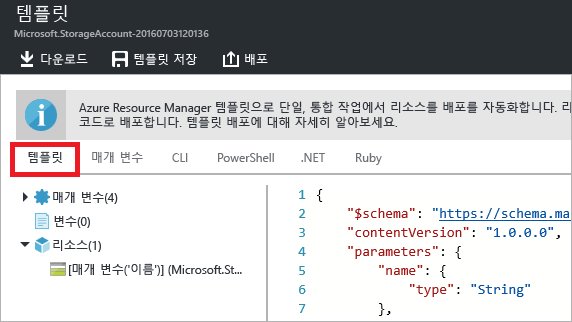
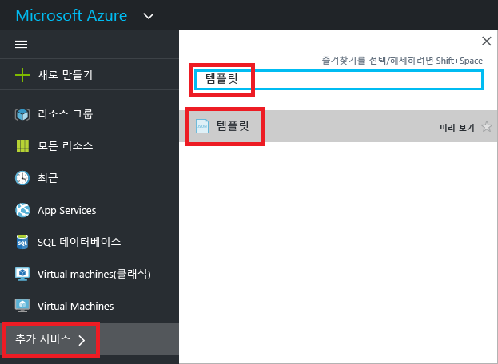
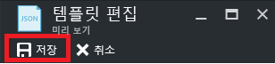

# <a name="export-an-azure-resource-manager-template-from-existing-resources"></a>기존 리소스에서 Azure Resource Manager 템플릿 내보내기
이 문서에서는 구독에서 기존 리소스의 Resource Manager 템플릿을 내보내는 방법을 알아봅니다. 생성된 해당 템플릿을 사용하여 템플릿 구문을 깊이 이해할 수 있습니다.

두 가지 방법으로 템플릿을 내보낼 수 있습니다.

* **배포에 사용된 실제 템플릿**을 내보낼 수 있습니다. 내보낸 템플릿은 원본 템플릿에 나타난 대로 모든 매개 변수 및 변수를 포함합니다. 이 방법은 포털을 통해 리소스를 배포하고 해당 리소스를 만드는 템플릿을 확인하려는 경우에 유용합니다. 이 템플릿은 곧 사용할 수 있습니다. 
* **리소스 그룹의 현재 상태를 나타내는 생성된 템플릿을 내보낼** 수 있습니다. 내보낸 템플릿은 배포에 사용된 템플릿에 기초하지 않습니다. 대신 리소스 그룹의 “스냅숏” 또는 “백업”인 템플릿을 만듭니다. 내보낸 템플릿에는 하드 코드된 값이 많으며 일반적으로 정의된 경우와 같이 매개 변수가 많이 포함되지 않습니다. 동일한 리소스 그룹에 리소스를 다시 배포하려면 이 옵션을 사용합니다. 다른 리소스 그룹에 이 템플릿을 사용하려면 크게 수정해야 할 수 있습니다.

이 문서에서는 포털을 통해 두 가지 방법을 모두 보여 줍니다.

## <a name="deploy-resources"></a>리소스 배포
템플릿으로 내보내는 데 사용할 수 있는 리소스를 Azure에 배포하기 시작하겠습니다. 템플릿을 내보내려는 구독에 리소스 그룹이 이미 있는 경우 이 섹션을 건너뛸 수 있습니다. 이 문서의 나머지 부분에서는 이 섹션에 나온 웹앱 및 SQL Database 솔루션을 배포했다고 가정합니다. 다른 솔루션을 사용하는 경우 환경은 약간 다를 수 있지만 템플릿을 내보내는 단계는 동일합니다. 

1. [Azure Portal](https://portal.azure.com)에서 **리소스 만들기**를 선택합니다.
   
      
2. **웹앱 + SQL**을 검색하고 사용 가능한 옵션 중에서 선택합니다.
   
      

3. **만들기**를 선택합니다.

      

4. 웹앱 및 SQL Database에 필수 값을 입력합니다. **만들기**를 선택합니다.

      

배포는 몇 분 정도가 걸릴 수 있습니다. 배포가 완료되면 구독에는 솔루션이 포함됩니다.

## <a name="view-template-from-deployment-history"></a>배포 기록의 템플릿 보기
1. 새 리소스 그룹의 리소스 그룹으로 이동합니다. 포털에 최종 배포 결과가 표시됩니다. 이 링크를 선택합니다.
   
      
2. 그룹의 배포 기록을 볼 수 있습니다. 사용자의 경우 포털에 하나의 배포만 나열되어 있을 것입니다. 이 배포를 선택합니다.
   
     
3. 포털에 배포 요약이 표시됩니다. 요약에는 배포 상태와 해당 작업, 매개 변수에 입력한 값이 포함됩니다. 배포에 사용된 템플릿을 보려면 **템플릿 보기**를 선택합니다.
   
     
4. Resource Manager는 다음 7개의 파일을 검색합니다.
   
   1. **템플릿** - 솔루션의 인프라를 정의하는 템플릿입니다. 포털을 통해 저장소 계정을 만들 때 Resource Manager는 템플릿을 사용하여 배포하고 나중에 참조할 수 있도록 해당 템플릿을 저장했습니다.
   2. **매개 변수** - 배포하는 동안 값을 전달하는 데 사용할 수 있는 매개 변수 파일. 첫 번째 배포 중에 제공되는 값을 포함합니다. 템플릿을 다시 배포할 때 이러한 값을 변경할 수 있습니다.
   3. **CLI** - 템플릿 배포에 사용할 수 있는 Azure CLI(명령줄 인터페이스) 스크립트 파일.
   3. **CLI 2.0** - 템플릿 배포에 사용할 수 있는 Azure CLI(명령줄 인터페이스) 스크립트 파일.
   4. **PowerShell** - 템플릿 배포에 사용할 수 있는 Azure PowerShell 스크립트 파일.
   5. **.NET** - 템플릿 배포에 사용할 수 있는 .NET 클래스.
   6. **Ruby** - 템플릿 배포에 사용할 수 있는 Ruby 클래스.
      
      기본적으로 포털에 템플릿이 표시됩니다.
      
       
      
이 템플릿은 웹앱 및 SQL Database를 만드는 데 사용되는 실제 템플릿입니다. 배포 중에 다른 값을 제공할 수 있는 매개 변수를 포함합니다. 템플릿 구조에 대해 자세히 알아보려면 [Azure Resource Manager 템플릿 작성하기](resource-group-authoring-templates.md)를 참조하세요.

## <a name="export-the-template-from-resource-group"></a>리소스 그룹에서 템플릿 내보내기
수동으로 리소스를 변경했거나 여러 배포에서 리소스를 추가한 경우 배포 기록에서 템플릿을 검색하면 리소스 그룹의 현재 상태를 반영하지 않습니다. 이 섹션에서는 리소스 그룹의 현재 상태를 반영하는 템플릿을 내보내는 방법을 보여줍니다. 동일한 리소스 그룹에 다시 배포하는 데 사용할 수 있는 리소스 그룹의 스냅숏으로 사용됩니다. 다른 솔루션에 내보낸 템플릿을 사용하려면 대폭 수정해야 합니다.

> [!NOTE]
> 200개 이상의 리소스가 있는 리소스 그룹에 대한 템플릿을 내보낼 수 없습니다.
> 
> 

1. 리소스 그룹에 대한 템플릿을 보려면 **Automation 스크립트**를 선택합니다.
   
      
   
     Resource Manager는 리소스 그룹에 있는 리소스를 평가하고 해당 리소스에 대한 템플릿을 생성합니다. 모든 리소스 종류가 내보내기 템플릿 함수를 지원하지는 않습니다. 내보내기에 문제가 있다는 것을 나타내는 오류가 표시될 수 있습니다. [내보내기 문제 수정](#fix-export-issues) 섹션에서 이러한 문제를 처리하는 방법을 알아봅니다.
2. 솔루션을 다시 배포하는 데 사용할 수 있는 6개의 파일을 다시 확인합니다. 그러나 이번에 이 템플릿은 약간 다릅니다. 생성된 템플릿에 이전 섹션에서 템플릿보다 더 적은 매개 변수가 포함됩니다. 또한 대부분의 값(예: 위치 및 SKU 값)은 매개 변수 값을 허용하지 않고 이 템플릿에서 하드 코딩됩니다. 이 템플릿을 다시 사용하기 전에 매개 변수를 효과적으로 사용할 수 있도록 템플릿을 편집하는 것이 좋습니다. 
   
3. 이 템플릿을 사용하여 계속해서 작업하기 위한 두 가지 옵션이 있습니다. 템플릿을 다운로드하고 JSON 편집기를 사용하여 로컬에서 작업할 수 있습니다. 또는 템플릿을 라이브러리에 저장하고 포털을 통해 작업할 수 있습니다.
   
     [VS Code](https://code.visualstudio.com/) 또는 [Visual Studio](vs-azure-tools-resource-groups-deployment-projects-create-deploy.md)와 같은 JSON 편집기 사용에 익숙한 경우 템플릿을 로컬로 다운로드하고 해당 편집기를 사용하는 것을 선호할 수 있습니다. 로컬로 작업하려면 **다운로드**를 선택합니다.
   
      
   
     JSON 편집기를 설정하지 않은 경우 포털을 통해 템플릿을 편집하는 것을 선호할 수 있습니다. 이 문서의 나머지 부분에서는 템플릿을 포털의 라이브러리에 저장했다고 가정합니다. 그러나 JSON 편집기로 로컬에서 작업하든지 포털을 통해 작업하든지 템플릿에 동일한 구문 변경 내용을 만듭니다. 포털을 통해 작업하려면 **라이브러리에 추가**를 선택합니다.
   
      
   
     템플릿을 라이브러리에 추가할 때 템플릿에 이름 및 설명을 지정합니다. 그런 다음 **저장**을 선택합니다.
   
     
4. 라이브러리에 저장된 템플릿을 보려면 **더 많은 서비스**를 선택하고 결과를 필터링할 **템플릿**을 입력하고 **템플릿**을 선택합니다.
   
      
5. 저장한 이름으로 템플릿을 선택합니다.
   
      

## <a name="customize-the-template"></a>템플릿 사용자 지정
모든 배포에 동일한 웹앱 및 SQL Database를 만들려는 경우 내보낸 템플릿이 제대로 작동합니다. 하지만 Resource Manager는 훨씬 더 유연하게 템플릿을 배포할 수 있도록 옵션을 제공합니다. 이 문서에서는 데이터베이스 관리자 이름 및 암호에 매개 변수를 추가하는 방법을 보여줍니다. 템플릿에서 다른 값에 더 많은 유연성을 추가하려면 이 방법을 사용할 수 있습니다.

1. 템플릿을 사용자 지정하려면 **편집**을 선택합니다.
   
     
2. 템플릿을 선택합니다.
   
     
3. 배포 중에 지정하려는 값을 전달할 수 있도록 하려면 템플릿에서 **매개 변수** 섹션에 두 개의 다음 매개 변수를 추가합니다.

   ```json
   "administratorLogin": {
       "type": "String"
   },
   "administratorLoginPassword": {
       "type": "SecureString"
   },
   ```

4. 새 매개 변수를 사용하려면 **리소스** 섹션에서 SQL Server 정의를 바꿉니다. **administratorLogin** 및 **administratorLoginPassword**는 이제 매개 변수 값을 사용합니다.

   ```json
   {
       "comments": "Generalized from resource: '/subscriptions/{subscription-id}/resourceGroups/exportsite/providers/Microsoft.Sql/servers/tfserverexport'.",
       "type": "Microsoft.Sql/servers",
       "kind": "v12.0",
       "name": "[parameters('servers_tfserverexport_name')]",
       "apiVersion": "2014-04-01-preview",
       "location": "South Central US",
       "scale": null,
       "properties": {
           "administratorLogin": "[parameters('administratorLogin')]",
           "administratorLoginPassword": "[parameters('administratorLoginPassword')]",
           "version": "12.0"
       },
       "dependsOn": []
   },
   ```

6. 템플릿 편집을 마친 경우 **확인**을 선택합니다.
7. **저장**를 선택하여 변경 내용을 템플릿에 저장합니다.
   
     
8. 업데이트된 템플릿을 다시 배포하려면 **배포**를 선택합니다.
   
     
9. 매개 변수 값을 제공하고 리소스를 배포하려는 리소스 그룹을 선택합니다.


## <a name="fix-export-issues"></a>내보내기 문제 수정
모든 리소스 종류가 내보내기 템플릿 함수를 지원하지는 않습니다. 이 문제를 해결하려면 누락된 리소스를 템플릿에 다시 수동으로 추가합니다. 오류 메시지에는 내보낼 수 없는 리소스 종류가 포함됩니다. [템플릿 참조](/azure/templates/)에서 리소스 종류를 찾습니다. 예를 들어 가상 네트워크 게이트웨이를 수동으로 추가하려면 [Microsoft.Network/virtualNetworkGateways 템플릿 참조](/azure/templates/microsoft.network/virtualnetworkgateways)를 참조하세요.

> [!NOTE]
> 배포 기록이 아닌 리소스 그룹에서 내보낸 경우 내보내기 문제가 발생합니다. 마지막 배포가 리소스 그룹의 현재 상태를 정확하게 나타내는 경우 리소스 그룹이 아닌 배포 기록에서 템플릿을 내보내야 합니다. 단일 템플릿에서 정의되지 않은 리소스 그룹을 변경한 경우에만 리소스 그룹에서 내보냅니다.
> 
> 

## <a name="next-steps"></a>다음 단계

* [PowerShell](resource-group-template-deploy.md), [Azure CLI](resource-group-template-deploy-cli.md) 또는 [REST API](resource-group-template-deploy-rest.md)를 통해 템플릿을 배포할 수 있습니다.
* PowerShell을 통해 템플릿을 내보내는 방법을 알아보려면 [PowerShell을 사용하여 Azure Resource Manager 템플릿 내보내기](resource-manager-export-template-powershell.md)를 참조하세요.
* Azure CLI을 통해 템플릿을 내보내는 방법을 알아보려면 [Azure CLI를 사용하여 Azure Resource Manager 템플릿 내보내기](resource-manager-export-template-cli.md)를 참조하세요.

