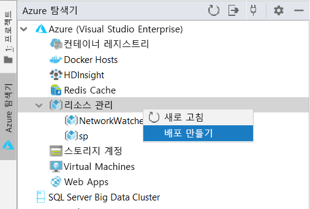
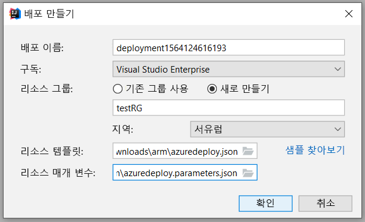
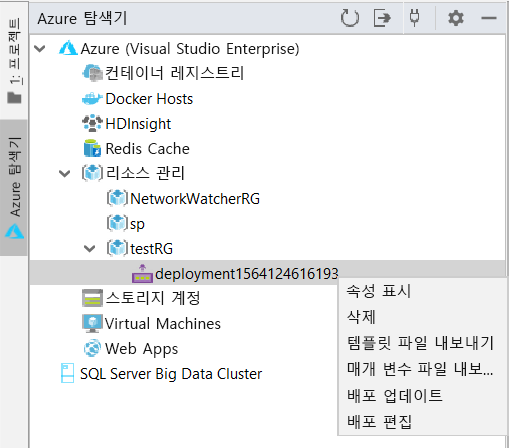
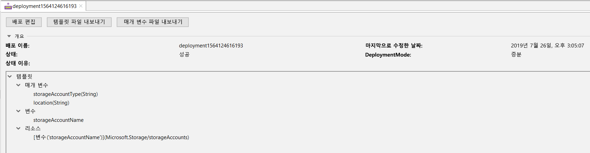
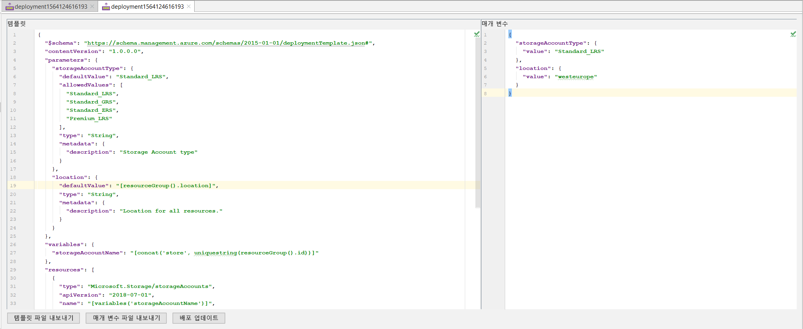
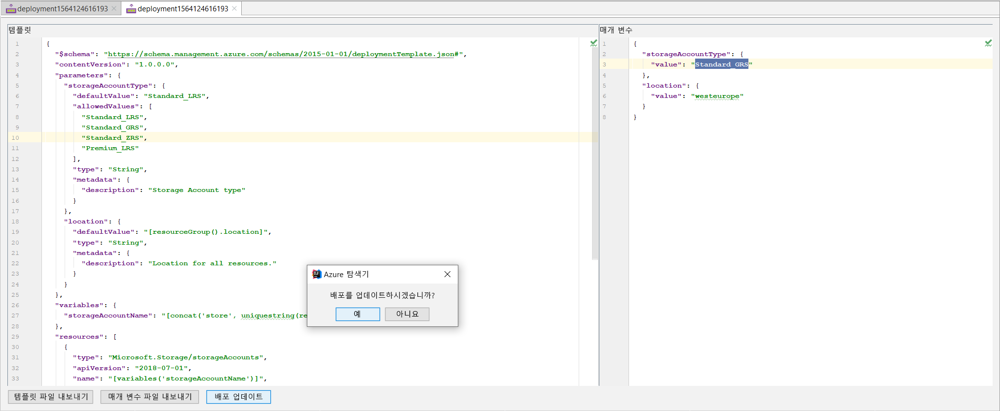
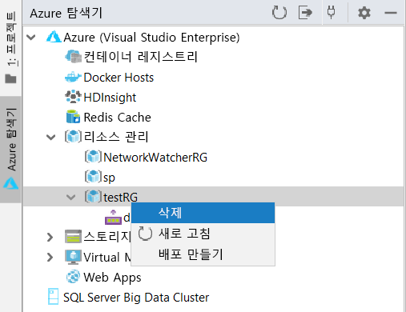

# 빠른 시작: IntelliJ IDEA를 사용하여 Azure Resource Manager 템플릿 만들기 및 배포

IntelliJ IDEA를 사용하여 Azure Resource Manager 템플릿을 Azure에 배포하는 방법과 함께 IDE에서 직접 템플릿을 편집하고 업데이트하는 프로세스를 알아봅니다. Resource Manager 템플릿은 솔루션에 배포해야 하는 리소스를 정의하는 JSON 파일입니다. Azure 솔루션 배포 및 관리와 관련된 개념을 이해하려면 [Azure Resource Manager 개요](resource-group-overview.md)를 참조하세요.

자습서를 완료한 후 Azure Storage 계정을 배포합니다. 다른 Azure 리소스를 배포하는 데 동일한 프로세스를 사용할 수 있습니다.

Azure 구독이 아직 없는 경우 시작하기 전에 [체험](https://azure.microsoft.com/free/) 계정을 만듭니다.

## 필수 조건

이 문서를 완료하려면 다음이 필요합니다.

* [IntelliJ IDEA](https://www.jetbrains.com/idea/download/) Ultimate Edition 또는 Community Edition 설치
* [Azure Toolkit for IntelliJ](https://plugins.jetbrains.com/plugin/8053)를 설치해야 합니다. 자세한 내용은 [IntelliJ의 플러그인 관리 가이드](https://www.jetbrains.com/help/idea/managing-plugins.html)를 참조하세요.
* Azure Toolkit for IntelliJ를 사용하려면 Azure 계정에 [로그인](https://docs.microsoft.com/java/azure/intellij/azure-toolkit-for-intellij-sign-in-instructions)해야 합니다.

## 빠른 시작 템플릿 배포

템플릿을 처음부터 만드는 대신 [Azure 빠른 시작 템플릿](https://azure.microsoft.com/resources/templates/)에서 템플릿을 엽니다. Azure 퀵 스타트 템플릿은 Resource Manager 템플릿용 저장소입니다. 이 빠른 시작에서 사용되는 템플릿은 [표준 저장소 계정 만들기](https://github.com/Azure/azure-quickstart-templates/tree/master/101-storage-account-create/)라고 합니다. Azure Storage 계정 리소스를 정의합니다. 

1. [`azuredeploy.json`](https://raw.githubusercontent.com/Azure/azure-quickstart-templates/master/101-storage-account-create/azuredeploy.json) 및 [`azuredeploy.parameters.json`](https://raw.githubusercontent.com/Azure/azure-quickstart-templates/master/101-storage-account-create/azuredeploy.parameters.json)을 마우스 오른쪽 단추로 클릭하고 로컬 컴퓨터에 저장합니다.

1. Azure 도구 키트가 제대로 설치되고 로그인된 경우 IntelliJ IDEA의 사이드바에 Azure Explorer가 표시됩니다. **리소스 관리**를 마우스 오른쪽 단추로 클릭하고 **배포 만들기**를 선택합니다.

    

1. **배포 이름**, **구독**, **리소스 그룹** 및 **지역**을 구성합니다. 여기서는 새 리소스 그룹 `testRG`에 템플릿을 배포합니다. 그런 다음, **리소스 템플릿**에 대한 경로를 `azuredeploy.json`으로, **리소스 매개변수**를 다운로드한 `azuredeploy.parameters.json`로 선택합니다.

    

1. 확인을 클릭하면 배포가 시작됩니다. 배포가 완료될 때까지 아래쪽의 IntelliJ IDEA의 **상태 표시줄**에서 진행 상황을 확인할 수 있습니다.

    

## 기존 배포 찾아보기

1. 배포가 완료되면 생성된 새 리소스 그룹 `testRG` 및 새 배포를 볼 수 있습니다. 배포를 마우스 오른쪽 단추로 클릭하면 가능한 작업 목록을 볼 수 있습니다. 이제 **속성 표시**를 선택합니다.

    

1. 배포 상태 및 템플릿 구조와 같은 몇 가지 유용한 속성을 보여주는 탭 보기가 열립니다.

    

## 기존 배포 편집 및 업데이트

1. 오른쪽 클릭 메뉴에서 **배포 편집** 또는 이전 속성 보기 표시를 선택합니다. Azure에 배포하기 위한 템플릿 및 매개 변수 파일을 보여주는 다른 탭 보기가 열립니다. 이러한 파일을 로컬에 저장하려면 **템플릿 파일 내보내기** 또는 **매개 변수 파일 내보내기**를 클릭합니다.

    

1. 이 페이지에서 두 파일을 편집하고 변경 내용을 Azure에 배포할 수 있습니다. 여기서는 매개 변수 파일의 **storageAccountType** 값을 `Standard_LRS`에서 `Standard_GRS`로 수정합니다. 그런 다음, 아래쪽 **배포 업데이트**를 클릭하고 업데이트를 확인합니다.

    

1. 업데이트 배포가 완료된 후에는 포털에서 만들어진 스토리지 계정이 `Standard_GRS`로 변경되었는지 확인할 수 있습니다.

## 리소스 정리

1. Azure 리소스가 더 이상 필요하지 않은 경우 리소스 그룹을 삭제하여 배포한 리소스를 정리합니다. Azure Portal 또는 Azure CLI에서 수행할 수 있습니다. IntelliJ IDEA의 Azure Explorer에서 만든 **리소스 그룹**을 마우스 오른쪽 단추로 클릭하고 삭제를 선택합니다.

    

> [!NOTE]
> 배포 삭제는 배포에서 생성된 리소스를 삭제하지 않습니다. 더 이상 필요하지 않으면 해당 리소스 그룹 또는 특정 리소스를 삭제하세요.

## 다음 단계

이 빠른 시작은 IntelliJ IDEA를 사용하여 Azure 빠른 시작 템플릿에서 기존 템플릿을 배포하는 데 집중하고 있습니다. 또한 Azure에서 기존 배포를 확인하고 업데이트하는 방법도 알아보았습니다. Azure 빠른 시작 템플릿의 템플릿은 필요한 모든 것을 제공하지 않을 수도 있습니다. 다음 자습서에서는 템플릿 참조에서 정보를 찾아 암호화된 Azure Storage 계정을 만드는 방법을 보여 줍니다.

> [!div class="nextstepaction"]
> [암호화된 저장소 계정 만들기](./resource-manager-tutorial-create-encrypted-storage-accounts.md)

> [!div class="nextstepaction"]
> [Azure 개발자 센터에서 Java 방문](https://docs.microsoft.com/azure/java)