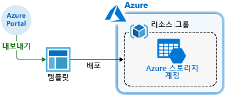
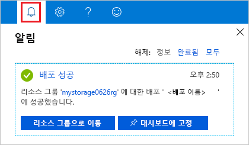
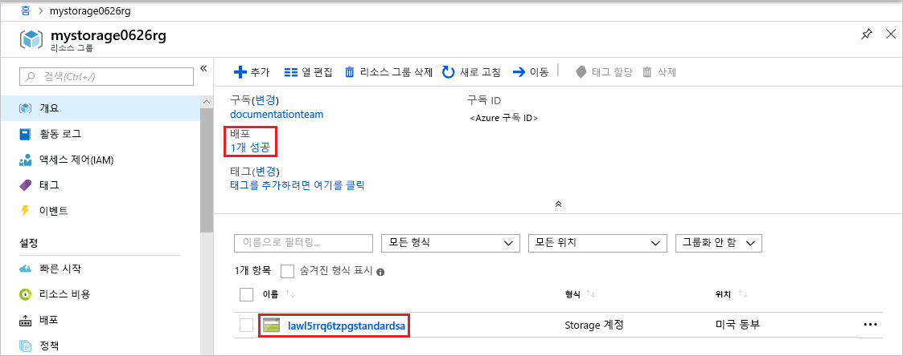

# <a name="quickstart-create-and-deploy-azure-resource-manager-templates-by-using-the-azure-portal"></a>빠른 시작: Azure Portal을 사용하여 Azure Resource Manager 템플릿 만들기 및 배포

Azure Portal을 사용하여 Resource Manager 템플릿을 생성하는 방법과 포털에서 템플릿을 편집하고 배포하는 프로세스에 대해 알아봅니다. Resource Manager 템플릿은 솔루션에 배포해야 하는 리소스를 정의하는 JSON 파일입니다. Azure 솔루션 배포 및 관리와 관련된 개념을 이해하려면 [Azure Resource Manager 개요](resource-group-overview.md)를 참조하세요.



자습서를 완료한 후 Azure Storage 계정을 배포합니다. 다른 Azure 리소스를 배포하는 데 동일한 프로세스를 사용할 수 있습니다.

Azure 구독이 아직 없는 경우 시작하기 전에 [체험](https://azure.microsoft.com/free/) 계정을 만듭니다.

## <a name="generate-a-template-using-the-portal"></a>포털을 사용하여 템플릿 생성

Resource Manager 템플릿을 처음부터 새로 만드는 작업은 쉽지 않으며 특히 Azure 배포를 처음 접하고 JSON 형식에 익숙하지 않는 경우에 더욱 그렇습니다. Azure Portal을 사용하여 리소스(예: Azure Storage 계정)를 구성할 수 있습니다. 리소스를 배포하기 전에 Resource Manager 템플릿으로 구성을 내보낼 수 있습니다. 템플릿을 저장하고 나중에 다시 사용할 수 있습니다.

숙련된 많은 템플릿 개발자는 익숙하지 않은 Azure 리소스를 배포하려고 할 때 이 메서드를 사용하여 템플릿을 생성합니다. 포털을 사용하여 템플릿을 내보내는 방법에 대한 자세한 내용은 [템플릿에 리소스 그룹 내보내기](./manage-resource-groups-portal.md#export-resource-groups-to-templates)를 참조하세요. 작업 템플릿을 찾는 다른 방법은 [Azure 빠른 시작 템플릿](https://azure.microsoft.com/resources/templates/)에서 찾는 것입니다.

1. [Azure Portal](https://portal.azure.com)에 로그인합니다.
2. **리소스 만들기** > **저장소** > **저장소 계정 - Blob, 파일, 테이블, 큐**를 차례로 선택합니다.

    
3. 다음 정보를 입력합니다.

    |Name|값|
    |----|----|
    |**리소스 그룹**|**새로 만들기**를 선택하고, 원하는 리소스 그룹 이름을 지정합니다. 스크린샷에서 리소스 그룹 이름은 *mystorage1016rg*입니다. 리소스 그룹은 Azure 리소스에 대한 컨테이너입니다. 리소스 그룹을 사용하면 Azure 리소스를 쉽게 관리할 수 있습니다. |
    |**Name**|스토리지 계정에 고유한 이름을 지정합니다. 스토리지 계정 이름은 Azure 전체에서 고유해야 하며 소문자와 숫자만 포함해야 합니다. 이름은 3에서 24자 사이여야 합니다. "스토리지 계정 이름 'mystorage1016'이 이미 사용되었습니다."라는 오류 메시지가 표시되면 **&lt;내 이름>스토리지&lt;MMDD 형식의 오늘 날짜>**(예: **johndolestorage1016**)를 사용해 보십시오. 자세한 내용은 [명명 규칙 및 제한 사항](/azure/architecture/best-practices/naming-conventions#naming-rules-and-restrictions)을 참조하세요.|

    나머지 속성에는 기본값을 사용할 수 있습니다.

    

    > [!NOTE]
    > 내보낸 템플릿 중 일부는 배포하기 전에 편집해야 합니다.

4. 화면 아래쪽에서 **검토 + 만들기**를 선택합니다. 다음 단계에서 **만들기**를 선택하지 마십시오.
5. 화면 아래쪽에서 **자동화 템플릿 다운로드**를 선택합니다. 생성된 템플릿이 포털에 표시됩니다.

    

    기본 창에 템플릿이 표시됩니다. 6개의 최상위 요소(`schema`, `contentVersion`, `parameters`, `variables`, `resources` 및 `output`)가 있는 JSON 파일입니다. 자세한 내용은 [Azure Resource Manager 템플릿의 구조 및 구문 이해](./resource-group-authoring-templates.md)를 참조하세요.

    매개 변수 6개가 정의되어 있습니다. 그 중 하나는 **storageAccountName**입니다. 이전 스크린샷에서 강조 표시된 두 번째 부분은 템플릿에서 이 매개 변수를 참조하는 방법을 보여줍니다. 다음 섹션에서는 생성된 이름을 저장소 계정에 사용하도록 템플릿을 편집합니다.

    템플릿에는 Azure 리소스 하나가 정의되어 있습니다. 유형은 `Microsoft.Storage/storageAccounts`입니다. 리소스가 정의되는 방법 및 정의 구조를 살펴보세요.
6. 화면 맨 위에서 **다운로드**를 선택하세요. 
7. 다운로드한 zip 파일을 열어서 **template.json**을 사용자의 컴퓨터에 저장합니다. 다음 섹션에서는 템플릿 배포 도구를 사용하여 템플릿을 편집합니다.
8. **매개 변수** 탭을 선택하여 매개 변수에 대해 입력한 값을 확인합니다. 이러한 값을 적어 두면, 다음 섹션에서 템플릿을 배포할 때 필요합니다.

    

    템플릿 파일과 매개 변수 파일을 모두 사용하여 리소스(이 자습서에서는 Azure 스토리지 계정)를 만들 수 있습니다.

## <a name="edit-and-deploy-the-template"></a>템플릿 편집 및 배포

Azure Portal은 기본적인 템플릿 편집 작업에 사용할 수 있습니다. 이 빠른 시작에서는 *템플릿 배포*라고 하는 포털 도구를 사용합니다. 하나의 인터페이스 - Azure Portal을 사용하여 전체 자습서를 완료할 수 있도록 이 자습서에서는 *템플릿 배포*가 사용됩니다. 더 복잡한 템플릿을 편집하려면 더 다양한 편집 기능을 제공하는 [Visual Studio Code](./resource-manager-quickstart-create-templates-use-visual-studio-code.md)를 사용하는 것이 좋습니다.

Azure의 각 Azure 서비스에는 고유한 이름이 필요합니다. 이미 존재하는 스토리지 계정 이름을 입력한 경우 배포에 실패할 수 있습니다. 이 문제를 방지하기 위해 템플릿 함수 호출 `uniquestring()`을 사용하도록 템플릿을 수정하여 고유한 스토리지 계정 이름을 생성합니다.

1. Azure Portal에서 **리소스 만들기**를 선택합니다.
2. **Marketplace 검색**에서 **템플릿 배포**를 입력하고 **ENTER**를 누릅니다.
3. **템플릿 배포**를 선택합니다.

    
4. **만들기**를 선택합니다.
5. **편집기에서 사용자 고유의 템플릿을 빌드합니다.** 를 선택합니다.
6. **파일 로드**를 선택한 다음, 지침에 따라 이전 섹션에서 다운로드한 template.json 파일을 로드합니다.
7. 템플릿에서 다음 세 가지를 변경합니다.

    

   - 이전 스크린샷에 표시된 대로 **storageAccountName** 매개 변수를 제거합니다.
   - 이전 스크린샷에 표시된 대로 **storageAccountName**이라는 변수를 하나 추가합니다.

       ```json
       "storageAccountName": "[concat(uniqueString(subscription().subscriptionId), 'storage')]"
       ```

       여기서는 두 개의 `concat()` 및 `uniqueString()` 템플릿 함수가 사용됩니다.
   - 매개 변수 대신 새로 정의된 변수를 사용하도록 **Microsoft.Storage/storageAccounts** 리소스의 name 요소를 업데이트합니다.

       ```json
       "name": "[variables('storageAccountName')]",
       ```

     최종 템플릿은 다음과 같습니다.

     ```json
     {
       "$schema": "https://schema.management.azure.com/schemas/2015-01-01/deploymentTemplate.json#",
       "contentVersion": "1.0.0.0",
       "parameters": {
           "location": {
               "type": "string"
           },
           "accountType": {
               "type": "string"
           },
           "kind": {
               "type": "string"
           },
           "accessTier": {
               "type": "string"
           },
           "supportsHttpsTrafficOnly": {
               "type": "bool"
           }
       },
       "variables": {
           "storageAccountName": "[concat(uniqueString(subscription().subscriptionId), 'storage')]"
       },
       "resources": [
           {
               "name": "[variables('storageAccountName')]",
               "type": "Microsoft.Storage/storageAccounts",
               "apiVersion": "2018-07-01",
               "location": "[parameters('location')]",
               "properties": {
                   "accessTier": "[parameters('accessTier')]",
                   "supportsHttpsTrafficOnly": "[parameters('supportsHttpsTrafficOnly')]"
               },
               "dependsOn": [],
               "sku": {
                   "name": "[parameters('accountType')]"
               },
               "kind": "[parameters('kind')]"
           }
       ],
       "outputs": {}
     }
     ```
8. **저장**을 선택합니다.
9. 다음 값을 입력합니다.

    |Name|값|
    |----|----|
    |**리소스 그룹**|마지막 섹션에서 만든 리소스 그룹 이름을 선택합니다. |
    |**위치**:|스토리지 계정의 위치를 선택합니다. 예: **미국 중부** |
    |**계정 유형**|이 빠른 시작에서는 **Standard_LRS**를 입력합니다. |
    |**종류**|이 빠른 시작에서는 **StorageV2**를 입력합니다. |
    |**액세스 계층**|이 빠른 시작에서는 **핫**을 입력합니다. |
    |**Https 트래픽만 사용**| 이 빠른 시작에서는 **true**를 선택합니다. |
    |**위에 명시된 사용 약관에 동의함**|(선택)|

    샘플 배포의 스크린샷은 다음과 같습니다.

    

10. **구매**를 선택합니다.
11. 화면 위쪽에서 벨 아이콘(알림)을 선택하여 배포 상태를 확인합니다. **배포 진행 중**이 표시됩니다. 배포가 완료될 때까지 기다립니다.

    

12. 알림 창에서 **리소스 그룹으로 이동**을 선택합니다. 다음과 비슷한 화면이 표시됩니다.

    

    배포 상태가 성공이고 리소스 그룹에 하나의 저장소 계정이 있는 것을 확인할 수 있습니다. 저장소 계정 이름은 템플릿에 의해 생성된 고유한 문자열입니다. 스토리지 계정 사용에 대한 자세한 내용은 [빠른 시작: Azure Portal을 사용하여 Blob 업로드, 다운로드 및 나열](../storage/blobs/storage-quickstart-blobs-portal.md)을 참조하세요.

## <a name="clean-up-resources"></a>리소스 정리

Azure 리소스가 더 이상 필요하지 않은 경우 리소스 그룹을 삭제하여 배포한 리소스를 정리합니다.

1. Azure Portal의 왼쪽 메뉴에서 **리소스 그룹**을 선택합니다.
2. **이름으로 필터링** 필드에서 리소스 그룹 이름을 입력합니다.
3. 해당 리소스 그룹 이름을 선택합니다.  리소스 그룹에 저장소 계정이 표시됩니다.
4. 최상위 메뉴에서 **리소스 그룹** 삭제를 선택합니다.

## <a name="next-steps"></a>다음 단계

이 자습서에서는 Azure Portal에서 템플릿을 생성하는 방법과 포털을 사용하여 템플릿을 배포하는 방법을 알아보았습니다. 이 빠른 시작에서 사용된 템플릿은 하나의 Azure 리소스가 있는 간단한 템플릿입니다. 복잡한 템플릿인 경우 Visual Studio Code 또는 Visual Studio를 사용하여 템플릿을 개발하는 것이 더 쉽습니다. 다음 빠른 시작에서는 Azure PowerShell과 Azure CLI(명령줄 인터페이스)를 사용하여 템플릿을 배포하는 방법을 보여줍니다.

> [!div class="nextstepaction"]
> [Visual Studio Code를 사용하여 템플릿 만들기](./resource-manager-quickstart-create-templates-use-visual-studio-code.md)
