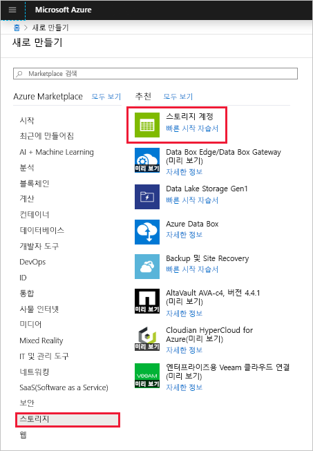
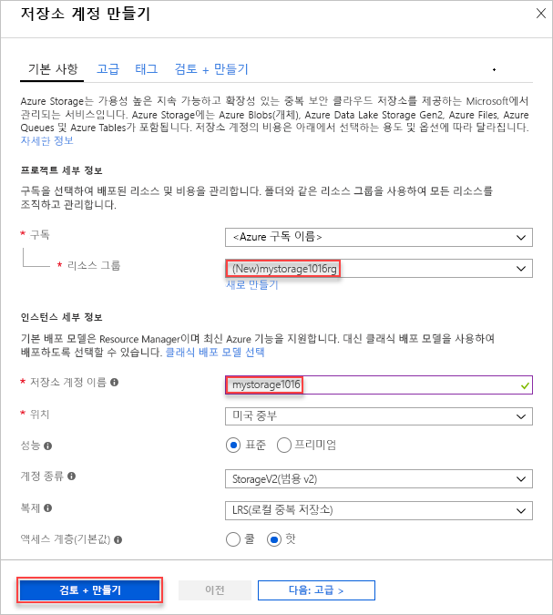
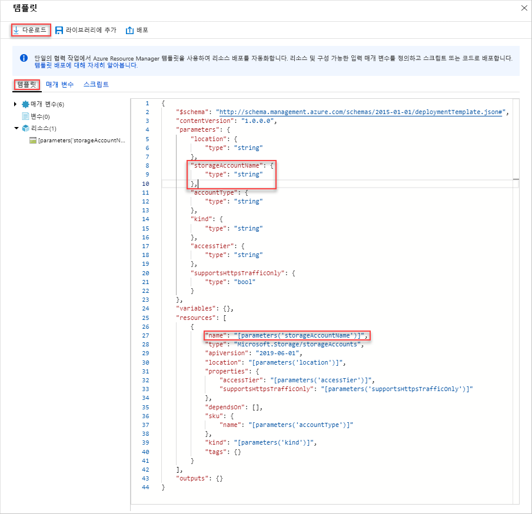
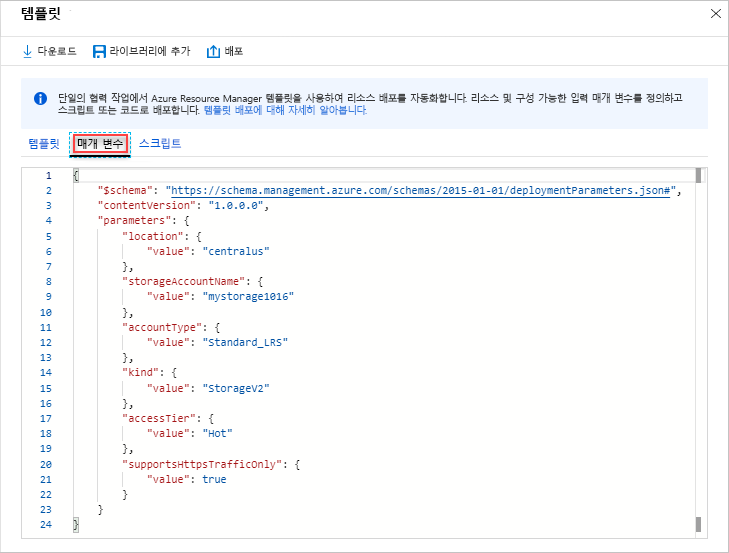
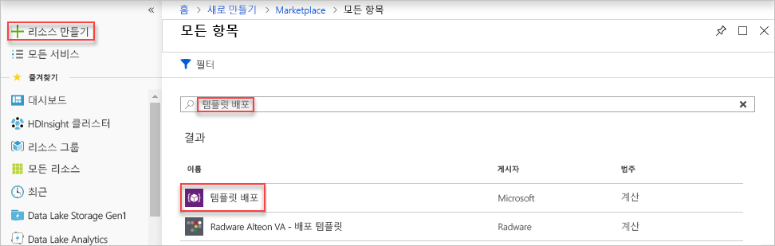
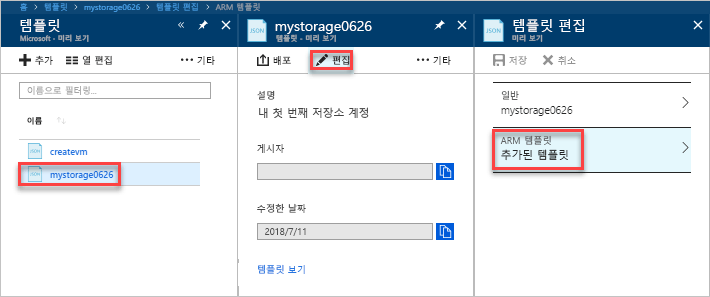
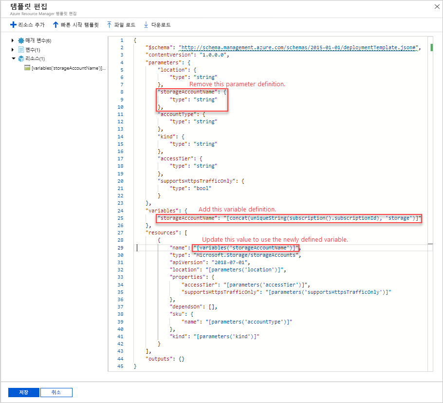
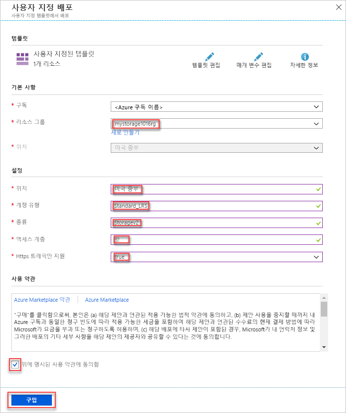

# <a name="quickstart-create-and-deploy-azure-resource-manager-templates-by-using-the-azure-portal"></a>빠른 시작: Azure Portal을 사용하여 Azure Resource Manager 템플릿 만들기 및 배포

Azure Portal을 사용하여 첫 번째 Azure Resource Manager 템플릿을 생성하여 만드는 방법과 포털에서 이 템플릿을 편집하고 배포하는 방법에 대해 알아봅니다.

Resource Manager 템플릿은 솔루션에 배포해야 하는 리소스를 정의하는 JSON 파일입니다. 템플릿을 만들기 위해 항상 처음부터 시작할 필요가 없습니다. 이 자습서에서는 Azure Portal에서 템플릿을 생성하는 방법에 대해 알아봅니다. 그런 다음, 템플릿을 사용자 지정하고 배포할 수 있습니다.

이 자습서의 지침에서는 Azure Storage 계정을 만듭니다. 동일한 프로세스를 사용하여 다른 Azure 리소스를 만들 수 있습니다.

Azure 구독이 아직 없는 경우 시작하기 전에 [체험](https://azure.microsoft.com/free/) 계정을 만듭니다.

## <a name="generate-a-template-using-the-portal"></a>포털을 사용하여 템플릿 생성

이 섹션에서는 Azure Portal을 사용하여 저장소 계정을 만듭니다. 저장소 계정을 배포하기 전에 구성에 따라 포털에서 생성된 템플릿을 탐색할 수 있습니다. 템플릿을 저장하고 나중에 다시 사용할 수 있습니다.

1. [Azure Portal](https://portal.azure.com)에 로그인합니다.
2. **리소스 만들기** > **저장소** > **저장소 계정 - Blob, 파일, 테이블, 큐**를 차례로 선택합니다.

    
3. 다음 정보를 입력합니다. 다음 단계에서 **만들기** 대신 **자동화 옵션**을 선택해야 템플릿을 배포하기 전에 확인할 수 있습니다.

    - **이름**: 저장소 계정에 고유한 이름을 지정합니다. 스크린샷에서 이름은 *mystorage0626*입니다.
    - **리소스 그룹**: 새 Azure 리소스 그룹을 원하는 이름으로 만듭니다. 스크린샷에서 리소스 그룹 이름은 *mystorage0626rg*입니다.

    나머지 속성에는 기본값을 사용할 수 있습니다.

    

    > [!NOTE]
    > 내보낸 템플릿 중 일부는 배포하기 전에 편집해야 합니다.

4. 화면 아래쪽에서 **자동화 옵션**을 선택합니다. 포털에서 **템플릿** 탭에 템플릿이 표시됩니다.

    

    기본 창에 템플릿이 표시됩니다. 이는 4개의 최상위 요소가 있는 JSON 파일입니다. 자세한 내용은 [Azure Resource Manager 템플릿의 구조 및 구문 이해](./resource-group-authoring-templates.md)를 참조하세요.

    **매개 변수** 요소 아래에는 정의된 5개의 매개 변수가 있습니다. 배포하는 동안 제공하는 값을 보려면 **매개 변수** 탭을 선택합니다.

    

    이러한 값은 이전 섹션에서 구성한 값입니다. 템플릿과 매개 변수 파일을 모두 사용하여 Azure 저장소 계정을 만들 수 있습니다.

5. 탭 위쪽에는 세 가지 메뉴 항목이 있습니다.

    - **다운로드**: 로컬 컴퓨터에 템플릿과 매개 변수 파일을 다운로드합니다.
    - **라이브러리에 추가**: 나중에 다시 사용할 라이브러리에 템플릿을 추가합니다.
    - **배포**: Azure 저장소 계정을 Azure에 배포합니다.

    이 자습서에서는 **라이브러리에 추가** 옵션을 사용합니다.

6. **라이브러리에 추가**를 선택합니다.
7. **이름** 및 **설명**을 입력한 다음, **저장**을 선택합니다.

> [!NOTE]
> 템플릿 라이브러리 기능은 미리 보기로 있습니다. 대부분의 사람들은 템플릿을 로컬 컴퓨터 또는 Github와 같은 공용 저장소에 저장하도록 선택합니다.  

## <a name="edit-and-deploy-the-template"></a>템플릿 편집 및 배포

이 섹션에서는 템플릿 라이브러리에서 저장된 템플릿을 열고, 포털 내에서 템플릿을 편집한 다음, 수정된 템플릿을 배포합니다. 더 복잡한 템플릿을 편집하려면 더 다양한 편집 기능을 제공하는 Visual Studio Code를 사용하는 것이 좋습니다.

1. Azure Portal의 왼쪽 메뉴에서 **모든 서비스**를 선택하고, 필터 상자에서 **템플릿**을 입력한 다음, **템플릿(미리 보기)** 을 선택합니다.

    
2. 마지막 섹션에서 저장한 템플릿을 선택합니다. 스크린샷에 사용된 이름은 *mystorage0626*입니다.
3. **편집**을 선택한 다음, **템플릿을 추가함**을 선택합니다.

    

4. **variables** 요소를 추가하고, 다음 스크린샷과 같이 하나의 변수를 추가합니다.

    ```json
    "variables": {
        "storageAccountName": "[concat(uniquestring(resourceGroup().id), 'standardsa')]"
    },
    ```
    

    여기서는 *concat()* 및 *uniqueString()* 의 두 가지 함수가 사용됩니다. uniqueString()은 리소스에 대한 고유한 이름을 만드는 데 도움이 됩니다.

5. 이전 스크린샷에서 강조 표시된 **name** 매개 변수를 제거합니다.
6. 매개 변수 대신 새로 정의된 변수를 사용하도록 **Microsoft.Storage/storageAccounts** 리소스의 name 요소를 업데이트합니다.

    ```json
    "name": "[variables('storageAccountName')]",
    ```

    최종 템플릿은 다음과 같습니다.

    ```json
    {
        "$schema": "https://schema.management.azure.com/schemas/2015-01-01/deploymentTemplate.json#",
        "contentVersion": "1.0.0.0",
        "parameters": {
            "location": {
                "type": "string"
            },
            "accountType": {
                "type": "string"
            },
            "kind": {
                "type": "string"
            },
            "httpsTrafficOnlyEnabled": {
                "type": "bool"
            }
        },
        "variables": {
            "storageAccountName": "[concat(uniquestring(resourceGroup().id), 'standardsa')]"
        },
        "resources": [
            {
                "apiVersion": "2018-02-01",
                "name": "[variables('storageAccountName')]",
                "location": "[parameters('location')]",
                "type": "Microsoft.Storage/storageAccounts",
                "sku": {
                    "name": "[parameters('accountType')]"
                },
                "kind": "[parameters('kind')]",
                "properties": {
                    "supportsHttpsTrafficOnly": "[parameters('httpsTrafficOnlyEnabled')]",
                    "encryption": {
                        "services": {
                            "blob": {
                                "enabled": true
                            },
                            "file": {
                                "enabled": true
                            }
                        },
                        "keySource": "Microsoft.Storage"
                    }
                },
                "dependsOn": []
            }
        ]
    }
    ```
7. **확인**을 선택한 다음, **저장**을 선택하여 변경 사항을 저장합니다.
8. **배포**를 선택합니다.
9. 다음 값을 입력합니다.

    - **구독**: Azure 구독을 선택합니다.
    - **리소스 그룹**: 리소스 그룹의 이름을 고유한 이름으로 지정합니다.
    - **위치**: 리소스 그룹에 대한 위치를 선택합니다.
    - **위치**: 저장소 계정에 대한 위치를 선택합니다.  리소스 그룹과 동일한 위치를 사용할 수 있습니다.
    - **계정 유형**: 이 빠른 시작에서는 **Standard_LRS**를 입력합니다.
    - **종류**: 이 빠른 시작에서는 **저장소**를 입력합니다.
    - **Https 트래픽만 사용**:  이 빠른 시작에서는 **false**를 선택합니다.
    - **위에 명시된 사용 약관에 동의함**: (선택)

    샘플 배포의 스크린샷은 다음과 같습니다.

    

10. **구매**를 선택합니다.
11. 화면 위쪽에서 벨 아이콘(알림)을 선택하여 배포 상태를 확인합니다.

## <a name="clean-up-resources"></a>리소스 정리

Azure 리소스가 더 이상 필요하지 않은 경우 리소스 그룹을 삭제하여 배포한 리소스를 정리합니다.

1. Azure Portal의 왼쪽 메뉴에서 **리소스 그룹**을 선택합니다.
2. **이름으로 필터링** 필드에서 리소스 그룹 이름을 입력합니다.
3. 해당 리소스 그룹 이름을 선택합니다.  리소스 그룹에 저장소 계정이 표시됩니다.
4. 최상위 메뉴에서 **리소스 그룹** 삭제를 선택합니다.

## <a name="next-steps"></a>다음 단계

이 자습서에서는 Azure Portal에서 템플릿을 생성하는 방법과 포털을 사용하여 템플릿을 배포하는 방법을 알아보았습니다. 이 빠른 시작에서 사용된 템플릿은 하나의 Azure 리소스가 있는 간단한 템플릿입니다. 복잡한 템플릿인 경우 Visual Studio Code 또는 Visual Studio를 사용하여 템플릿을 개발하는 것이 더 쉽습니다.

> [!div class="nextstepaction"]
> [Visual Studio Code를 사용하여 템플릿 만들기](./resource-manager-quickstart-create-templates-use-visual-studio-code.md)
