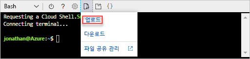

# <a name="quickstart-create-azure-resource-manager-templates-by-using-visual-studio-code"></a>빠른 시작: Visual Studio Code를 사용하여 Azure Resource Manager 템플릿 만들기

Visual Studio Code 및 Azure Resource Manager 도구 확장을 사용하여 Azure Resource Manager 템플릿을 만드는 방법에 대해 알아봅니다. 확장이 없이 Visual Studio Code에서 Resource Manager 템플릿을 만들 수 있지만, 확장에서는 템플릿 개발을 간소화하는 자동 완성 옵션을 제공합니다. Azure 솔루션 배포 및 관리와 관련된 개념을 이해하려면 [Azure Resource Manager 개요](resource-group-overview.md)를 참조하세요.

Azure 구독이 아직 없는 경우 시작하기 전에 [체험](https://azure.microsoft.com/free/) 계정을 만듭니다.

## <a name="prerequisites"></a>필수 조건

이 문서를 완료하려면 다음이 필요합니다.

- [Visual Studio Code](https://code.visualstudio.com/)
- Resource Manager 도구 확장. 설치하려면 다음 단계를 사용합니다.

    1. Visual Studio Code를 엽니다.
    2. **Ctrl+Shift+X**를 눌러 확장 패널을 엽니다.
    3. **Azure Resource Manager 도구**를 검색한 다음, **설치**를 선택합니다.
    4. **다시 로드**를 선택하여 확장 설치를 완료합니다.

## <a name="open-a-quickstart-template"></a>빠른 시작 템플릿 열기

템플릿을 처음부터 만드는 대신 [Azure 빠른 시작 템플릿](https://azure.microsoft.com/resources/templates/)에서 템플릿을 엽니다. Azure 퀵 스타트 템플릿은 Resource Manager 템플릿용 저장소입니다.

이 빠른 시작에서 사용되는 템플릿은 [표준 저장소 계정 만들기](https://azure.microsoft.com/resources/templates/101-storage-account-create/)라고 합니다. 이 템플릿은 Azure Storage 계정 리소스를 정의합니다.

1. Visual Studio Code에서 **파일**>**파일 열기**를 차례로 선택합니다.
2. **파일 이름**에서 다음 URL을 붙여넣습니다.

    ```url
    https://raw.githubusercontent.com/Azure/azure-quickstart-templates/master/101-storage-account-create/azuredeploy.json
    ```
3. **열기**를 선택하여 파일을 엽니다.
4. **파일**>**이름으로 저장**을 차례로 선택하여 파일을 **azuredeploy.json**으로 저장합니다.

## <a name="edit-the-template"></a>템플릿 편집

Visual Studio Code를 사용하여 템플릿을 편집하는 방법을 알아보려면 출력 섹션에 하나 이상의 요소를 추가합니다.

1. Visual Studio Code에서 하나 이상의 출력을 내보낸 템플릿에 추가합니다.

    ```json
    "storageUri": {
      "type": "string",
      "value": "[reference(variables('storageAccountName')).primaryEndpoints.blob]"
    }
    ```

    완료되면 출력 섹션이 다음과 같습니다.

    ```json
    "outputs": {
      "storageAccountName": {
        "type": "string",
        "value": "[variables('storageAccountName')]"
      },
      "storageUri": {
        "type": "string",
        "value": "[reference(variables('storageAccountName')).primaryEndpoints.blob]"
      }
    }
    ```

    Visual Studio Code 내에서 코드를 복사하여 붙여넣은 경우 **value** 요소를 다시 입력하여 Resource Manager 도구 확장의 Intellisense 기능을 사용해 봅니다.

    

2. **파일**>**저장**을 차례로 선택하여 파일을 저장합니다.

## <a name="deploy-the-template"></a>템플릿 배포

템플릿을 배포하는 방법에는 여러 가지가 있습니다.  이 빠른 시작에서는 Azure Portal에서 Cloud Shell을 사용합니다. Cloud Shell은 Azure CLI와 Azure PowerShell을 모두 지원합니다. 여기에 제공되는 지침에서는 CLI를 사용합니다.

1. [Azure 포털](https://portal.azure.com)
2. 다음 이미지와 같이 오른쪽 위 모서리에서 **Cloud Shell**을 선택합니다.

    

3. 아래쪽 화살표를 선택한 다음, **Bash**를 선택하여 PowerShell에서 CLI로 전환합니다.

    
4. **다시 시작**을 선택하여 셸을 다시 시작합니다.
5. **파일 업로드/다운로드**를 선택한 다음, **업로드**를 선택합니다.

    
4. 빠른 시작의 앞부분에서 저장한 파일을 선택합니다. 기본 이름은 **azuredeploy.json**입니다.
5. Cloud Shell에서 **ls** 명령을 실행하여 파일이 성공적으로 업로드되었는지 확인합니다. **cat** 명령을 사용하여 템플릿 내용을 확인할 수도 있습니다.

    
6. Cloud Shell에서 다음 명령을 실행합니다.

    ```cli
    az group create --name <ResourceGroupName> --location <AzureLocation>

    az group deployment create --name <DeploymentName> --resource-group <ResourceGroupName> --template-file <TemplateFileName>
    ```
    샘플 배포의 스크린샷은 다음과 같습니다.

    

    스크린샷에서 사용된 값은 다음과 같습니다.

    - **&lt;ResourceGroupName>**: myresourcegroup0709입니다. 매개 변수에는 두 가지 표현이 있습니다.  동일한 값을 사용해야 합니다.
    - **&lt;AzureLocation>**: eastus2
    - **&lt;DeployName>**: mydeployment0709
    - **&lt;TemplateFile>**: azuredeploy.json

    스크린샷 출력에서 저장소 계정 이름은 *3tqebj3slyfyestandardsa*입니다. 

7. 다음 PowerShell 명령을 실행하여 새로 만든 저장소 계정을 나열합니다.

    ```cli
    az storage account show --resource-group <ResourceGroupName> --name <StorageAccountName>
    ```

## <a name="clean-up-resources"></a>리소스 정리

Azure 리소스가 더 이상 필요하지 않은 경우 리소스 그룹을 삭제하여 배포한 리소스를 정리합니다.

1. Azure Portal의 왼쪽 메뉴에서 **리소스 그룹**을 선택합니다.
2. **이름으로 필터링** 필드에서 리소스 그룹 이름을 입력합니다.
3. 해당 리소스 그룹 이름을 선택합니다.  리소스 그룹에 총 6개의 리소스가 표시됩니다.
4. 위쪽 메뉴에서 **리소스 그룹 삭제**를 선택합니다.

## <a name="next-steps"></a>다음 단계

이 자습서에서는 Visual Studio Code를 사용하여 템플릿을 만드는 방법과 Azure Portal Cloud Shell을 사용하여 템플릿을 배포하는 방법을 알아보았습니다. 이 빠른 시작에 사용된 템플릿에는 하나의 Azure 리소스만 포함되어 있습니다.  다음 자습서에서는 여러 리소스가 있는 템플릿을 개발합니다.  일부 리소스에는 종속 리소스가 있습니다.

> [!div class="nextstepaction"]
> [Visual Studio를 사용하여 템플릿 만들기](./vs-azure-tools-resource-groups-deployment-projects-create-deploy.md)
