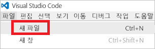
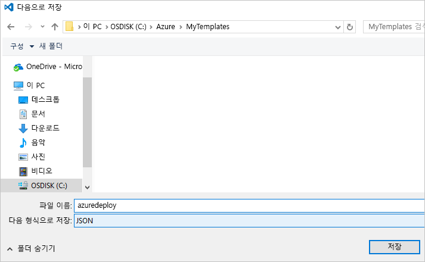

# <a name="use-visual-studio-code-extension-to-create-azure-resource-manager-template"></a>Visual Studio Code 확장을 사용하여 Azure Resource Manager 템플릿 만들기
이 문서에서는 Visual Studio Code에서 Azure Resource Manager 도구 확장을 설치하고 사용하는 이점을 설명합니다. 확장하지 않고 VS Code에서 Resource Manager 템플릿을 만들 수 있지만 확장은 템플릿을 개발을 간소화하는 자동 완성 옵션을 제공합니다. 템플릿에서 사용할 수 있는 템플릿 함수, 매개 변수 및 변수를 제공합니다.

이 문서를 완료하려면 [Visual Studio Code](https://code.visualstudio.com/)가 필요합니다.

Azure 솔루션 배포 및 관리와 관련된 개념을 이해하려면 [Azure Resource Manager 개요](resource-group-overview.md)를 참조하세요.

## <a name="create-the-template"></a>템플릿 만들기

이 문서에서는 [첫 번째 Azure Resource Manager 템플릿 만들기 및 배포](resource-manager-create-first-template.md)에서 만든 템플릿을 사용합니다. 해당 템플릿이 이미 있는 경우 이 섹션을 건너뛸 수 있습니다.

1. 템플릿을 만들어야 하는 경우 VS Code를 시작합니다. **파일** > **새 파일**을 선택합니다. 

   

2. 다음 JSON 구문을 파일에 복사하여 붙여넣습니다.

   ```json
   {
     "$schema": "http://schema.management.azure.com/schemas/2015-01-01/deploymentTemplate.json#",
     "contentVersion": "1.0.0.0",
     "parameters": {
       "storageSKU": {
         "type": "string",
         "allowedValues": [
           "Standard_LRS",
           "Standard_ZRS",
           "Standard_GRS",
           "Standard_RAGRS",
           "Premium_LRS"
         ],
         "defaultValue": "Standard_LRS",
         "metadata": {
           "description": "The type of replication to use for the storage account."
         }
       },   
       "storageNamePrefix": {
         "type": "string",
         "maxLength": 11,
         "defaultValue": "storage",
         "metadata": {
           "description": "The value to use for starting the storage account name. Use only lowercase letters and numbers."
         }
       }
     },
     "variables": {
       "storageName": "[concat(toLower(parameters('storageNamePrefix')), uniqueString(resourceGroup().id))]"
     },
     "resources": [
       {
         "name": "[variables('storageName')]",
         "type": "Microsoft.Storage/storageAccounts",
         "apiVersion": "2016-01-01",
         "sku": {
           "name": "[parameters('storageSKU')]"
         },
         "kind": "Storage",
         "location": "[resourceGroup().location]",
         "tags": {},
         "properties": {
           "encryption":{
             "services":{
               "blob":{
                 "enabled":true
               }
             },
             "keySource":"Microsoft.Storage"
           }
         }
       }
     ],
     "outputs": {  }
   }
   ```

3. 이 파일을 로컬 폴더에 **azuredeploy.json**으로 저장합니다.

   

## <a name="install-the-extension"></a>확장 설치

1. VS Code에서 **확장**을 선택합니다.

   

2. **Azure Resource Manager 도구**를 검색하고 **설치**를 선택합니다.

   

3. 확장 설치가 완료되면 **다시 로드**를 선택합니다.

## <a name="edit-the-template"></a>템플릿 편집

1. azuredeploy.json 파일을 엽니다.

2. 확장은 사용 가능한 모든 [템플릿 함수](resource-group-template-functions.md)를 검색합니다. 또한 템플릿에 정의된 매개 변수 및 변수를 읽습니다. 이 기능을 보려면 출력 섹션에 두 개의 값을 추가합니다. 템플릿에서 출력 섹션을 다음으로 바꿉니다.

   ```json
   "outputs": { 
       "groupLocation": {
         "type": "string",
         "value": ""
       },
       "storageUri": {
         "type": "string",
         "value": ""
       }
   }
   ```

3. **groupLocation**에서 값의 따옴표 안에 커서를 놓습니다. 왼쪽 괄호(`[`)를 입력합니다. 확장은 즉시 사용 가능한 템플릿 함수를 제공합니다.

   

4. **resourceGroup**을 입력하기 시작합니다. `resourceGroup()` 함수가 표시되면 탭 키나 Enter 키를 누릅니다.

   

5. 확장은 함수 구문을 채웁니다. [resourceGroup](resource-group-template-functions-resource.md#resourcegroup) 함수는 매개 변수를 허용하지 않습니다. 오른쪽 괄호 뒤에 마침표를 추가합니다. 확장은 `resourceGroup()` 함수에서 반환하는 개체에 사용할 수 있는 속성을 제공합니다. `location`를 선택합니다.

   

6. **위치** 뒤에 닫힌 오른쪽 괄호를 추가합니다.

   ```json
   "outputs": { 
       "groupLocation": {
         "type": "string",
         "value": "[resourceGroup().location]"
       },
       "storageUri": {
         "type": "string",
         "value": ""
       }
   }
   ```

7. 이제 **storageUri**의 따옴표 안에 커서를 놓습니다. 다시 왼쪽 괄호를 입력합니다. **참조**를 입력하기 시작합니다. 해당 함수를 선택하고 탭 키나 Enter 키를 누릅니다.

   

8. [참조](resource-group-template-functions-resource.md#reference)는 리소스 ID 또는 리소스 이름을 매개 변수로 허용합니다. 변수에 이미 저장소 계정의 이름이 있습니다. **var**을 입력한 다음 Ctrl+스페이스바를 선택합니다. 확장은 변수 함수를 제공합니다.

   

   탭 키 또는 Enter 키를 누릅니다.

9. [변수](resource-group-template-functions-deployment.md#variables) 함수에는 변수의 이름이 필요합니다. 괄호 안에 작은 따옴표를 추가합니다. 확장은 템플릿에 정의된 변수의 이름을 제공합니다.

    

10. **storageName** 변수를 선택합니다. 오른쪽 괄호를 추가합니다. 다음 예제에서는 출력 섹션을 보여줍니다.

   ```json
   "outputs": { 
       "groupLocation": {
         "type": "string",
         "value": "[resourceGroup().location]"
       },
       "storageUri": {
         "type": "string",
         "value": "[reference(concat('Microsoft.Storage/storageAccounts/',variables('storageName'))).primaryEndpoints.blob]"
       }
   }
   ```

최종 템플릿은 다음과 같습니다.

```json
{
  "$schema": "http://schema.management.azure.com/schemas/2015-01-01/deploymentTemplate.json#",
  "contentVersion": "1.0.0.0",
  "parameters": {
    "storageSKU": {
      "type": "string",
      "allowedValues": [
        "Standard_LRS",
        "Standard_ZRS",
        "Standard_GRS",
        "Standard_RAGRS",
        "Premium_LRS"
      ],
      "defaultValue": "Standard_LRS",
      "metadata": {
        "description": "The type of replication to use for the storage account."
      }
    },   
    "storageNamePrefix": {
      "type": "string",
      "maxLength": 11,
      "defaultValue": "storage",
      "metadata": {
        "description": "The value to use for starting the storage account name. Use only lowercase letters and numbers."
      }
    }
  },
  "variables": {
    "storageName": "[concat(toLower(parameters('storageNamePrefix')), uniqueString(resourceGroup().id))]"
  },
  "resources": [
    {
      "name": "[variables('storageName')]",
      "type": "Microsoft.Storage/storageAccounts",
      "apiVersion": "2016-01-01",
      "sku": {
        "name": "[parameters('storageSKU')]"
      },
      "kind": "Storage",
      "location": "[resourceGroup().location]",
      "tags": {},
      "properties": {
        "encryption":{
          "services":{
            "blob":{
              "enabled":true
            }
          },
          "keySource":"Microsoft.Storage"
        }
      }
    }
  ],
  "outputs": { 
    "groupLocation": {
      "type": "string",
      "value": "[resourceGroup().location]"
    },
    "storageUri": {
      "type": "string",
      "value": "[reference(concat('Microsoft.Storage/storageAccounts/',variables('storageName'))).primaryEndpoints.blob]"
    }
  }
}
```

## <a name="deploy-template"></a>템플릿 배포

이제 이 템플릿을 배포할 수 있습니다. PowerShell 또는 Azure CLI를 사용하여 리소스 그룹을 만듭니다. 그런 다음 리소스 그룹에 저장소 계정을 배포합니다.

* PowerShell의 경우 템플릿이 포함된 폴더에서 다음 명령을 사용합니다.

   ```powershell
   Connect-AzureRmAccount
   
   New-AzureRmResourceGroup -Name examplegroup -Location "South Central US"
   New-AzureRmResourceGroupDeployment -ResourceGroupName examplegroup -TemplateFile azuredeploy.json
   ```

* 로컬에 설치된 Azure CLI의 경우 템플릿이 포함된 폴더에서 다음 명령을 사용합니다.

   ```azurecli
   az login

   az group create --name examplegroup --location "South Central US"
   az group deployment create --resource-group examplegroup --template-file azuredeploy.json
   ```

배포가 완료되면 출력 값이 반환됩니다.

## <a name="clean-up-resources"></a>리소스 정리

리소스가 더 이상 필요 없는 경우 리소스 그룹을 삭제하여 배포된 리소스를 정리합니다.

PowerShell의 경우 다음을 사용합니다.

```powershell
Remove-AzureRmResourceGroup -Name examplegroup
```

Azure CLI의 경우 

```azurecli
az group delete --name examplegroup
```

## <a name="next-steps"></a>다음 단계
* 템플릿 구조에 대해 자세히 알아보려면 [Azure Resource Manager 템플릿 작성하기](resource-group-authoring-templates.md)를 참조하세요.
* 저장소 계정의 속성에 대한 자세한 내용은 [저장소 계정 템플릿 참조](/azure/templates/microsoft.storage/storageaccounts)를 참조하세요.
* 다양한 유형의 솔루션에 대한 전체 템플릿을 보려면 [Azure 빠른 시작 템플릿](https://azure.microsoft.com/documentation/templates/)을 참조하세요.
