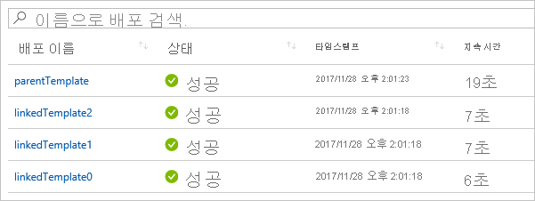

# <a name="using-linked-and-nested-templates-when-deploying-azure-resources"></a>Azure 리소스를 배포할 때 연결 및 중첩된 템플릿 사용

복잡 한 솔루션을 배포 하려면 템플릿을 여러 관련 템플릿으로 분할 한 다음 주 템플릿을 통해 함께 배포할 수 있습니다. 관련 템플릿은 기본 템플릿 내에 포함 된 별도의 파일 또는 템플릿 구문이 될 수 있습니다. 이 문서에서는 **연결 된 템플릿** 이라는 용어를 사용 하 여 주 템플릿의 링크를 통해 참조 되는 별도의 템플릿 파일을 참조 합니다. **중첩 된 템플릿** 이라는 용어를 사용 하 여 기본 템플릿 내에 포함 된 템플릿 구문을 참조 합니다.

중소기업에게는 단일 템플릿이 더 간편하게 이해하고 유지 관리할 수 있습니다. 모든 리소스 및 값을 단일 파일에서 볼 수 있습니다. 고급 시나리오의 경우 연결 된 템플릿을 사용 하 여 솔루션을 대상 구성 요소로 나눌 수 있습니다. 이러한 템플릿은 다른 시나리오에서 쉽게 다시 사용할 수 있습니다.

자습서의 경우 [자습서: 연결된 Azure Resource Manager 템플릿 만들기](./deployment-tutorial-linked-template.md)를 참조하세요.

> [!NOTE]
> 연결된 템플릿 또는 중첩된 템플릿의 경우 [증분](deployment-modes.md) 배포 모드만 사용할 수 있습니다.
>

## <a name="nested-template"></a>중첩된 템플릿

템플릿을 중첩 하려면 [배포 리소스](/azure/templates/microsoft.resources/deployments) 를 기본 템플릿에 추가 합니다. **템플릿** 속성에서 템플릿 구문을 지정 합니다.

```json
{
  "$schema": "https://schema.management.azure.com/schemas/2019-04-01/deploymentTemplate.json#",
  "contentVersion": "1.0.0.0",
  "parameters": {},
  "variables": {},
  "resources": [
    {
      "type": "Microsoft.Resources/deployments",
      "apiVersion": "2019-10-01",
      "name": "nestedTemplate1",
      "properties": {
        "mode": "Incremental",
        "template": {
          <nested-template-syntax>
        }
      }
    }
  ],
  "outputs": {
  }
}
```

다음 예제에서는 중첩 된 템플릿을 통해 저장소 계정을 배포 합니다.

```json
{
  "$schema": "https://schema.management.azure.com/schemas/2019-04-01/deploymentTemplate.json#",
  "contentVersion": "1.0.0.0",
  "parameters": {
    "storageAccountName": {
      "type": "string"
    }
  },
  "resources": [
    {
      "type": "Microsoft.Resources/deployments",
      "apiVersion": "2019-10-01",
      "name": "nestedTemplate1",
      "properties": {
        "mode": "Incremental",
        "template": {
          "$schema": "https://schema.management.azure.com/schemas/2019-04-01/deploymentTemplate.json#",
          "contentVersion": "1.0.0.0",
          "resources": [
            {
              "type": "Microsoft.Storage/storageAccounts",
              "apiVersion": "2019-04-01",
              "name": "[parameters('storageAccountName')]",
              "location": "West US",
              "sku": {
                "name": "Standard_LRS"
              },
              "kind": "StorageV2"
            }
          ]
        }
      }
    }
  ],
  "outputs": {
  }
}
```

### <a name="expression-evaluation-scope-in-nested-templates"></a>중첩 된 템플릿의 식 계산 범위

중첩 된 템플릿을 사용 하는 경우 템플릿 식이 부모 템플릿 또는 중첩 된 템플릿의 범위 내에서 계산 되는지 여부를 지정할 수 있습니다. 범위는 [resourceGroup](template-functions-resource.md#resourcegroup) 및 [subscription](template-functions-resource.md#subscription) 과 같은 매개 변수, 변수 및 함수를 확인 하는 방법을 결정 합니다.

속성을 통해 범위를 설정 합니다 `expressionEvaluationOptions` . 기본적으로 속성은 `expressionEvaluationOptions` 로 설정 됩니다 `outer` . 즉, 부모 템플릿 범위를 사용 합니다. `inner`식이 중첩 된 템플릿의 범위 내에서 계산 되도록 하려면 값을로 설정 합니다.

```json
{
  "type": "Microsoft.Resources/deployments",
  "apiVersion": "2019-10-01",
  "name": "nestedTemplate1",
  "properties": {
  "expressionEvaluationOptions": {
    "scope": "inner"
  },
  ...
```

다음 템플릿에서는 범위에 따라 템플릿 식이 확인 되는 방법을 보여 줍니다. `exampleVar`부모 템플릿과 중첩 된 템플릿 모두에 정의 된 라는 변수를 포함 합니다. 변수의 값을 반환 합니다.

```json
{
  "$schema": "https://schema.management.azure.com/schemas/2019-04-01/deploymentTemplate.json#",
  "contentVersion": "1.0.0.0",
  "parameters": {
  },
  "variables": {
    "exampleVar": "from parent template"
  },
  "resources": [
    {
      "type": "Microsoft.Resources/deployments",
      "apiVersion": "2019-10-01",
      "name": "nestedTemplate1",
      "properties": {
        "expressionEvaluationOptions": {
          "scope": "inner"
        },
        "mode": "Incremental",
        "template": {
          "$schema": "https://schema.management.azure.com/schemas/2019-04-01/deploymentTemplate.json#",
          "contentVersion": "1.0.0.0",
          "variables": {
            "exampleVar": "from nested template"
          },
          "resources": [
          ],
          "outputs": {
            "testVar": {
              "type": "string",
              "value": "[variables('exampleVar')]"
            }
          }
        }
      }
    }
  ],
  "outputs": {
    "messageFromLinkedTemplate": {
      "type": "string",
      "value": "[reference('nestedTemplate1').outputs.testVar.value]"
    }
  }
}
```

의 `exampleVar` 속성 값에 따라의 값이 변경 `scope` `expressionEvaluationOptions` 됩니다. 다음 표에서는 두 범위에 대 한 결과를 보여 줍니다.

| `expressionEvaluationOptions`범위 | 출력 |
| ----- | ------ |
| inner | 중첩 된 템플릿 |
| 외부 (또는 기본값) | 부모 템플릿에서 |

다음 예에서는 SQL server를 배포 하 고 암호에 사용할 주요 자격 증명 모음 암호를 검색 합니다. 범위는 `inner` 키 자격 증명 모음 ID (외부 템플릿에서 참조)를 동적으로 만들고 `adminPassword.reference.keyVault` 중첩 된 `parameters` 템플릿에 매개 변수로 전달 하므로로 설정 됩니다.

```json
{
  "$schema": "https://schema.management.azure.com/schemas/2019-04-01/deploymentTemplate.json#",
  "contentVersion": "1.0.0.0",
  "parameters": {
    "location": {
      "type": "string",
      "defaultValue": "[resourceGroup().location]",
      "metadata": {
        "description": "The location where the resources will be deployed."
      }
    },
    "vaultName": {
      "type": "string",
      "metadata": {
        "description": "The name of the keyvault that contains the secret."
      }
    },
    "secretName": {
      "type": "string",
      "metadata": {
        "description": "The name of the secret."
      }
    },
    "vaultResourceGroupName": {
      "type": "string",
      "metadata": {
        "description": "The name of the resource group that contains the keyvault."
      }
    },
    "vaultSubscription": {
      "type": "string",
      "defaultValue": "[subscription().subscriptionId]",
      "metadata": {
        "description": "The name of the subscription that contains the keyvault."
      }
    }
  },
  "resources": [
    {
      "type": "Microsoft.Resources/deployments",
      "apiVersion": "2019-10-01",
      "name": "dynamicSecret",
      "properties": {
        "mode": "Incremental",
        "expressionEvaluationOptions": {
          "scope": "inner"
        },
        "parameters": {
          "location": {
            "value": "[parameters('location')]"
          },
          "adminLogin": {
            "value": "ghuser"
          },
          "adminPassword": {
            "reference": {
              "keyVault": {
                "id": "[resourceId(parameters('vaultSubscription'), parameters('vaultResourceGroupName'), 'Microsoft.KeyVault/vaults', parameters('vaultName'))]"
              },
              "secretName": "[parameters('secretName')]"
            }
          }
        },
        "template": {
          "$schema": "https://schema.management.azure.com/schemas/2019-04-01/deploymentTemplate.json#",
          "contentVersion": "1.0.0.0",
          "parameters": {
            "adminLogin": {
              "type": "string"
            },
            "adminPassword": {
              "type": "securestring"
            },
            "location": {
              "type": "string"
            }
          },
          "variables": {
            "sqlServerName": "[concat('sql-', uniqueString(resourceGroup().id, 'sql'))]"
          },
          "resources": [
            {
              "type": "Microsoft.Sql/servers",
              "apiVersion": "2018-06-01-preview",
              "name": "[variables('sqlServerName')]",
              "location": "[parameters('location')]",
              "properties": {
                "administratorLogin": "[parameters('adminLogin')]",
                "administratorLoginPassword": "[parameters('adminPassword')]"
              }
            }
          ],
          "outputs": {
            "sqlFQDN": {
              "type": "string",
              "value": "[reference(variables('sqlServerName')).fullyQualifiedDomainName]"
            }
          }
        }
      }
    }
  ],
  "outputs": {
  }
}
```

> [!NOTE]
>
> Scope를로 설정 하면 `outer` `reference` 중첩 된 템플릿에 배포한 리소스에 대해 중첩 된 템플릿의 출력 섹션에서 함수를 사용할 수 없습니다. 중첩 된 템플릿에서 배포 된 리소스에 대 한 값을 반환 하려면 범위를 사용 `inner` 하거나 중첩 된 템플릿을 연결 된 템플릿으로 변환 합니다.

## <a name="linked-template"></a>연결된 템플릿

템플릿을 연결 하려면 [배포 리소스](/azure/templates/microsoft.resources/deployments) 를 기본 템플릿에 추가 합니다. **Templatelink** 속성에서 포함할 템플릿의 URI를 지정 합니다. 다음 예에서는 새 저장소 계정을 배포 하는 템플릿에 연결 합니다.

```json
{
  "$schema": "https://schema.management.azure.com/schemas/2019-04-01/deploymentTemplate.json#",
  "contentVersion": "1.0.0.0",
  "parameters": {},
  "variables": {},
  "resources": [
    {
      "type": "Microsoft.Resources/deployments",
      "apiVersion": "2019-10-01",
      "name": "linkedTemplate",
      "properties": {
        "mode": "Incremental",
        "templateLink": {
          "uri":"https://mystorageaccount.blob.core.windows.net/AzureTemplates/newStorageAccount.json",
          "contentVersion":"1.0.0.0"
        }
      }
    }
  ],
  "outputs": {
  }
}
```

연결 된 템플릿을 참조할 때의 값은 로컬 `uri` 네트워크에서 사용할 수 있는 로컬 파일이 나 파일이 아니어야 합니다. **Http** 또는 **https**로 다운로드 가능한 URI 값을 제공 해야 합니다.

> [!NOTE]
>
> 예를 들어 다음과 같이 매개 변수를 사용 하 여 **http** 또는 **https**를 사용 하는 것으로 확인 되는 매개 변수를 사용 하 여 템플릿을 참조할 수 있습니다 `_artifactsLocation` .`"uri": "[concat(parameters('_artifactsLocation'), '/shared/os-disk-parts-md.json', parameters('_artifactsLocationSasToken'))]",`

Resource Manager에서 템플릿에 액세스할 수 있어야 합니다. 한 가지 옵션은 연결된 템플릿을 스토리지 계정에 배치하고 해당 항목의 URI를 사용하는 것입니다.

### <a name="parameters-for-linked-template"></a>연결 된 템플릿의 매개 변수

외부 파일이 나 인라인에 연결 된 템플릿에 대 한 매개 변수를 제공할 수 있습니다. 외부 매개 변수 파일을 제공 하는 경우 **parametersLink** 속성을 사용 합니다.

```json
"resources": [
  {
  "type": "Microsoft.Resources/deployments",
  "apiVersion": "2019-10-01",
  "name": "linkedTemplate",
  "properties": {
    "mode": "Incremental",
    "templateLink": {
      "uri":"https://mystorageaccount.blob.core.windows.net/AzureTemplates/newStorageAccount.json",
      "contentVersion":"1.0.0.0"
    },
    "parametersLink": {
      "uri":"https://mystorageaccount.blob.core.windows.net/AzureTemplates/newStorageAccount.parameters.json",
      "contentVersion":"1.0.0.0"
    }
  }
  }
]
```

매개 변수 값을 인라인으로 전달 하려면 **parameters** 속성을 사용 합니다.

```json
"resources": [
  {
   "type": "Microsoft.Resources/deployments",
   "apiVersion": "2019-10-01",
   "name": "linkedTemplate",
   "properties": {
     "mode": "Incremental",
     "templateLink": {
      "uri":"https://mystorageaccount.blob.core.windows.net/AzureTemplates/newStorageAccount.json",
      "contentVersion":"1.0.0.0"
     },
     "parameters": {
      "storageAccountName":{"value": "[parameters('storageAccountName')]"}
    }
   }
  }
]
```

인라인 매개 변수와 매개 변수 파일에 대한 링크를 둘 다 사용할 수는 없습니다. `parametersLink` 및 `parameters`를 둘 다 지정하면 오류를 발생하며 배포가 실패합니다.

## <a name="contentversion"></a>contentVersion

`contentVersion`또는 속성에 대 한 속성을 제공할 필요가 `templateLink` 없습니다 `parametersLink` . 를 제공 하지 않으면 `contentVersion` 템플릿의 현재 버전이 배포 됩니다. 콘텐츠 버전 값을 제공하는 경우에는 연결된 템플릿의 버전과 일치해야 합니다. 그렇지 않으면 오류와 함께 배포에 실패합니다.

## <a name="using-variables-to-link-templates"></a>변수를 사용하여 템플릿 연결

앞의 예제에서는 템플릿 링크에 대한 하드 코딩된 URL 값을 보여 주었습니다. 이 방법은 간단한 템플릿에는 적용 될 수 있지만, 많은 모듈식 템플릿 집합에 대해서는 제대로 작동 하지 않습니다. 대신, 주 템플릿에 대한 기본 URL을 보관하는 정적 변수를 만든 다음 해당 기본 URL에서 연결된 템플릿에 대한 URL을 동적으로 만들 수 있습니다. 이 방법의 장점으로는 주 템플릿에서 정적 변수만 변경 하면 되므로 템플릿을 쉽게 이동 하거나 분기할 수 있습니다. 주 템플릿은 분해된 템플릿 전체에서 올바른 URI를 전달합니다.

다음 예제에서는 기본 URL을 사용하여 연결된 템플릿에 대한 두 개의 URL을 만드는 방법을 보여 줍니다(**sharedTemplateUrl** 및 **vmTemplate**).

```json
"variables": {
  "templateBaseUrl": "https://raw.githubusercontent.com/Azure/azure-quickstart-templates/master/postgresql-on-ubuntu/",
  "sharedTemplateUrl": "[uri(variables('templateBaseUrl'), 'shared-resources.json')]",
  "vmTemplateUrl": "[uri(variables('templateBaseUrl'), 'database-2disk-resources.json')]"
}
```

또한 [deployment()](template-functions-deployment.md#deployment) 를 사용하여 현재 템플릿에 대한 기본 URL을 가져올 수 있으며 동일한 위치에 있는 다른 템플릿에 대한 URL를 가져올 수 있습니다. 이 방법은 템플릿 위치가 변경되거나 템플릿 파일에서 URL 하드 코딩을 방지하려는 경우 유용합니다. templateLink 속성은 URL을 사용하여 원격 템플릿을 연결할 때만 반환됩니다. 로컬 템플릿을 사용하는 경우 이 속성을 사용할 수 없습니다.

```json
"variables": {
  "sharedTemplateUrl": "[uri(deployment().properties.templateLink.uri, 'shared-resources.json')]"
}
```

궁극적으로 속성의 속성에서 변수를 사용 합니다 `uri` `templateLink` .

```json
"templateLink": {
 "uri": "[variables('sharedTemplateUrl')]",
 "contentVersion":"1.0.0.0"
}
```

## <a name="using-copy"></a>Copy 사용

중첩 된 템플릿을 사용 하 여 리소스의 여러 인스턴스를 만들려면 **Microsoft .resources/배포** 리소스 수준에 copy 요소를 추가 합니다. 범위가 inner 인 경우 중첩 된 템플릿 내에 복사본을 추가할 수 있습니다.

다음 예제 템플릿에서는 중첩 된 템플릿과 함께 copy를 사용 하는 방법을 보여 줍니다.

```json
"resources": [
  {
  "type": "Microsoft.Resources/deployments",
  "apiVersion": "2019-10-01",
  "name": "[concat('nestedTemplate', copyIndex())]",
  // yes, copy works here
  "copy":{
    "name": "storagecopy",
    "count": 2
  },
  "properties": {
    "mode": "Incremental",
    "expressionEvaluationOptions": {
    "scope": "inner"
    },
    "template": {
    "$schema": "https://schema.management.azure.com/schemas/2019-04-01/deploymentTemplate.json#",
    "contentVersion": "1.0.0.0",
    "resources": [
      {
      "type": "Microsoft.Storage/storageAccounts",
      "apiVersion": "2019-04-01",
      "name": "[concat(variables('storageName'), copyIndex())]",
      "location": "West US",
      "sku": {
        "name": "Standard_LRS"
      },
      "kind": "StorageV2"
      // Copy works here when scope is inner
      // But, when scope is default or outer, you get an error
      //"copy":{
      //  "name": "storagecopy",
      //  "count": 2
      //}
      }
    ]
    }
  }
  }
]
```

## <a name="get-values-from-linked-template"></a>연결된 템플릿에서 값 가져오기

연결된 템플릿에서 출력 값을 가져오려면 `"[reference('deploymentName').outputs.propertyName.value]"` 같은 구문으로 속성 값을 검색합니다.

연결 된 템플릿에서 출력 속성을 가져오는 경우 속성 이름에 대시를 포함 하면 안 됩니다.

다음 예에서는 연결된 템플릿을 참조하고 출력 값을 가져오는 방법을 보여 줍니다. 연결된 템플릿이 간단한 메시지를 반환합니다.  먼저 연결 된 템플릿:

```json
{
  "$schema": "https://schema.management.azure.com/schemas/2019-04-01/deploymentTemplate.json#",
  "contentVersion": "1.0.0.0",
  "parameters": {},
  "variables": {},
  "resources": [],
  "outputs": {
    "greetingMessage": {
      "value": "Hello World",
      "type" : "string"
    }
  }
}
```

주 템플릿은 연결된 템플릿을 배포하고 반환된 값을 가져옵니다. 배포 리소스를 이름으로 참조하고 연결된 템플릿에서 반환한 속성의 이름을 사용합니다.

```json
{
  "$schema": "https://schema.management.azure.com/schemas/2019-04-01/deploymentTemplate.json#",
  "contentVersion": "1.0.0.0",
  "parameters": {},
  "variables": {},
  "resources": [
    {
      "type": "Microsoft.Resources/deployments",
      "apiVersion": "2019-10-01",
      "name": "linkedTemplate",
      "properties": {
        "mode": "Incremental",
        "templateLink": {
          "uri": "[uri(deployment().properties.templateLink.uri, 'helloworld.json')]",
          "contentVersion": "1.0.0.0"
        }
      }
    }
  ],
  "outputs": {
    "messageFromLinkedTemplate": {
      "type": "string",
      "value": "[reference('linkedTemplate').outputs.greetingMessage.value]"
    }
  }
}
```

다른 리소스 형식과 마찬가지로 연결 된 템플릿과 다른 리소스 간에 종속성을 설정할 수 있습니다. 다른 리소스에 연결 된 템플릿의 출력 값이 필요한 경우 연결 된 템플릿이 이전에 배포 되었는지 확인 합니다. 또는 연결된 템플릿이 다른 리소스에 종속될 경우 연결된 템플릿 이전에 다른 리소스가 배포되었는지 확인해야 합니다.

다음 예제에서는 공용 IP 주소를 배포 하 고 해당 공용 IP에 대 한 Azure 리소스의 리소스 ID를 반환 하는 템플릿을 보여 줍니다.

```json
{
  "$schema": "https://schema.management.azure.com/schemas/2019-04-01/deploymentTemplate.json#",
  "contentVersion": "1.0.0.0",
  "parameters": {
    "publicIPAddresses_name": {
      "type": "string"
    }
  },
  "variables": {},
  "resources": [
    {
      "type": "Microsoft.Network/publicIPAddresses",
      "apiVersion": "2018-11-01",
      "name": "[parameters('publicIPAddresses_name')]",
      "location": "eastus",
      "properties": {
        "publicIPAddressVersion": "IPv4",
        "publicIPAllocationMethod": "Dynamic",
        "idleTimeoutInMinutes": 4
      },
      "dependsOn": []
    }
  ],
  "outputs": {
    "resourceID": {
      "type": "string",
      "value": "[resourceId('Microsoft.Network/publicIPAddresses', parameters('publicIPAddresses_name'))]"
    }
  }
}
```

부하 분산 장치를 배포할 때 위의 템플릿에서 공용 IP 주소를 사용 하려면 템플릿에 연결 하 고 리소스에 대 한 종속성을 선언 `Microsoft.Resources/deployments` 합니다. Load Balancer의 공개 IP 주소는 연결된 템플릿에서 값을 출력하도록 설정됩니다.

```json
{
  "$schema": "https://schema.management.azure.com/schemas/2019-04-01/deploymentTemplate.json#",
  "contentVersion": "1.0.0.0",
  "parameters": {
    "loadBalancers_name": {
      "defaultValue": "mylb",
      "type": "string"
    },
    "publicIPAddresses_name": {
      "defaultValue": "myip",
      "type": "string"
    }
  },
  "variables": {},
  "resources": [
    {
      "type": "Microsoft.Network/loadBalancers",
      "apiVersion": "2018-11-01",
      "name": "[parameters('loadBalancers_name')]",
      "location": "eastus",
      "properties": {
        "frontendIPConfigurations": [
          {
            "name": "LoadBalancerFrontEnd",
            "properties": {
              "privateIPAllocationMethod": "Dynamic",
              "publicIPAddress": {
                // this is where the output value from linkedTemplate is used
                "id": "[reference('linkedTemplate').outputs.resourceID.value]"
              }
            }
          }
        ],
        "backendAddressPools": [],
        "loadBalancingRules": [],
        "probes": [],
        "inboundNatRules": [],
        "outboundNatRules": [],
        "inboundNatPools": []
      },
      // This is where the dependency is declared
      "dependsOn": [
        "linkedTemplate"
      ]
    },
    {
      "type": "Microsoft.Resources/deployments",
      "apiVersion": "2019-10-01",
      "name": "linkedTemplate",
      "properties": {
        "mode": "Incremental",
        "templateLink": {
          "uri": "[uri(deployment().properties.templateLink.uri, 'publicip.json')]",
          "contentVersion": "1.0.0.0"
        },
        "parameters":{
          "publicIPAddresses_name":{"value": "[parameters('publicIPAddresses_name')]"}
        }
      }
    }
  ]
}
```

## <a name="deployment-history"></a>배포 기록

Resource Manager는 각 템플릿을 배포 기록에서 별도 배포로 처리합니다. 세 개의 연결 된 템플릿이나 중첩 된 템플릿이 있는 주 템플릿은 배포 기록에 다음과 같이 표시 됩니다.



기록에서 이러한 개별 항목을 사용하여 배포 후 출력 값을 가져올 수 있습니다. 다음 템플릿은 공개 IP 주소를 만들고 해당 IP 주소를 출력합니다.

```json
{
  "$schema": "https://schema.management.azure.com/schemas/2019-04-01/deploymentTemplate.json#",
  "contentVersion": "1.0.0.0",
  "parameters": {
    "publicIPAddresses_name": {
      "type": "string"
    }
  },
  "variables": {},
  "resources": [
    {
      "type": "Microsoft.Network/publicIPAddresses",
      "apiVersion": "2018-11-01",
      "name": "[parameters('publicIPAddresses_name')]",
      "location": "southcentralus",
      "properties": {
        "publicIPAddressVersion": "IPv4",
        "publicIPAllocationMethod": "Static",
        "idleTimeoutInMinutes": 4,
        "dnsSettings": {
          "domainNameLabel": "[concat(parameters('publicIPAddresses_name'), uniqueString(resourceGroup().id))]"
        }
      },
      "dependsOn": []
    }
  ],
  "outputs": {
    "returnedIPAddress": {
      "type": "string",
      "value": "[reference(parameters('publicIPAddresses_name')).ipAddress]"
    }
  }
}
```

다음 템플릿은 위에 템플릿에 연결됩니다. 세 개의 공개 IP 주소를 만듭니다.

```json
{
  "$schema": "https://schema.management.azure.com/schemas/2019-04-01/deploymentTemplate.json#",
  "contentVersion": "1.0.0.0",
  "parameters": {
  },
  "variables": {},
  "resources": [
    {
      "type": "Microsoft.Resources/deployments",
      "apiVersion": "2019-10-01",
      "name": "[concat('linkedTemplate', copyIndex())]",
      "copy": {
        "count": 3,
        "name": "ip-loop"
      },
      "properties": {
        "mode": "Incremental",
        "templateLink": {
        "uri": "[uri(deployment().properties.templateLink.uri, 'static-public-ip.json')]",
        "contentVersion": "1.0.0.0"
        },
        "parameters":{
          "publicIPAddresses_name":{"value": "[concat('myip-', copyIndex())]"}
        }
      }
    }
  ]
}
```

배포 후 다음 PowerShell 스크립트를 통해 출력 값을 검색할 수 있습니다.

```azurepowershell-interactive
$loopCount = 3
for ($i = 0; $i -lt $loopCount; $i++)
{
  $name = 'linkedTemplate' + $i;
  $deployment = Get-AzResourceGroupDeployment -ResourceGroupName examplegroup -Name $name
  Write-Output "deployment $($deployment.DeploymentName) returned $($deployment.Outputs.returnedIPAddress.value)"
}
```

또는 Bash 셸의 Azure CLI 스크립트:

```azurecli-interactive
#!/bin/bash

for i in 0 1 2;
do
  name="linkedTemplate$i";
  deployment=$(az deployment group show -g examplegroup -n $name);
  ip=$(echo $deployment | jq .properties.outputs.returnedIPAddress.value);
  echo "deployment $name returned $ip";
done
```

## <a name="securing-an-external-template"></a>외부 템플릿 보호

연결된 템플릿은 외부에서 사용할 수 있어야 하지만 일반에 공개할 필요는 없습니다. 스토리지 계정 소유자만 액세스할 수 있는 프라이빗 스토리지 계정에 템플릿을 추가할 수 있습니다. 그런 다음 배포하는 동안 액세스할 수 있도록 공유 액세스 서명(SAS) 토큰을 만듭니다. 링크된 템플릿 URI에 SAS 토큰을 추가합니다. 토큰이 보안 문자열로 전달되었지만 SAS 토큰을 포함한 링크된 템플릿 URI가 배포 작업에 로그됩니다. 노출을 최소화하려면 토큰에 만료 날짜를 설정합니다.

매개 변수 파일은 SAS 토큰으로 액세스를 제한할 수 있습니다.

현재 [Azure Storage 방화벽](../../storage/common/storage-network-security.md)뒤에 있는 저장소 계정의 템플릿에 연결할 수 없습니다.

다음 예제에서는 템플릿에 연결할 때 SAS 토큰을 전달하는 방법을 보여 줍니다.

```json
{
  "$schema": "https://schema.management.azure.com/schemas/2019-04-01/deploymentTemplate.json#",
  "contentVersion": "1.0.0.0",
  "parameters": {
  "containerSasToken": { "type": "securestring" }
  },
  "resources": [
  {
    "type": "Microsoft.Resources/deployments",
    "apiVersion": "2019-10-01",
    "name": "linkedTemplate",
    "properties": {
    "mode": "Incremental",
    "templateLink": {
      "uri": "[concat(uri(deployment().properties.templateLink.uri, 'helloworld.json'), parameters('containerSasToken'))]",
      "contentVersion": "1.0.0.0"
    }
    }
  }
  ],
  "outputs": {
  }
}
```

PowerShell에서는 다음 명령을 사용하여 컨테이너용 토큰을 얻고 템플릿을 배포합니다. **containerSasToken** 매개 변수는 템플릿에 정의됩니다. **New-AzResourceGroupDeployment** 명령의 매개 변수가 아닙니다.

```azurepowershell-interactive
Set-AzCurrentStorageAccount -ResourceGroupName ManageGroup -Name storagecontosotemplates
$token = New-AzStorageContainerSASToken -Name templates -Permission r -ExpiryTime (Get-Date).AddMinutes(30.0)
$url = (Get-AzStorageBlob -Container templates -Blob parent.json).ICloudBlob.uri.AbsoluteUri
New-AzResourceGroupDeployment -ResourceGroupName ExampleGroup -TemplateUri ($url + $token) -containerSasToken $token
```

Bash 셸의 Azure CLI에서는 컨테이너용 토큰을 얻고 다음 코드를 사용하여 템플릿을 배포합니다.

```azurecli-interactive
#!/bin/bash

expiretime=$(date -u -d '30 minutes' +%Y-%m-%dT%H:%MZ)
connection=$(az storage account show-connection-string \
  --resource-group ManageGroup \
  --name storagecontosotemplates \
  --query connectionString)
token=$(az storage container generate-sas \
  --name templates \
  --expiry $expiretime \
  --permissions r \
  --output tsv \
  --connection-string $connection)
url=$(az storage blob url \
  --container-name templates \
  --name parent.json \
  --output tsv \
  --connection-string $connection)
parameter='{"containerSasToken":{"value":"?'$token'"}}'
az deployment group create --resource-group ExampleGroup --template-uri $url?$token --parameters $parameter
```

## <a name="example-templates"></a>예제 템플릿

다음 예제에서는 연결된 템플릿의 일반적인 사용 방법을 보여 줍니다.

|기본 템플릿  |연결된 템플릿 |설명  |
|---------|---------| ---------|
|[Hello World](https://github.com/Azure/azure-docs-json-samples/blob/master/azure-resource-manager/linkedtemplates/helloworldparent.json) |[연결된 템플릿](https://github.com/Azure/azure-docs-json-samples/blob/master/azure-resource-manager/linkedtemplates/helloworld.json) | 연결된 템플릿에서 문자열을 반환합니다. |
|[공용 IP 주소가 있는 Load Balancer](https://github.com/Azure/azure-docs-json-samples/blob/master/azure-resource-manager/linkedtemplates/public-ip-parentloadbalancer.json) |[연결된 템플릿](https://github.com/Azure/azure-docs-json-samples/blob/master/azure-resource-manager/linkedtemplates/public-ip.json) |연결된 템플릿에서 공용 IP 주소를 반환하고 부하 분산 장치에서 해당 값을 설정합니다. |
|[여러 IP 주소](https://github.com/Azure/azure-docs-json-samples/blob/master/azure-resource-manager/linkedtemplates/static-public-ip-parent.json) | [연결된 템플릿](https://github.com/Azure/azure-docs-json-samples/blob/master/azure-resource-manager/linkedtemplates/static-public-ip.json) |연결된 템플릿에서 여러 공용 IP 주소를 만듭니다.  |

## <a name="next-steps"></a>다음 단계

* 자습서를 진행하려면 [자습서: 연결된 Azure Resource Manager 템플릿 만들기](./deployment-tutorial-linked-template.md)를 참조하세요.
* 리소스 배포 순서를 정의하는 방법을 알아보려면 [Azure Resource Manager 템플릿에서 종속성 정의](define-resource-dependency.md)를 참조하세요.
* 한 리소스를 정의 하 되 여러 인스턴스를 만드는 방법을 알아보려면 [Azure Resource Manager에서 리소스의 여러 인스턴스 만들기](copy-resources.md)를 참조 하세요.
* 스토리지 계정에서 템플릿을 설정하고 SAS 토큰을 생성하는 절차는 [Resource Manager 템플릿과 Azure PowerShell로 리소스 배포](deploy-powershell.md) 또는 [Resource Manager 템플릿과 Azure CLI로 리소스 배포](deploy-cli.md)를 참조하세요.
