# <a name="creating-and-deploying-azure-resource-groups-through-visual-studio"></a>Visual Studio를 통해 Azure 리소스 그룹 만들기 및 배포

Visual Studio를 사용하여 Azure로 인프라 및 코드를 배포하는 프로젝트를 만들 수 있습니다. 예를 들어 앱에 대한 웹 호스트, 웹 사이트 및 데이터베이스를 정의하고 코드와 함께 해당 인프라를 배포할 수 있습니다. Visual Studio는 일반 시나리오를 배포하기 위한 다양한 서로 다른 시작 템플릿을 제공합니다. 이 문서에서는 웹앱 및 SQL Database를 배포합니다.  

이 문서에서는 [Azure 개발 및 ASP.NET 워크로드가 설치된 Visual Studio 2017 이상](/dotnet/azure/dotnet-tools)을 사용하는 방법을 보여줍니다. Visual Studio 2015 업데이트 2 및 Microsoft Azure SDK for .NET 2.9 또는 Azure SDK 2.9와 함께 Visual Studio 2013을 사용하는 경우 환경은 대부분 동일합니다.

[!INCLUDE [updated-for-az](../../includes/updated-for-az.md)]

## <a name="create-azure-resource-group-project"></a>Azure 리소스 그룹 프로젝트 만들기

이 섹션에서는 **웹앱 + SQL** 템플릿으로 Azure 리소스 그룹 프로젝트를 만듭니다.

1. Visual Studio에서 **파일**, **새 프로젝트**를 선택하고, **C#** 또는 **Visual Basic**을 선택합니다. 이러한 프로젝트에는 JSON 및 PowerShell 콘텐츠만 들어 있기 때문에 어떤 언어를 선택하든 이후 단계에 영향을 미치지 않습니다. 그런 다음 **클라우드**, **Azure 리소스 그룹** 프로젝트를 차례로 선택합니다.
   
    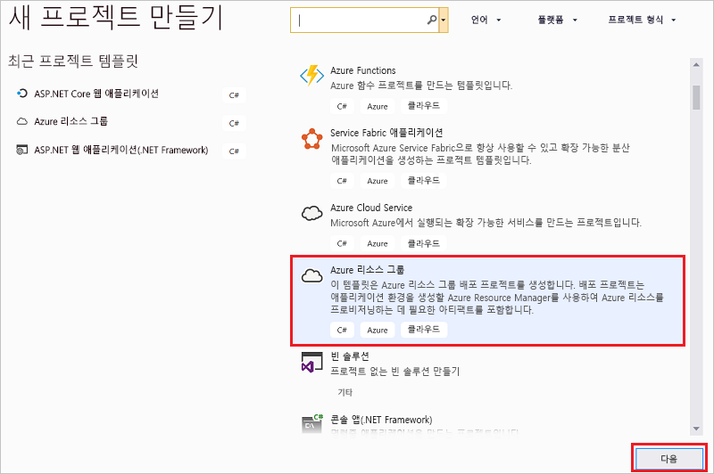
2. Azure 리소스 관리자에 배포하려는 템플릿을 선택합니다. 배포하려는 프로젝트의 유형에 따라 다양한 옵션이 있습니다. 이 문서의 경우 **웹앱 + SQL** 템플릿을 선택합니다.
   
    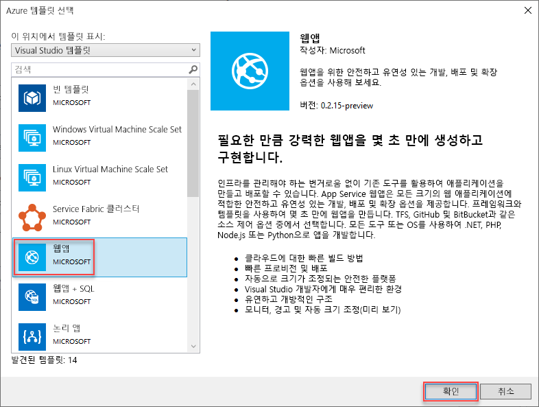
   
    선택한 템플릿은 시작 지점일 뿐이며 시나리오를 충족하는 리소스를 추가 및 제거할 수 있습니다.
   
   > [!NOTE]
   > Visual Studio은 온라인에서 사용 가능한 템플릿 목록을 검색합니다. 목록은 변경될 수 있습니다.
   > 
   > 
   
    Visual Studio는 웹앱 및 SQL 데이터베이스에 대한 리소스 그룹 배포 프로젝트를 만듭니다.
3. 만든 항목을 보려면 배포 프로젝트에서 노드를 봅니다.
   
    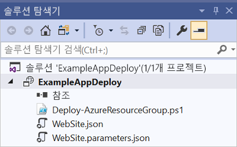
   
    이 예제에서 웹앱 + SQL 템플릿을 선택했기 때문에 다음 파일이 표시됩니다. 
   
   | 파일 이름 | 설명 |
   | --- | --- |
   | Deploy-AzureResourceGroup.ps1 |PowerShell 명령을 실행하여 Azure Resource Manager를 배포하는 PowerShell 스크립트입니다.<br />**참고** 이 PowerShell 스크립트는 Visual Studio에서 템플릿을 배포하는 데 사용됩니다. 이 스크립트를 변경하면 Visual Studio의 배포에 영향이 있으므로 신중해야 합니다. |
   | WebSiteSQLDatabase.json |Azure에 배포하려는 인프라를 정의하는 Resource Manager 템플릿 및 배포하는 동안 제공할 수 있는 매개 변수입니다. 또한 Resource Manager가 리소스를 올바른 순서로 배포하도록 리소스 간의 종속성을 정의합니다. |
   | WebSiteSQLDatabase.parameters.json |템플릿에 필요한 값을 포함하고 있는 매개 변수 파일입니다. 각 배포를 사용자 지정하는 값을 전달합니다. |
   
    모든 리소스 그룹 배포 프로젝트에는 이러한 기본 파일이 있습니다. 다른 프로젝트는 다른 기능을 지원하는 추가 파일을 포함할 수 있습니다.

## <a name="customize-the-resource-manager-template"></a>리소스 관리자 템플릿 사용자 지정
배포하려는 리소스를 설명하는 JSON 템플릿 파일을 수정하여 배포 프로젝트를 사용자 지정할 수 있습니다. JSON은 JavaScript Object Notation의 약어로, 쉽게 작업할 수 있는 직렬화된 데이터 형식입니다. JSON 파일은 각 파일의 위쪽에서 참조하는 스키마를 사용합니다. 스키마를 이해하려면 다운로드하여 분석할 수 있습니다. 스키마는 유효한 요소, 필드의 형식 및 포맷, 가능한 속성 값을 정의합니다. 리소스 관리자 템플릿의 요소에 대한 자세한 내용은 [Azure 리소스 관리자 템플릿 작성](resource-group-authoring-templates.md)을 참조하세요.

템플릿에서 작업하려면 **WebSiteSQLDatabase.json**을 엽니다.

Visual Studio 편집기는 Resource Manager 템플릿 편집에 도움이 되는 도구를 제공합니다. **JSON 개요** 창을 통해 템플릿에 정의된 요소를 쉽게 볼 수 있습니다.

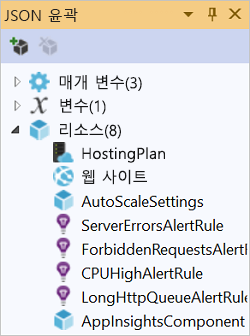

개요에서 요소 중 하나를 선택하면 템플릿의 해당 부분으로 이동하고 해당 JSON을 강조 표시합니다.

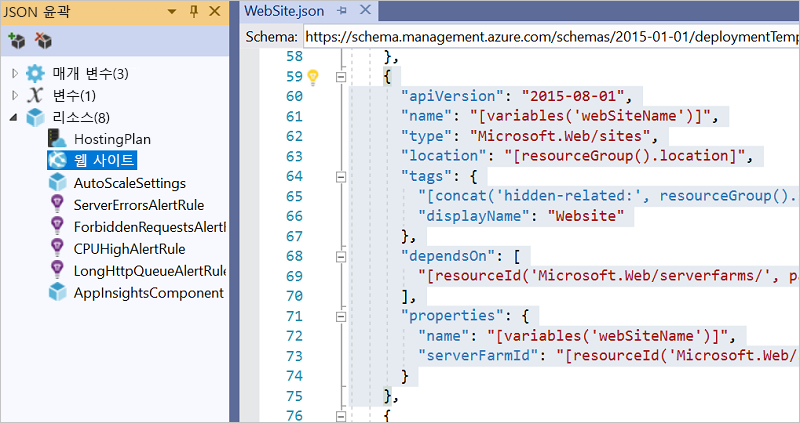

JSON 개요 창의 맨 위에 있는 **리소스 추가** 버튼을 선택하거나 **리소스**를 마우스 오른쪽 단추로 클릭하고 **새 리소스 추가**를 선택하여 리소스를 추가할 수 있습니다.

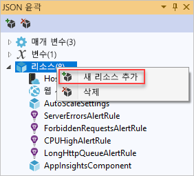

이 자습서의 경우 **Storage 계정** 을 선택하고 이름을 지정합니다. 11개 미만의 문자이며 숫자 및 소문자만을 포함하는 이름을 제공합니다.

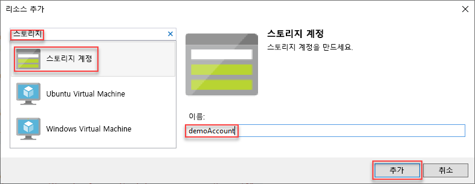

추가된 리소스 뿐만 아니라 형식 저장소 계정에 대한 매개 변수 및 저장소 계정 이름에 대한 변수입니다.

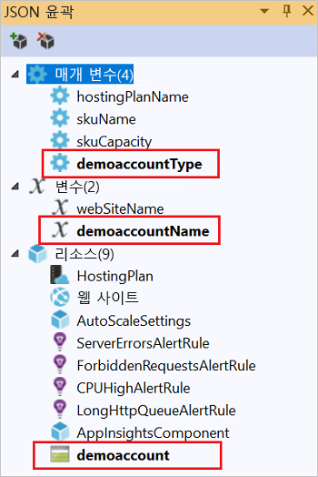

**storageType** 매개 변수는 허용되는 형식 및 기본 형식을 사용하여 미리 정의됩니다. 이러한 값을 유지하거나 시나리오에 대해 편집할 수 있습니다. 아무도 이 템플릿을 통해 **Premium_LRS** 저장소 계정을 배포하지 못하게 하려면 허용된 형식에서 제거해야 합니다. 

```json
"storageType": {
  "type": "string",
  "defaultValue": "Standard_LRS",
  "allowedValues": [
    "Standard_LRS",
    "Standard_ZRS",
    "Standard_GRS",
    "Standard_RAGRS"
  ]
}
```

Visual Studio는 또한 템플릿을 편집하는 경우 사용 가능한 속성을 이해할 수 있도록 intellisense를 제공합니다. 예를 들어 App Service 계획에 대한 속성을 편집하려면 **HostingPlan** 리소스로 이동하고 **속성**에 대한 값을 추가합니다. intellisense는 사용 가능한 값을 표시하고 해당 값에 대한 설명을 제공합니다.

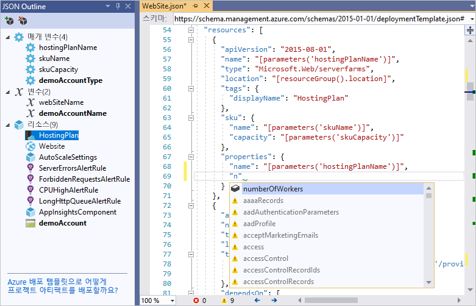

**numberOfWorkers** 를 1로 설정할 수 있습니다.

```json
"properties": {
  "name": "[parameters('hostingPlanName')]",
  "numberOfWorkers": 1
}
```

## <a name="deploy-the-resource-group-project-to-azure"></a>Azure에 리소스 그룹 프로젝트 배포
이제 프로젝트를 배포할 준비가 완료되었습니다. Azure 리소스 그룹 프로젝트를 배포할 때 Azure 리소스 그룹에 배포합니다. 리소스 그룹은 공통 수명 주기를 공유하는 리소스의 논리적 그룹화입니다.

1. 배포 프로젝트 노드의 바로 가기 메뉴에서 **배포** > **새 배포**를 선택합니다.
   
    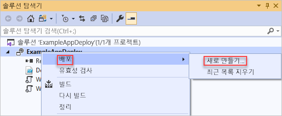
   
    **리소스 그룹에 배포** 대화 상자가 나타납니다.
   
    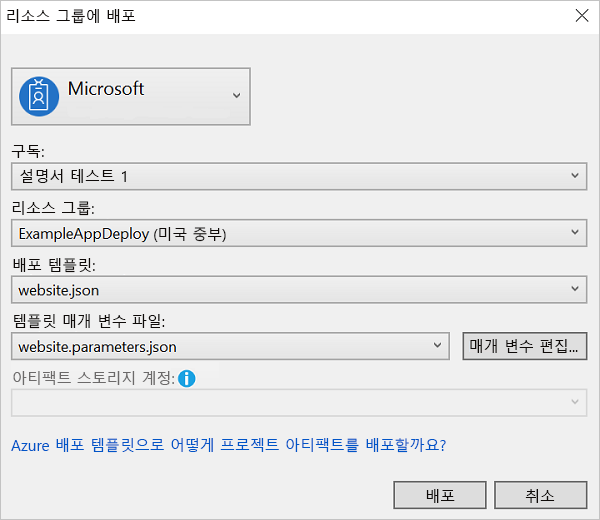
2. **리소스 그룹** 드롭다운 상자에서 기존 리소스 그룹을 선택하거나 새 항목을 만듭니다. 리소스 그룹을 만들려면 **리소스 그룹** 드롭다운 상자를 열고 **새로 만들기**를 선택합니다.
   
    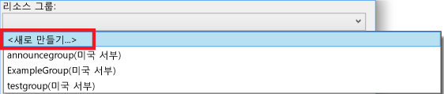
   
    **리소스 그룹 만들기** 대화 상자가 나타납니다. 그룹에 이름 및 위치를 지정하고 **만들기** 단추를 선택합니다.
   
    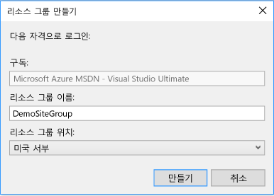
3. **매개 변수 편집** 단추를 선택하여 배포에 대한 매개 변수를 편집합니다.
   
    
4. 비어 있는 매개 변수에 값을 제공하고 **저장** 단추를 선택합니다. 비어 있는 매개 변수는 **hostingPlanName**, **administratorLogin**, **administratorLoginPassword** 및 **databaseName**입니다.
   
    **hostingPlanName** 은 만들려는 [App Service 계획](../app-service/overview-hosting-plans.md) 의 이름을 지정합니다. 
   
    **administratorLogin** 은 SQL Server 관리자의 사용자 이름을 지정합니다. **sa** 또는 **admin** 같은 평범한 관리자 이름을 사용하지 마세요. 
   
    **administratorLoginPassword** 는 SQL Server 관리자의 암호를 지정합니다. **암호를 매개 변수 파일에 일반 텍스트로 저장** 옵션은 안전하지 않으므로 이 옵션을 선택하지 마세요. 암호는 일반 텍스트로 저장되지 않으므로 배포 중에 이 암호를 다시 제공해야 합니다. 
   
    **databaseName** 은 만들 데이터베이스의 이름을 지정합니다. 
   
    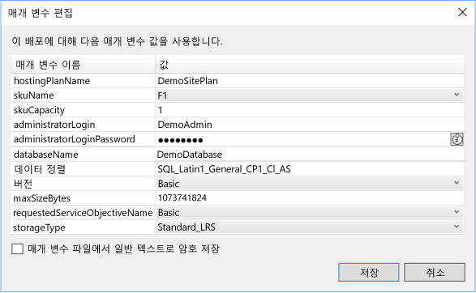
5. **배포** 단추를 선택하여 Azure에 프로젝트를 배포합니다. Visual Studio 인스턴스의 외부에서 PowerShell 콘솔이 열립니다. 메시지가 표시되면 PowerShell 콘솔에 SQL Server 관리자 암호를 입력합니다. **PowerShell 콘솔은 다른 항목 뒤에 숨겨지거나 작업 표시줄에서 최소화될 수 있습니다.** 이 콘솔을 찾아서 암호를 제공합니다.
   
   > [!NOTE]
   > Visual Studio에서는 Azure PowerShell cmdlet을 설치하도록 요청할 수 있습니다. 메시지가 표시되면 설치합니다. 리소스 그룹을 성공적으로 배포하려면 Azure PowerShell 모듈이 필요합니다. 프로젝트의 PowerShell 스크립트는 새 [Azure PowerShell Az 모듈](/powershell/azure/new-azureps-module-az)에서 작동하지 않습니다. 
   >
   > 자세한 내용은 [Azure PowerShell 모듈 설치 및 구성](/powershell/azure/install-Az-ps)을 참조하세요.
   > 
   > 
6. 배포는 몇 분 정도가 걸릴 수 있습니다. **출력** 창에 배포의 상태가 표시됩니다. 배포가 완료되면 마지막 메시지는 다음과 유사한 내용으로 성공적인 배포를 나타냅니다.
   
        ... 
        18:00:58 - Successfully deployed template 'websitesqldatabase.json' to resource group 'DemoSiteGroup'.
7. 브라우저에서 [Azure Portal](https://portal.azure.com/) 을 열고 계정에 로그인합니다. 리소스 그룹을 보려면 **리소스 그룹** 및 배포한 리소스 그룹을 선택합니다.
   
    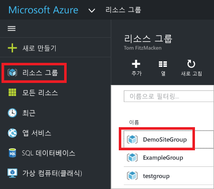
8. 배포된 리소스가 모두 표시됩니다. 저장소 계정의 이름은 해당 리소스를 추가할 때 지정한 것과 일치하지 않은지 확인합니다. 저장소 계정은 고유해야 합니다. 고유한 이름을 제공하기 위해 템플릿은 자동으로 사용자가 제공한 이름에 문자의 문자열을 추가합니다. 
   
    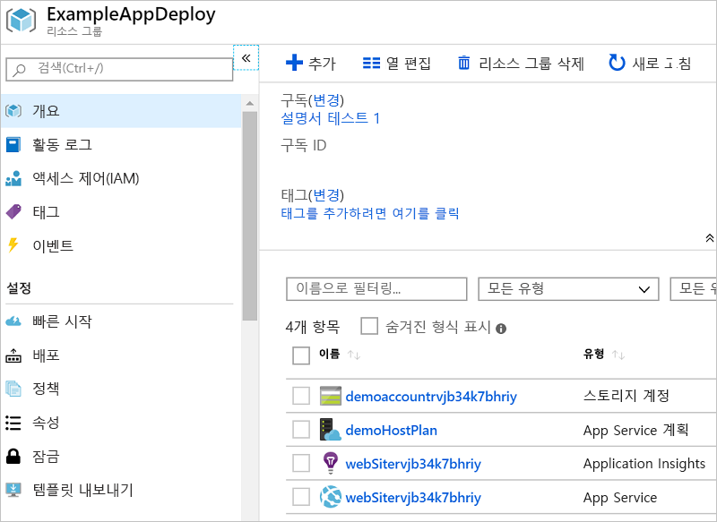
9. 프로젝트를 변경하고 다시 배포할 경우, Azure 리소스 그룹 프로젝트의 바로 가기 메뉴에서 기존 리소스 그룹을 선택합니다. 바로 가기 메뉴에서 **배포**를 선택한 다음 배포한 리소스 그룹을 선택합니다.
   
    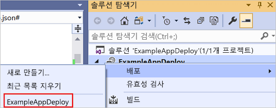

## <a name="deploy-code-with-your-infrastructure"></a>인프라를 사용하여 코드 배포
이 시점에서 앱에 대한 인프라를 배포했지만 프로젝트와 함께 배포된 실제 코드가 없습니다. 이 문서에서는 배포하는 동안 웹앱 및 SQL Database 테이블을 배포하는 방법을 보여 줍니다. 웹앱 대신 Virtual Machine을 배포하는 경우 배포의 일부로 컴퓨터에서 일부 코드를 실행하려 할 것입니다. 웹앱에 대한 코드 배포 또는 Virtual Machine 설정을 위한 절차는 거의 동일합니다.

1. Visual Studio 솔루션에 프로젝트를 추가합니다. 솔루션을 마우스 오른쪽 단추로 클릭하고 **추가** > **새 프로젝트**를 선택합니다.
   
    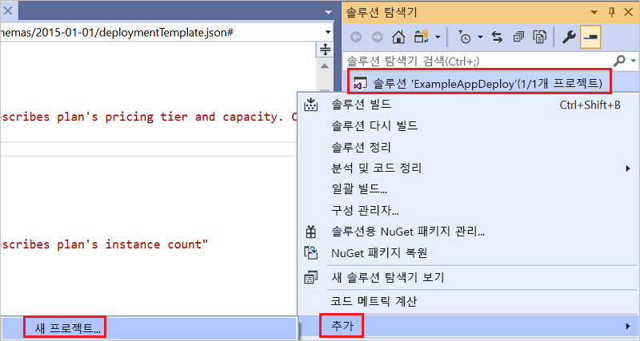
2. **ASP.NET 웹 애플리케이션**을 추가합니다. 
   
    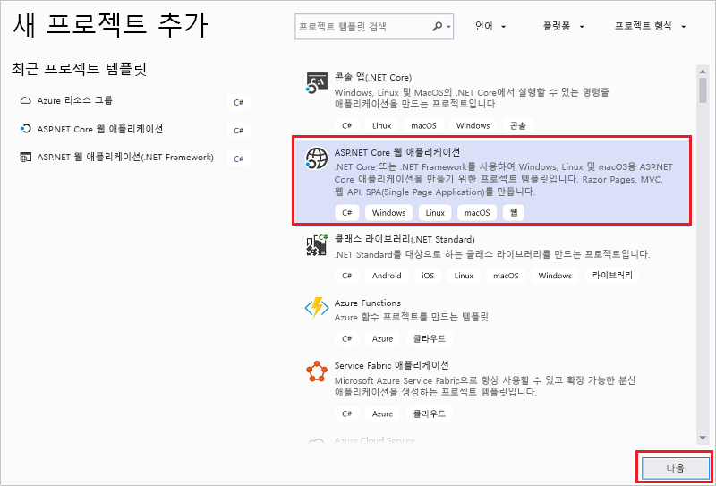
3. **MVC**를 선택합니다.
   
    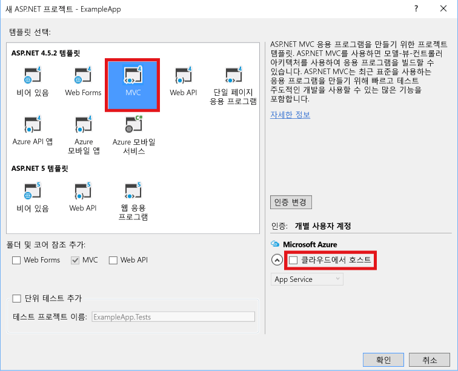
4. Visual Studio에서 웹앱을 만든 후에 솔루션에 두 프로젝트가 모두 표시됩니다.
   
    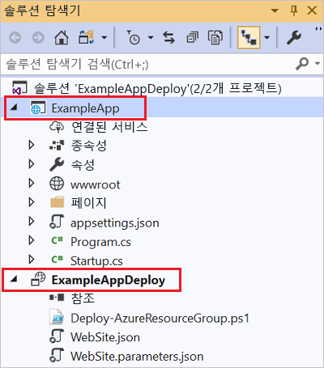
5. 이제, 리소스 그룹 프로젝트가 새 프로젝트를 인식하는지 확인해야 합니다. 리소스 그룹 프로젝트(AzureResourceGroup1)로 돌아갑니다. **참조**를 마우스 오른쪽 단추로 클릭하고 **참조 추가**를 선택합니다.
   
    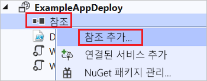
6. 만든 웹앱 프로젝트를 선택합니다.
   
    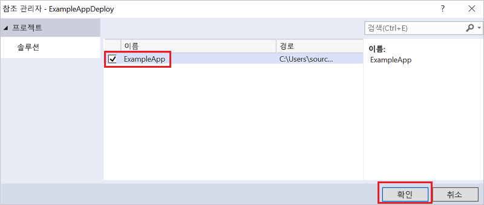
   
    참조를 추가하여 리소스 그룹 프로젝트에 웹앱 프로젝트에 연결하고 자동으로 세 가지 주요 속성을 설정합니다. 참조를 위한 **속성** 창에서 이러한 속성을 확인합니다.
   
      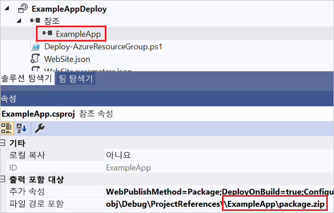
   
    속성은 다음과 같습니다.
   
   * **추가 속성**은 Azure Storage에 푸시되는 웹 배포 패키지 준비 위치를 포함합니다. 폴더(ExampleApp) 및 파일(package.zip)을 적어둡니다. 이러한 값은 앱을 배포할 때 매개 변수로 제공하므로 알고 있어야 합니다. 
   * **파일 경로 포함**은 패키지를 만들 경로를 포함합니다. **대상 포함**은 배포에서 실행할 명령을 포함합니다. 
   * **빌드;패키지** 의 기본값을 통해 배포는 웹 배포 패키지(package.zip)를 빌드하고 만들 수 있습니다.  
     
     배포는 패키지를 만드는 속성에서 필요한 정보를 얻게 되므로 게시 프로필이 필요하지 않습니다.
7. WebSiteSQLDatabase.json으로 돌아와서 템플릿에 리소스를 추가합니다.
   
    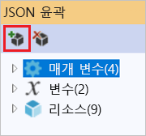
8. 이번에는 **Web Apps에 대한 웹 배포**를 선택합니다. 
   
    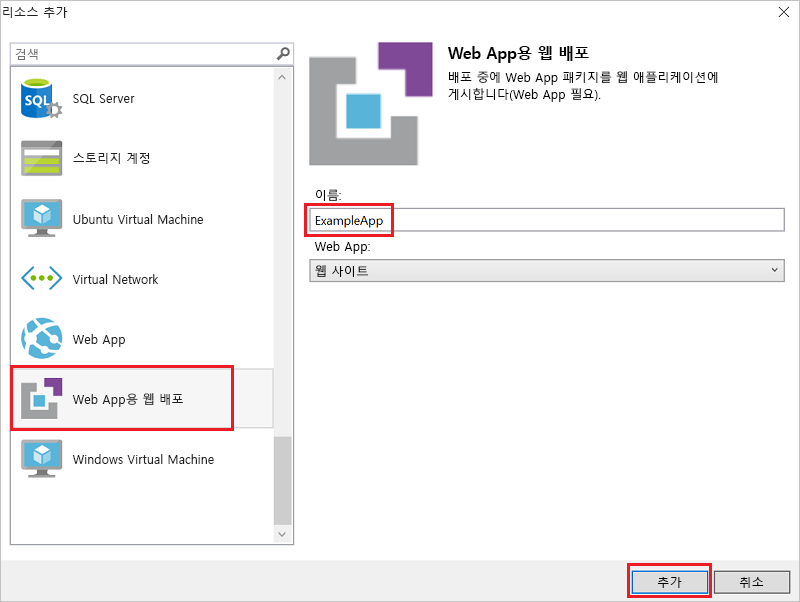
9. 리소스 그룹에 리소스 그룹 프로젝트를 다시 배포합니다. 이번에는 몇 가지 새로운 매개 변수가 있습니다. 자동으로 생성되므로 **_artifactsLocation** 또는 **_artifactsLocationSasToken**에 대한 값을 제공할 필요가 없습니다. 그러나 폴더와 파일 이름을 배포 패키지를 포함하는 경로로 설정해야 합니다(다음 이미지에서 **ExampleAppPackageFolder** 및 **ExampleAppPackageFileName**으로 나타남). 앞서 참조 속성에서 확인한 값을 제공합니다(**ExampleApp** 및 **package.zip**).
   
    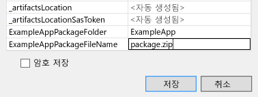
   
    **아티팩트 저장소 계정**의 경우 이 리소스 그룹과 함께 배포된 계정을 선택합니다.
10. 배포가 완료된 후에 포털에서 웹앱을 선택합니다. URL을 선택하여 사이트를 찾습니다.
    
     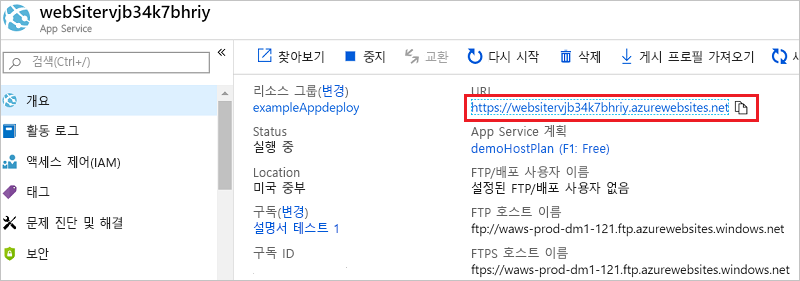
11. 기본 ASP.NET 앱을 성공적으로 배포했습니다.
    
     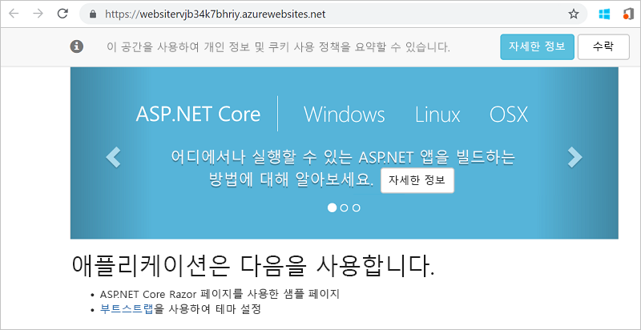

## <a name="add-an-operations-dashboard-to-your-deployment"></a>배포에 작업 대시보드 추가
Visual Studio 인터페이스를 통해 사용할 수 있는 리소스로만 제한되지 않습니다. 템플릿에 사용자 지정 리소스를 추가하여 배포를 사용자 지정할 수 있습니다. 리소스 추가를 표시하기 위해 배포한 리소스를 관리하는 운영 대시보드를 추가합니다.

1. WebsiteSqlDeploy.json 파일을 열고 저장소 계정 리소스 뒤에, 하지만 리소스 섹션의 닫는 `]` 앞에 다음 JSON을 추가합니다.

   ```json
    ,{
      "properties": {
        "lenses": {
          "0": {
            "order": 0,
            "parts": {
              "0": {
                "position": {
                  "x": 0,
                  "y": 0,
                  "colSpan": 4,
                  "rowSpan": 6
                },
                "metadata": {
                  "inputs": [
                    {
                      "name": "resourceGroup",
                      "isOptional": true
                    },
                    {
                      "name": "id",
                      "value": "[resourceGroup().id]",
                      "isOptional": true
                    }
                  ],
                  "type": "Extension/HubsExtension/PartType/ResourceGroupMapPinnedPart"
                }
              },
              "1": {
                "position": {
                  "x": 4,
                  "y": 0,
                  "rowSpan": 3,
                  "colSpan": 4
                },
                "metadata": {
                  "inputs": [],
                  "type": "Extension[azure]/HubsExtension/PartType/MarkdownPart",
                  "settings": {
                    "content": {
                      "settings": {
                        "content": "__Customizations__\n\nUse this dashboard to create and share the operational views of services critical to the application performing. To customize simply pin components to the dashboard and then publish when you're done. Others will see your changes when you publish and share the dashboard.\n\nYou can customize this text too. It supports plain text, __Markdown__, and even limited HTML like images  and <a href='https://azure.microsoft.com' target='_blank'>links</a> that open in a new tab.\n",
                        "title": "Operations",
                        "subtitle": "[resourceGroup().name]"
                      }
                    }
                  }
                }
              }
            }
          }
        },
        "metadata": {
          "model": {
            "timeRange": {
              "value": {
                "relative": {
                  "duration": 24,
                  "timeUnit": 1
                }
              },
              "type": "MsPortalFx.Composition.Configuration.ValueTypes.TimeRange"
            }
          }
        }
      },
      "apiVersion": "2015-08-01-preview",
      "name": "[concat('ARM-',resourceGroup().name)]",
      "type": "Microsoft.Portal/dashboards",
      "location": "[resourceGroup().location]",
      "tags": {
        "hidden-title": "[concat('OPS-',resourceGroup().name)]"
      }
    }
   ```

2. 리소스 그룹을 다시 배포합니다. Azure Portal에서 대시보드를 살펴보고, 공유 대시보드가 선택 목록에 추가되었는지 확인합니다.

   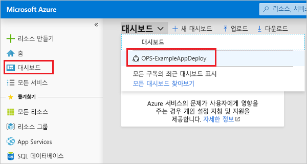

3. 대시보드를 선택합니다.

   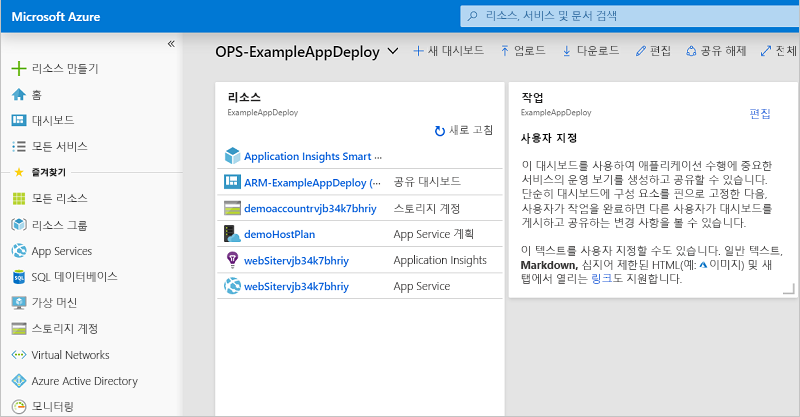

RBAC 그룹을 사용하여 대시보드에 대한 액세스를 관리할 수 있습니다. 또한 배포 후 대시보드의 모양을 사용자 지정할 수 있습니다. 그러나 리소스 그룹을 다시 배포하는 경우 대시보드는 템플릿에서 기본 상태로 다시 설정됩니다. 대시보드 만들기에 대한 자세한 내용은 [Azure 대시보드를 프로그래밍 방식으로 만들기](../azure-portal/azure-portal-dashboards-create-programmatically.md)를 참조하세요.

## <a name="next-steps"></a>다음 단계

이 빠른 시작에서는 Visual Studio를 사용하여 템플릿을 만들고 배포하는 방법을 알아보았습니다. 다음 자습서에서는 템플릿 참조에서 정보를 찾아 암호화된 Azure Storage 계정을 만드는 방법을 보여 줍니다.

> [!div class="nextstepaction"]
> [암호화된 저장소 계정 만들기](./resource-manager-tutorial-create-encrypted-storage-accounts.md)
