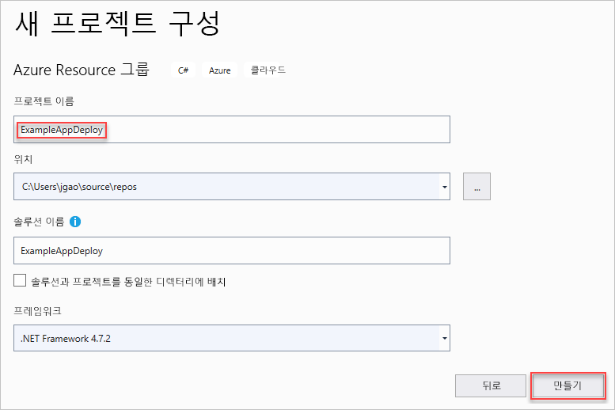
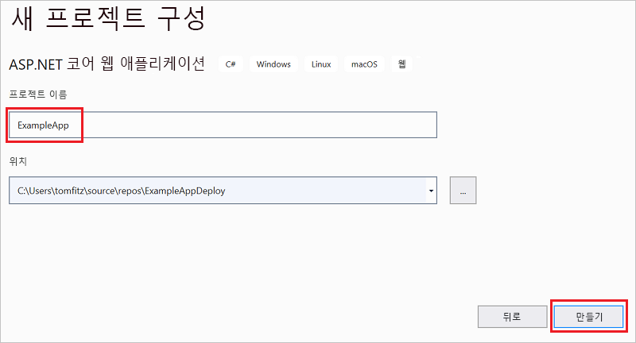
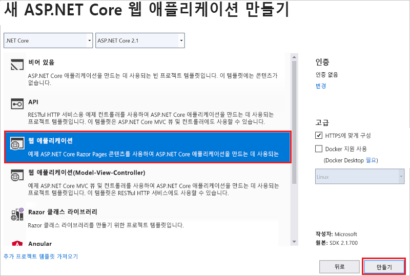
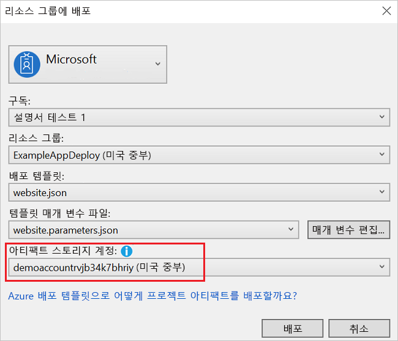

# <a name="creating-and-deploying-azure-resource-groups-through-visual-studio"></a>Visual Studio를 통해 Azure 리소스 그룹 만들기 및 배포

Visual Studio를 사용하여 Azure로 인프라 및 코드를 배포하는 프로젝트를 만들 수 있습니다. 예를 들어, 웹 호스트, 웹 사이트 및 웹 사이트에 대한 코드를 배포할 수 있습니다. Visual Studio는 일반 시나리오를 배포하기 위한 다양한 서로 다른 시작 템플릿을 제공합니다. 이 문서에서는 웹앱을 배포합니다.  

이 문서에서는 [Azure 개발 및 ASP.NET 워크로드가 설치된 Visual Studio 2019 이상](/visualstudio/install/install-visual-studio?view=vs-2019)을 사용하는 방법을 보여줍니다. Visual Studio 2017을 사용하는 경우 환경이 대부분 동일합니다.

## <a name="create-azure-resource-group-project"></a>Azure 리소스 그룹 프로젝트 만들기

이 섹션에서는 **웹앱** 템플릿으로 Azure 리소스 그룹 프로젝트를 만듭니다.

1. Visual Studio에서 **파일**, **새로 만들기** 및 **프로젝트**를 차례로 선택합니다. **Azure 리소스 그룹** 프로젝트 템플릿 및 **다음**을 선택합니다.

    

1. 프로젝트 이름을 지정합니다. 다른 기본 설정은 정상이지만 사용자 환경에 맞게 작동하는지 검토하세요. 완료되면 **만들기**를 선택합니다.

    

1. Azure 리소스 관리자에 배포하려는 템플릿을 선택합니다. 배포하려는 프로젝트의 유형에 따라 다양한 옵션이 있습니다. 이 문서의 경우 **웹앱** 템플릿 및 **확인**을 선택합니다.

    

    선택한 템플릿은 시작 지점일 뿐이며 시나리오를 충족하는 리소스를 추가 및 제거할 수 있습니다.

1. Visual Studio는 웹앱에 대한 리소스 그룹 배포 프로젝트를 만듭니다. 프로젝트에 대한 파일을 보려면 배포 프로젝트의 노드를 확인합니다.

    

    웹앱 템플릿을 선택했기 때문에 다음 파일이 표시됩니다.

   | 파일 이름 | 설명 |
   | --- | --- |
   | Deploy-AzureResourceGroup.ps1 |PowerShell 명령을 실행하여 Azure Resource Manager를 배포하는 PowerShell 스크립트입니다. Visual Studio는 이 PowerShell 스크립트를 사용하여 템플릿을 배포합니다. |
   | WebSite.json |Azure에 배포하려는 인프라를 정의하는 Resource Manager 템플릿 및 배포하는 동안 제공할 수 있는 매개 변수입니다. 또한 Resource Manager가 리소스를 올바른 순서로 배포하도록 리소스 간의 종속성을 정의합니다. |
   | WebSite.parameters.json |템플릿에 필요한 값을 포함하고 있는 매개 변수 파일입니다. 각 배포를 사용자 지정하는 값을 전달합니다. |

    모든 리소스 그룹 배포 프로젝트에는 이러한 기본 파일이 있습니다. 다른 프로젝트는 다른 기능을 지원하는 추가 파일을 포함할 수 있습니다.

## <a name="customize-resource-manager-template"></a>Resource Manager 템플릿 사용자 지정

배포하려는 리소스를 설명하는 Resource Manager 템플릿을 수정하여 배포 프로젝트를 사용자 지정할 수 있습니다. 리소스 관리자 템플릿의 요소에 대한 자세한 내용은 [Azure 리소스 관리자 템플릿 작성](resource-group-authoring-templates.md)을 참조하세요.

1. 템플릿에서 작업하려면 **WebSite.json**을 엽니다.

1. Visual Studio 편집기는 Resource Manager 템플릿 편집에 도움이 되는 도구를 제공합니다. **JSON 개요** 창을 통해 템플릿에 정의된 요소를 쉽게 볼 수 있습니다.

   

1. 개요에서 요소를 선택하여 템플릿의 해당 부분으로 이동합니다.

   

1. JSON 개요 창의 맨 위에 있는 **리소스 추가** 버튼을 선택하거나 **리소스**를 마우스 오른쪽 단추로 클릭하고 **새 리소스 추가**를 선택하여 리소스를 추가할 수 있습니다.

   

1. **스토리지 계정**을 선택하고 이름을 입력합니다. 11개 미만의 문자이며 숫자 및 소문자만을 포함하는 이름을 제공합니다.

   

1. 추가된 리소스 뿐만 아니라 형식 저장소 계정에 대한 매개 변수 및 저장소 계정 이름에 대한 변수입니다.

   

1. 스토리지 계정의 유형에 대한 매개 변수는 허용되는 유형 및 기본 유형을 사용하여 미리 정의됩니다. 이러한 값을 유지하거나 시나리오에 대해 편집할 수 있습니다. 아무도 이 템플릿을 통해 **Premium_LRS** 저장소 계정을 배포하지 못하게 하려면 허용된 형식에서 제거해야 합니다.

   ```json
   "demoaccountType": {
     "type": "string",
     "defaultValue": "Standard_LRS",
     "allowedValues": [
       "Standard_LRS",
       "Standard_ZRS",
       "Standard_GRS",
       "Standard_RAGRS"
     ]
   }
   ```

1. Visual Studio는 또한 템플릿을 편집하는 경우 사용 가능한 속성을 이해할 수 있도록 intellisense를 제공합니다. 예를 들어 App Service 계획에 대한 속성을 편집하려면 **HostingPlan** 리소스로 이동하고 **속성**에 대한 값을 추가합니다. intellisense는 사용 가능한 값을 표시하고 해당 값에 대한 설명을 제공합니다.

   

   **numberOfWorkers**를 1로 설정한 다음, 파일을 저장할 수 있습니다.

   ```json
   "properties": {
     "name": "[parameters('hostingPlanName')]",
     "numberOfWorkers": 1
   }
   ```

1. **WebSite.parameters.json** 파일을 엽니다. 배포할 리소스를 사용자 정의하는 값을 배포 중에 전달하려면 매개 변수 파일을 사용합니다. 호스팅 계획에 이름을 지정하고 파일을 저장합니다.

   ```json
   {
     "$schema": "https://schema.management.azure.com/schemas/2015-01-01/deploymentParameters.json#",
     "contentVersion": "1.0.0.0",
     "parameters": {
       "hostingPlanName": {
         "value": "demoHostPlan"
       }
     }
   }
   ```

## <a name="deploy-project-to-azure"></a>Azure에 프로젝트 배포

이제 프로젝트를 리소스 그룹에 배포할 준비가 되었습니다.

기본적으로 프로젝트에서 PowerShell 스크립트(Deploy-AzureResourceGroup.ps1)는 AzureRM 모듈을 사용합니다. 여전히 AzureRM 모듈이 설치되어 있고 계속 사용하려는 경우 이 기본 스크립트를 사용할 수 있습니다. 이 스크립트를 사용하면 Visual Studio 인터페이스를 사용하여 솔루션을 배포할 수 있습니다.

그러나 새 [Az 모듈](/powershell/azure/new-azureps-module-az)로 마이그레이션한 경우 프로젝트에 새 스크립트를 추가해야 합니다. Az 모듈을 사용하는 스크립트를 추가하려면 [Deploy-AzTemplate.ps1](https://github.com/Azure/azure-quickstart-templates/blob/master/Deploy-AzTemplate.ps1) 스크립트를 복사하고 프로젝트에 추가합니다. 이 스크립트를 배포에 사용하려면 Visual Studio의 배포 인터페이스를 사용하는 대신, PowerShell 콘솔에서 실행해야 합니다.

두 방법은 모두 이 문서에 나와 있습니다. 이 문서에서는 기본 스크립트를 AzureRM 모듈 스크립트로, 새 스크립트를 Az 모듈 스크립트로 부릅니다.

### <a name="az-module-script"></a>Az 모듈 스크립트

Az 모듈 스크립트의 경우 PowerShell 콘솔을 열고 다음을 실행합니다.

```powershell
.\Deploy-AzTemplate.ps1 -ArtifactStagingDirectory . -Location centralus -TemplateFile WebSite.json -TemplateParametersFile WebSite.parameters.json
```

### <a name="azurerm-module-script"></a>AzureRM 모듈 스크립트

AzureRM 모듈 스크립트의 경우 Visual Studio를 사용합니다.

1. 배포 프로젝트 노드의 바로 가기 메뉴에서 **배포** > **새 배포**를 선택합니다.

    

1. **리소스 그룹에 배포** 대화 상자가 나타납니다. **리소스 그룹** 드롭다운 상자에서 기존 리소스 그룹을 선택하거나 새 항목을 만듭니다. **배포**를 선택합니다.

    

1. **출력** 창에 배포의 상태가 표시됩니다. 배포가 완료되면 마지막 메시지는 다음과 유사한 내용으로 성공적인 배포를 나타냅니다.

   ```output
   18:00:58 - Successfully deployed template 'website.json' to resource group 'ExampleAppDeploy'.
   ```

## <a name="view-deployed-resources"></a>배포된 리소스 보기

결과를 확인해보겠습니다.

1. 브라우저에서 [Azure Portal](https://portal.azure.com/) 을 열고 계정에 로그인합니다. 리소스 그룹을 보려면 **리소스 그룹** 및 배포한 리소스 그룹을 선택합니다.

1. 배포된 리소스가 모두 표시됩니다. 저장소 계정의 이름은 해당 리소스를 추가할 때 지정한 것과 일치하지 않은지 확인합니다. 저장소 계정은 고유해야 합니다. 고유한 이름을 만들기 위해 템플릿은 자동으로 사용자가 제공한 이름에 문자의 문자열을 추가합니다.

    

## <a name="add-code-to-project"></a>프로젝트에 코드 추가

이 시점에서 앱에 대한 인프라를 배포했지만 프로젝트와 함께 배포된 실제 코드가 없습니다.

1. Visual Studio 솔루션에 프로젝트를 추가합니다. 솔루션을 마우스 오른쪽 단추로 클릭하고 **추가** > **새 프로젝트**를 선택합니다.

    

1. **ASP.NET Core 웹 애플리케이션**을 추가합니다.

    

1. 웹앱에 이름을 지정하고 **만들기**를 선택합니다.

    

1. **웹 애플리케이션** 및 **만들기**를 선택합니다.

    

1. Visual Studio에서 웹앱을 만든 후에 솔루션에 두 프로젝트가 모두 표시됩니다.

    

1. 이제, 리소스 그룹 프로젝트가 새 프로젝트를 인식하는지 확인해야 합니다. 리소스 그룹 프로젝트(ExampleAppDeploy)로 돌아갑니다. **참조**를 마우스 오른쪽 단추로 클릭하고 **참조 추가**를 선택합니다.

    

1. 만든 웹앱 프로젝트를 선택합니다.

   

   참조를 추가하여 리소스 그룹 프로젝트에 웹앱 프로젝트를 연결하고 자동으로 몇 가지 속성을 설정합니다. 참조를 위한 **속성** 창에서 이러한 속성을 확인합니다. **파일 경로 포함**은 패키지를 만들 경로를 포함합니다. 폴더(ExampleApp) 및 파일(package.zip)을 적어둡니다. 이러한 값은 앱을 배포할 때 매개 변수로 제공하므로 알고 있어야 합니다.

   

1. 템플릿(WebSite.json)으로 돌아와서 템플릿에 리소스를 추가합니다.

    

1. 이번에는 **Web Apps에 대한 웹 배포**를 선택합니다. 

    

   템플릿을 저장합니다.

1. 템플릿에 몇 가지 새로운 매개 변수가 있습니다. 이전 단계에서 추가된 것입니다. 이러한 값은 자동으로 생성되므로 **_artifactsLocation** 또는 **_artifactsLocationSasToken**에 대한 값을 제공할 필요가 없습니다. 그러나 폴더와 파일 이름을 배포 패키지를 포함하는 경로로 설정해야 합니다. 이러한 매개 변수의 이름은 **PackageFolder** 및 **PackageFileName**으로 끝납니다. 이름의 첫 번째 부분은 추가한 웹 배포 리소스의 이름입니다. 이 문서에서는 이름을 **ExampleAppPackageFolder** 및 **ExampleAppPackageFileName**이라고 지정했습니다. 

   **Website.parameters.json**을 열고 참조 속성에서 확인한 값으로 해당 매개 변수를 설정합니다. **ExampleAppPackageFolder**를 폴더의 이름으로 설정합니다. **ExampleAppPackageFileName**을 zip 파일의 이름으로 설정합니다.

   ```json
   {
     "$schema": "https://schema.management.azure.com/schemas/2015-01-01/deploymentParameters.json#",
     "contentVersion": "1.0.0.0",
     "parameters": {
       "hostingPlanName": {
         "value": "demoHostPlan"
       },
       "ExampleAppPackageFolder": {
         "value": "ExampleApp"
       },
       "ExampleAppPackageFileName": {
         "value": "package.zip"
       }
     }
   }
   ```

## <a name="deploy-code-with-infrastructure"></a>인프라를 사용하여 코드 배포

프로젝트에 코드를 추가했기 때문에 이번에 배포가 약간 다릅니다. 배포하는 동안 Resource Manager가 액세스할 수 있는 위치로 프로젝트의 아티팩트를 준비합니다. 아티팩트는 스토리지 계정에 준비됩니다.

### <a name="az-module-script"></a>Az 모듈 스크립트

Az 모듈 스크립트를 사용하는 경우 템플릿에 변경해야 할 사항이 하나 있습니다. 이 스크립트는 아티팩트 위치에 슬래시를 추가하지만 템플릿에는 해당 슬래시가 없습니다. WebSite.json을 열고 MSDeploy 확장에 대한 속성을 찾습니다. **packageUri**라는 속성이 있습니다. 아티팩트 위치와 패키지 폴더 간에 슬래시를 제거합니다.

다음과 같이 표시되어야 합니다.

```json
"packageUri": "[concat(parameters('_artifactsLocation'), parameters('ExampleAppPackageFolder'), '/', parameters('ExampleAppPackageFileName'), parameters('_artifactsLocationSasToken'))]",
```

앞의 예제에서 **parameters('_artifactsLocation')** 와 **parameters('ExampleAppPackageFolder')** 사이에 `'/',`가 없다는 점에 유의하세요.

프로젝트를 다시 빌드합니다. 프로젝트를 빌드하면 배포해야 하는 파일이 준비 폴더에 추가되었는지 확인합니다.

이제 PowerShell 콘솔을 열고 다음을 실행합니다.

```powershell
.\Deploy-AzTemplate.ps1 -ArtifactStagingDirectory .\bin\Debug\staging\ExampleAppDeploy -Location centralus -TemplateFile WebSite.json -TemplateParametersFile WebSite.parameters.json -UploadArtifacts -StorageAccountName <storage-account-name>
```

### <a name="azurerm-module-script"></a>AzureRM 모듈 스크립트

AzureRM 모듈 스크립트의 경우 Visual Studio를 사용합니다.

1. 다시 배포하려면 **배포**를 선택하고 이전에 배포한 리소스를 선택합니다.

    

1. **아티팩트 스토리지 계정**의 경우 이 리소스 그룹과 함께 배포된 스토리지 계정을 선택합니다.

   

## <a name="view-web-app"></a>웹앱 보기

1. 배포가 완료된 후에 포털에서 웹앱을 선택합니다. URL을 선택하여 사이트를 찾습니다.

   

1. 기본 ASP.NET 앱을 성공적으로 배포했습니다.

   

## <a name="add-operations-dashboard"></a>작업 대시보드 추가

Visual Studio 인터페이스를 통해 사용할 수 있는 리소스로만 제한되지 않습니다. 템플릿에 사용자 지정 리소스를 추가하여 배포를 사용자 지정할 수 있습니다. 리소스 추가를 표시하기 위해 배포한 리소스를 관리하는 운영 대시보드를 추가합니다.

1. WebSite.json 파일을 열고, 다음 JSON을 스토리지 계정 리소스 뒤, 리소스 섹션의 닫는 `]` 앞에 추가합니다.

   ```json
    ,{
      "properties": {
        "lenses": {
          "0": {
            "order": 0,
            "parts": {
              "0": {
                "position": {
                  "x": 0,
                  "y": 0,
                  "colSpan": 4,
                  "rowSpan": 6
                },
                "metadata": {
                  "inputs": [
                    {
                      "name": "resourceGroup",
                      "isOptional": true
                    },
                    {
                      "name": "id",
                      "value": "[resourceGroup().id]",
                      "isOptional": true
                    }
                  ],
                  "type": "Extension/HubsExtension/PartType/ResourceGroupMapPinnedPart"
                }
              },
              "1": {
                "position": {
                  "x": 4,
                  "y": 0,
                  "rowSpan": 3,
                  "colSpan": 4
                },
                "metadata": {
                  "inputs": [],
                  "type": "Extension[azure]/HubsExtension/PartType/MarkdownPart",
                  "settings": {
                    "content": {
                      "settings": {
                        "content": "__Customizations__\n\nUse this dashboard to create and share the operational views of services critical to the application performing. To customize simply pin components to the dashboard and then publish when you're done. Others will see your changes when you publish and share the dashboard.\n\nYou can customize this text too. It supports plain text, __Markdown__, and even limited HTML like images  and <a href='https://azure.microsoft.com' target='_blank'>links</a> that open in a new tab.\n",
                        "title": "Operations",
                        "subtitle": "[resourceGroup().name]"
                      }
                    }
                  }
                }
              }
            }
          }
        },
        "metadata": {
          "model": {
            "timeRange": {
              "value": {
                "relative": {
                  "duration": 24,
                  "timeUnit": 1
                }
              },
              "type": "MsPortalFx.Composition.Configuration.ValueTypes.TimeRange"
            }
          }
        }
      },
      "apiVersion": "2015-08-01-preview",
      "name": "[concat('ARM-',resourceGroup().name)]",
      "type": "Microsoft.Portal/dashboards",
      "location": "[resourceGroup().location]",
      "tags": {
        "hidden-title": "[concat('OPS-',resourceGroup().name)]"
      }
    }
   ```

1. 프로젝트를 다시 배포합니다.

1. 배포가 완료된 후 포털에서 대시보드를 확인합니다. **대시보드**를 선택하고 배포한 항목을 하나 선택합니다.

   

1. 사용자 지정 대시보드가 표시됩니다.

   

RBAC 그룹을 사용하여 대시보드에 대한 액세스를 관리할 수 있습니다. 또한 배포 후 대시보드의 모양을 사용자 지정할 수 있습니다. 그러나 리소스 그룹을 다시 배포하는 경우 대시보드는 템플릿에서 기본 상태로 다시 설정됩니다. 대시보드 만들기에 대한 자세한 내용은 [Azure 대시보드를 프로그래밍 방식으로 만들기](../azure-portal/azure-portal-dashboards-create-programmatically.md)를 참조하세요.

## <a name="clean-up-resources"></a>리소스 정리

Azure 리소스가 더 이상 필요하지 않은 경우 리소스 그룹을 삭제하여 배포한 리소스를 정리합니다.

1. Azure Portal의 왼쪽 메뉴에서 **리소스 그룹**을 선택합니다.

1. 해당 리소스 그룹 이름을 선택합니다.

1. 위쪽 메뉴에서 **리소스 그룹 삭제**를 선택합니다.

## <a name="next-steps"></a>다음 단계

이 빠른 시작에서는 Visual Studio를 사용하여 템플릿을 만들고 배포하는 방법을 알아보았습니다. 다음 자습서에서는 템플릿 참조에서 정보를 찾아 암호화된 Azure Storage 계정을 만드는 방법을 보여 줍니다.

> [!div class="nextstepaction"]
> [암호화된 저장소 계정 만들기](./resource-manager-tutorial-create-encrypted-storage-accounts.md)
