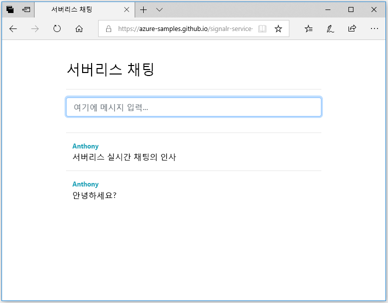

## 웹 응용 프로그램 실행

1. 편의를 위해 GitHub에서 호스트된 샘플 단일 페이지 웹 응용 프로그램이 있습니다. 브라우저에서 [https://azure-samples.github.io/signalr-service-quickstart-serverless-chat/demo/chat/](https://azure-samples.github.io/signalr-service-quickstart-serverless-chat/demo/chat/)을(를) 엽니다.

    > [!NOTE]
    > HTML 파일 소스는 [/docs/demo/chat/index.html](https://github.com/Azure-Samples/signalr-service-quickstart-serverless-chat/blob/master/docs/demo/chat/index.html)에서 찾을 수 있습니다.

1. 함수 앱 기본 URL에 대한 메시지가 표시되면 *http://localhost:7071*을(를) 입력합니다.

1. 메시지가 표시되면 사용자 이름을 입력합니다.

1. 웹 응용 프로그램이 함수 앱에서 *GetSignalRInfo* 함수를 호출하여 Azure SignalR Service에 연결할 연결 정보를 검색합니다. 연결이 완료되면 이 채팅 메시지 입력 상자가 표시됩니다.

1. 메시지를 입력하고 Enter 키를 누릅니다. 이 응용 프로그램이 Azure 함수 앱에서 이 메시지를 *SendMessage* 함수로 보낸 다음, 이 앱이 SignalR 출력 바인딩을 사용하여 연결된 클라이언트 모두에 이 메시지를 브로드캐스트합니다. 모든 기능이 올바르게 작동하는 경우 이 메시지가 응용 프로그램에 표시됩니다.

    

1. 다른 브라우저 창에서 웹 응용 프로그램의 다른 인스턴스를 엽니다. 응용 프로그램의 모든 인스턴스에 전송된 메시지가 표시됩니다.