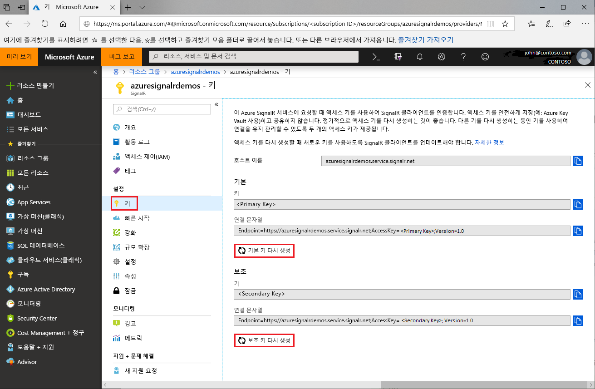

# Azure SignalR Service에 대한 액세스 키 회전

각 Azure SignalR Service 인스턴스에는 기본 및 보조 키의 액세스 키 쌍이 있습니다. 서비스에 요청을 만들 때 SignalR 클라이언트를 인증하는 데 사용됩니다. 키는 인스턴스 엔드포인트 URL과 연결됩니다. 키를 안전하게 보호하고 정기적으로 회전해야 합니다. 하나의 키를 다시 생성하는 동안 다른 하나를 사용하여 연결을 유지할 수 있도록 하기 위해 두 개의 액세스 키가 제공됩니다.

## 액세스 키를 회전하는 이유는?

보안상의 이유 및 규정 준수 요구 사항을 위해 개발자는 정기적으로 액세스 키를 회전시키는 것이 좋습니다.

## 액세스 키를 다시 생성하는 방법은?

1. [Azure Portal](https://portal.azure.com/)로 이동하여 자격 증명으로 로그인합니다.

1. 키를 다시 생성하려는 Azure SignalR Service 인스턴스에서 **키** 섹션을 찾습니다.

1. 탐색 메뉴에서 **키**를 클릭합니다.

1. **기본 키 다시 생성** 또는 **보조 키 다시 생성**을 클릭합니다.

새 키 및 해당 연결 문자열이 생성되어 표시됩니다.

 

또한 [Azure CLI](/cli/azure/ext/signalr/signalr/key?view=azure-cli-latest#ext-signalr-az-signalr-key-renew)를 사용하여 키를 다시 생성할 수도 있습니다.

## 새 연결 문자열을 사용하여 구성 업데이트

1. 새로 생성된 연결 문자열을 복사합니다.

1. 새 연결 문자열을 사용하도록 모든 구성을 업데이트합니다.

1. 필요에 따라 애플리케이션을 다시 시작합니다.

## 강제 액세스 키 다시 생성

Azure SignalR Service는 특정 상황에서 필수 액세스 키 다시 생성을 적용할 수 있습니다. 서비스는 이메일 및 포털 알림을 통해 고객에게 알립니다. 이 통신을 받거나 액세스 키로 인해 서비스 오류가 발생하는 경우 이 가이드에 따라 키를 회전합니다.

## 다음 단계

정기적으로 액세스 키를 회전하는 것은 좋은 보안 방법으로 권장됩니다.

이 가이드에서는 액세스 키를 다시 생성하는 방법에 대해 알아보았습니다. Azure Functions 또는 OAuth를 사용한 인증에 관한 다음 자습서를 계속 진행하세요.

> [!div class="nextstepaction"]
> [ASP.NET Core ID와 통합](./signalr-authenticate-oauth.md)

> [!div class="nextstepaction"]
> [인증을 사용하여 서버리스 실시간 앱 빌드](./signalr-authenticate-azure-functions.md)