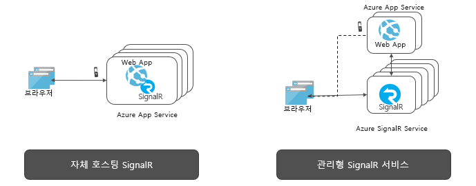

# Azure SignalR Service란?

Azure SignalR Service는 HTTP를 통해 애플리케이션에 실시간 웹 기능을 추가하는 프로세스를 간소화합니다. 이 실시간 기능을 사용하면 서비스가 연결된 클라이언트(예: 단일 페이지 웹 또는 모바일 애플리케이션)에 콘텐츠 업데이트를 푸시할 수 있습니다. 결과적으로 클라이언트가 서버를 폴링하거나 업데이트에 대한 새 HTTP 요청을 제출하지 않고도 업데이트됩니다.

이 문서에서는 Azure SignalR Service에 대한 개요를 제공합니다.

## Azure SignalR Service의 용도는?

서버에서 클라이언트로 데이터를 푸시해야 하는 모든 시나리오에서 Azure SignalR Service를 사용할 수 있습니다.

서버에서 폴링이 필요한 일반적인 실시간 기능에도 Azure SignalR Service를 사용할 수 있습니다.

Azure SignalR Service는 매우 다양한 업계에서 실시간 콘텐츠 업데이트가 필요한 애플리케이션 유형에 사용되었습니다. 다음에 Azure SignalR Service를 사용하면 좋은 몇 가지 예가 나와 있습니다.

* **높은 빈도 데이터 업데이트:** 게임, 투표, 폴링, 경매
* **대시보드 및 모니터링:** 회사 대시보드, 금융 시장 데이터, 인스턴트 판매 업데이트, 다중 플레이어 게임 리더 보드, IoT 모니터링
* **채팅:** 라이브 채팅방, 채팅 봇, 온라인 고객 지원, 실시간 쇼핑 지원, 메신저, 인게임 채팅 등
* **지도의 실시간 위치:** 물류 추적, 배달 상태 추적, 운송 상태 업데이트, GPS 앱
* **실시간으로 타기팅 광고:** 맞춤형 읽기 시간 푸시 광고 및 제품, 대화형 광고
* **협업 앱:** 공동 작성, 화이트보드 앱, 팀 모임 소프트웨어
* **푸시 알림:** 소셜 네트워크, 메일, 게임, 여행 경보
* **실시간 브로드캐스트:** 라이브 오디오/비디오 브로드캐스트, 실시간 캡션, 번역, 이벤트/뉴스 브로드캐스트
* **IoT 및 연결된 디바이스:** : 실시간 IoT 메트릭, 원격 제어, 실시간 상태, 위치 추적
* **자동화:** 업스트림 이벤트의 실시간 트리거

## Azure SignalR Service를 사용하면 어떤 이점이 있나요?

**표준 기반:**

SignalR은 실시간 웹 애플리케이션을 빌드하는 데 사용되는 다양한 기술에 대한 추상화를 제공합니다. [Websocket](https://wikipedia.org/wiki/WebSocket)이 최적의 전송이지만, 다른 옵션을 사용할 수 없는 경우 [SSE(Server-Sent Events)](https://wikipedia.org/wiki/Server-sent_events) 및 Long Polling과 같은 다른 기술이 사용됩니다. SignalR은 서버와 클라이언트에서 지원되는 기능에 따라 적절한 전송을 자동으로 감지하고 초기화합니다.

**원시 ASP.NET Core 지원:**

SignalR Service는 ASP.NET Core 및 ASP.NET의 원시 프로그래밍 환경을 제공합니다. SignalR Service를 사용하여 새 SignalR 애플리케이션을 개발하거나 기존 SignalR 기반 애플리케이션에서 SignalR Service로 마이그레이션하려면 최소한의 작업이 필요합니다.
또한 SignalR Service는 ASP.NET Core의 새로운 기능인 서버 쪽 Blazor를 지원합니다.

**광범위한 클라이언트 지원:**

SignalR Service는 웹 및 모바일 브라우저, 데스크톱 앱, 모바일 앱, 서버 프로세스, IoT 디바이스 및 게임 콘솔과 같은 광범위한 클라이언트에서 작동합니다. SignalR Service는 다양한 언어로 SDK를 제공합니다. 원시 ASP.NET Core 또는 ASP.NET C# SDK 외에도 SignalR Service는 웹 클라이언트와 대부분의 JavaScript 프레임워크를 지원하는 JavaScript 클라이언트 SDK도 제공합니다. Java 클라이언트 SDK는 Android 원시 앱을 포함한 Java 애플리케이션에도 지원됩니다. SignalR Service는 REST API를 지원하며 Azure Functions 및 Event Grid와 통합을 통해 서버리스를 지원합니다.

**대규모 클라이언트 연결 처리:**

SignalR Service는 대규모 실시간 애플리케이션용으로 설계되었습니다. SignalR Service를 사용하면 여러 인스턴스가 함께 작동하여 수백만 개의 클라이언트 연결로 확장될 수 있습니다. 또한 서비스는 분할, 고가용성 또는 재해 복구 용도로 전 세계 여러 지역을 지원합니다.

**자체 호스트 SignalR에 대한 부담 제거:**

자체 호스트 SignalR 애플리케이션과 비교해 볼 때, SignalR Service로 전환하면 확장 및 클라이언트 연결을 처리하는 백플레인을 관리할 필요가 없습니다. 또한 완전 관리형 서비스는 웹 애플리케이션을 단순화하고 호스팅 비용을 절약합니다. SignalR Service는 글로벌 환경과 세계적 수준의 데이터 센터 및 네트워크를 제공하고, 수백만 개의 연결로 확장되며, Azure 표준으로 모든 규정 준수 및 보안을 제공하는 동시에 SLA를 보장합니다.

**다양한 메시징 패턴을 위한 다양한 API 제공:**

SignalR Service를 사용하면 서버가 특정 연결이나 모든 연결에 또는 특정 사용자에 속하거나 임의의 그룹에 배치된 연결의 하위 세트에 메시지를 보낼 수 있습니다.

## Azure SignalR Service 사용 방법

여기에 나열된 일부 샘플과 같이 Azure SignalR Service를 통해 프로그래밍하는 다양한 방법이 있습니다.

- **[ASP.NET Core SignalR 앱 크기 조정](signalr-concept-scale-aspnet-core.md)** - Azure SignalR Service를 ASP.NET Core SignalR 애플리케이션과 통합하여 수십만 개의 연결까지 확장합니다.
- **[서버리스 실시간 앱 빌드](signalr-concept-azure-functions.md)** - Azure SignalR Service와 Azure Functions의 통합을 사용하여 JavaScript, C# 및 Java와 같은 언어로 서버리스 실시간 애플리케이션을 빌드합니다.
- **[REST API를 통해 서버에서 클라이언트로 메시지 보내기](https://github.com/Azure/azure-signalr/blob/dev/docs/rest-api.md)** - Azure SignalR Service는 REST API를 제공하여 애플리케이션이 모든 REST 지원 프로그래밍 언어로 SignalR Service와 연결된 클라이언트에 메시지를 게시할 수 있도록 합니다.