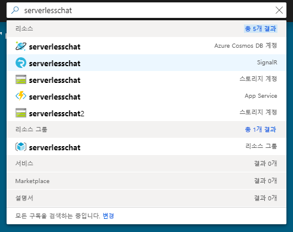
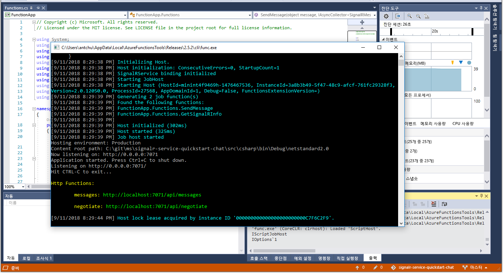

# <a name="quickstart-create-a-chat-room-with-azure-functions-and-signalr-service-using-c"></a>빠른 시작: C\#을 사용하여 Azure Functions와 SignalR Service로 대화방 만들기

Azure SignalR Service를 사용하면 애플리케이션에 실시간 기능을 쉽게 추가할 수 있습니다. Azure Functions는 인프라를 관리하지 않고 코드를 실행할 수 있는 서버리스 플랫폼입니다. 이 빠른 시작에서는 SignalR Serivces와 Functions를 사용하여 서버리스, 실시간 대화 애플리케이션을 빌드하는 방법에 대해 알아봅니다.

## <a name="prerequisites"></a>필수 조건

Visual Studio 2019가 아직 설치되지 않은 경우 **체험판** [Visual Studio 2019 Community Edition](https://www.visualstudio.com/downloads/)을 다운로드하고 사용할 수 있습니다. Visual Studio를 설치하는 동안 **Azure 개발**을 사용하도록 설정합니다.

[Azure Functions Core Tools(v2)](https://github.com/Azure/azure-functions-core-tools#installing), [.NET Core SDK](https://dotnet.microsoft.com/download) 및 즐겨 찾는 코드 편집기를 사용하여 명령줄(macOS, Windows 또는 Linux)에서 이 자습서를 실행할 수도 있습니다.

[!INCLUDE [quickstarts-free-trial-note](../../includes/quickstarts-free-trial-note.md)]

## <a name="log-in-to-azure"></a>Azure에 로그인

Azure 계정을 사용하여 <https://portal.azure.com/>에서 Azure Portal에 로그인합니다.

[!INCLUDE [Create instance](includes/signalr-quickstart-create-instance.md)]

[!INCLUDE [Clone application](includes/signalr-quickstart-clone-application.md)]

## <a name="configure-and-run-the-azure-function-app"></a>Azure Function 앱을 구성하고 실행합니다.

1. Visual Studio(또는 다른 코드 편집기)를 시작하고 복제된 리포지토리의 *src/chat/csharp* 폴더에서 솔루션을 엽니다.

1. Azure Portal이 열리는 브라우저에서, 포털의 맨 위에 있는 검색 상자에서 해당 이름을 검색하여 이전에 배포한 SignalR Service 인스턴스를 성공적으로 만들었는지 확인합니다. 인스턴스를 선택하여 엽니다.

    

1. SignalR Service 인스턴스의 연결 문자열을 보려면 **키**를 선택합니다.

1. 기본 연결 문자열을 선택하여 복사합니다.

1. 다시 Visual Studio의 솔루션 탐색기에서 *local.settings.sample.json*의 이름을 *local.settings.json*으로 바꿉니다.

1. **local.settings.json** 에서 연결 문자열을 **AzureSignalRConnectionString** 설정 값에 붙여넣습니다. 파일을 저장합니다.

1. **Functions.cs**를 엽니다. 이 함수 앱에서는 두 개의 HTTP 트리거 함수가 있습니다.

    - **GetSignalRInfo** - *SignalRConnectionInfo* 입력 바인딩을 사용하여 올바른 연결 정보를 생성하고 리턴합니다.
    - **SendMessage** - 요청 본문에서 대화 메시지를 수신하고 *SignalR* 출력 바인딩을 사용하여 모든 연결된 클라이언트 애플리케이션으로 메시지를 브로드캐스트합니다.

1. 다음 옵션 중 하나를 사용하여 Azure Function App을 로컬로 시작합니다.

    - **Visual Studio**: *디버그* 메뉴에서 *디버깅 시작*을 선택하여 애플리케이션을 실행합니다.

        

    - **명령줄**: 다음 명령을 실행하여 함수 호스트를 시작합니다.

        ```bash
        func start
        ```

[!INCLUDE [Run web application](includes/signalr-quickstart-run-web-application.md)]

[!INCLUDE [Cleanup](includes/signalr-quickstart-cleanup.md)]

## <a name="next-steps"></a>다음 단계

이 빠른 시작에서는 Visual Studio에서 실시간 서버리스 애플리케이션을 빌드하고 실행했습니다. 그런 다음 Visual Studio를 사용하여 Azure Functions를 개발하고 배포하는 방법에 대해 자세히 알아보세요.

> [!div class="nextstepaction"]
> [Visual Studio를 사용하여 Azure Functions 개발](../azure-functions/functions-develop-vs.md)