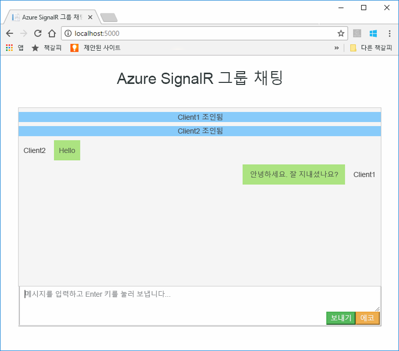
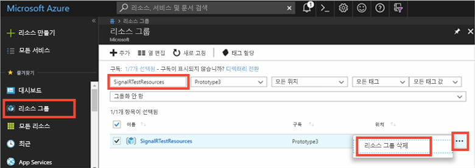

# <a name="quickstart-create-a-chat-room-by-using-signalr-service"></a>빠른 시작: SignalR Service를 사용하여 대화방 만들기


Azure SignalR Service는 개발자가 실시간 기능으로 손쉽게 웹 애플리케이션을 빌드할 수 있게 하는 Azure 서비스입니다. 이 서비스는 [ASP.NET Core 2.0용 SignalR](https://docs.microsoft.com/aspnet/core/signalr/introduction)을 기준으로 합니다.

이 문서에서는 Azure SignalR Service를 시작하는 방법을 보여줍니다. 이 빠른 시작에서는 ASP.NET Core MVC 웹앱을 사용하여 채팅 애플리케이션을 만듭니다. 이 앱은 Azure SignalR Service 리소스와 연결하여 실시간 콘텐츠 업데이트를 사용하도록 설정합니다. 웹 애플리케이션을 로컬로 호스팅하고 여러 브라우저 클라이언트에 연결합니다. 각 클라이언트는 다른 모든 클라이언트에 콘텐츠 업데이트 푸시할 수 있습니다. 

이 빠른 시작의 단계를 완료하려면 아무 코드 편집기나 사용할 수 있습니다. 한 가지 옵션은 Windows, macOS 및 Linux 플랫폼에서 사용할 수 있는 [Visual Studio Code](https://code.visualstudio.com/)입니다.

이 자습서에 대한 코드는 [AzureSignalR-samples GitHub 리포지토리](https://github.com/aspnet/AzureSignalR-samples/tree/master/samples/ChatRoom)에서 다운로드할 수 있습니다. 또한 [SignalR Service 만들기 스크립트](scripts/signalr-cli-create-service.md)를 수행하여 이 빠른 시작에 사용되는 Azure 리소스를 만들 수도 있습니다.

[!INCLUDE [quickstarts-free-trial-note](../../includes/quickstarts-free-trial-note.md)]


## <a name="prerequisites"></a>필수 조건

* [.NET Core SDK](https://www.microsoft.com/net/download/windows)를 설치합니다.
* [AzureSignalR-sample](https://github.com/aspnet/AzureSignalR-samples) GitHub 리포지토리를 다운로드하거나 복제합니다. 

## <a name="create-an-azure-signalr-resource"></a>Azure SignalR 리소스 만들기

[!INCLUDE [azure-signalr-create](../../includes/signalr-create.md)]

## <a name="create-an-aspnet-core-web-app"></a>ASP.NET Core 웹앱 만들기

이 섹션에서는 [.NET Core CLI(명령줄 인터페이스)](https://docs.microsoft.com/dotnet/core/tools/)를 사용하여 새 ASP.NET Core MVC 웹앱 프로젝트를 만듭니다. Visual Studio 대신 .NET Core CLI를 사용하면 Windows, macOS 및 Linux 플랫폼에서 사용할 수 있다는 이점이 있습니다. 

1. 프로젝트 폴더를 만듭니다. 이 빠른 시작에서는 *E:\Testing\chattest* 폴더를 사용합니다.

2. 새 폴더에서 다음 명령을 실행하여 프로젝트를 만듭니다.

        dotnet new mvc


## <a name="add-secret-manager-to-the-project"></a>프로젝트에 암호 관리자 추가

이 섹션에서는 [비밀 관리자 도구](https://docs.microsoft.com/aspnet/core/security/app-secrets)를 프로젝트에 추가합니다. 비밀 관리자 도구는 개발 작업용 중요 데이터를 프로젝트 트리 외부에 저장합니다. 이 방법을 사용하면 소스 코드에서 앱 비밀을 실수로 공유하지 못하도록 방지할 수 있습니다.

1. *.csproj* 파일을 엽니다. *Microsoft.Extensions.SecretManager.Tools*를 포함할 `DotNetCliToolReference` 요소를 추가합니다. 또한 *chattest.csproj*에 대한 다음 코드와 같이 `UserSecretsId` 요소를 추가하고 파일을 저장합니다.

    ```xml
    <Project Sdk="Microsoft.NET.Sdk.Web">
    <PropertyGroup>
        <TargetFramework>netcoreapp2.0</TargetFramework>
        <UserSecretsId>SignalRChatRoomEx</UserSecretsId>
    </PropertyGroup>
    <ItemGroup>
        <PackageReference Include="Microsoft.AspNetCore.All" Version="2.0.0" />
    </ItemGroup>
    <ItemGroup>
        <DotNetCliToolReference Include="Microsoft.VisualStudio.Web.CodeGeneration.Tools" Version="2.0.0" />
        <DotNetCliToolReference Include="Microsoft.Extensions.SecretManager.Tools" Version="2.0.0" />
    </ItemGroup>
    </Project>    
    ```

## <a name="add-azure-signalr-to-the-web-app"></a>웹앱에 Azure SignalR 추가

1. 다음 명령을 실행하여 `Microsoft.Azure.SignalR` NuGet 패키지에 대한 참조를 추가합니다.

        dotnet add package Microsoft.Azure.SignalR

2. 다음 명령을 실행하여 프로젝트에 대한 패키지를 복원합니다.

        dotnet restore

3. *Azure:SignalR:ConnectionString*이라는 암호를 암호 관리자에 추가합니다. 

    이 암호는 SignalR Service 리소스에 액세스하기 위한 연결 문자열을 포함합니다. *Azure:SignalR:ConnectionString*은 SignalR에서 연결을 설정하기 위해 찾는 기본 구성 키입니다. 다음 명령의 값을 SignalR Service 리소스에 대한 연결 문자열로 바꿉니다.

    이 명령은 *.csproj* 파일과 동일한 디렉터리에서 실행해야 합니다.

    ```
    dotnet user-secrets set Azure:SignalR:ConnectionString "<Your connection string>"    
    ```

    비밀 관리자는 로컬로 호스팅되는 동안 웹앱을 테스트하는 데만 사용됩니다. 자습서의 뒷부분에서는 채팅 웹앱을 Azure에 배포합니다. 웹앱이 Azure에 배포되면 비밀 관리자를 통해 연결 문자열을 저장하는 대신 애플리케이션 설정을 사용합니다.

    이 비밀은 구성 API를 사용하여 액세스됩니다. 콜론(:)은 지원되는 모든 플랫폼에서 구성 API를 통해 구성 이름에서 작동합니다. [환경별 구성](https://docs.microsoft.com/aspnet/core/fundamentals/configuration/index?tabs=basicconfiguration&view=aspnetcore-2.0)을 참조하세요. 


4. *Startup.cs*를 열고, `services.AddSignalR().AddAzureSignalR()` 메서드를 호출하여 Azure SignalR 서비스를 사용하도록 `ConfigureServices` 메서드를 업데이트합니다.

    ```csharp
    public void ConfigureServices(IServiceCollection services)
    {
        services.AddMvc();
        services.AddSignalR().AddAzureSignalR();
    }
    ```

    매개 변수를 `AddAzureSignalR()`에 전달하지 않으면 이 코드에서 SignalR Service 리소스 연결 문자열에 대한 기본 구성 키를 사용합니다. 기본 구성 키는 *Azure:SignalR:ConnectionString*입니다

5. 또한 *Startup.cs*에서 `app.UseStaticFiles()` 호출을 다음 코드로 바꾸어 `Configure` 메서드를 업데이트한 후 파일을 저장합니다.

    ```csharp
    app.UseFileServer();
    app.UseAzureSignalR(routes =>
    {
        routes.MapHub<Chat>("/chat");
    });
    ```            

### <a name="add-a-hub-class"></a>허브 클래스 추가

SignalR에서 허브는 클라이언트에서 호출할 수 있는 메서드 세트를 공개하는 핵심 구성 요소입니다. 이 섹션에서는 다음 두 가지 방법으로 허브 클래스를 정의합니다. 

* `Broadcast`: 이 메서드는 모든 클라이언트에 메시지를 브로드캐스트합니다.
* `Echo`: 이 메서드는 호출자에게 메시지를 보냅니다.

두 메서드는 모두 ASP.NET Core SignalR SDK에서 제공하는 `Clients` 인터페이스를 사용합니다. 이 인터페이스를 통해 연결된 모든 클라이언트에 액세스할 수 있으므로 콘텐츠를 클라이언트로 푸시할 수 있습니다.

1. 프로젝트 디렉터리에서 *Hub*라는 새 폴더를 추가합니다. *Chat.cs*라는 새 허브 코드 파일을 새 폴더에 추가합니다.

2. 다음 코드를 *Chat.cs*에 추가하여 허브 클래스를 정의하고 파일을 저장합니다. 

    *chattest*와는 다른 프로젝트 이름을 사용한 경우 이 클래스에 대한 네임스페이스를 업데이트합니다.

    ```csharp
    using Microsoft.AspNetCore.SignalR;

    namespace chattest
    {

        public class Chat : Hub
        {
            public void BroadcastMessage(string name, string message)
            {
                Clients.All.SendAsync("broadcastMessage", name, message);
            }

            public void Echo(string name, string message)
            {
                Clients.Client(Context.ConnectionId).SendAsync("echo", name, message + " (echo from server)");
            }
        }
    }
    ```

### <a name="add-the-client-interface-for-the-web-app"></a>웹앱용 클라이언트 인터페이스 추가

이 대화방 앱용 클라이언트 사용자 인터페이스는 *wwwroot* 디렉터리의 *index.html* 파일에 HTML 및 JavaScript로 구성됩니다.

[샘플 리포지토리](https://github.com/aspnet/AzureSignalR-samples/tree/master/samples/ChatRoom/wwwroot)의 *wwwroot* 폴더에서 *index.html* 파일, *css* 폴더 및 *scripts* 폴더를 복사합니다. 프로젝트의 *wwwroot* 폴더에 붙여넣습니다.

*index.html*의 기본 코드는 다음과 같습니다. 

```javascript
var connection = new signalR.HubConnectionBuilder()
                            .withUrl('/chat')
                            .build();
bindConnectionMessage(connection);
connection.start()
    .then(function () {
        onConnected(connection);
    })
    .catch(function (error) {
        console.error(error.message);
    });
```    

*index.html*의 코드는 `HubConnectionBuilder.build()`를 호출하여 Azure SignalR 리소스에 대한 HTTP 연결을 수행합니다.

연결이 성공적이면 해당 연결이 `bindConnectionMessage`로 전달되고, 들어오는 콘텐츠의 클라이언트 푸시를 위한 이벤트 처리기가 추가됩니다. 

`HubConnection.start()`는 허브와의 통신을 시작합니다. 그런 다음, `onConnected()`에서 단추 이벤트 처리기를 추가합니다. 이러한 처리기는 연결을 사용하여 이 클라이언트가 연결된 모든 클라이언트에 콘텐츠 업데이트를 푸시할 수 있도록 합니다.

## <a name="add-a-development-runtime-profile"></a>개발 런타임 프로필 추가

이 섹션에서는 ASP.NET Core용 개발 런타임 환경을 추가합니다. 자세한 내용은 [ASP.NET Core에서 여러 환경 사용](https://docs.microsoft.com/aspnet/core/fundamentals/environments)을 참조하세요.

1. *Properties*라는 폴더를 프로젝트에 만듭니다.

2. 다음 내용이 포함된 *launchSettings.json*이라는 새 파일을 폴더에 추가하고 파일을 저장합니다.

    ```json
    {
        "profiles" : 
        {
            "ChatRoom": 
            {
                "commandName": "Project",
                "launchBrowser": true,
                "environmentVariables": 
                {
                    "ASPNETCORE_ENVIRONMENT": "Development"
                },
                "applicationUrl": "http://localhost:5000/"
            }
        }
    }
    ```


## <a name="build-and-run-the-app-locally"></a>로컬로 앱 빌드 및 실행

1. .NET Core CLI를 사용하여 앱을 빌드하려면 명령 셸에서 다음 명령을 실행합니다.

        dotnet build

2. 빌드가 성공적으로 완료되면 다음 명령을 실행하여 웹앱을 로컬로 실행합니다.

        dotnet run

    앱은 개발 런타임 프로필에 구성된 대로 5000 포트에서 로컬로 호스팅됩니다.

        E:\Testing\chattest>dotnet run
        Hosting environment: Development
        Content root path: E:\Testing\chattest
        Now listening on: http://localhost:5000
        Application started. Press Ctrl+C to shut down.    

3. 두 개의 브라우저 창을 엽니다. 각 브라우저에서 `http://localhost:5000`으로 이동합니다. 이름을 입력하라는 메시지가 표시됩니다. 두 클라이언트에 대한 클라이언트 이름을 입력하고, **보내기** 단추를 사용하여 두 클라이언트 간의 메시지 콘텐츠 푸시를 테스트합니다.

    


## <a name="clean-up-resources"></a>리소스 정리

다음 자습서로 계속 진행하려면 이 빠른 시작에서 만든 리소스를 유지하여 다시 사용할 수 있습니다.

빠른 시작 샘플 애플리케이션의 사용이 완료되면 요금이 청구되지 않도록 이 빠른 시작에서 만든 Azure 리소스를 삭제할 수 있습니다. 

> [!IMPORTANT]
> 리소스 그룹을 삭제하면 되돌릴 수 없으며 해당 그룹의 모든 리소스가 포함됩니다. 잘못된 리소스 그룹 또는 리소스를 자동으로 삭제하지 않도록 해야 합니다. 유지하려는 리소스가 포함된 기존 리소스 그룹에 이 샘플을 호스팅하는 리소스를 만든 경우 리소스 그룹을 삭제하는 대신, 해당 블레이드에서 각 리소스를 개별적으로 삭제할 수 있습니다.
> 
> 

[Azure Portal](https://portal.azure.com)에 로그인하고 **리소스 그룹**을 선택합니다.

**이름으로 필터링** 텍스트 상자에서 리소스 그룹의 이름을 입력합니다. 이 빠른 시작의 지침에서는 *SignalRTestResources*라는 리소스 그룹을 사용합니다. 결과 목록의 리소스 그룹에서 줄임표( **...** ) > **리소스 그룹 삭제**를 차례로 선택합니다.

   



리소스 그룹 삭제를 확인하는 메시지가 표시됩니다. 리소스 그룹의 이름을 입력하여 확인하고 **삭제**를 선택합니다.
   
잠시 후, 리소스 그룹 및 모든 해당 리소스가 삭제됩니다.


## <a name="next-steps"></a>다음 단계

이 빠른 시작에서는 새 Azure SignalR Service 리소스를 만들었습니다. 그런 다음, ASP.NET Core 웹앱에서 이를 사용하여 콘텐츠 업데이트를 연결된 여러 클라이언트에 실시간으로 푸시했습니다. Azure SignalR Service를 사용하는 방법을 자세히 알아보려면 인증을 시연하는 다음 자습서로 계속 진행하세요.

> [!div class="nextstepaction"]
> [Azure SignalR Service 인증](./signalr-concept-authenticate-oauth.md)


