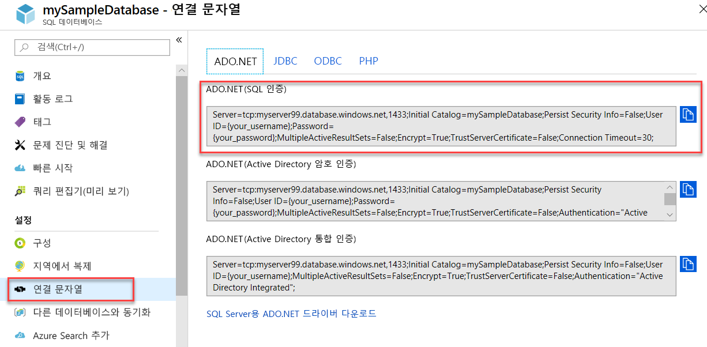

# Azure SQL Database와 Azure SQL Managed Instance 연결 및 쿼리 문서
[!INCLUDE[appliesto-sqldb-sqlmi](../includes/appliesto-sqldb-sqlmi.md)]

다음 문서는 Azure SQL Database 및 Azure SQL Managed Instance에 연결하고 쿼리하는 방법을 보여주는 Azure 예제에 대한 링크를 포함합니다. 전송 수준 보안과 관련된 몇 가지 권장 사항은 [데이터베이스 연결에 대한 TLS 고려 사항](#tls-considerations-for-database-connectivity)을 참조하세요.

## 빠른 시작

| 빠른 시작 | Description |
|---|---|
|[SQL Server Management Studio](connect-query-ssms.md)|이 빠른 시작은 SSMS를 사용하여 데이터베이스에 연결한 다음, Transact-SQL 문을 사용하여 데이터베이스에서 데이터를 쿼리, 삽입, 업데이트 및 삭제하는 방법을 보여 줍니다.|
|[Azure Data Studio](/sql/azure-data-studio/quickstart-sql-database?toc=%2fazure%2fsql-database%2ftoc.json)|이 빠른 시작에서는 Azure Data Studio를 사용하여 데이터베이스에 연결한 다음, T-SQL(Transact-SQL) 문을 사용하여 Azure Data Studio 자습서에서 사용할 TutorialDB를 만드는 방법을 보여 줍니다.|
|[Azure Portal](connect-query-portal.md)|이 빠른 시작에서는 쿼리 편집기를 사용하여 데이터베이스(Azure SQL Database만)에 연결한 다음, Transact-SQL 문을 사용하여 데이터베이스에서 데이터를 쿼리, 삽입, 업데이트 및 삭제하는 방법을 보여 줍니다.|
|[Visual Studio Code](connect-query-vscode.md)|이 빠른 시작은 Visual Studio 코드를 사용하여 데이터베이스에 연결한 다음, Transact-SQL 문을 사용하여 데이터베이스에서 데이터를 쿼리, 삽입, 업데이트 및 삭제하는 방법을 보여 줍니다.|
|[Visual Studio에서 .NET 사용](connect-query-dotnet-visual-studio.md)|이 빠른 시작에서는 .NET Framework를 사용하여 Visual Studio에서 C# 프로그램을 만들어 데이터베이스에 연결하고, Transact-SQL 문을 사용하여 데이터를 쿼리하는 방법을 보여 줍니다.|
|[.NET Core](connect-query-dotnet-core.md)|이 빠른 시작에서는 Windows/Linux/macOS에서 .NET Core를 사용하여 데이터베이스에 연결하고, Transact-SQL 문을 사용하여 데이터를 쿼리하는 C# 프로그램을 만드는 방법을 보여 줍니다.|
|[Go](connect-query-go.md)|이 빠른 시작에서는 Go를 사용하여 데이터베이스에 연결하는 방법을 보여 줍니다. 데이터 쿼리 및 수정을 위한 Transact SQL 문도 보여 줍니다.|
|[Java](connect-query-java.md)|이 빠른 시작에서는 Java를 사용하여 데이터베이스에 연결한 다음, Transact-SQL 문을 사용하여 데이터를 쿼리하는 방법을 보여 줍니다.|
|[Node.JS](connect-query-nodejs.md)|이 빠른 시작에서는 Node.js를 사용하여 데이터베이스에 연결하고, Transact-SQL 문을 사용하여 데이터를 쿼리하는 프로그램을 만드는 방법을 보여 줍니다.|
|[PHP](connect-query-php.md)|이 빠른 시작에서는 PHP를 사용하여 데이터베이스에 연결하고, Transact-SQL 문을 사용하여 데이터를 쿼리하는 프로그램을 만드는 방법을 보여 줍니다.|
|[Python](connect-query-python.md)|이 빠른 시작에서는 Python을 사용하여 데이터베이스에 연결하고 Transact-SQL 문을 사용하여 데이터를 쿼리하는 방법을 보여 줍니다. |
|[Ruby](connect-query-ruby.md)|이 빠른 시작에서는 Ruby를 사용하여 데이터베이스에 연결하고, Transact-SQL 문을 사용하여 데이터를 쿼리하는 프로그램을 만드는 방법을 보여 줍니다.|
|[R](connect-query-r.md)|이 빠른 시작에서는 Azure SQL Database Machine Learning Services에서 R을 사용하여 Azure SQL Database의 데이터베이스에 연결하고, Transact-SQL 문을 사용하여 데이터를 쿼리하는 프로그램을 만드는 방법을 보여줍니다.|
|||

## 서버 연결 정보 가져오기

Azure SQL Database의 데이터베이스에 연결하는 데 필요한 연결 정보를 가져옵니다. 다음 절차를 수행하려면 정규화된 서버 이름이나 호스트 이름, 데이터베이스 이름 및 로그인 정보가 필요합니다.

1. [Azure Portal](https://portal.azure.com/)에 로그인합니다.

2. **SQL Databases** 또는 **SQL Managed Instances** 페이지로 이동합니다.

3. **개요** 페이지에서 Azure SQL Database의 데이터베이스에 대한 **서버 이름** 옆에 있는 정규화된 서버 이름 또는 Azure VM의 Azure SQL Managed Instance 또는 SQL Server에 대한 **호스트** 옆에 있는 정규화된 서버 이름(또는 IP 주소)을 검토합니다. 서버 이름이나 호스트 이름을 복사하려면 마우스로 해당 이름 위를 가리키고 **복사** 아이콘을 선택합니다.

> [!NOTE]
> Azure VM의 SQL Server에 대한 연결 정보는 [SQL Server 인스턴스에 연결](../virtual-machines/windows/sql-vm-create-portal-quickstart.md#connect-to-sql-server)을 참조하세요.

## ADO.NET 연결 정보 가져오기(선택 사항 - SQL Database 전용)

1. Azure Portal의 데이터베이스 블레이드로 이동하고 **설정** 아래에서 **연결 문자열** 을 선택합니다.

2. **ADO.NET** 연결 문자열 전체를 검토합니다.

    

3. 사용하려는 경우 **ADO.NET** 연결 문자열을 복사합니다.

## 데이터베이스 연결에 대한 TLS 고려 사항

TLS(전송 계층 보안)는 Microsoft가 Azure SQL Database의 데이터베이스 또는 Azure SQL Managed Instance에 대한 연결을 위해 제공하거나 지원하는 모든 드라이버에서 사용됩니다. 특별한 구성은 필요하지 않습니다. SQL Server 인스턴스, Azure SQL Database의 데이터베이스 또는 Azure SQL Managed Instance 인스턴스에 대한 모든 연결의 경우 모든 애플리케이션에서 다음 구성 또는 해당 사항을 설정하는 것이 좋습니다.

- **Encrypt = On**
- **TrustServerCertificate = Off**

일부 시스템은 해당 구성 키워드에 대해 각기 다르지만 해당 키워드를 사용합니다. 이러한 구성은 클라이언트 드라이버에서 서버에서 받은 TLS 인증서의 ID를 확인하도록 합니다.

또한 PCI-DSS(Payment Card Industry - Data Security Standard)를 준수해야 하는 경우 클라이언트에서 TLS 1.1 및 1.0을 비활성화하는 것이 좋습니다.

타사 드라이버는 기본적으로 TLS를 사용할 수 있습니다. Azure SQL Database 또는 Azure SQL Managed Instance에 연결 시 고려해 볼 수 있습니다. 포함된 드라이버가 있는 애플리케이션은 이러한 연결 설정을 제어하도록 허용할 수 없습니다. 중요한 데이터와 상호 작용하는 시스템에서 사용하기 전에 이러한 드라이버와 애플리케이션의 보안을 검사하는 것이 좋습니다.

## 라이브러리

다양한 라이브러리 및 프레임워크를 사용하여 Azure SQL Database 또는 Azure SQL Managed Instance에 연결할 수 있습니다. C#, Java, Node.js, PHP 및 Python과 같은 프로그래밍 언어를 빠르게 시작하려면 [자습서 시작](https://aka.ms/sqldev)을 확인하세요. 그런 다음 Linux 또는 Windows 또는 macOS의 Docker에서 SQL Server를 사용하여 앱을 빌드합니다.

다음 표는 클라이언트 애플리케이션이 다양한 언어를 사용하여 온-프레미스 또는 클라우드에서 실행 중인 SQL Server에 연결하고 사용할 수 있는 연결 라이브러리 또는 *드라이버* 를 나열합니다. Linux, Windows 또는 Docker에서 사용 가능하며 Azure SQL Database, Azure SQL Managed Instance 및 Azure Synapse Analytics에 연결할 때 사용할 수 있습니다.

| 언어 | 플랫폼 | 추가 리소스 | 다운로드 | 시작하기 |
| :-- | :-- | :-- | :-- | :-- |
| C# | Windows, Linux, macOS | [Microsoft ADO.NET for SQL Server](/sql/connect/ado-net/microsoft-ado-net-sql-server) | [다운로드](https://www.microsoft.com/net/download/) | [시작](https://www.microsoft.com/sql-server/developer-get-started/csharp/ubuntu)
| Java | Windows, Linux, macOS | [SQL Server용 Microsoft JDBC 드라이버](/sql/connect/jdbc/microsoft-jdbc-driver-for-sql-server/) | [다운로드](/sql/connect/jdbc/download-microsoft-jdbc-driver-for-sql-server) |  [시작](https://www.microsoft.com/sql-server/developer-get-started/java/ubuntu)
| PHP | Windows, Linux, macOS| [SQL Server용 PHP SQL 드라이버](/sql/connect/php/microsoft-php-driver-for-sql-server) | [다운로드](/sql/connect/php/download-drivers-php-sql-server) | [시작](https://www.microsoft.com/sql-server/developer-get-started/php/ubuntu/)
| Node.js | Windows, Linux, macOS | [SQL Server용 Node.js 드라이버](/sql/connect/node-js/node-js-driver-for-sql-server/) | [설치](/sql/connect/node-js/step-1-configure-development-environment-for-node-js-development/) |  [시작](https://www.microsoft.com/sql-server/developer-get-started/node/ubuntu)
| Python | Windows, Linux, macOS | [Python SQL 드라이버](/sql/connect/python/python-driver-for-sql-server/) | 다음 선택 항목을 설치합니다.   \* [pymssql](/sql/connect/python/pymssql/step-1-configure-development-environment-for-pymssql-python-development/)   \* [pyodbc](/sql/connect/python/pyodbc/step-1-configure-development-environment-for-pyodbc-python-development/) |  [시작](https://www.microsoft.com/sql-server/developer-get-started/python/ubuntu)
| Ruby | Windows, Linux, macOS | [SQL Server용 Ruby 드라이버](/sql/connect/ruby/ruby-driver-for-sql-server/) | [설치](/sql/connect/ruby/step-1-configure-development-environment-for-ruby-development/) | [시작](https://www.microsoft.com/sql-server/developer-get-started/ruby/ubuntu)
| C++ | Windows, Linux, macOS | [Microsoft ODBC driver for SQL Server](/sql/connect/odbc/microsoft-odbc-driver-for-sql-server/) | [다운로드](/sql/connect/odbc/microsoft-odbc-driver-for-sql-server/) |  

다음 표는 클라이언트 애플리케이션이 SQL Server, Azure SQL Database, Azure SQL Managed Instance 또는 Azure Synapse Analytics에서 사용할 수 있는 ORM(개체-관계형 매핑) 프레임워크 및 웹 프레임워크의 예를 나열합니다. Linux, Windows 또는 Docker에서 프레임워크를 사용할 수 있습니다.

| 언어 | 플랫폼 | ORM |
| :-- | :-- | :-- |
| C# | Windows, Linux, macOS | [Entity Framework](/ef) [Entity Framework Core](/ef/core/index) |
| Java | Windows, Linux, macOS |[Hibernate ORM](https://hibernate.org/orm)|
| PHP | Windows, Linux, macOS | [Laravel(Eloquent)](https://laravel.com/docs/eloquent) [Doctrine](https://www.doctrine-project.org/projects/orm.html) |
| Node.js | Windows, Linux, macOS | [Sequelize ORM](https://sequelize.org/) |
| Python | Windows, Linux, macOS |[Django](https://www.djangoproject.com/) |
| Ruby | Windows, Linux, macOS | [Ruby on Rails](https://rubyonrails.org/) |
||||

## 다음 단계

- 연결 아키텍처 정보는 [Azure SQL Database 연결 아키텍처](connectivity-architecture.md)를 참조하세요.
- 클라이언트 애플리케이션에서 연결하는 데 사용되는 [SQL Server 드라이버](/sql/connect/sql-connection-libraries/)를 찾습니다.
- Azure SQL Database 또는 Azure SQL Managed Instance에 연결합니다.
  - [.NET(C#)을 사용한 연결 및 쿼리](connect-query-dotnet-core.md)
  - [PHP를 사용한 연결 및 쿼리](connect-query-php.md)
  - [Node.js를 사용한 연결 및 쿼리](connect-query-nodejs.md)
  - [Java를 사용한 연결 및 쿼리](connect-query-java.md)
  - [Python을 사용한 연결 및 쿼리](connect-query-python.md)
  - [Ruby를 사용한 연결 및 쿼리](connect-query-ruby.md)
  - [Linux에 SQL Server 명령줄 도구인 sqlcmd 및 bcp 설치](/sql/linux/sql-server-linux-setup-tools) - Linux 사용자의 경우 [sqlcmd](/sql/ssms/scripting/sqlcmd-use-the-utility)를 사용하여 Azure SQL Database 또는 Azure SQL Managed Instance에 연결해보세요.
- 재시도 로직 코드 예제:
  - [ADO.NET을 사용하여 탄력적으로 연결][step-4-connect-resiliently-to-sql-with-ado-net-a78n]
  - [PHP를 사용하여 탄력적으로 연결][step-4-connect-resiliently-to-sql-with-php-p42h]

<!-- Link references. -->

[step-4-connect-resiliently-to-sql-with-ado-net-a78n]: /sql/connect/ado-net/step-4-connect-resiliently-sql-ado-net

[step-4-connect-resiliently-to-sql-with-php-p42h]: /sql/connect/php/step-4-connect-resiliently-to-sql-with-php
