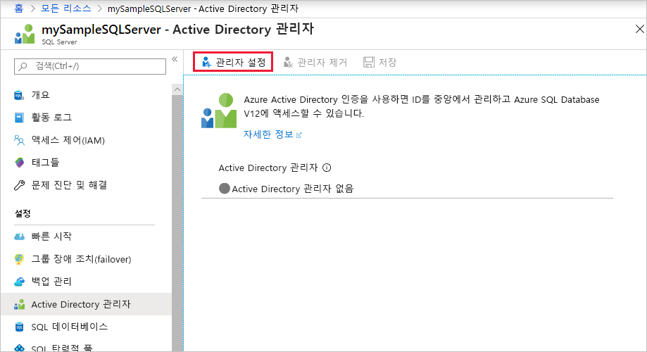
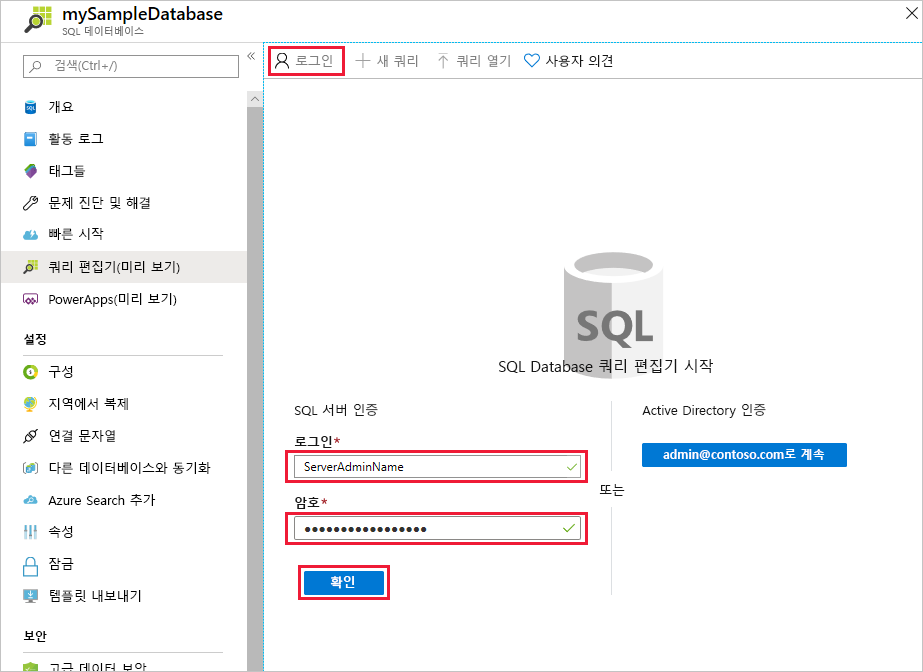
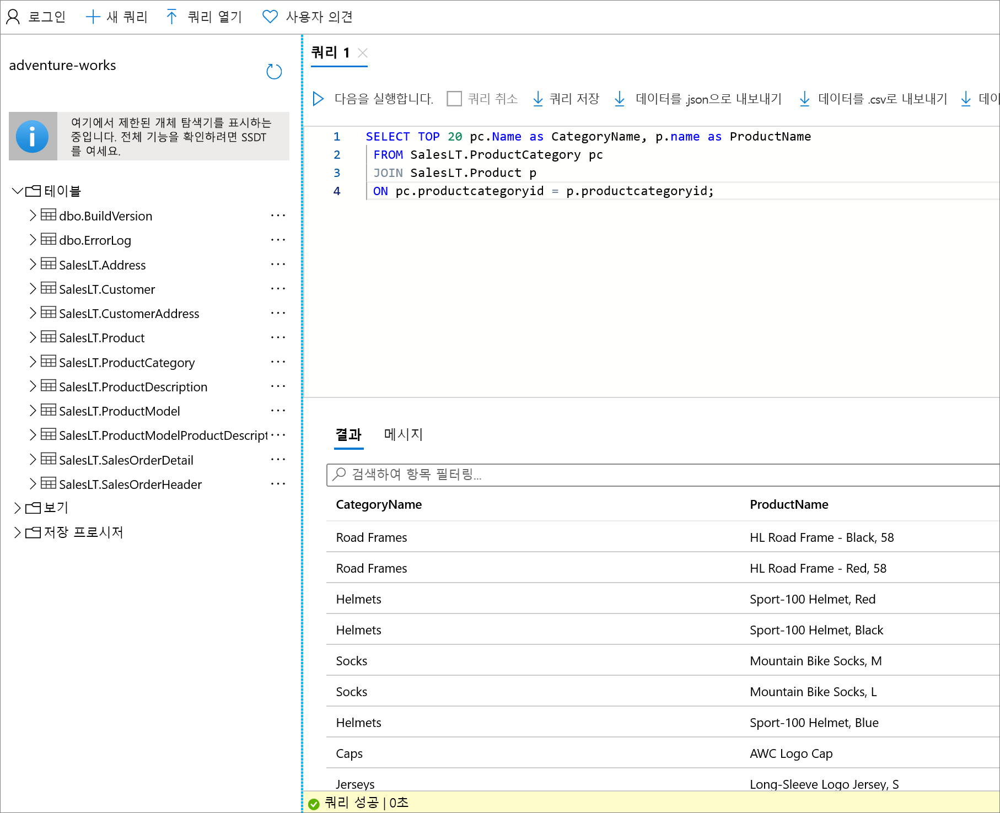

# <a name="quickstart-use-the-azure-portals-query-editor-preview-to-query-an-azure-sql-database"></a>빠른 시작: Azure Portal의 쿼리 편집기(미리 보기)를 사용하여 Azure SQL Database 쿼리
[!INCLUDE[appliesto-sqldb](../includes/appliesto-sqldb.md)]

쿼리 편집기는 Azure SQL Database의 데이터베이스 또는 Azure Synapse Analytics의 데이터 웨어하우스에 대해 SQL 쿼리를 실행하는 데 사용되는 Azure Portal 도구입니다.

이 빠른 시작에서는 쿼리 편집기를 사용하여 데이터베이스에 대해 Transact-SQL(T-SQL) 쿼리를 실행합니다.

## <a name="prerequisites"></a>필수 구성 요소

### <a name="create-a-database-with-sample-data"></a>샘플 데이터로 데이터베이스 만들기

이 빠른 시작을 완료하려면 AdventureWorksLT 샘플 데이터베이스가 필요합니다. SQL Database의 AdventureWorksLT 샘플 데이터베이스의 작업 복사본이 없는 경우 다음 빠른 시작을 활용하여 신속하게 만들 수 있습니다.

[빠른 시작: Azure Portal, PowerShell 또는 Azure CLI를 사용하여 Azure SQL Database의 데이터베이스 만들기](single-database-create-quickstart.md)

### <a name="set-an-azure-active-directory-admin-for-the-server-optional"></a>서버에 대한 Azure Active Directory 관리자 설정(선택 사항)

Azure Active Directory(Azure AD) 관리자를 구성하면 단일 ID를 사용하여 Azure Portal과 데이터베이스에 로그인할 수 있습니다. Azure AD를 사용하여 쿼리 편집기에 연결하려는 경우 아래 단계를 수행합니다.

이 프로세스는 선택 사항이며, 대신 SQL 인증을 사용하여 쿼리 편집기에 연결할 수 있습니다.

> [!NOTE]
> * 이메일 계정(예: outlook.com, gmail.com, yahoo.com 등)은 아직 Azure AD 관리자로 지원되지 않습니다. Azure AD에서 기본적으로 만들어지거나 Azure AD에 페더레이션된 사용자를 선택해야 합니다.
> * Azure AD 관리자 로그인은 2단계 인증을 사용하는 계정에서 작동하지만 쿼리 편집기는 2단계 인증을 지원하지 않습니다.

1. Azure Portal에서 SQL 데이터베이스 서버로 이동합니다.

2. **SQL 서버** 메뉴에서 **Active Directory 관리자** 를 선택합니다.

3. SQL Server **Active Directory 관리자** 페이지 도구 모음에서 **관리자 설정** 을 선택합니다.

    

4. **관리자 추가** 페이지의 검색 상자에서 찾을 사용자나 그룹을 입력하고 관리자 권한으로 선택한 다음, **선택** 단추를 선택합니다.

5. 다시 SQL Server **Active Directory 관리자** 페이지 도구 모음에서 **저장** 을 선택합니다.

## <a name="using-sql-query-editor"></a>SQL 쿼리 편집기 사용

1. [Azure Portal](https://portal.azure.com/)에 로그인하고 쿼리하려는 데이터베이스를 선택합니다.

2. **SQL 데이터베이스** 메뉴에서 **쿼리 편집기(미리 보기)** 를 선택합니다.

    

### <a name="establish-a-connection-to-the-database"></a>데이터베이스에 대한 연결 설정

포털에 로그인되어 있더라도 데이터베이스에 액세스하려면 자격 증명을 입력해야 합니다. SQL 인증 또는 Azure Active Directory를 사용하여 데이터베이스에 연결할 수 있습니다.

#### <a name="connect-using-sql-authentication"></a>SQL 인증을 사용하여 연결

1. **로그인** 페이지의 **SQL 서버 인증** 에서 데이터베이스에 대 한 액세스 권한이 있는 사용자의 **로그인** 및 **암호** 를 입력합니다. 잘 모르겠으면 데이터베이스 서버의 서버 관리자 로그인 및 암호를 사용합니다.

    

2. **확인** 을 선택합니다.

#### <a name="connect-using-azure-active-directory"></a>Azure Active Directory를 사용하여 연결

**쿼리 편집기(미리 보기)** 에서 **Active Directory 인증** 섹션의 **로그인** 페이지를 확인합니다. 인증은 자동으로 이루어지므로 데이터베이스에 대한 Azure AD 관리자인 경우 로그인되었다는 메시지가 표시됩니다. 그런 다음, **다음으로 계속** *\<your user or group ID>* 단추를 선택합니다. 성공적으로 로그인되지 않았다는 내용이 페이지에 표시되면 페이지를 새로 고쳐야 할 수도 있습니다.

### <a name="query-a-database-in-sql-database"></a>SQL Database에서 데이터베이스 쿼리

다음 예제 쿼리는 AdventureWorksLT 샘플 데이터베이스에 대해 성공적으로 실행됩니다.

#### <a name="run-a-select-query"></a>SELECT 쿼리 실행

1. 쿼리 편집기에 다음 쿼리를 붙여넣습니다.

   ```sql
    SELECT TOP 20 pc.Name as CategoryName, p.name as ProductName
    FROM SalesLT.ProductCategory pc
    JOIN SalesLT.Product p
    ON pc.productcategoryid = p.productcategoryid;
   ```

2. **실행** 을 선택한 다음, **결과** 창에서 출력을 검토합니다.

   

3. 필요에 따라 쿼리를 .sql 파일로 저장하거나 반환된 데이터를 .json, .csv 또는 .xml 파일로 내보낼 수 있습니다.

#### <a name="run-an-insert-query"></a>INSERT 쿼리 실행

다음 [INSERT](/sql/t-sql/statements/insert-transact-sql/) T-SQL 문을 실행하여 `SalesLT.Product` 테이블에 새 제품을 추가합니다.

1. 이전 쿼리를 다음 쿼리로 바꿉니다.

    ```sql
    INSERT INTO [SalesLT].[Product]
           ( [Name]
           , [ProductNumber]
           , [Color]
           , [ProductCategoryID]
           , [StandardCost]
           , [ListPrice]
           , [SellStartDate]
           )
    VALUES
           ('myNewProduct'
           ,123456789
           ,'NewColor'
           ,1
           ,100
           ,100
           ,GETDATE() );
   ```


2. **실행** 을 선택하여 `Product` 테이블에서 새 행을 삽입합니다. **메시지** 창에 **쿼리 성공: 영향을 받는 행: 1** 이 표시됩니다.


#### <a name="run-an-update-query"></a>UPDATE 쿼리 실행

다음 [UPDATE](/sql/t-sql/queries/update-transact-sql/) T-SQL 문을 실행하여 새 제품을 수정합니다.

1. 이전 쿼리를 다음 쿼리로 바꿉니다.

   ```sql
   UPDATE [SalesLT].[Product]
   SET [ListPrice] = 125
   WHERE Name = 'myNewProduct';
   ```

2. **실행** 을 선택하여 `Product` 테이블에서 지정된 행을 업데이트합니다. **메시지** 창에 **쿼리 성공: 영향을 받는 행: 1** 이 표시됩니다.

#### <a name="run-a-delete-query"></a>DELETE 쿼리 실행

다음 [DELETE](/sql/t-sql/statements/delete-transact-sql/) T-SQL 문을 실행하여 새 제품을 제거합니다.

1. 이전 쿼리를 다음 쿼리로 바꿉니다.

   ```sql
   DELETE FROM [SalesLT].[Product]
   WHERE Name = 'myNewProduct';
   ```

2. **실행** 을 선택하여 `Product` 테이블에서 지정된 행을 삭제합니다. **메시지** 창에 **쿼리 성공: 영향을 받는 행: 1** 이 표시됩니다.


## <a name="troubleshooting-and-considerations"></a>문제 해결 및 고려 사항

쿼리 편집기를 사용할 때 알아야 할 몇 가지 사항이 있습니다.

### <a name="configure-local-network-settings"></a>로컬 네트워크 설정 구성

쿼리 편집기에서 다음 오류 중 하나가 발생하는 경우:
 - *로컬 네트워크 설정 때문에 쿼리 편집기에서 쿼리를 실행하지 못하는 것일 수 있습니다. 네트워크 설정을 구성하는 방법에 대한 지침을 보려면 여기를 클릭하세요.*
 - *서버에 대한 연결을 설정할 수 없습니다. 로컬 방화벽 구성 또는 네트워크 프록시 설정에 문제가 있는 것일 수 있습니다.*

이는 쿼리 편집기에서 포트 443 및 1443을 사용하여 통신하기 때문입니다. 이러한 포트에서 아웃바운드 HTTPS 트래픽을 사용하도록 설정했는지 확인해야 합니다. 아래 지침에서는 운영 체제에 따라 이 작업을 수행하는 방법을 안내합니다. 회사 IT 부서에 문의하여 로컬 네트워크에서 이 연결을 열도록 승인을 받아야 할 수 있습니다.

#### <a name="steps-for-windows"></a>Windows에 대한 단계

1. **Windows Defender 방화벽** 을 엽니다.
2. 왼쪽 메뉴에서 **고급 설정** 을 선택합니다.
3. **고급 보안 기능이 있는 Windows Defender 방화벽** 의 왼쪽 메뉴에서 **아웃바운드 규칙** 을 선택합니다.
4. 오른쪽 메뉴에서 **새 규칙...** 을 선택합니다.

**새 아웃바운드 규칙 마법사** 에서 다음 단계를 수행합니다.

1. 만들고자 하는 규칙의 유형으로 **포트** 를 선택합니다. **다음** 을 선택합니다.
2. **TCP** 를 선택합니다.
3. **특정 원격 포트** 를 선택하고 ‘443, 1443’을 입력합니다. 이후 **다음** 을 선택합니다.
4. ‘안전한 경우 연결 허용’을 선택합니다.
5. **다음** 을 선택하고 **다음** 을 다시 선택합니다.
5. ‘도메인’, ‘개인’ 및 ‘공용’을 모두 선택합니다.
6. 규칙에 이름(예: ‘Access Azure SQL query editor’)을 지정하고 선택적으로 설명을 입력합니다. 그런 다음, **마침** 을 선택합니다.

#### <a name="steps-for-mac"></a>Mac에 대한 단계
1. **시스템 기본 설정** 을 엽니다(Apple 메뉴 > 시스템 기본 설정).
2. **보안 및 개인 정보** 를 클릭합니다.
3. **방화벽** 을 클릭합니다.
4. 방화벽이 꺼진 경우 하단에 있는 **잠금을 클릭하여 변경** 을 클릭하고 **방화벽 켜기** 를 선택합니다.
4. **방화벽 옵션** 을 클릭합니다.
5. **보안 및 개인 정보** 창에서 ‘서명된 소프트웨어가 들어오는 연결을 수신하도록 자동으로 허용’ 옵션을 선택합니다.

#### <a name="steps-for-linux"></a>Linux에 대한 단계
이 명령을 실행하여 iptables 업데이트
  ```
  sudo iptables -A OUTPUT -p tcp --dport 443 -j ACCEPT
  sudo iptables -A OUTPUT -p tcp --dport 1443 -j ACCEPT
  ```

### <a name="connection-considerations"></a>연결 고려 사항

* 쿼리 편집기에 대한 공용 연결의 경우 데이터베이스 및 데이터 웨어하우스에 액세스하려면 [서버의 허용된 방화벽 규칙에 아웃바운드 IP 주소를 추가](firewall-create-server-level-portal-quickstart.md)해야 합니다.

* 서버에 Private Link 연결이 설정되어 있고 개인 가상 네트워크의 IP에서 쿼리 편집기에 연결하는 경우 쿼리 편집기는 클라이언트 IP 주소를 SQL 데이터베이스 서버 방화벽 규칙에 추가할 필요 없이 작동합니다.

* 쿼리 편집기 사용에 필요한 가장 기본적인 RBAC 권한은 서버와 데이터베이스에 대한 읽기 액세스입니다. 이 수준의 액세스 권한이 있는 사용자는 쿼리 편집기 기능에 액세스할 수 있습니다. 특정 사용자에 대한 액세스를 제한하려면 Azure Active Directory 또는 SQL 인증 자격 증명을 사용하여 쿼리 편집기에 로그인할 수 없도록 해야 합니다. 서버에 대한 AAD 관리자로 자신을 할당하거나 SQL 관리자 계정을 추가할 수 없는 경우 쿼리 편집기를 사용할 수 없습니다.

* 쿼리 편집기는 `master` 데이터베이스 연결을 지원하지 않습니다.

* 쿼리 편집기에서 `ApplicationIntent=ReadOnly`를 사용하여 복제본 데이터베이스에 연결할 수 없습니다.

* ‘The X-CSRF-Signature 헤더의 유효성 검사를 수행할 수 없음’ 오류 메시지가 표시되는 다음 작업을 통해 문제를 해결합니다.

    * 컴퓨터의 시계가 올바른 시간 및 표준 시간대로 설정되어 있는지 확인합니다. 또한 미국 동부, 태평양 등의 인스턴스 위치에 대한 표준 시간대를 검색하여 컴퓨터의 표준 시간대를 Azure와 일치시킬 수 있습니다.
    * 프록시 네트워크에 있는 경우 요청 헤더 ‘X-CSRF-Signature’가 수정 또는 삭제되지 않았는지 확인합니다.

### <a name="other-considerations"></a>기타 고려 사항

* **F5** 키를 누르면 쿼리 편집기 페이지가 새로 고쳐지고 작업 중인 모든 쿼리가 손실됩니다.

* 쿼리 실행에 대한 제한 시간은 5분입니다.

* 쿼리 편집기는 지리 데이터 형식에 대한 원통 도법만 지원합니다.

* 데이터베이스 테이블 및 보기에 대한 IntelliSense 지원은 없지만, 편집기는 이미 입력된 이름에 자동 완성 기능을 지원합니다.

## <a name="next-steps"></a>다음 단계

Azure SQL Database에서 지원되는 T-SQL(Transact-SQL)에 대해 자세히 알아보려면 [SQL Database로 마이그레이션 중 Transact-SQL 차이점 해결](transact-sql-tsql-differences-sql-server.md)을 참조하세요.
