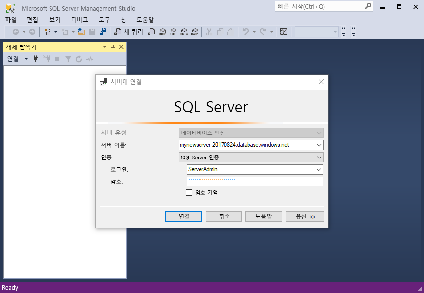
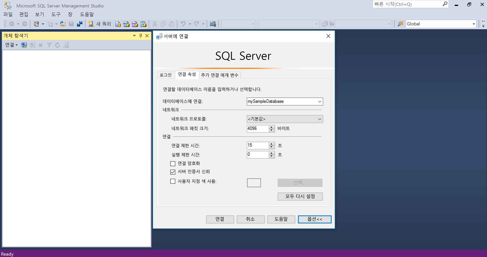
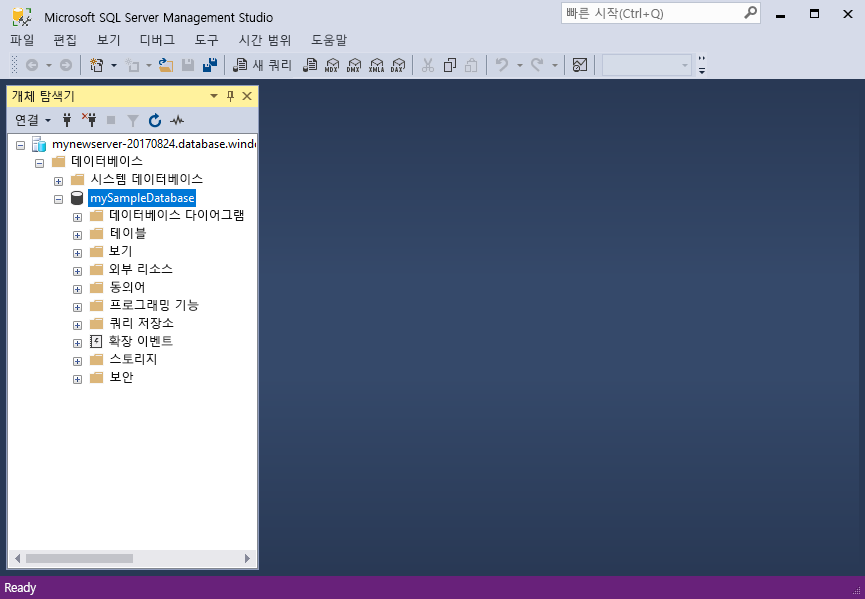
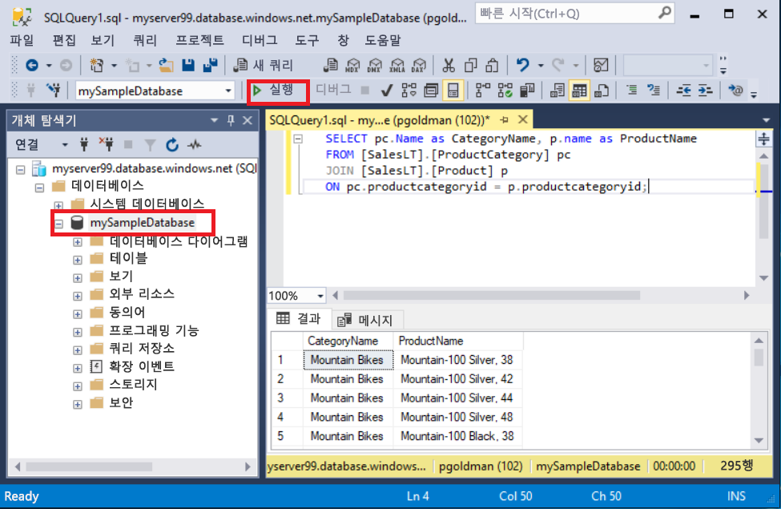
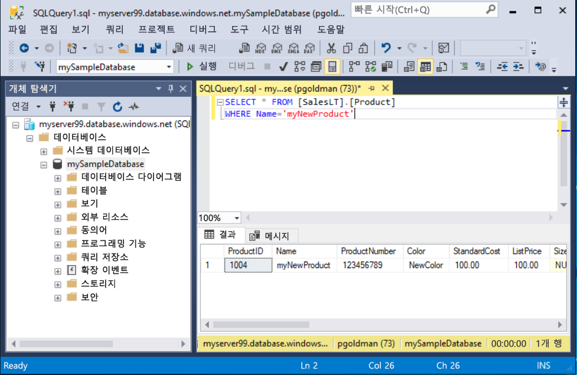

# <a name="quickstart-use-ssms-to-connect-to-and-query-azure-sql-database-or-azure-sql-managed-instance"></a>빠른 시작: SSMS를 사용하여 Azure SQL Database 또는 Azure SQL Managed Instance 쿼리
[!INCLUDE[appliesto-sqldb-sqlmi](../includes/appliesto-sqldb-sqlmi.md)]

이 빠른 시작에서는 SSMS(SQL Server Management Studio)를 사용하여 Azure SQL Database 또는 Azure SQL Managed Instance에 연결하고 일부 쿼리를 실행하는 방법을 알아봅니다.

## <a name="prerequisites"></a>필수 구성 요소

이 빠른 시작을 완료하려면 다음 항목이 필요합니다.

- [SSMS(SQL Server Management Studio)](/sql/ssms/download-sql-server-management-studio-ssms/).

- Azure SQL Database의 데이터베이스입니다. 다음 빠른 시작 중 하나를 사용하여 Azure SQL Database에서 데이터베이스를 만들고 구성할 수 있습니다.

  | 작업 | SQL Database | SQL Managed Instance | Azure VM의 SQL Server |
  |:--- |:--- |:---|:---|
  | 생성| [포털](single-database-create-quickstart.md) | [포털](../managed-instance/instance-create-quickstart.md) | [포털](../virtual-machines/windows/sql-vm-create-portal-quickstart.md)
  || [CLI](scripts/create-and-configure-database-cli.md) | [CLI](https://medium.com/azure-sqldb-managed-instance/working-with-sql-managed-instance-using-azure-cli-611795fe0b44) |
  || [PowerShell](scripts/create-and-configure-database-powershell.md) | [PowerShell](../managed-instance/scripts/create-configure-managed-instance-powershell.md) | [PowerShell](../virtual-machines/windows/sql-vm-create-powershell-quickstart.md)
  | 구성 | [서버 수준 IP 방화벽 규칙](firewall-create-server-level-portal-quickstart.md)| [VM에서 연결](../managed-instance/connect-vm-instance-configure.md)|
  |||[사이트에서 연결](../managed-instance/point-to-site-p2s-configure.md) | [SQL Server에 연결](../virtual-machines/windows/sql-vm-create-portal-quickstart.md)
  |데이터 로드|Adventure Works(빠른 시작마다 로드됨)|[Wide World Importers 복원](../managed-instance/restore-sample-database-quickstart.md) | [Wide World Importers 복원](../managed-instance/restore-sample-database-quickstart.md) |
  |||[GitHub](https://github.com/Microsoft/sql-server-samples/tree/master/samples/databases/adventure-works)의 [BACPAC](database-import.md) 파일에서 Adventure Works 복원 또는 가져오기| [GitHub](https://github.com/Microsoft/sql-server-samples/tree/master/samples/databases/adventure-works)의 [BACPAC](database-import.md) 파일에서 Adventure Works 복원 또는 가져오기|
  |||

  > [!IMPORTANT]
  > 이 문서의 스크립트는 Adventure Works 데이터베이스를 사용하도록 작성되었습니다. 관리되는 인스턴스의 경우 Adventure Works 데이터베이스를 인스턴스 데이터베이스로 가져오거나 이 문서의 스크립트를 수정하여 Wide World Importors 데이터베이스를 사용해야 합니다.

SSMS를 설치하지 않고 일부 임시 쿼리를 실행하려는 경우 [빠른 시작: Azure Portal의 쿼리 편집기를 사용하여 Azure SQL Database의 데이터베이스 쿼리](connect-query-portal.md)를 참조하세요.

## <a name="get-server-connection-information"></a>서버 연결 정보 가져오기

데이터베이스에 연결하는 데 필요한 연결 정보를 가져옵니다. 이 빠른 시작을 완료하려면 정규화된 [서버](logical-servers.md) 이름이나 호스트 이름, 데이터베이스 이름 및 로그인 정보가 필요합니다.

1. [Azure Portal](https://portal.azure.com/)에 로그인합니다.

2. 쿼리하려는 **데이터베이스** 또는 **관리되는 인스턴스**로 이동합니다.

3. **개요** 페이지에서 SQL Database의 데이터베이스에 대한 **서버 이름** 옆에 있는 정규화된 서버 이름 또는 VM의 SQL Managed Instance 또는 SQL Server 인스턴스의 관리되는 인스턴스에 대한 **호스트** 옆에 있는 정규화된 서버 이름(또는 IP 주소)을 검토합니다. 서버 이름이나 호스트 이름을 복사하려면 마우스로 해당 이름 위를 가리키고 **복사** 아이콘을 선택합니다.

> [!NOTE]
> Azure VM의 SQL Server에 대한 연결 정보는 [SQL Server에 연결](../virtual-machines/windows/sql-vm-create-portal-quickstart.md#connect-to-sql-server)을 참조하세요.

## <a name="connect-to-your-database"></a>데이터베이스 연결

SSMS에서 서버에 연결합니다.

> [!IMPORTANT]
> 서버는 포트 1433에서 수신 대기합니다. 회사 방화벽 뒤에서 서버에 연결하려면 방화벽에서 이 포트가 열려 있어야 합니다.

1. SSMS를 엽니다.

2. **서버에 연결** 대화 상자가 표시됩니다. 다음 정보를 입력합니다.

   | 설정      | 제안 값    | Description |
   | ------------ | ------------------ | ----------- |
   | **서버 유형** | 데이터베이스 엔진 | 필수 값. |
   | **서버 이름** | 정규화된 서버 이름 | 예: **servername.database.windows.net** |
   | **인증** | SQL Server 인증 | 이 자습서에서는 SQL 인증을 사용합니다. |
   | **로그인** | 서버 관리자 계정 사용자 ID | 서버를 만드는 데 사용되는 서버 관리자 계정의 사용자 ID입니다. |
   | **암호** | 서버 관리자 계정 암호 | 서버를 만드는 데 사용되는 서버 관리자 계정의 암호입니다. |
   ||||

     

3. **서버에 연결** 대화 상자에서 **옵션**을 선택합니다. **데이터베이스에 연결** 드롭다운 메뉴에서 **mySampleDatabase**를 선택합니다. [필수 구성 요소](#prerequisites) 섹션에서 빠른 시작을 완료하면 mySampleDatabase라는 AdventureWorksLT 데이터베이스가 만들어집니다. AdventureWorks 데이터베이스의 작업 복사본 이름이 mySampleDatabase와 다른 경우 이를 대신 선택합니다.

     

4. **연결**을 선택합니다. 개체 탐색기 창이 열립니다.

5. 데이터베이스의 개체를 보려면 **데이터베이스**를 확장한 다음, 데이터베이스 노드를 확장합니다.

     

## <a name="query-data"></a>쿼리 데이터

이 [SELECT](/sql/t-sql/queries/select-transact-sql/) Transact-SQL 코드를 실행하여 범주별 상위 20개 제품을 쿼리합니다.

1. 개체 탐색기에서 **mySampleDatabase**를 마우스 오른쪽 단추로 클릭하고 **새 쿼리**를 선택합니다. 데이터베이스에 연결된 새 쿼리 창이 열립니다.

2. 쿼리 창에서 다음 SQL 쿼리를 붙여 넣습니다.

   ```sql
   SELECT pc.Name as CategoryName, p.name as ProductName
   FROM [SalesLT].[ProductCategory] pc
   JOIN [SalesLT].[Product] p
   ON pc.productcategoryid = p.productcategoryid;
   ```

3. 도구 모음에서 **실행**을 선택하여 쿼리를 실행하고 `Product` 및 `ProductCategory` 테이블에서 데이터를 검색합니다.

    

### <a name="insert-data"></a>데이터 삽입

이 [INSERT](/sql/t-sql/statements/insert-transact-sql/) Transact-SQL 코드를 실행하여 `SalesLT.Product` 테이블에서 새 제품을 만듭니다.

1. 이전 쿼리를 다음 쿼리로 바꿉니다.

   ```sql
   INSERT INTO [SalesLT].[Product]
           ( [Name]
           , [ProductNumber]
           , [Color]
           , [ProductCategoryID]
           , [StandardCost]
           , [ListPrice]
           , [SellStartDate] )
     VALUES
           ('myNewProduct'
           ,123456789
           ,'NewColor'
           ,1
           ,100
           ,100
           ,GETDATE() );
   ```

2. **실행**을 선택하여 `Product` 테이블에서 새 행을 삽입합니다. **메시지** 창에 **(영향을 받는 행 1개)** 가 표시됩니다.

#### <a name="view-the-result"></a>결과 보기

1. 이전 쿼리를 다음 쿼리로 바꿉니다.

   ```sql
   SELECT * FROM [SalesLT].[Product]
   WHERE Name='myNewProduct'
   ```

2. **실행**을 선택합니다. 다음과 같은 결과가 나타납니다.

   

### <a name="update-data"></a>데이터 업데이트

이 [UPDATE](/sql/t-sql/queries/update-transact-sql?view=sql-server-ver15) Transact-SQL 코드를 실행하여 새 제품을 수정합니다.

1. 이전 쿼리를 이전에 만든 새 레코드를 반환하는 쿼리로 바꿉니다.

   ```sql
   UPDATE [SalesLT].[Product]
   SET [ListPrice] = 125
   WHERE Name = 'myNewProduct';
   ```

2. **실행**을 선택하여 `Product` 테이블에서 지정된 행을 업데이트합니다. **메시지** 창에 **(영향을 받는 행 1개)** 가 표시됩니다.

### <a name="delete-data"></a>데이터 삭제

이 [DELETE](/sql/t-sql/statements/delete-transact-sql/) Transact-SQL 코드를 실행하여 새 제품을 제거합니다.

1. 이전 쿼리를 다음 쿼리로 바꿉니다.

   ```sql
   DELETE FROM [SalesLT].[Product]
   WHERE Name = 'myNewProduct';
   ```

2. **실행**을 선택하여 `Product` 테이블에서 지정된 행을 삭제합니다. **메시지** 창에 **(영향을 받는 행 1개)** 가 표시됩니다.

## <a name="next-steps"></a>다음 단계

- SSMS에 대한 자세한 내용은 [SQL Server Management Studio](/sql/ssms/sql-server-management-studio-ssms/)를 참조하세요.
- Azure Portal을 사용하여 연결하고 쿼리하려면 [Azure Portal SQL 쿼리 편집기를 사용하여 연결 및 쿼리](connect-query-portal.md)를 참조하세요.
- Visual Studio 코드를 사용하여 연결 및 쿼리하려면 [Visual Studio 코드를 사용하여 연결 및 쿼리](connect-query-vscode.md)를 참조하세요.
- .NET을 사용하여 연결 및 쿼리하려면 [.NET을 사용하여 연결 및 쿼리](connect-query-dotnet-visual-studio.md)를 참조하세요.
- PHP를 사용하여 연결 및 쿼리하려면 [PHP를 사용하여 연결 및 쿼리](connect-query-php.md)를 참조하세요.
- Node.js를 사용하여 연결 및 쿼리하려면 [Node.js를 사용하여 연결 및 쿼리](connect-query-nodejs.md)를 참조하세요.
- Java를 사용하여 연결 및 쿼리하려면 [Java를 사용하여 연결 및 쿼리](connect-query-java.md)를 참조하세요.
- Python을 사용하여 연결 및 쿼리하려면 [Python을 사용하여 연결 및 쿼리](connect-query-python.md)를 참조하세요.
- Ruby를 사용하여 연결 및 쿼리하려면 [Ruby를 사용하여 연결 및 쿼리](connect-query-ruby.md)를 참조하세요.
