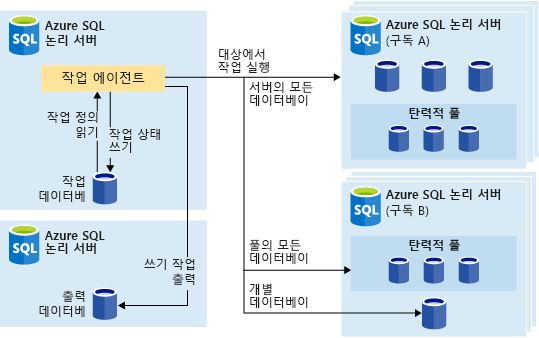
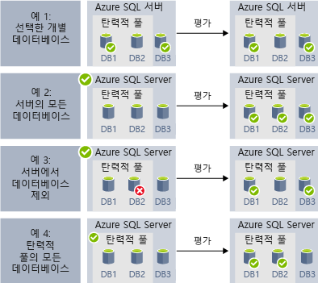
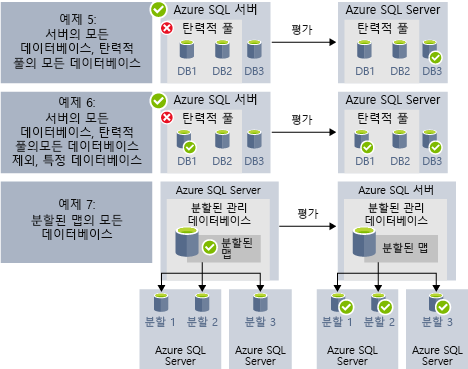

# 탄력적 작업을 사용하여 관리 작업 자동화(미리 보기)

[!INCLUDE[appliesto-sqldb](../includes/appliesto-sqldb.md)]

T-SQL(Transact-SQL) 쿼리를 실행하고 유지 관리 작업을 수행하도록 하나 이상의 Azure SQL 데이터베이스에 대해 주기적으로 실행되는 탄력적 작업을 만들고 예약할 수 있습니다. 

대상 데이터베이스 또는 작업이 실행되는 데이터베이스의 그룹을 정의할 수 있으며, 작업 실행을 위한 일정도 정의할 수 있습니다.
작업은 대상 데이터베이스에 로그인하는 작업을 처리합니다. 또한 데이터베이스 그룹에서 실행할 Transact-SQL 스크립트를 정의, 유지 관리 및 보존합니다.

모든 작업은 실행의 상태를 기록하고 오류가 발생하는 경우 작업을 자동으로 다시 시도합니다.

## 탄력적 작업을 사용하는 경우

탄력적 작업 자동화를 사용할 수 있는 몇 가지 시나리오는 다음과 같습니다.

- 관리 작업을 자동화한 다음, 주중 매일, 일정 시간 후 등에 실행되도록 예약합니다.
  - 스키마 변경, 자격 증명 관리, 성능 데이터 수집 또는 테넌트(고객) 원격 분석 수집을 배포합니다.
  - 참조 데이터(모든 데이터베이스에서 공통적인 정보)를 업데이트하고 Azure Blob Storage에서 데이터를 로드합니다.
- 사용량이 적은 시간 중과 같이 데이터베이스 컬렉션에 대해 되풀이해서 실행하려면 작업을 구성합니다.
  - 지속적으로 데이터베이스 집합에서 중앙 테이블로 쿼리 결과 수집 지속적으로 성능 쿼리를 실행하고 실행할 추가 작업을 트리거하도록 구성할 수 있습니다.
- 보고에 대한 데이터 수집
  - 데이터베이스의 컬렉션에서 단일 대상 테이블로 데이터를 집계합니다.
  - 큰 데이터베이스 집합에 대해 더 오래 실행되는 데이터 처리 쿼리(예: 고객 원격 분석 수집) 실행. 추가 분석을 위해 결과가 단일 대상 테이블에 수집됩니다.
- 데이터 이동 

### 다른 플랫폼에서 자동화

다양한 플랫폼에서 다음과 같은 작업 예약 기술을 고려합니다.

- **탄력적 작업** 은 Azure SQL Database의 하나 이상의 데이터베이스에서 사용자 지정 작업을 실행하는 작업 예약 서비스입니다.
- **SQL 에이전트 작업** 은 SQL Server의 자동화에 계속 사용되는 SQL 에이전트 서비스에서 실행되며 Azure SQL Managed Instances에도 포함됩니다. SQL 에이전트 작업은 Azure SQL Database에서 사용할 수 없습니다.

탄력적 작업은 [Azure SQL Database](sql-database-paas-overview.md), [Azure SQL Database 탄력적 풀](elastic-pool-overview.md) 및 [분할 맵](elastic-scale-shard-map-management.md)의 Azure SQL Database를 대상으로 지정할 수 있습니다.

SQL Server 및 Azure SQL Managed Instance의 T-SQL 스크립트 작업 작동화의 경우 [SQL 에이전트](job-automation-managed-instances.md)를 고려하세요. 

Azure Synapse Analytics의 T-SQL 스크립트 작업을 자동화하는 경우 [Azure Data Factory를 기반](../../synapse-analytics/data-integration/concepts-data-factory-differences.md)으로 하는 [반복 트리거가 있는 파이프라인](../../synapse-analytics/data-integration/concepts-data-factory-differences.md)을 고려하세요.

SQL 에이전트(SQL Server 및 SQL Managed Instance의 일부로 사용 가능)와 Database 탄력적 작업 에이전트(Azure SQL Database 또는 SQL Server 및 Azure SQL Managed Instance, Azure Synapse Analytics의 데이터베이스에서 T-SQL을 실행할 수 있음) 간의 차이점에 주목할 필요가 있습니다.

| |탄력적 작업 |SQL 에이전트 |
|---------|---------|---------|
|**범위** | 작업 에이전트와 동일한 Azure 클라우드에 있는 많은 Azure SQL Database 데이터베이스 및/또는 데이터 웨어하우스입니다. 대상은 다른 서버, 구독 및/또는 지역에 있을 수 있습니다.   대상 그룹은 개별 데이터베이스나 데이터 웨어하우스 또는 서버, 풀 또는 분할 맵(작업 런타임 시 동적으로 열거되는)의 모든 데이터베이스로 구성됩니다. | SQL 에이전트와 동일한 인스턴스의 모든 개별 데이터베이스입니다. SQL Server 에이전트의 다중 서버 관리 기능을 사용하면 마스터/대상 인스턴스에서 작업 실행을 조정할 수 있지만 이 기능은 SQL 관리형 인스턴스에서 사용할 수 없습니다. |
|**지원되는 API 및 도구** | 포털, PowerShell, T-SQL, Azure Resource Manager | T-SQL 및 SSMS(SQL Server Management Studio) |
 
## 탄력적 작업 대상

**탄력적 작업** 은 일정에 따라 또는 요청 시 많은 데이터베이스에서 하나 이상의 T-SQL 스크립트를 병렬로 실행하는 기능을 제공합니다.

특정 데이터베이스를 포함하거나 제외할 수 있는 유연성이 추가된 하나 이상의 개별 데이터베이스, 서버의 모든 데이터베이스, 탄력적 풀의 모든 데이터베이스 또는 분할 맵과 같은 데이터베이스 조합에 대해 예약된 작업을 실행할 수 있습니다. 작업은 여러 서버 및 여러 사람에서 실행될 수 있으며 심지어 다른 구독의 데이터베이스에 대해서도 실행될 수 있습니다. 서버 및 풀은 런타임 시 동적으로 열거되므로 작업은 실행 시 대상 그룹에 존재하는 모든 데이터베이스에 대해 실행됩니다.

다음 이미지에서는 다른 유형의 대상 그룹에 대해 작업을 실행하는 작업 에이전트를 보여줍니다.

### 탄력적 작업 구성 요소

|구성 요소 | 설명(추가 세부 정보는 표 아래에 있음) |
|---------|---------|
|[**탄력적 작업 에이전트**](#elastic-job-agent) | 작업을 실행하고 관리하기 위해 만든 Azure 리소스입니다. |
|[**작업 데이터베이스**](#elastic-job-database) | 작업 에이전트가 작업 관련 데이터, 작업 정의 등을 저장하는 데 사용하는 Azure SQL Database의 데이터베이스입니다. |
|[**대상 그룹**](#target-group) | 서버, 풀, 데이터베이스 및 분할된 데이터베이스의 집합이 작업을 실행하기 위해 매핑됩니다. |
|[**작업**](#elastic-jobs-and-job-steps) | 작업은 둘 이상의 작업 단계로 구성된 작업 단위입니다. 작업 단계는 실행할 T-SQL 스크립트 뿐만 아니라 스크립트를 실행하는 데 필요한 기타 세부 정보를 지정합니다. |

#### 탄력적 작업 에이전트

탄력적 작업 에이전트는 작업을 생성하고 실행하고 관리하기 위한 Azure 리소스입니다. 탄력적 작업 에이전트는 포털에서 만드는 Azure 리소스입니다([PowerShell](elastic-jobs-powershell-create.md) 및 REST도 지원됩니다).

**탄력적 작업 에이전트** 를 만들려면 Azure SQL Database의 기존 데이터베이스가 필요합니다. 에이전트는 이 기존 Azure SQL Database를 [*작업 데이터베이스*](#elastic-job-database)로 구성합니다.

탄력적 작업 에이전트는 무료입니다. 작업 데이터베이스는 Azure SQL Database의 모든 데이터베이스와 동일한 비용이 청구됩니다.

#### 탄력적 작업 데이터베이스

*작업 데이터베이스* 는 작업을 정의하고 작업 실행의 기록 및 상태를 추적하는 데 사용됩니다. *작업 데이터베이스* 는 또한 에이전트 메타데이터, 로그, 결과, 작업 정의를 저장하는 데 사용되며, T-SQL을 사용하여 작업을 생성, 실행 및 관리하기 위해 많은 유용한 저장 프로시저 및 기타 데이터베이스 개체도 포함합니다.

현재 미리 보기의 경우 탄력적 작업 에이전트를 만드는 데 Azure SQL Database의 기존 데이터베이스(S0 이상)가 필요합니다.

*작업 데이터베이스* 는 깨끗하고, 비어있는 S0 이상의 서비스 목표 Azure SQL Database여야 합니다. *작업 데이터베이스* 의 권장되는 서비스 개체는 S1 이상이지만 작업 단계 수, 작업 대상 수 및 작업 실행 빈도 같은 사용자 작업의 성능 요구에 따라 달라집니다. 

작업 데이터베이스에 대한 작업이 예상보다 느린 경우 Azure Portal 또는 [sys.dm_db_resource_stats](/sql/relational-databases/system-dynamic-management-views/sys-dm-db-resource-stats-azure-sql-database) DMV를 사용하여 속도 저하 기간 동안 작업 데이터베이스에서 데이터베이스 성능 및 리소스 사용률을 [모니터링](monitor-tune-overview.md#azure-sql-database-and-azure-sql-managed-instance-resource-monitoring)할 수 있습니다. CPU, 데이터 IO 또는 로그 쓰기와 같은 리소스의 사용률이 100%에 도달하고 속도 저하 기간과 상관 관계에 있는 경우, 작업 데이터베이스 성능이 충분히 향상될 때까지 데이터베이스를 더 높은 서비스 개체([DTU 모델](service-tiers-dtu.md) 또는 [vCore 모델](service-tiers-vcore.md)에서)로 증분 확장하는 것이 좋습니다.

##### 탄력적 작업 데이터베이스 사용 권한

작업 에이전트 생성 동안 스키마, 테이블 및 *jobs_reader* 라는 역할이 *작업 데이터베이스* 에서 만들어집니다. 역할은 다음과 같은 사용 권한으로 생성되며, 작업 모니터링을 위해 관리자에게 보다 정교한 액세스 제어를 제공하도록 설계되었습니다.

|역할 이름 |'작업' 스키마 사용 권한 |'jobs_internal' 스키마 사용 권한 |
|---------|---------|---------|
|**jobs_reader** | SELECT | None |

> [!IMPORTANT]
> 데이터베이스 관리자로 *작업 데이터베이스* 에 대해 액세스 권한을 부여하기 전에 보안 관련 문제를 고려합니다. 작업을 만들거나 편집할 수 있는 권한이 있는 악의적인 사용자는 해당 악의적인 사용자의 제어 아래 저장된 자격 증명을 사용하는 작업을 만들거나 편집할 수 있으며, 이는 악의적인 사용자가 자격 증명의 암호를 확인하도록 허용할 수 있습니다.

#### 대상 그룹

*대상 그룹* 은 작업 단계에서 실행될 데이터베이스의 집합을 정의합니다. 대상 그룹은 다음의 모든 번호와 조합을 포함할 수 있습니다.

- **논리적 SQL 서버** - 서버가 지정되면 작업 실행 시 서버에 존재하는 모든 데이터베이스 그룹의 일부가 됩니다. 작업 실행에 앞서 그룹을 열거하고 업데이트할 수 있도록 master 데이터베이스 자격 증명이 제공되어야 합니다. 논리 서버에 대한 자세한 내용은 [Azure SQL Database 및 Azure Synapse Analytics의 서버란?](logical-servers.md)을 참조하세요.
- **탄력적 풀** - 탄력적 풀을 지정하는 경우 작업 실행 시 탄력적인 풀에 있는 모든 데이터베이스는 그룹의 일부가 됩니다. 서버의 경우 작업 실행에 앞서 그룹을 업데이트할 수 있도록 master 데이터베이스 자격 증명이 제공되어야 합니다.
- **단일 데이터베이스** - 하나 이상의 개별 데이터베이스가 그룹의 일부가 되도록 지정합니다.
- **분할 맵** - 분할 맵의 데이터베이스.

> [!TIP]
> 작업 실행 시 *동적 열거형* 은 서버 또는 풀을 포함하는 대상 그룹에서 데이터베이스의 집합을 다시 평가합니다. 동적 열거형은 **작업 실행 시 서버나 풀에 존재하는 모든 데이터베이스에서 작업이 실행되는지** 확인합니다. 런타임 시 데이터베이스 목록의 재평가는 풀 또는 서버 멤버 자격이 자주 변경되는 시나리오에 특히 유용합니다.

풀 및 단일 데이터베이스는 그룹에서 제외되거나 포함되는 것으로 지정할 수 있습니다. 이렇게 하면 데이터베이스의 모든 조합을 사용하여 대상 그룹을 만들 수 있습니다. 예를 들어 대상 그룹에 서버를 추가할 수 있지만 탄력적 풀에서 특정 데이터베이스를 제외합니다(또는 전체 풀을 제외).

대상 그룹은 여러 지역 및 여러 구독에서 데이터베이스를 포함할 수 있습니다. 지역 간 실행은 동일한 지역 내 실행보다 더 많은 대기 시간이 필요합니다.

다음 예제에서는 작업 실행 시 여러 대상 그룹 정의를 동적으로 열거하여 작업에서 실행할 데이터베이스를 결정하는 원리를 보여줍니다.

**예제 1** 은 개별 데이터베이스 목록으로 구성되는 대상 그룹을 보여줍니다. 이 대상 그룹을 사용하여 작업 단계가 실행되면 작업 단계의 동작은 각 데이터베이스에서 실행됩니다. 
**예제 2** 는 서버를 대상으로 포함하는 대상 그룹을 보여 줍니다. 이 대상 그룹을 사용하여 작업 단계가 실행되면 현재 서버에 있는 데이터베이스 목록을 확인하기 위해 서버가 동적으로 열거됩니다. 작업 단계의 동작은 각 데이터베이스에서 실행됩니다. 
**예제 3** 은 *예제 2* 와 비슷한 대상 그룹을 보여주지만, 개별 데이터베이스가 제외됩니다. 제외된 데이터베이스에서 작업 단계의 동작이 실행되지 *않습니다*. 
**예제 4** 는 탄력적 풀을 대상으로 포함하는 대상 그룹을 보여줍니다. *예제 2* 와 비슷하게, 풀에 있는 데이터베이스 목록을 확인하기 위해 런타임에 풀이 동적으로 열거됩니다.
  

**예제 5** 및 **예제 6** 은 포함 및 제외 규칙을 사용하여 서버, 탄력적 풀, 데이터베이스를 결합할 수 있는 고급 시나리오를 보여줍니다. 
**예제 7** 은 분할된 데이터베이스 맵의 분할된 데이터베이스를 런타임에도 평가할 수 있음을 보여줍니다.

> [!NOTE]
> 작업 데이터베이스 자체는 작업의 대상일 수 있습니다. 이 시나리오에서 작업 데이터베이스는 다른 대상 데이터베이스와 동일하게 처리됩니다. 작업 데이터베이스에서 작업 사용자를 만들고 충분한 권한을 부여해야 하며, 작업 사용자에 대한 데이터베이스 범위 자격 증명은 다른 대상 데이터베이스의 경우와 마찬가지로 작업 데이터베이스에도 있어야 합니다.

#### 탄력적 작업 및 작업 단계

*작업* 은 일정에 따라 또는 일회성 작업으로 실행되는 작업의 단위입니다. 작업은 하나 이상의 *작업 단계* 로 구성됩니다.

각 작업 단계는 실행할 T-SQL 스크립트, T-SQL 스크립트를 실행하는 하나 이상의 대상 그룹 및 작업 에이전트가 대상 데이터베이스에 연결해야 하는 자격 증명을 지정합니다. 각 작업 단계에는 사용자 지정 가능한 시간 제한 및 재시도 정책이 있으며, 출력 매개 변수를 선택적으로 지정할 수 있습니다.

#### 작업 출력

각 대상 데이터베이스에서 작업 단계의 결과는 자세히 레코드되며, 스크립트 출력은 지정된 테이블로 캡처될 수 있습니다. 작업에서 반환된 모든 데이터를 저장하려면 데이터베이스를 지정할 수 있습니다.

#### 작업 기록

[테이블 jobs.job_executions를 쿼리](elastic-jobs-tsql-create-manage.md#monitor-job-execution-status)하여 *작업 데이터베이스* 에서 탄력적 작업 실행 기록을 봅니다. 시스템 정리 작업은 45일 이상된 실행 기록을 제거합니다. 45일 이하 기록을 제거하려면 *작업 데이터베이스* 에서 **sp_purge_history** 저장 프로시저를 호출합니다.

#### 작업 상태

[테이블 jobs.job_executions를 쿼리](elastic-jobs-tsql-create-manage.md#monitor-job-execution-status)하여 *작업 데이터베이스* 에서 탄력적 작업 실행을 모니터링할 수 있습니다. 

### 에이전트 성능, 용량 및 제한 사항

탄력적 작업은 장기 실행 작업이 완료되기를 기다리는 동안 최소한의 컴퓨팅 리소스를 사용합니다.

작업(동시 작업자 수)에 대한 원하는 실행 시간 및 데이터베이스의 대상 그룹 크기에 따라 에이전트는 *작업 데이터베이스* 의 다른 양의 성능 및 컴퓨팅을 요구합니다(대상 및 작업 수가 많아질수록 필요한 컴퓨팅 양도 더 많아집니다).

현재 제한은 100개의 동시 작업입니다.

#### 작업이 대상 데이터베이스 성능을 감소시키는 것을 방지

SQL 탄력적인 풀에서 데이터베이스에 대해 작업을 실행할 때 리소스에 작업 부하를 주지 않도록 하려면 작업이 동시에 실행될 수 있는 데이터베이스의 수를 제한하도록 작업을 구성할 수 있습니다.

## 다음 단계

- [탄력적 작업을 만들고 관리하는 방법](elastic-jobs-overview.md)
- [PowerShell을 사용하여 탄력적 작업 만들기 및 관리](elastic-jobs-powershell-create.md)
- [T-SQL(Transact-SQL)을 사용하여 탄력적 작업 만들기 및 관리](elastic-jobs-tsql-create-manage.md)