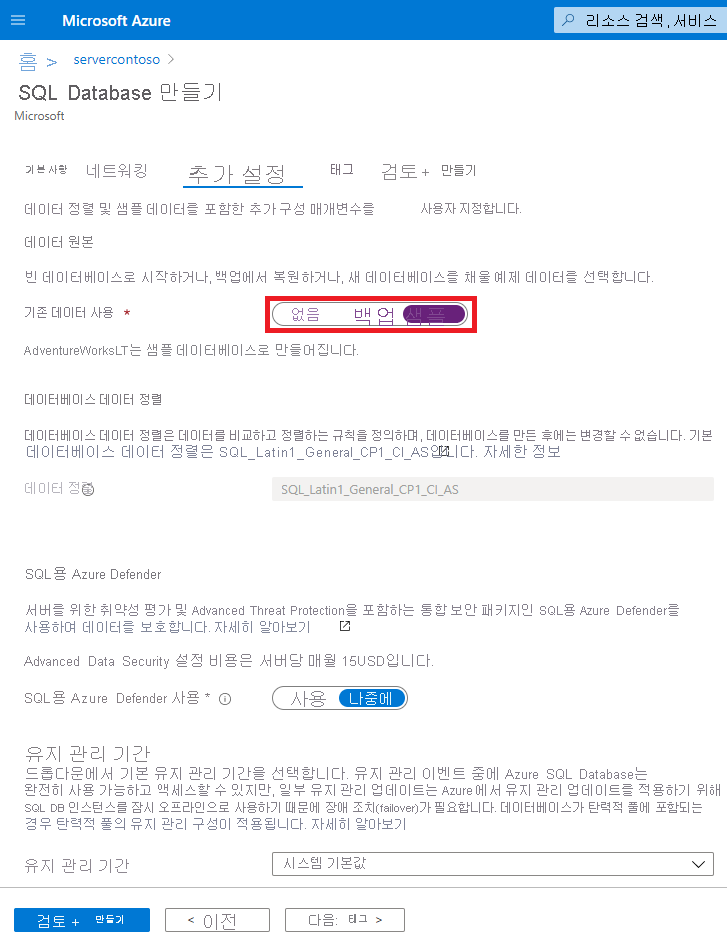
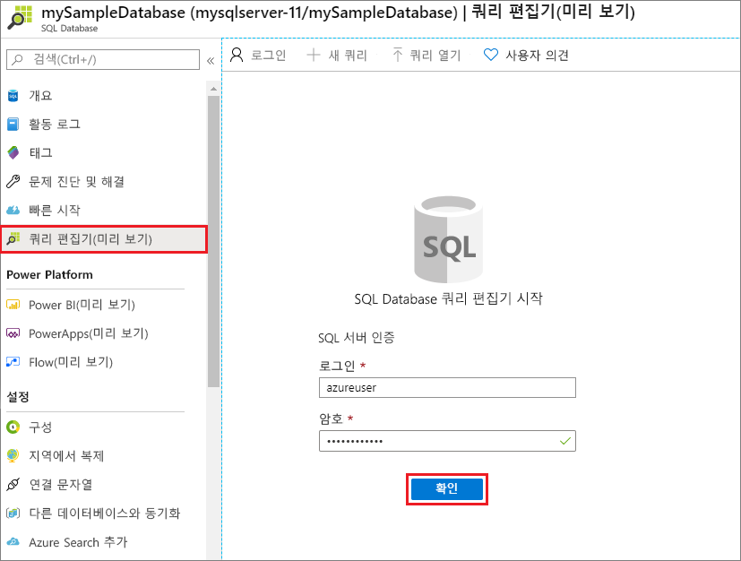
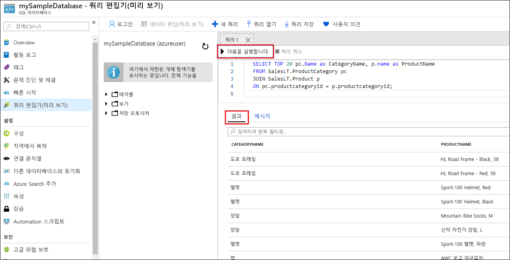

# <a name="quickstart-create-an-azure-sql-database-single-database"></a>빠른 시작: Azure SQL Database 단일 데이터베이스 만들기

이 빠른 시작에서는 Azure Portal, PowerShell 스크립트 또는 Azure CLI 스크립트를 사용하여 Azure SQL Database에서 [단일 데이터베이스](single-database-overview.md)를 만듭니다. 그런 다음, Azure Portal에서 **쿼리 편집기**를 사용하여 데이터베이스를 쿼리합니다.


## <a name="prerequisite"></a>필수 요소

- 활성화된 Azure 구독. 아직 없는 경우 [체험 계정](https://azure.microsoft.com/free/)을 만들 수 있습니다.

## <a name="create-a-single-database"></a>단일 데이터베이스 만들기

이 빠른 시작에서는 [서버리스 컴퓨팅 계층](serverless-tier-overview.md)에 단일 데이터베이스를 만듭니다.

# <a name="portal"></a>[포털](#tab/azure-portal)

Azure Portal에서 단일 데이터베이스를 만들기 위해 이 빠른 시작이 Azure SQL 페이지에서 시작됩니다.

1. [SQL 배포 옵션 선택](https://portal.azure.com/#create/Microsoft.AzureSQL) 페이지로 이동합니다.
1. **SQL 데이터베이스**에서 **리소스 유형**을 **단일 데이터베이스**로 설정한 상태로 두고 **만들기**를 선택합니다.

   

1. **SQL 데이터베이스 만들기** 양식의 **기본** 탭에 있는 **프로젝트 세부 정보** 아래에서 원하는 Azure **구독**을 선택합니다.
1. **리소스 그룹**의 경우 **새로 만들기**를 선택하고, *myResourceGroup*을 입력하고, **확인**을 선택합니다.
1. **데이터베이스 이름**에 *mySampleDatabase*를 입력합니다.
1. **서버**에 대해 **새로 만들기**를 선택하고 **새 서버** 양식을 다음 값으로 입력합니다.
   - **서버 이름**: *mysqlserver*를 입력하고 고유하게 유지하기 위한 일부 문자를 추가합니다. 서버 이름은 구독 내에서 고유한 것이 아니라 Azure의 모든 서버에 대해 전역적으로 고유해야 하므로 사용할 정확한 서버 이름을 제공할 수 없습니다. 따라서 mysqlserver12345와 같은 항목을 입력하면 포털에서 사용 가능 여부를 알 수 있습니다.
   - **서버 관리자 로그인**: *azureuser*를 입력합니다.
   - **암호**: 요구 사항을 충족하는 암호를 입력하고, **암호 확인** 필드에서 다시 입력합니다.
   - **위치**: 드롭다운 목록에서 위치를 선택합니다.

   **확인**을 선택합니다.

1. **SQL 탄력적 풀을 사용하나요?** 를 **아니요**로 설정된 상태로 둡니다.
1. **컴퓨팅 + 스토리지**에서 **데이터베이스 구성**을 선택합니다.
1. 이 빠른 시작에서는 서버리스 데이터베이스를 사용하므로 **서버리스**를 선택한 다음, **적용**을 선택합니다. 

      

1. 완료되면 **다음: 네트워킹**을 선택합니다.

   

1. **네트워킹** 탭에서 **연결 방법**에 대해 **퍼블릭 엔드포인트**를 선택합니다.
1. **방화벽 규칙**의 경우 **현재 클라이언트 IP 주소 추가**를 **예**로 설정합니다. **Azure 서비스 및 리소스가 이 서버에 액세스할 수 있도록 허용**을 **아니요**로 설정된 상태로 둡니다.
1. 완료되면 **다음: 추가 설정**을 선택합니다.

   
  

1. **추가 설정** 탭의 **데이터 원본** 섹션에서 **기존 데이터 사용**에 대해 **샘플**을 선택합니다. 이렇게 하면 AdventureWorksLT 샘플 데이터베이스가 만들어지므로 비어 있는 빈 데이터베이스와는 달리 쿼리 및 실험을 위한 몇 가지 테이블과 데이터가 있습니다.
1. 페이지 아래쪽에서 **검토 + 만들기**를 선택합니다.

   

1. **검토 + 만들기** 페이지에서 검토 후 **만들기**를 선택합니다.

# <a name="azure-cli"></a>[Azure CLI](#tab/azure-cli)

## <a name="launch-azure-cloud-shell"></a>Azure Cloud Shell 시작

Azure Cloud Shell은 이 항목의 단계를 실행하는 데 무료로 사용할 수 있는 대화형 셸입니다. 공용 Azure 도구가 사전 설치되어 계정에서 사용하도록 구성되어 있습니다. 

Cloud Shell을 열려면 코드 블록의 오른쪽 위 모서리에 있는 **사용해 보세요**를 선택하기만 하면 됩니다. 또한 [https://shell.azure.com](https://shell.azure.com)로 이동하여 별도의 브라우저 탭에서 Cloud Shell을 시작할 수도 있습니다. **복사**를 선택하여 코드 블록을 복사하여 Cloud Shell에 붙여넣고, **Enter** 키를 눌러 실행합니다.

## <a name="set-parameter-values"></a>매개 변수 값 설정

다음 값은 데이터베이스와 필요한 리소스를 만드는 후속 명령에 사용됩니다. 서버 이름은 모든 Azure에서 전역적으로 고유해야 하므로 $RANDOM 함수를 사용하여 서버 이름을 만듭니다. IP 주소 범위의 0.0.0.0 값을 특정 환경에 맞게 바꿉니다.

```azurecli-interactive
# Set the resource group name and location for your server
resourceGroupName=myResourceGroup
location=eastus

# Set an admin login and password for your database
adminlogin=azureuser
password=Azure1234567!

# Set a server name that is unique to Azure DNS (<server_name>.database.windows.net)
serverName=server-$RANDOM

# Set the ip address range that can access your database
startip=0.0.0.0
endip=0.0.0.0
```

## <a name="create-a-resource-group"></a>리소스 그룹 만들기

[az group create](/cli/azure/group) 명령을 사용하여 리소스 그룹을 만듭니다. Azure 리소스 그룹은 Azure 리소스가 배포 및 관리되는 논리적 컨테이너입니다. 다음 예제에서는 *eastus* 위치에 *myResourceGroup*이라는 리소스 그룹을 만듭니다.

```azurecli-interactive
az group create --name $resourceGroupName --location $location
```

## <a name="create-a-server"></a>서버 만들기

[az sql server create](/cli/azure/sql/server) 명령을 사용하여 서버를 만듭니다.

```azurecli-interactive
az sql server create \
    --name $serverName \
    --resource-group $resourceGroupName \
    --location $location  \
    --admin-user $adminlogin \
    --admin-password $password
```


## <a name="configure-a-firewall-rule-for-the-server"></a>서버에 대한 방화벽 규칙 구성

[az sql server firewall-rule create](/cli/azure/sql/server/firewall-rule) 명령을 사용하여 방화벽 규칙을 만듭니다.

```azurecli-interactive
az sql server firewall-rule create \
    --resource-group $resourceGroupName \
    --server $serverName \
    -n AllowYourIp \
    --start-ip-address $startip \
    --end-ip-address $endip
```


## <a name="create-a-single-database"></a>단일 데이터베이스 만들기

[az sql db create](/cli/azure/sql/db) 명령을 사용하여 데이터베이스를 만듭니다. 다음 코드가 생성됨


```azurecli-interactive
az sql db create \
    --resource-group $resourceGroupName \
    --server $serverName \
    --name mySampleDatabase \
    --sample-name AdventureWorksLT \
    --edition GeneralPurpose \
    --compute-model Serverless \
    --family Gen5 \
    --capacity 2
```


# <a name="powershell"></a>[PowerShell](#tab/azure-powershell)

Windows PowerShell을 사용하여 리소스 그룹, 서버 및 단일 데이터베이스를 만들 수 있습니다.

## <a name="launch-azure-cloud-shell"></a>Azure Cloud Shell 시작

Azure Cloud Shell은 이 항목의 단계를 실행하는 데 무료로 사용할 수 있는 대화형 셸입니다. 공용 Azure 도구가 사전 설치되어 계정에서 사용하도록 구성되어 있습니다. 

Cloud Shell을 열려면 코드 블록의 오른쪽 위 모서리에 있는 **사용해 보세요**를 선택하기만 하면 됩니다. 또한 [https://shell.azure.com](https://shell.azure.com)로 이동하여 별도의 브라우저 탭에서 Cloud Shell을 시작할 수도 있습니다. **복사**를 선택하여 코드 블록을 복사하여 Cloud Shell에 붙여넣고, **Enter** 키를 눌러 실행합니다.

## <a name="set-parameter-values"></a>매개 변수 값 설정

다음 값은 데이터베이스와 필요한 리소스를 만드는 후속 명령에 사용됩니다. 서버 이름은 모든 Azure에서 전역적으로 고유해야 하므로 Get-Random cmdlet을 사용하여 서버 이름을 만듭니다. IP 주소 범위의 0.0.0.0 값을 특정 환경에 맞게 바꿉니다.

```azurepowershell-interactive
   # Set variables for your server and database
   $resourceGroupName = "myResourceGroup"
   $location = "eastus"
   $adminLogin = "azureuser"
   $password = "Azure1234567!"
   $serverName = "mysqlserver-$(Get-Random)"
   $databaseName = "mySampleDatabase"

   # The ip address range that you want to allow to access your server
   $startIp = "0.0.0.0"
   $endIp = "0.0.0.0"

   # Show randomized variables
   Write-host "Resource group name is" $resourceGroupName
   Write-host "Server name is" $serverName
```


## <a name="create-resource-group"></a>리소스 그룹 만들기

[New-AzResourceGroup](/powershell/module/az.resources/new-azresourcegroup)을 사용하여 Azure 리소스 그룹을 만듭니다. 리소스 그룹은 Azure 리소스가 배포 및 관리되는 논리적 컨테이너입니다.

```azurepowershell-interactive
   Write-host "Creating resource group..."
   $resourceGroup = New-AzResourceGroup -Name $resourceGroupName -Location $location -Tag @{Owner="SQLDB-Samples"}
   $resourceGroup
```


## <a name="create-a-server"></a>서버 만들기

[New-AzSqlServer](/powershell/module/az.sql/new-azsqlserver) cmdlet을 사용하여 서버를 만듭니다.

```azurepowershell-interactive
  Write-host "Creating primary server..."
   $server = New-AzSqlServer -ResourceGroupName $resourceGroupName `
      -ServerName $serverName `
      -Location $location `
      -SqlAdministratorCredentials $(New-Object -TypeName System.Management.Automation.PSCredential `
      -ArgumentList $adminLogin, $(ConvertTo-SecureString -String $password -AsPlainText -Force))
   $server
```

## <a name="create-a-firewall-rule"></a>방화벽 규칙을 만들기

[New-AzSqlServerFirewallRule](/powershell/module/az.sql/new-azsqlserverfirewallrule) cmdlet을 사용하여 서버 방화벽 규칙을 만듭니다.

```azurepowershell-interactive
   Write-host "Configuring server firewall rule..."
   $serverFirewallRule = New-AzSqlServerFirewallRule -ResourceGroupName $resourceGroupName `
      -ServerName $serverName `
      -FirewallRuleName "AllowedIPs" -StartIpAddress $startIp -EndIpAddress $endIp
   $serverFirewallRule
```


## <a name="create-a-single-database"></a>단일 데이터베이스 만들기

[New-AzSqlDatabase](/powershell/module/az.sql/new-azsqldatabase) cmdlet을 사용하여 단일 데이터베이스를 만듭니다.

```azurepowershell-interactive
   Write-host "Creating a gen5 2 vCore serverless database..."
   $database = New-AzSqlDatabase  -ResourceGroupName $resourceGroupName `
      -ServerName $serverName `
      -DatabaseName $databaseName `
      -Edition GeneralPurpose `
      -ComputeModel Serverless `
      -ComputeGeneration Gen5 `
      -VCore 2 `
      -MinimumCapacity 2 `
      -SampleName "AdventureWorksLT"
   $database
```

---


## <a name="query-the-database"></a>데이터베이스 쿼리

데이터베이스가 생성되면 Azure Portal에서 **쿼리 편집기(미리 보기)** 를 사용하여 데이터베이스에 연결하고 데이터를 쿼리할 수 있습니다.

1. 포털에서 **SQL 데이터베이스**를 검색하고 선택한 다음, 목록에서 데이터베이스를 선택합니다.
1. 데이터베이스의 페이지에서 왼쪽 메뉴에 있는 **쿼리 편집기(미리 보기)** 를 선택합니다.
1. 사용자의 서버 관리자 로그인 정보를 입력하고, **확인**을 선택합니다.

   

1. 다음 쿼리를 **쿼리 편집기** 창에 입력합니다.

   ```sql
   SELECT TOP 20 pc.Name as CategoryName, p.name as ProductName
   FROM SalesLT.ProductCategory pc
   JOIN SalesLT.Product p
   ON pc.productcategoryid = p.productcategoryid;
   ```

1. **실행**을 선택한 다음, **결과** 창에서 쿼리 결과를 검토합니다.

   

1. **쿼리 편집기** 창을 닫고, 저장하지 않은 편집 내용을 삭제하라는 메시지가 표시될 때 **확인**을 선택합니다.

## <a name="clean-up-resources"></a>리소스 정리

리소스 그룹, 서버 및 단일 데이터베이스를 유지하여 다음 단계로 이동하고, 다양한 방법으로 데이터베이스에 연결하고 쿼리하는 방법을 알아봅니다.

이러한 리소스의 사용을 마친 후에는 만든 리소스 그룹을 삭제할 수 있습니다. 그러면 해당 리소스 그룹 내에서 서버 및 단일 데이터베이스도 삭제됩니다.

### <a name="portal"></a>[포털](#tab/azure-portal)

Azure Portal을 사용하여 **myResourceGroup** 및 모든 해당 리소스를 삭제하려면 다음을 수행합니다.

1. 포털에서 **리소스 그룹**을 검색하고 선택한 다음, 목록에서 **myResourceGroup**을 선택합니다.
1. 리소스 그룹 페이지에서 **리소스 그룹 삭제**를 선택합니다.
1. **리소스 그룹 이름 입력**에 *myResourceGroup*을 입력한 다음, **삭제**를 선택합니다.

### <a name="azure-cli"></a>[Azure CLI](#tab/azure-cli)

리소스 그룹 및 모든 해당 리소스를 삭제하려면 리소스 그룹 이름을 사용하여 다음 Azure CLI 명령을 실행합니다.

```azurecli-interactive
az group delete --name $resourceGroupName
```

### <a name="powershell"></a>[PowerShell](#tab/azure-powershell)

리소스 그룹 및 모든 해당 리소스를 삭제하려면 리소스 그룹의 이름을 사용하여 다음 PowerShell cmdlet을 실행합니다.

```azurepowershell-interactive
Remove-AzResourceGroup -Name $resourceGroupName
```

---

## <a name="next-steps"></a>다음 단계

다양한 도구 및 언어를 사용하여 데이터베이스 [연결 및 쿼리](connect-query-content-reference-guide.md):
> [!div class="nextstepaction"]
> [SQL Server Management Studio를 사용하여 연결 및 쿼리](connect-query-ssms.md)
>
> [Azure Data Studio를 사용하여 연결 및 쿼리](/sql/azure-data-studio/quickstart-sql-database?toc=/azure/sql-database/toc.json)

클라우드 비용을 최적화하여 비용을 절감하고 싶습니까?

> [!div class="nextstepaction"]
> [Cost Management를 통한 비용 분석 시작](https://docs.microsoft.com/azure/cost-management-billing/costs/quick-acm-cost-analysis?WT.mc_id=costmanagementcontent_docsacmhorizontal_-inproduct-learn)
