# 빠른 시작: SQL Managed Instance의 관리형 인스턴스 만들기
[!INCLUDE[appliesto-sqlmi](../includes/appliesto-sqlmi.md)]

이 빠른 시작에서는 Azure Portal에서 [Azure SQL Managed Instance](sql-managed-instance-paas-overview.md)의 관리형 인스턴스를 만드는 방법을 안내합니다.

> [!IMPORTANT]
> 제한 사항은 [지원되는 지역](resource-limits.md#supported-regions) 및 [지원되는 구독 유형](resource-limits.md#supported-subscription-types)을 참조하세요.

## 관리되는 인스턴스 만들기

관리형 인스턴스를 만들려면 다음 단계를 수행합니다. 

### Azure Portal에 로그인

Azure 구독이 아직 없는 경우 [무료 계정을 만듭니다](https://azure.microsoft.com/free/).

1. [Azure Portal](https://portal.azure.com/)에 로그인합니다.
1. Azure Portal의 왼쪽 메뉴에서 **Azure SQL**을 선택합니다. 목록에 **Azure SQL**이 없는 경우 **모든 서비스**를 선택한 다음, 검색 상자에 **Azure SQL**을 입력합니다.
1. **+추가**를 선택하여 **SQL 배포 옵션 선택** 페이지를 엽니다. **SQL 관리형 인스턴스** 타일에서 **세부 정보 표시**를 선택하면 Azure SQL Managed Instance에 대한 추가 정보를 볼 수 있습니다.
1. **만들기**를 선택합니다.

   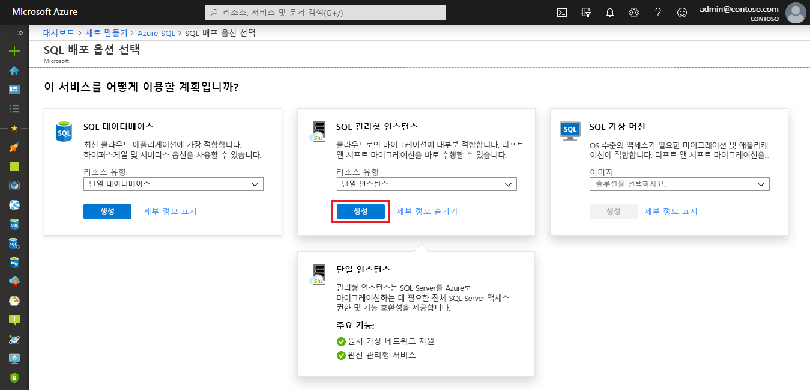

4. **Azure SQL Managed Instance 만들기** 프로비저닝 양식의 탭을 사용하여 필수 및 선택적 정보를 추가합니다. 다음 섹션에서는 이러한 탭을 설명합니다.

### 기본 사항 탭

- **기본 사항** 탭에 필요한 필수 정보를 입력합니다. 이는 관리형 인스턴스를 프로비저닝하기 위한 최소 정보 세트입니다.

   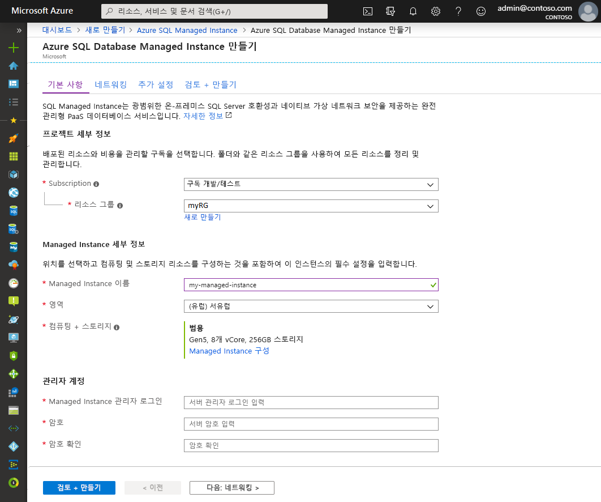

   아래 표를 사용하여 이 탭에 필요한 정보를 참조합니다.

   | 설정| 제안 값 | Description |
   | ------ | --------------- | ----------- |
   | **구독** | 사용자의 구독. | 새 리소스를 만들 권한을 제공하는 구독입니다. |
   | **리소스 그룹** | 새 또는 기존 리소스 그룹입니다.|유효한 리소스 그룹 이름은 [명명 규칙 및 제한 사항](/azure/architecture/best-practices/resource-naming)을 참조하세요.|
   | **관리되는 인스턴스 이름** | 모든 유효한 이름|유효한 이름은 [명명 규칙 및 제한 사항](/azure/architecture/best-practices/resource-naming)을 참조하세요.|
   | **지역** |관리형 인스턴스를 만들 지역.|지역에 대한 자세한 내용은 [Azure 지역](https://azure.microsoft.com/regions/)을 참조하세요.|
   | **Managed Instance 관리자 로그인** | 유효한 사용자 이름. | 유효한 이름은 [명명 규칙 및 제한 사항](/azure/architecture/best-practices/resource-naming)을 참조하세요. "serveradmin"은 예약된 서버 수준 역할이므로 사용하지 마세요.|
   | **암호** | 유효한 암호| 암호는 16자 이상이어야 하며 [정의된 복잡성 요구 사항](../../virtual-machines/windows/faq.md#what-are-the-password-requirements-when-creating-a-vm)을 충족해야 합니다.|

- **관리형 인스턴스 구성**을 선택하여 컴퓨팅 및 스토리지 리소스의 크기를 조정하고 가격 책정 계층을 검토합니다. 슬라이더 또는 텍스트 상자를 사용하여 스토리지 공간 및 가상 코어 수를 지정합니다. 모두 마쳤으면 **적용**을 눌러 선택한 내용을 저장합니다. 

   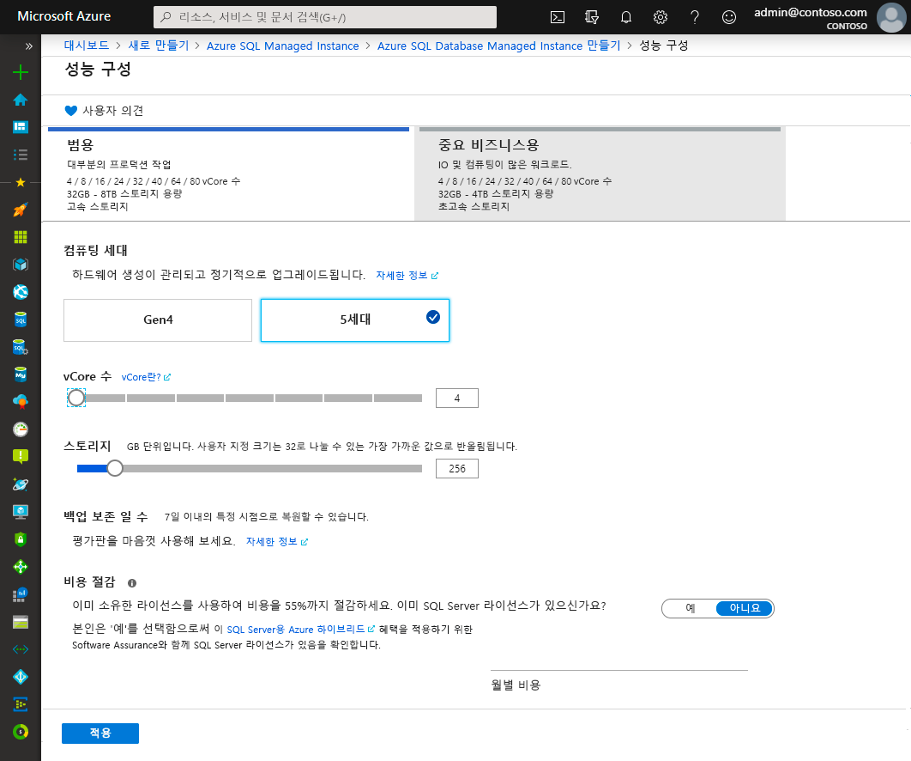

- SQL Managed Instance를 만들기 전에 선택 항목을 검토하려면 **검토 + 만들기**를 선택합니다. 또는 네트워킹 옵션을 구성할 수 있도록 **다음: 네트워킹**을 선택합니다.

### 네트워킹 탭

- **네트워킹** 탭에서 선택적 정보를 입력합니다. 이 정보를 생략하면 포털에서 기본 설정이 적용됩니다.

   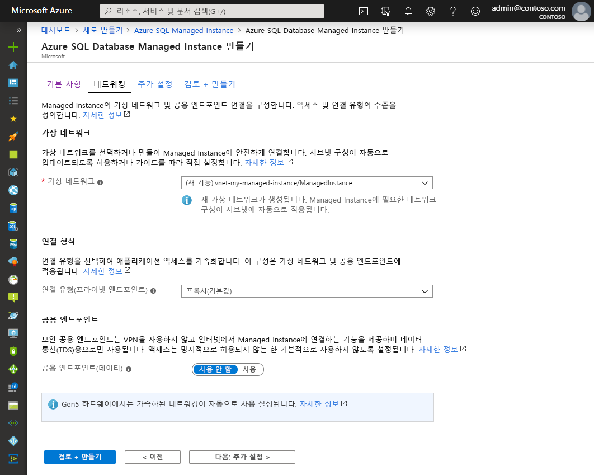

   아래 표를 사용하여 이 탭에 필요한 정보를 참조합니다.

   | 설정| 제안 값 | Description |
   | ------ | --------------- | ----------- |
   | **가상 네트워크** | **새 가상 네트워크 만들기** 또는 유효한 가상 네트워크 및 서브넷을 선택합니다.| 네트워크 또는 서브넷을 사용할 수 없는 경우 [네트워크 요구 사항을 충족하도록 수정](vnet-existing-add-subnet.md)해야만 새 관리형 인스턴스의 대상으로 선택할 수 있습니다. SQL Managed Instance의 네트워크 환경을 구성하기 위한 요구 사항에 대한 자세한 내용은 [SQL Managed Instance에 대한 가상 네트워크 구성](connectivity-architecture-overview.md)을 참조하세요. |
   | **연결 형식** | 프록시 또는 리디렉션 연결 형식 중에 선택합니다.|연결 형식에 대한 자세한 내용은 [Azure SQL Managed Instance 연결 형식](../database/connectivity-architecture.md#connection-policy)을 참조하세요.|
   | **공용 엔드포인트**  | **사용**을 선택합니다. | 공용 데이터 엔드포인트를 통해 관리형 인스턴스에 액세스할 수 있도록 하려면 이 옵션을 활성화해야 합니다. | 
   | **다음에서 액세스 허용**(**공용 엔드포인트**를 사용하는 경우) | 옵션 중 하나를 선택합니다.   |포털 환경에서 공용 엔드포인트를 사용하여 보안 그룹을 구성할 수 있습니다.     시나리오에 따라 다음 옵션 중 하나를 선택합니다.   <ul> <li>**Azure 서비스**: Power BI 또는 다른 다중 테넌트 서비스에서 연결하는 경우 이 옵션을 사용하는 것이 좋습니다. </li> <li> **인터넷**: 관리형 인스턴스를 신속하게 가동하려는 경우에 테스트 용도로 사용합니다. 프로덕션 환경에는 권장하지 않습니다. </li> <li> **액세스 권한 없음**: 이 옵션은 **거부** 보안 규칙을 만듭니다. 공용 엔드포인트를 통해 관리형 인스턴스에 액세스할 수 있도록 이 규칙을 수정합니다. </li> </ul>   퍼블릭 엔드포인트 보안에 대한 자세한 내용은 [퍼블릭 엔드포인트를 통해 Azure SQL Managed Instance를 안전하게 사용](public-endpoint-overview.md)을 참조하세요.|

- **검토 + 만들기**를 선택하여 관리형 인스턴스를 만들기 전에 선택 항목을 검토합니다. 또는 **다음: 추가 설정**을 선택하여 사용자 지정 설정을 더 많이 구성합니다.

### 추가 설정

- **추가 설정** 탭에서 선택적 정보를 입력합니다. 이 정보를 생략하면 포털에서 기본 설정이 적용됩니다.

   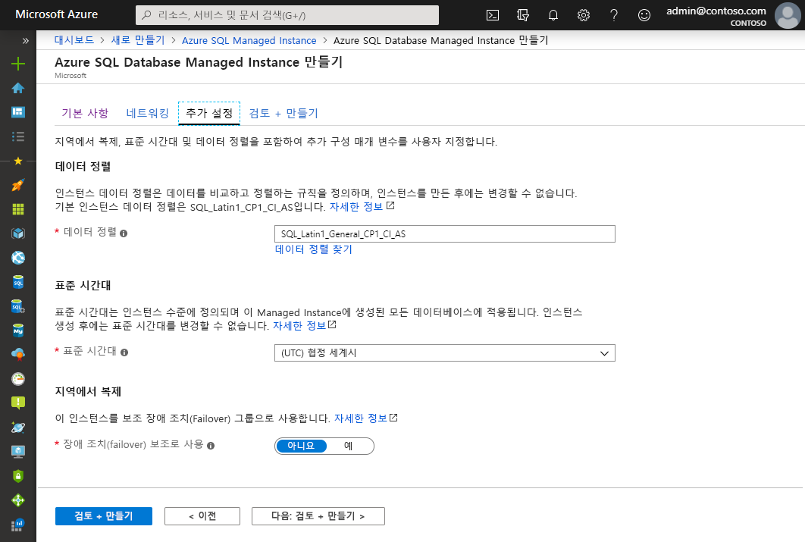

   아래 표를 사용하여 이 탭에 필요한 정보를 참조합니다.

   | 설정| 제안 값 | Description |
   | ------ | --------------- | ----------- |
   | **데이터 정렬** | 관리형 인스턴스에 사용할 데이터 정렬을 선택합니다. SQL Server에서 데이터베이스를 마이그레이션하는 경우 `SELECT SERVERPROPERTY(N'Collation')` 명령으로 원본 데이터 정렬을 확인하고 해당 값을 사용합니다.| 데이터 정렬에 대한 자세한 내용은 [서버 데이터 정렬 설정 또는 변경](https://docs.microsoft.com/sql/relational-databases/collations/set-or-change-the-server-collation)을 참조하세요.|   
   | **표준 시간대** | 관리형 인스턴스에 사용할 표준 시간대를 선택합니다.|자세한 내용은 [표준 시간대](timezones-overview.md)를 참조하세요.|
   | **보조 장애 조치(failover)로 사용** | **예**를 선택합니다. | 관리형 인스턴스를 장애 조치(failover) 그룹 보조로 사용하려면 이 옵션을 활성화합니다.|
   | **기본 SQL Managed Instance**(**보조 장애 조치(failover)로 사용**이 **예**로 설정된 경우) | 만들려는 관리형 인스턴스와 동일한 DNS 영역에 가입할 기존 기본 관리형 인스턴스를 선택합니다. | 이 단계는 장애 조치(failover) 그룹의 생성 후 구성이 가능하도록 설정합니다. 자세한 내용은 [자습서: 장애 조치(failover) 그룹에 관리형 인스턴스 추가](failover-group-add-instance-tutorial.md)를 참조하세요.|

## 검토 + 만들기

1. **검토 + 만들기** 탭을 선택하여 관리형 인스턴스를 만들기 전에 선택 항목을 검토합니다.

   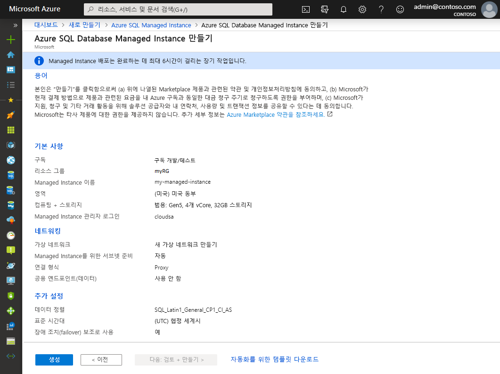

1. **만들기**를 선택하여 관리형 인스턴스를 프로비저닝하기 시작합니다.

> [!IMPORTANT]
> 관리형 인스턴스 배포는 장기 실행 작업입니다. 서브넷에서 첫 번째 인스턴스를 배포하려면 기존 관리형 인스턴스가 있는 서브넷에 배포하는 것보다 일반적으로 훨씬 오래 걸립니다. 평균적인 프로비저닝 시간에 대한 내용은 [SQL Managed Instance 관리 작업](sql-managed-instance-paas-overview.md#management-operations)을 참조하세요.

## 배포 진행률 모니터링

1. **알림** 아이콘을 선택하여 배포 상태를 확인합니다.

   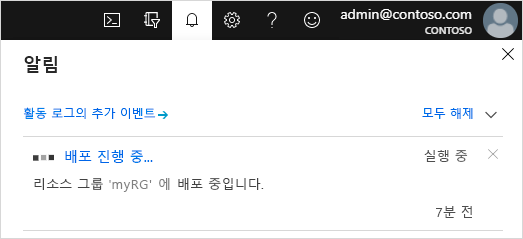

1. 알림에서 **배포 진행 중**을 선택하여 SQL Managed Instance 창을 열고 배포 진행 상황을 자세히 모니터링합니다. 

> [!TIP]
> 웹 브라우저를 닫았거나 배포 진행률 화면에서 벗어난 경우에는 다음 단계에 따라 배포 진행률 화면을 찾습니다.
> 1. Azure Portal에서 SQL Managed Instance를 배포할 리소스 그룹(**기본** 탭)을 엽니다.
> 2. **배포**를 선택합니다.
> 3. 진행 중인 SQL Managed Instance 배포 작업을 선택합니다.

> [!IMPORTANT]
> - SQL Managed Instance 만들기는 상황에 따라 한 번에 몇 시간이 걸릴 수 있는 장기 실행 작업입니다. 일반적인 생성 시간은 [관리 작업 기간](management-operations-overview.md#management-operations-duration)을 참조하세요.
> - 동일한 서브넷의 다른 Managed Instance에 대한 장기 실행 복원 또는 스케일링 작업과 같이 영향을 주는 다른 작업이 있는 경우 SQL Managed Instance 만들기 시작이 지연될 수 있습니다. 자세한 내용은 [관리 작업 상호 영향](management-operations-overview.md#management-operations-cross-impact)을 참조하세요.
> - 관리형 인스턴스 만들기 상태를 가져오려면 리소스 그룹에 대해 **읽기 권한**이 있어야 합니다. 관리형 인스턴스가 생성되는 동안 이 권한이 없거나 취소되면 SQL Managed Instance가 리소스 그룹 배포 목록에 표시되지 않을 수 있습니다.
>

## 만든 리소스 보기

관리형 인스턴스가 성공적으로 배포되면 생성된 리소스를 볼 수 있습니다.

1. 관리형 인스턴스의 리소스 그룹을 엽니다. 

   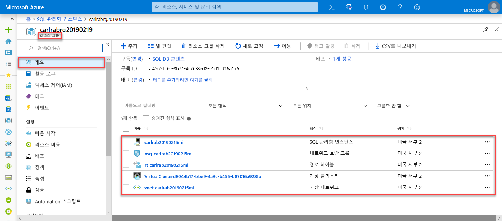

## 네트워크 설정 보기 및 미세 조정

필요에 따라 네트워킹 설정을 미세 조정하려면 다음을 검사합니다.

1. 자동으로 생성된 UDR(사용자 정의 경로)을 검토할 경로 테이블을 선택합니다.

   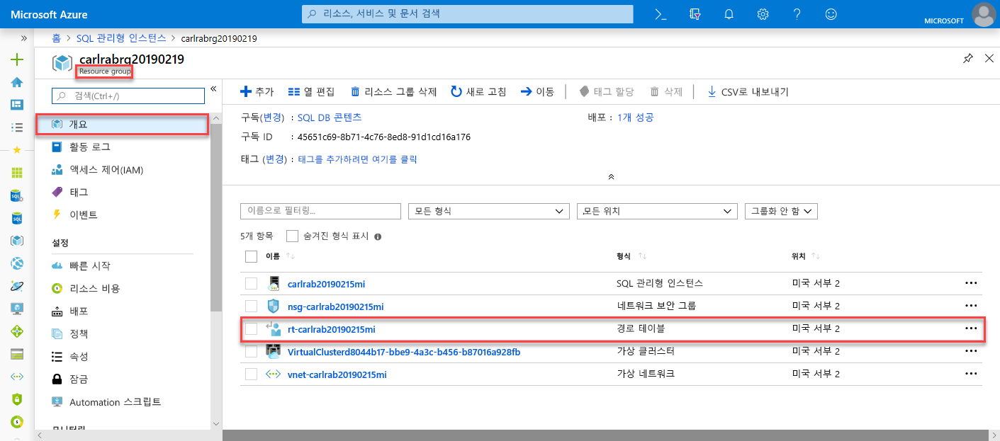

2. 경로 테이블에서는 SQL Managed Instance의 가상 네트워크 내에서 트래픽을 라우팅할 항목을 검토합니다. 경로 테이블을 수동으로 만들거나 구성하는 경우 SQL Managed Instance 경로 테이블에 이러한 항목을 만들어야 합니다.

   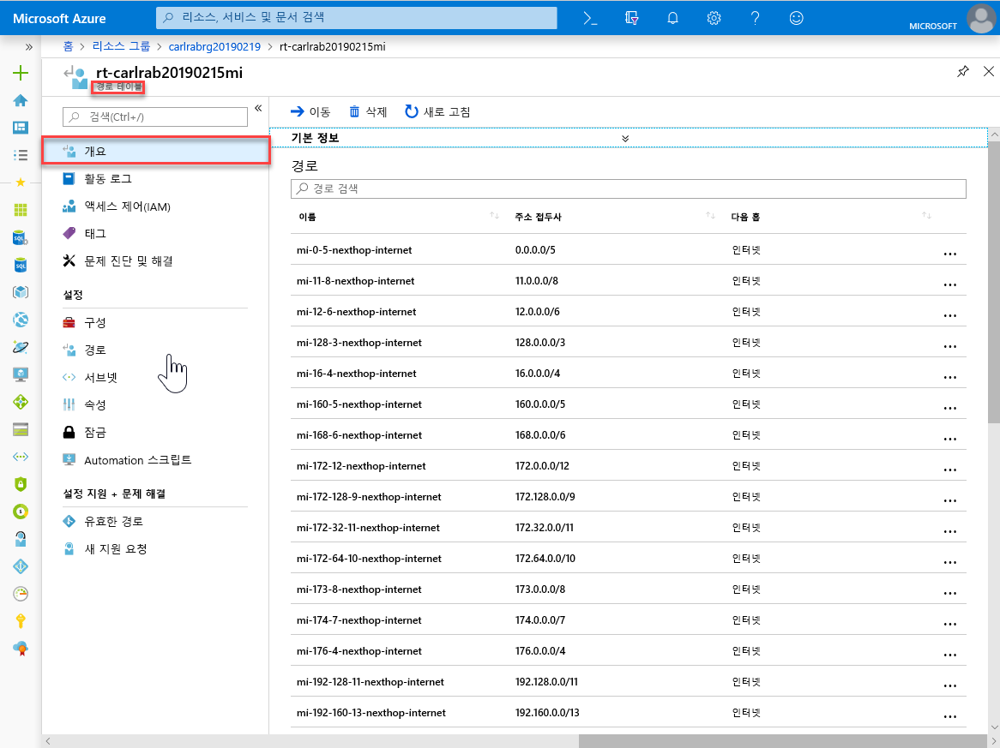

3. 리소스 그룹으로 돌아가서, 네트워크 보안 그룹을 선택합니다.

   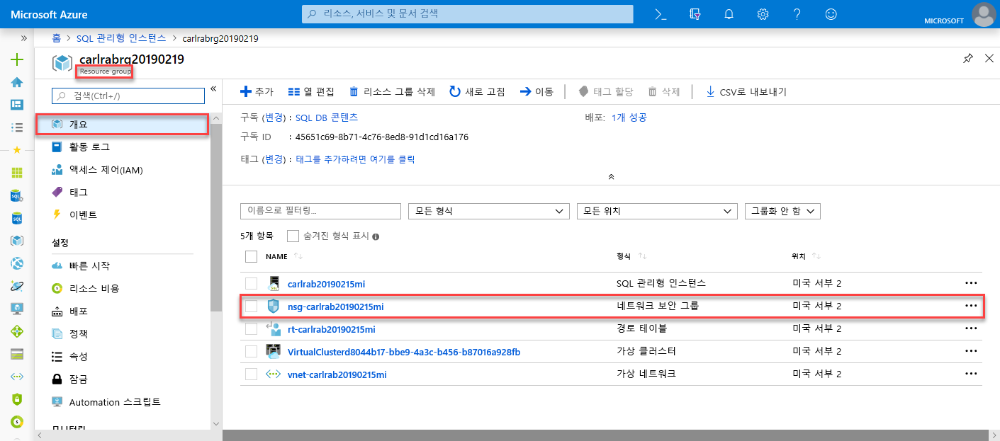

4. 인바운드 및 아웃바운드 보안 규칙을 검토합니다. 

   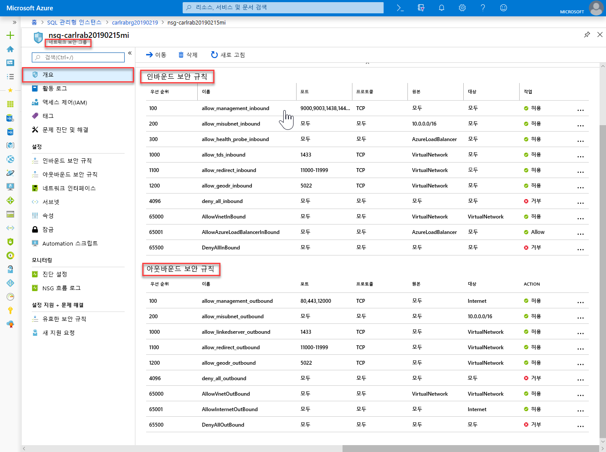

> [!IMPORTANT]
> SQL Managed Instance에 대해 퍼블릭 엔드포인트를 구성한 경우 포트를 열어 네트워크 트래픽을 허용하는 방식으로 SQL Managed Instance에 대한 공용 인터넷의 연결을 허용해야 합니다. [SQL Managed Instance의 퍼블릭 엔드포인트 구성](public-endpoint-configure.md#allow-public-endpoint-traffic-on-the-network-security-group)에서 자세한 내용을 참조하세요.
>

## SQL Managed Instance에 대한 연결 세부 정보 검색

SQL Managed Instance에 연결하려면 다음 단계를 수행하여 호스트 이름 및 FQDN(정규화된 도메인 이름)을 검색합니다.

1. 리소스 그룹으로 돌아가 관리되는 인스턴스를 선택합니다.

   

2. **개요** 탭에서 **호스트** 속성을 찾습니다. 다음 빠른 시작에서 사용할 수 있도록 관리형 인스턴스의 호스트 이름을 복사합니다.

   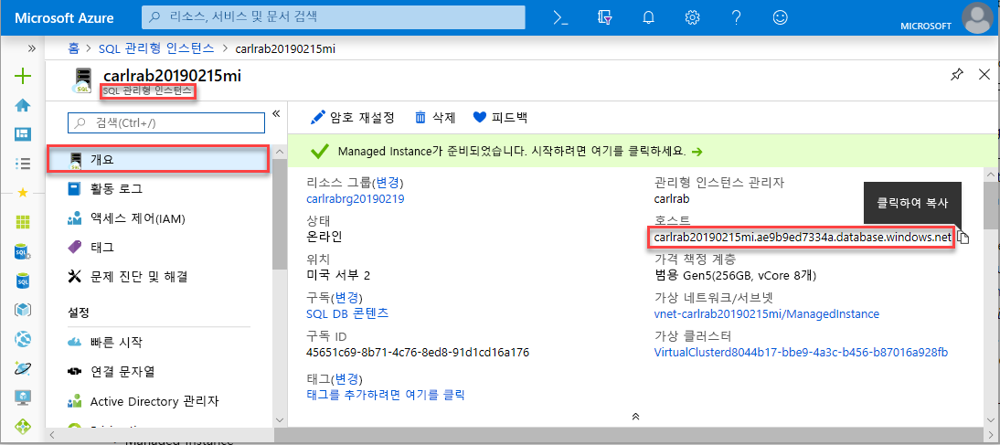

   복사된 값은 SQL Managed Instance에 연결하는 데 사용할 수 있는 FQDN(정규화된 도메인 이름)을 나타냅니다. 이는 *your_host_name.a1b2c3d4e5f6.database.windows.net*과 같은 주소 예제와 유사합니다.

## 다음 단계

SQL Managed Instance에 연결하는 방법은 다음 항목을 참조하세요.
- 애플리케이션의 연결 옵션 개요는 [애플리케이션을 SQL Managed Instance에 연결](connect-application-instance.md)을 참조하세요.
- Azure 가상 머신에서 SQL Managed Instance에 연결하는 방법을 보여 주는 빠른 시작은 [Azure 가상 머신 연결 구성](connect-vm-instance-configure.md)을 참조하세요.
- 온-프레미스 클라이언트 컴퓨터에서 지점 및 사이트 간 연결을 사용하여 SQL Managed Instance에 연결하는 방법을 보여 주는 빠른 시작은 [지점 및 사이트 간 연결 구성](point-to-site-p2s-configure.md)을 참조하세요.

기존의 온-프레미스 SQL Server 데이터베이스를 SQL Managed Instance에 복원하려면 다음을 수행합니다. 
- [마이그레이션용 Azure Database Migration Service](../../dms/tutorial-sql-server-to-managed-instance.md)를 사용하여 데이터베이스 백업 파일에서 복원합니다. 
- [T-SQL RESTORE 명령](restore-sample-database-quickstart.md)을 사용하여 데이터베이스 백업 파일에서 복원합니다.

기본 제공 문제 해결 인텔리전스를 사용하는 SQL Managed Instance 데이터베이스의 고급 성능 모니터링에 대해 자세히 알아보려면 [Azure SQL 분석을 사용하여 Azure SQL Managed Instance 모니터링](../../azure-monitor/insights/azure-sql.md)을 참조하세요.
