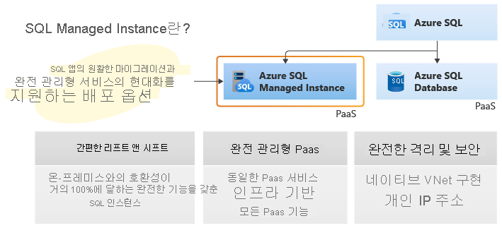

# Azure SQL Managed Instance 이란?
[!INCLUDE[appliesto-sqlmi](../includes/appliesto-sqlmi.md)]

Azure sql Managed Instance 제품군의 일부는 광범위 하 게 관리 되 고 있는 플랫폼 서비스의 모든 이점과 가장 광범위 한 SQL Server 데이터베이스 엔진 호환성을 결합 하는 확장 가능한 인텔리전트 클라우드 데이터베이스 서비스입니다. SQL Managed Instance는 최신 SQL Server (Enterprise Edition) 데이터베이스 엔진과 100% 호환성을 제공 하 고, 일반적인 보안 문제를 해결 하는 기본 [VNet (가상 네트워크](../../virtual-network/virtual-networks-overview.md) ) 구현을 제공 하 고, 기존 SQL Server 고객에 게 적합 한 [비즈니스 모델](https://azure.microsoft.com/pricing/details/sql-database/) 을 제공 합니다. SQL Managed Instance를 사용 하면 기존 SQL Server 고객이 응용 프로그램 및 데이터베이스를 최소한으로 변경 하 여 온-프레미스 응용 프로그램을 클라우드로 리프트 앤 시프트 할 수 있습니다. 동시에 SQL Managed Instance는 관리 오버 헤드 및 TCO를 크게 줄이는 모든 PaaS 기능 (자동 패치 및 버전 업데이트, [자동화 된 백업](../database/automated-backups-overview.md), [고가용성](../database/high-availability-sla.md))을 유지 합니다.

> [!IMPORTANT]
> SQL Managed Instance 현재 사용할 수 있는 지역 목록은 [지원 되는 지역](resource-limits.md#supported-regions)을 참조 하세요.

다음 다이어그램에서는 SQL Managed Instance의 주요 기능을 간략하게 설명 합니다.

Azure SQL Managed Instance은 최대한 마이그레이션 작업을 최소화 하면서 온-프레미스 또는 IaaS, 자체 빌드 또는 ISV에서 제공 하는 많은 수의 앱을 완전히 관리 되는 PaaS 클라우드 환경으로 마이그레이션하는 고객을 위해 설계 되었습니다. 고객은 완전히 자동화 된 [Azure 데이터 마이그레이션 서비스](../../dms/tutorial-sql-server-to-managed-instance.md#create-an-azure-database-migration-service-instance)를 사용 하 여 기존 SQL Server 인스턴스를 SQL Managed Instance로 리프트 앤 시프트 할 수 있습니다 .이는 기본 VNet 지원과 함께 고객 인스턴스의 SQL Server 및 완전 한 격리를 제공 합니다.  소프트웨어 보증을 통해 [SQL Server의 Azure 하이브리드 혜택](https://azure.microsoft.com/pricing/hybrid-benefit/)를 사용 하 여 SQL Managed Instance에 대 한 할인 된 요금으로 기존 라이선스를 교환할 수 있습니다. SQL Managed Instance는 높은 보안과 풍부한 프로그래밍 영역이 필요한 SQL Server 인스턴스에 대해 클라우드의 최상의 마이그레이션 대상입니다.

## 주요 특징 및 기능

SQL Managed Instance Azure SQL Database와 SQL Server 데이터베이스 엔진 둘 다에서 사용할 수 있는 최상의 기능을 결합 합니다.

> [!IMPORTANT]
> SQL Managed Instance는 온라인 작업, 자동 계획 수정 및 기타 엔터프라이즈 성능 향상을 포함 하 여 최신 버전의 SQL Server 기능을 모두 사용 하 여 실행 됩니다. 사용 가능한 기능에 대 한 비교는 기능 비교에 설명 되어 있습니다 [. AZURE SQL Managed Instance와 SQL Server](../database/features-comparison.md)비교 합니다.

| **PaaS의 이점** | **비즈니스 연속성** |
| --- | --- |
|하드웨어를 구입하고 관리할 필요가 없음  기본 인프라 관리를 위한 오버헤드가 없음  신속한 프로비전 및 서비스 크기 조정  자동 패치 적용 및 버전 업그레이드  다른 PaaS 데이터 서비스와 통합 |99.99% 작동 시간 SLA   기본 제공 되는 [고가용성](../database/high-availability-sla.md)  [자동화된 백업](../database/automated-backups-overview.md)으로 보호되는 데이터  고객이 구성 가능한 백업 보존 기간  사용자가 시작하는 [백업](https://docs.microsoft.com/sql/t-sql/statements/backup-transact-sql?view=azuresqldb-mi-current)  지정 [시간 데이터베이스 복원](../database/recovery-using-backups.md#point-in-time-restore) 기능 |
|**보안 및 규정 준수** | **관리**|
|Isolated 환경 ([VNet 통합](connectivity-architecture-overview.md), 단일 테 넌 트 서비스, 전용 계산 및 저장소)  [TDE(투명한 데이터 암호화)](https://docs.microsoft.com/sql/relational-databases/security/encryption/transparent-data-encryption-azure-sql) [Azure Active Directory (AZURE AD) 인증](../database/authentication-aad-overview.md), Single Sign-On 지원   <a href="/sql/t-sql/statements/create-login-transact-sql?view=azuresqldb-mi-current">Azure AD 서버 보안 주체 (로그인)</a>   규정 준수 표준을 준수 Azure SQL Database  [SQL 감사](auditing-configure.md)  [Advanced Threat Protection](threat-detection-configure.md) |서비스 프로비전 및 크기 조정을 자동화하는 Azure Resource Manager API  수동 서비스 프로비전 및 크기 조정을 위한 Azure Portal 기능  데이터 마이그레이션 서비스

> [!IMPORTANT]
> Azure SQL Managed Instance는 다양 한 규정 준수 표준에 대해 인증 되었습니다. 자세한 내용은 **SQL Database**에 나열 된 SQL Managed Instance 준수 인증의 최신 목록을 찾을 수 있는 [Microsoft Azure 호환성 제공](https://servicetrust.microsoft.com/ViewPage/MSComplianceGuideV3?command=Download&downloadType=Document&downloadId=44bbae63-bf4d-4e3b-9d3d-c96fb25ec363&tab=7027ead0-3d6b-11e9-b9e1-290b1eb4cdeb&docTab=7027ead0-3d6b-11e9-b9e1-290b1eb4cdeb_FAQ_and_White_Papers)을 참조 하세요.

다음 표에서는 SQL Managed Instance의 주요 기능을 보여 줍니다.

|기능 | Description|
|---|---|
| SQL Server 버전/빌드 | SQL Server 데이터베이스 엔진 (안정적인 최신) |
| 관리되는 자동 백업 | 예 |
| 기본 제공 인스턴스/데이터베이스 모니터링 및 메트릭 | 예 |
| 자동 소프트웨어 패치 | 예 |
| 최신 데이터베이스 엔진 기능 | 예 |
| 데이터베이스당 데이터 파일(행) 수 | 여러 |
| 데이터베이스당 로그 파일(로그) 수 | 1 |
| VNet - Azure Resource Manager 배포 | 예 |
| VNet - 클래식 배포 모델 | 아니요 |
| 포털 지원 | 예|
| 기본 제공 통합 서비스(SSIS) | 아니요 - SSIS는 [Azure Data Factory PaaS](https://docs.microsoft.com/azure/data-factory/tutorial-deploy-ssis-packages-azure)의 일부입니다. |
| 기본 제공 분석 서비스(SSAS) | 아니요 - SSAS는 별도의 [PaaS](https://docs.microsoft.com/azure/analysis-services/analysis-services-overview)입니다. |
| 기본 제공 보고 서비스(SSRS) | 아니요-대신 [페이지를 매긴 보고서 Power BI](https://docs.microsoft.com/power-bi/paginated-reports/paginated-reports-report-builder-power-bi) 사용 하거나 Azure VM에서 SSRS를 호스팅합니다. SQL Managed Instance SSRS를 서비스로 실행할 수는 없지만 SQL Server 인증을 사용 하 여 Azure 가상 머신에 설치 된 보고 서버용 [ssrs 카탈로그 데이터베이스](https://docs.microsoft.com/sql/reporting-services/install-windows/ssrs-report-server-create-a-report-server-database#database-server-version-requirements) 를 호스트할 수 있습니다. |
|||

## vCore 기반 구매 모델

SQL Managed Instance에 대 한 [Vcore 기반 구매 모델](../database/service-tiers-vcore.md) 은 유연성, 제어, 투명성 및 온-프레미스 워크 로드 요구 사항을 클라우드로 변환 하는 간단한 방법을 제공 합니다. 이 모델을 사용하면 워크로드 요구 사항에 따라 컴퓨팅, 메모리 및 스토리지를 선택할 수 있습니다. VCore 모델은 SQL Server [Azure 하이브리드 혜택](https://azure.microsoft.com/pricing/hybrid-benefit/) 으로 최대 55%까지 비용을 절감할 수 있습니다.

VCore 모델에서 하드웨어 세대 중에서 선택할 수 있습니다.

- **Gen4** 논리 Cpu는 Intel E5-2673 V3 (haswell) 2.4 g h z 프로세서, 연결 된 SSD, 실제 코어, 코어 당 8gb RAM 및 계산 크기 (8 ~ 24 개 vcores)를 기반으로 합니다.
- **Gen5** 논리 Cpu는 intel E5-2673 V4 (Broadwell) 2.3 GHz 및 intel SP-8160 (Skylake) 프로세서, FAST NVMe SSD, 하이퍼 스레드 논리 코어 및 4 개에서 80 코어 사이의 계산 크기를 기반으로 합니다.

[SQL Managed Instance 리소스 제한](resource-limits.md#hardware-generation-characteristics)에서 하드웨어 생성 간의 차이점에 대 한 자세한 정보를 찾습니다.

## 서비스 계층

SQL Managed Instance는 두 가지 서비스 계층으로 제공 됩니다.

- **범용: 일반적인**성능 및 i/o 대기 시간 요구 사항이 있는 응용 프로그램을 위해 설계 되었습니다.
- **중요 업무용**: 작업에 대 한 기본 유지 관리 작업의 최소 영향 및 낮은 i/o 대기 시간 요구 사항이 있는 응용 프로그램을 위해 설계 되었습니다.

두 서비스 계층은 모두 99.99% 가용성을 보장하며 스토리지 크기와 컴퓨팅 용량을 독립적으로 선택할 수 있습니다. Azure SQL Managed Instance의 고가용성 아키텍처에 대 한 자세한 내용은 [고가용성 및 AZURE sql Managed Instance](../database/high-availability-sla.md)를 참조 하세요.

### 범용 서비스 계층

다음 목록에서는 범용 서비스 계층의 주요 특징을 설명 합니다.

- 일반적인 성능 요구 사항으로 대부분의 비즈니스 응용 프로그램을 위해 설계 되었습니다.
- 고성능 Azure Blob Storage(8TB)
- 안정적인 Azure Blob storage 및 [azure Service Fabric](../../service-fabric/service-fabric-overview.md) 를 기반으로 하는 기본 제공 [고가용성](../database/high-availability-sla.md#basic-standard-and-general-purpose-service-tier-availability)

자세한 내용은 [범용 계층의 저장소 계층](https://medium.com/azure-sqldb-managed-instance/file-layout-in-general-purpose-azure-sql-managed-instance-cf21fff9c76c) 및 [SQL Managed Instance에 대 한 저장소 성능 모범 사례 및 고려 사항 (범용)](https://blogs.msdn.microsoft.com/sqlcat/2018/07/20/storage-performance-best-practices-and-considerations-for-azure-sql-db-managed-instance-general-purpose/)을 참조 하세요.

[SQL Managed Instance 리소스 제한](resource-limits.md#service-tier-characteristics)에서 서비스 계층 간의 차이점에 대 한 자세한 정보를 찾아봅니다.

### 중요 비즈니스 서비스 계층

중요 비즈니스용 서비스 계층은 i/o 요구 사항이 높은 응용 프로그램을 위해 빌드됩니다. 여러 개의 격리 된 복제본을 사용 하 여 오류에 대 한 가장 높은 복원 력을 제공 합니다.

다음 목록에서는 중요 비즈니스용 서비스 계층의 주요 특징을 설명합니다.

- 최고의 성능과 HA 요구 사항을 가진 대부분의 비즈니스 애플리케이션용으로 설계됨
- 초고속 로컬 SSD 스토리지(4세대의 최대 1TB 및 5세대의 최대 4TB)와 함께 제공됨
- [Always On 가용성 그룹](https://docs.microsoft.com/sql/database-engine/availability-groups/windows/always-on-availability-groups-sql-server) 및 [Azure Service Fabric](../../service-fabric/service-fabric-overview.md) 를 기반으로 하는 기본 제공 [고가용성](../database/high-availability-sla.md#premium-and-business-critical-service-tier-availability)
- 보고 및 기타 읽기 전용 작업에 사용할 수 있는 기본 제공 추가 [읽기 전용 데이터베이스 복제본](../database/read-scale-out.md)
- 고성능 요구 사항이 있는 워크로드에 사용할 수 있는 [메모리 내 OLTP](../in-memory-oltp-overview.md)  

[SQL Managed Instance 리소스 제한](resource-limits.md#service-tier-characteristics)에서 서비스 계층 간의 차이점에 대 한 자세한 정보를 찾아봅니다.

## 관리 작업

Azure SQL Managed Instance은 새로운 관리 되는 인스턴스를 자동으로 배포 하 고, 인스턴스 속성을 업데이트 하 고, 더 이상 필요 하지 않은 경우 인스턴스를 삭제 하는 데 사용할 수 있는 관리 작업을 관리 작업에 대 한 자세한 설명은 관리 [되는 인스턴스 관리 작업 개요](management-operations-overview.md) 페이지에서 찾을 수 있습니다.

## 고급 보안 및 규정 준수

SQL Managed Instance는 Azure 플랫폼과 SQL Server 데이터베이스 엔진에서 제공 하는 고급 보안 기능과 함께 제공 됩니다.

### 보안 격리

SQL Managed Instance는 Azure 플랫폼의 다른 테 넌 트에서 추가 보안 격리를 제공 합니다. 보안 격리에는 다음이 포함됩니다.

- Azure Express 경로 또는 VPN Gateway를 사용 하 여 [기본 가상 네트워크 구현](connectivity-architecture-overview.md) 및 온-프레미스 환경에 연결
- 기본 배포에서 SQL 끝점은 개인 IP 주소를 통해서만 노출 되므로 개인 Azure 또는 하이브리드 네트워크에서 안전 하 게 연결할 수 있습니다.
- 전용 기본 인프라(컴퓨팅, 스토리지)를 제공하는 단일 테넌트

다음 다이어그램은 애플리케이션에 대한 다양한 연결 옵션을 설명합니다.

  

서브넷 수준의 VNet 통합 및 네트워킹 정책 적용에 대한 자세한 내용은 [Managed Instance에 대한 VNet 아키텍처](connectivity-architecture-overview.md) 및 [애플리케이션을 Managed Instance에 연결](connect-application-instance.md)을 참조하세요.

> [!IMPORTANT]
> 보안 요구 사항에 따라 허용 되는 동일한 서브넷에 여러 관리 되는 인스턴스를 추가 하면 추가적인 이점이 있습니다. 동일한 서브넷에 인스턴스를 배치 하면 네트워크 인프라 유지 관리가 상당히 간소화 되 고 인스턴스 프로 비전 시간이 단축 됩니다 .이는 긴 프로 비전 기간이 서브넷의 첫 번째 관리 되는 인스턴스를 배포 하는 비용과 연결 되기 때문입니다.

### 보안 기능

Azure SQL Managed Instance는 데이터를 보호 하는 데 사용할 수 있는 고급 보안 기능 집합을 제공 합니다.

- [SQL Managed Instance 감사](auditing-configure.md) 는 데이터베이스 이벤트를 추적 하 고 Azure 저장소 계정에 배치 된 감사 로그 파일에 기록 합니다. 감사는 규정 준수를 유지 관리하고, 데이터베이스 작업을 이해하고, 비즈니스 문제나 의심스러운 보안 위반을 나타낼 수 있는 불일치 및 이상 활동을 파악하는 데 도움이 될 수 있습니다.
- 동작 SQL Managed Instance의 데이터 암호화는 전송 계층 보안을 사용 하 여 동작에서 데이터에 대 한 암호화를 제공 하 여 데이터를 보호 합니다. 전송 계층 보안 외에도 SQL Managed Instance는 [Always Encrypted](/sql/relational-databases/security/encryption/always-encrypted-database-engine)를 사용 하 여 쿼리 처리 중에 중요 한 데이터의 보호를 제공 합니다. Always Encrypted 중요 한 데이터의 도난 관련 위반에 대 한 데이터 보안을 제공 합니다. 예를 들어 Always Encrypted를 사용하여 쿼리를 처리하는 동안에도 신용 카드 번호가 데이터베이스에 암호화되어 저장됩니다. 또한 해당 데이터를 처리해야 하는 권한이 부여된 직원 또는 애플리케이션에 의해 사용 시점에 암호를 해독할 수 있습니다.
- [Advanced Threat Protection](threat-detection-configure.md) 은 서비스에 기본 제공 되는 추가 보안 인텔리전스 계층을 제공 하 여 [감사](auditing-configure.md) 를 보완 하 여 데이터베이스에 액세스 하거나 악용 하려는 비정상적이 고 잠재적으로 유해한 시도를 검색 합니다. 의심스러운 활동, 잠재적 취약성 및 SQL 삽입 공격은 물론 비정상적인 데이터베이스 액세스 패턴에 대해 경고합니다. Advanced Threat Protection 경고는 [Azure Security Center](https://azure.microsoft.com/services/security-center/)에서 확인할 수 있습니다. 의심 스러운 활동의 세부 정보를 제공 하 고 위협을 조사 하 고 완화 하는 방법에 대 한 권장 조치를 제공 합니다.  
- [동적 데이터 마스킹](/sql/relational-databases/security/dynamic-data-masking) 은 권한이 없는 사용자에 게 데이터를 마스킹 하 여 중요 한 데이터 노출을 제한 합니다. 동적 데이터 마스킹을 수행하면 애플리케이션 계층에 대한 영향을 최소화하면서 표시할 중요한 데이터의 양을 지정할 수 있도록 하여 중요한 데이터에 대한 무단 액세스를 방지할 수 있습니다. 데이터베이스의 데이터는 변경되지 않으면서 지정된 데이터베이스 필드에 대한 쿼리의 결과 집합에서 중요한 데이터를 숨기는 정책 기반 보안 기능입니다.
- RLS ( [행 수준 보안](/sql/relational-databases/security/row-level-security) )를 사용 하면 쿼리를 실행 하는 사용자의 특성 (예: 그룹 멤버 자격 또는 실행 컨텍스트)에 따라 데이터베이스 테이블의 행에 대 한 액세스를 제어할 수 있습니다. RLS는 응용 프로그램의 보안 설계 및 코딩을 간소화 합니다. RLS를 사용하면 데이터 행 액세스에 대한 제한을 구현할 수 있습니다. 예를 들어 작업자가 소속 부서와 관련된 데이터 행에만 액세스하게 하거나 데이터 액세스를 관련 데이터로 제한할 수 있습니다.
- [TDE (투명 한 데이터 암호화)](/sql/relational-databases/security/encryption/transparent-data-encryption-azure-sql) 는 미사용 데이터 암호화 라고 하는 SQL Managed Instance 데이터 파일을 암호화 합니다. TDE는 데이터 및 로그 파일에 대한 실시간 I/O 암호화 및 암호 해독을 수행합니다. 암호화에는 복구 중에 사용 가능하도록 데이터베이스 부트 레코드에 저장된 DEK(데이터베이스 암호화 키)가 사용됩니다. 투명한 데이터 암호화를 사용하여 Managed Instance의 모든 데이터베이스를 보호할 수 있습니다. TDE는 저장소 미디어 도난 으로부터 보호 하기 위해 다양 한 규정 준수 표준에 필요한 SQL Server의 검증 된 암호화 기반 기술입니다.

암호화 된 데이터베이스를 SQL Managed Instance로 마이그레이션하는 것은 Azure Database Migration Service 또는 기본 복원을 통해 지원 됩니다. 기본 복원을 사용 하 여 암호화 된 데이터베이스를 마이그레이션할 계획인 경우 기존 TDE 인증서를 SQL Server 인스턴스에서 SQL Managed Instance로 마이그레이션하는 것이 필수 단계입니다. 마이그레이션 옵션에 대 한 자세한 내용은 [SQL SERVER SQL Managed Instance로 마이그레이션을](migrate-to-instance-from-sql-server.md)참조 하세요.

## Azure Active Directory 통합

SQL Managed Instance는 Azure AD와 통합 된 기존 SQL Server 데이터베이스 엔진 로그인 및 로그인을 지원 합니다. Azure AD 서버 보안 주체 (로그인) (**공개 미리 보기**)는 온-프레미스 환경에서 사용 하는 온-프레미스 데이터베이스 로그인의 azure 클라우드 버전입니다. Azure AD 서버 보안 주체 (로그인)를 사용 하면 동일한 관리 되는 인스턴스 내에서 데이터베이스 간 쿼리를 포함 하 여 인스턴스 수준 작업을 수행할 수 있는 진정한 인스턴스 범위 보안 주체로 Azure AD 테 넌 트의 사용자 및 그룹을 지정할 수 있습니다.

**외부 공급자에서**Azure AD 서버 보안 주체 (로그인)를 만들기 위해 새 구문이 도입 되었습니다. 구문에 대 한 자세한 내용은 <a href="/sql/t-sql/statements/create-login-transact-sql?view=azuresqldb-mi-current">로그인 만들기</a>를 참조 하 고 [SQL Managed Instance에 대 한 Azure Active Directory 관리자 프로 비전](../database/authentication-aad-configure.md#provision-azure-ad-admin-sql-managed-instance) 문서를 검토 하세요.

### Azure Active Directory 통합 및 다단계 인증

SQL Managed Instance를 사용 하면 [Azure Active Directory 통합](../database/authentication-aad-overview.md)으로 데이터베이스 사용자 및 기타 Microsoft 서비스의 id를 중앙에서 관리할 수 있습니다. 이 기능은 사용 권한 관리를 간소화하고 보안을 향상시킵니다. Azure Active Directory은 Single Sign-On 프로세스를 지 원하는 동시에 데이터 및 응용 프로그램 보안을 향상 시키기 위해 [multi-factor authentication](../database/authentication-mfa-ssms-configure.md) 을 지원 합니다.

### 인증

SQL Managed Instance 인증은 데이터베이스에 연결할 때 사용자가 자신의 id를 증명 하는 방법을 나타냅니다. SQL Managed Instance는 두 가지 유형의 인증을 지원 합니다.  

- **SQL 인증**:

  이 인증 방법은 사용자 이름과 암호를 사용합니다.
- **Azure Active Directory 인증**:

  이 인증 방법은 Azure Active Directory에서 관리하는 ID를 사용하며, 관리되는 도메인과 통합된 도메인에 대해 지원됩니다. [가능한 경우](https://docs.microsoft.com/sql/relational-databases/security/choose-an-authentication-mode) Active Directory 인증(통합 보안)을 사용합니다.

### 권한 부여

권한 부여는 사용자가 Azure SQL Managed Instance의 데이터베이스 내에서 수행할 수 있는 작업을 나타내며, 사용자 계정의 데이터베이스 역할 멤버 자격과 개체 수준 권한으로 제어 됩니다. SQL Managed Instance는 SQL Server 2017와 동일한 권한 부여 기능을 제공 합니다.

## 데이터베이스 마이그레이션

SQL Managed Instance은 온-프레미스 또는 IaaS 데이터베이스 구현에서 대량 데이터베이스 마이그레이션을 사용 하는 사용자 시나리오를 대상으로 합니다. SQL Managed Instance는 다음과 같은 몇 가지 데이터베이스 마이그레이션 옵션을 지원 합니다.

### 백업 및 복원  

마이그레이션 방식에서는 Azure Blob Storage에 SQL을 백업합니다. Azure storage blob에 저장 된 백업은 [T-SQL RESTORE 명령을](https://docs.microsoft.com/sql/t-sql/statements/restore-statements-transact-sql?view=azuresqldb-mi-current)사용 하 여 관리 되는 인스턴스로 직접 복원할 수 있습니다.

- 와이드 세계 가져오기-표준 데이터베이스 백업 파일을 복원 하는 방법을 보여 주는 빠른 시작은 [관리 되는 인스턴스로 백업 파일 복원](restore-sample-database-quickstart.md)을 참조 하세요. 이 빠른 시작에서는 Azure Blob storage에 백업 파일을 업로드 하 고 SAS (공유 액세스 서명) 키를 사용 하 여 보호 해야 함을 보여 줍니다.
- URL에서 복원하는 방법에 대한 자세한 내용은 [URL에서 네이티브 복원](migrate-to-instance-from-sql-server.md#native-restore-from-url)을 참조하세요.

> [!IMPORTANT]
> Managed Instance에서 백업은 다른 Managed Instance로 복원될 수만 있습니다. SQL Server 인스턴스로 복원 하거나 Azure SQL Database 수 없습니다.

### Database Migration Service

Azure Database Migration Service은 가동 중지 시간을 최소화 하면서 여러 데이터베이스 소스에서 Azure 데이터 플랫폼으로 원활 하 게 마이그레이션할 수 있도록 설계 된 완전히 관리 되는 서비스입니다. 이 서비스는 기존 타사 및 SQL Server 데이터베이스를 Azure VM의 Azure SQL Database, Azure SQL Managed Instance 및 SQL Server로 이동 하는 데 필요한 작업을 간소화 합니다. [Database Migration Service를 사용 하 여 온-프레미스 데이터베이스를 SQL Managed Instance로 마이그레이션하는 방법을](https://aka.ms/migratetoMIusingDMS)참조 하세요.

## 지원되는 SQL 기능

SQL Managed Instance은 준비 된 릴리스 계획을 통해 최신 SQL Server 버전과 100% 노출 영역 호환성을 제공 하는 것을 목표로 합니다. 기능 및 비교 목록은 [sql Managed Instance 기능 비교](../database/features-comparison.md)를 참조 하 고 sql Managed Instance와 SQL Server의 t-sql 차이점 목록은 [SQL Server에서 sql Managed Instance t-sql 차이점](transact-sql-tsql-differences-sql-server.md)을 참조 하세요.

SQL Managed Instance는 SQL Server 2008 데이터베이스와의 이전 버전과의 호환성을 지원 합니다. SQL Server 2005 데이터베이스 서버에서 직접 마이그레이션은 지원 되며 마이그레이션된 SQL Server 2005 데이터베이스의 호환성 수준이 SQL Server 2008로 업데이트 됩니다.
  
다음 다이어그램에서는 SQL Managed Instance의 노출 영역 호환성을 간략하게 설명 합니다.  

### SQL Server 온-프레미스와 SQL Managed Instance의 주요 차이점

SQL Managed Instance 클라우드에서 항상 최신 상태를 유지 하는 데 도움이 됩니다. 즉, SQL Server의 일부 기능이 사용 되지 않거나, 사용 중지 되거나, 대안이 될 수 있습니다. 특정 기능이 약간 다른 방식으로 작동 하거나 완전히 제어 하지 않는 환경에서 서비스가 실행 되는 것을 도구에서 인식 해야 하는 경우가 있습니다.

몇 가지 주요 차이점은 다음과 같습니다.

- 고가용성은 [Always On 가용성 그룹](https://docs.microsoft.com/sql/database-engine/availability-groups/windows/always-on-availability-groups-sql-server)와 비슷한 기술을 사용 하 여 기본 제공 및 미리 구성 됩니다.
- 자동화 된 백업 및 지정 시간 복원만 있습니다. 고객은 `copy-only` 자동 백업 체인을 방해 하지 않는 백업을 시작할 수 있습니다.
- 전체 실제 경로를 지정 하는 것은 지원 되지 않으므로 해당 하는 모든 시나리오를 다르게 지원 해야 합니다. RESTORE DB는 이동을 지원 하지 않으며, CREATE DB는 실제 경로를 허용 하지 않고, BULK INSERT Azure blob 에서만 작동 합니다.
- SQL Managed Instance는 Windows 인증에 대 한 클라우드 대신 [AZURE AD 인증](../database/authentication-aad-overview.md) 을 지원 합니다.
- SQL Managed Instance은 메모리 내 OLTP 개체를 포함 하는 데이터베이스에 대해 XTP 파일 그룹 및 파일을 자동으로 관리 합니다.
- SQL Managed Instance는 ssis (SQL Server Integration Services)를 지원 하 고 SSIS 패키지를 저장 하는 SSIS 카탈로그 (SSISDB)를 호스팅할 수 있지만, Azure Data Factory의 IR (관리 Azure-SSIS Integration Runtime)에서 실행 됩니다. [Data Factory에서 Azure-SSIS IR 만들기를](https://docs.microsoft.com/azure/data-factory/create-azure-ssis-integration-runtime)참조 하세요. SSIS 기능을 비교 하려면 [SQL Managed Instance에 SQL Database 비교](../../data-factory/create-azure-ssis-integration-runtime.md#comparison-of-sql-database-and-sql-managed-instance)를 참조 하세요.

### 관리 기능

시스템 관리자는 SQL Managed Instance를 사용 하 여 관리 작업에 대 한 시간을 절약할 수 있습니다. 서비스에서 이러한 작업을 수행 하거나 이러한 작업을 크게 간소화 합니다. 예를 들어 [OS/RDBMS 설치 및 패치](../database/high-availability-sla.md), [동적 인스턴스 크기 조정 및 구성](../database/single-database-scale.md), [백업](../database/automated-backups-overview.md), [데이터베이스 복제](replication-between-two-instances-configure-tutorial.md) (시스템 데이터베이스 포함), [고가용성 구성](../database/high-availability-sla.md), 상태 및 [성능 모니터링](../../azure-monitor/insights/azure-sql.md) 데이터 스트림 구성이 있습니다.

자세한 내용은 [지원 되거나 지원 되지 않는 sql Managed Instance 기능 목록](../database/features-comparison.md)및 [sql Managed Instance와 SQL Server의 t-sql 차이점](transact-sql-tsql-differences-sql-server.md)을 참조 하세요.

### 관리 되는 인스턴스를 프로그래밍 방식으로 식별

다음 표에서는 Transact-sql을 통해 액세스할 수 있는 몇 가지 속성을 보여 줍니다 .이 속성을 사용 하 여 응용 프로그램이 SQL Managed Instance를 사용 하 고 있는지 검색 하 고 중요 한 속성을 검색할 수 있습니다.

|속성|값|의견|
|---|---|---|
|`@@VERSION`|Microsoft SQL Azure(RTM) - 12.0.2000.8 2018-03-07 Copyright (C) 2018 Microsoft Corporation.|이 값은 SQL Database와 같습니다. 이 **는** SQL 엔진 버전 12 (SQL Server 2014)를 나타내지 않습니다. SQL Managed Instance는 항상 사용 가능한 최신 RTM 버전의 SQL Server 보다 같거나 높은 안정적인 최신 SQL 엔진 버전을 항상 실행 합니다.  |
|`SERVERPROPERTY ('Edition')`|SQL Azure|이 값은 SQL Database와 같습니다.|
|`SERVERPROPERTY('EngineEdition')`|8|이 값은 Managed Instance를 고유하게 식별합니다.|
|`@@SERVERNAME`, `SERVERPROPERTY ('ServerName')`|`<instanceName>`.`<dnsPrefix>`.database.windows.net 형식의 전체 인스턴스 DNS 이름. 여기서 `<instanceName>`은 고객이 제공한 이름이고, `<dnsPrefix>`는 글로벌 DNS 이름의 고유성을 보장하기 위해 이름에서 자동으로 생성되는 부분(예: “wcus17662feb9ce98”)입니다.|예: my-managed-instance.wcus17662feb9ce98.database.windows.net|

## 다음 단계

- 첫 번째 관리 되는 인스턴스를 만드는 방법을 알아보려면 [빠른 시작 가이드](instance-create-quickstart.md)를 참조 하세요.
- 기능 및 비교 목록은 [SQL 일반 기능](../database/features-comparison.md)을 참조하세요.
- VNet 구성에 대 한 자세한 내용은 [SQL Managed Instance vnet 구성](connectivity-architecture-overview.md)을 참조 하세요.
- 관리 되는 인스턴스를 만들고 백업 파일에서 데이터베이스를 복원 하는 빠른 시작은 [관리 되는 인스턴스 만들기](instance-create-quickstart.md)를 참조 하세요.
- 마이그레이션을 위해 Azure Database Migration Service를 사용 하는 방법에 대 한 자습서는 [Database Migration Service를 사용 하 여 SQL Managed Instance 마이그레이션](../../dms/tutorial-sql-server-to-managed-instance.md)을 참조 하세요.
- 기본 제공 되는 문제 해결 인텔리전스를 사용 하 여 SQL Managed Instance 데이터베이스 성능에 대 한 고급 모니터링은 [Azure SQL 분석를 사용 하 여 AZURE sql Managed Instance 모니터링](../../azure-monitor/insights/azure-sql.md)을 참조 하세요.
- 가격 책정 정보는 [SQL Database 가격 책정](https://azure.microsoft.com/pricing/details/sql-database/managed/)을 참조 하세요.
