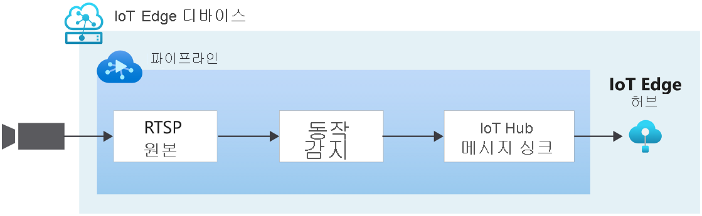

# 빠른 시작: 동작 감지 및 이벤트 내보내기

이 빠른 시작에서는 Azure Video Analyzer를 시작하는 단계를 안내합니다. Azure VM을 IoT Edge 디바이스와 시뮬레이션된 라이브 비디오 스트림으로 사용합니다. 설치 단계가 완료되면 해당 스트림의 모든 동작을 감지하고 보고하는 비디오 파이프라인을 통해 시뮬레이션된 라이브 비디오 스트림을 실행할 수 있습니다. 다음 다이어그램은 해당 파이프라인의 그래픽 표현을 보여줍니다.

> [!div class="mx-imgBorder"]
> :::image type="content" source="./media/get-started-detect-motion-emit-events/motion-detection.svg" alt-text="동작 감지":::

::: zone pivot="programming-language-csharp"
[!INCLUDE [header](includes/detect-motion-emit-events-quickstart/csharp/header.md)]
::: zone-end

::: zone pivot="programming-language-python"
[!INCLUDE [header](includes/detect-motion-emit-events-quickstart/python/header.md)]
::: zone-end

## 필수 구성 요소

::: zone pivot="programming-language-csharp"
[!INCLUDE [prerequisites](./includes/common-includes/csharp-prerequisites.md)]
::: zone-end

::: zone pivot="programming-language-python"
[!INCLUDE [prerequisites](./includes/common-includes/python-prerequisites.md)]
::: zone-end

## Azure 리소스 설정

[!INCLUDE [resources](./includes/common-includes/azure-resources.md)]

## 개요

이 다이어그램에서는 이 빠른 시작에서 어떻게 신호가 흐르는지를 보여줍니다. [에지 모듈](https://github.com/Azure/video-analyzer/tree/main/edge-modules/sources/rtspsim-live555)은 RTSP(Real-Time Streaming Protocol) 서버를 호스팅하는 IP 카메라를 시뮬레이션합니다. [RTSP 원본](pipeline.md#rtsp-source) 노드는 이 서버에서 비디오 피드를 가져와서 비디오 프레임을 [동작 감지 프로세서](pipeline.md#motion-detection-processor) 노드로 보냅니다. 동작 감지 프로세서 노드를 사용하면 라이브 비디오에서 동작을 감지할 수 있습니다. 수신되는 비디오 프레임을 검사하고 비디오에서 이동이 있는지 확인합니다. 동작이 감지되면 비디오 프레임을 파이프라인의 다음 노드에 전달하고 이벤트를 내보냅니다. 마지막으로, 내보낸 모든 이벤트는 IoT Hub에 게시된 IoT 허브 메시지 싱크로 전송됩니다.

## 개발 환경 설정

::: zone pivot="programming-language-csharp"
[!INCLUDE [setup development environment](./includes/set-up-dev-environment/csharp/csharp-set-up-dev-env.md)]
::: zone-end

::: zone pivot="programming-language-python"
[!INCLUDE [setup development environment](./includes/set-up-dev-environment/python/python-set-up-dev-env.md)]
::: zone-end

## 샘플 비디오 검토

::: zone pivot="programming-language-csharp"
[!INCLUDE [review-sample-video](./includes/detect-motion-emit-events-quickstart/csharp/review-sample-video.md)]
::: zone-end

::: zone pivot="programming-language-python"
[!INCLUDE [review-sample-video](./includes/detect-motion-emit-events-quickstart/python/review-sample-video.md)]
::: zone-end

## 샘플 파일 검사

::: zone pivot="programming-language-csharp"
[!INCLUDE [examine-sample-files](./includes/detect-motion-emit-events-quickstart/csharp/examine-sample-files.md)]
::: zone-end

::: zone pivot="programming-language-python"
[!INCLUDE [examine-sample-files](./includes/detect-motion-emit-events-quickstart/python/examine-sample-files.md)]
::: zone-end

## 배포 매니페스트 생성 및 배포

::: zone pivot="programming-language-csharp"
[!INCLUDE [generate-deploy-deployment-manifest](./includes/detect-motion-emit-events-quickstart/csharp/generate-deploy-deployment-manifest.md)]
::: zone-end

::: zone pivot="programming-language-python"
[!INCLUDE [generate-deploy-deployment-manifest](./includes/detect-motion-emit-events-quickstart/python/generate-deploy-deployment-manifest.md)]
::: zone-end

## 이벤트 모니터링 준비

::: zone pivot="programming-language-csharp"
[!INCLUDE [prepare-monitor-events](./includes/detect-motion-emit-events-quickstart/csharp/prepare-monitor-events.md)]
::: zone-end

::: zone pivot="programming-language-python"
[!INCLUDE [prepare-monitor-events](./includes/detect-motion-emit-events-quickstart/python/prepare-monitor-events.md)]
::: zone-end

## 샘플 프로그램 실행

::: zone pivot="programming-language-csharp"
[!INCLUDE [run-sample-program](./includes/detect-motion-emit-events-quickstart/csharp/run-sample-program.md)]
::: zone-end

::: zone pivot="programming-language-python"
[!INCLUDE [run-sample-program](./includes/detect-motion-emit-events-quickstart/python/run-sample-program.md)]
::: zone-end

## 결과 해석

::: zone pivot="programming-language-csharp"
[!INCLUDE [interpret-results](includes/detect-motion-emit-events-quickstart/csharp/interpret-results.md)]
::: zone-end

::: zone pivot="programming-language-python"
[!INCLUDE [interpret-results](includes/detect-motion-emit-events-quickstart/python/interpret-results.md)]
::: zone-end

## 리소스 정리

다른 빠른 시작을 시도하려면 생성된 리소스를 유지해야 합니다. 그렇지 않으면 Azure Portal에서 리소스 그룹으로 이동하고, 이 빠른 시작을 실행한 리소스 그룹을 선택한 다음, 모든 리소스를 삭제합니다.

## 다음 단계

- [사용자 고유의 모델로 라이브 비디오 분석](analyze-live-video-use-your-model-http.md) 빠른 시작에 따라 AI를 라이브 비디오 피드에 적용합니다.
- 고급 사용자에 대한 추가 문제를 검토합니다.

  - RTSP 시뮬레이터를 사용하는 대신 RTSP를 지원하는 [IP 카메라](https://en.wikipedia.org/wiki/IP_camera)를 사용합니다. [ONVIF 규격 제품](https://www.onvif.org/conformant-products/) 페이지에서 RTSP를 지원하는 IP 카메라를 찾을 수 있습니다. G, S 또는 T 프로필을 준수하는 디바이스를 찾습니다.
  - Azure에서 Linux VM을 사용하는 대신 AMD64 또는 x64 Linux 디바이스를 사용합니다. 이 디바이스는 IP 카메라와 동일한 네트워크에 있어야 합니다. [Linux에 Azure IoT Edge 런타임 설치](../../iot-edge/how-to-install-iot-edge.md?preserve-view=true&view=iotedge-2020-11)의 지침을 따릅니다. 그런 다음, [가상 Linux 디바이스에 첫 번째 IoT Edge 모듈 배포](../../iot-edge/quickstart-linux.md?preserve-view=true&view=iotedge-2020-11)의 지침에 따라 디바이스를 Azure IoT Hub에 등록합니다.
