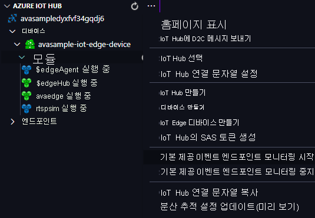

Video Analytics 에지 모듈을 사용하여 들어오는 라이브 비디오 스트림에서 동작을 감지하고 IoT Hub에 이벤트를 전송합니다. 이러한 이벤트를 보려면 다음 단계를 수행합니다.

1. Visual Studio Code에서 탐색기 창을 열고, 왼쪽 아래 모서리에서 Azure IoT Hub를 찾습니다.
1. **디바이스** 노드를 확장합니다.
1. **avasample-iot-edge-device** 를 마우스 오른쪽 단추로 클릭하고 **기본 제공 이벤트 엔드포인트 모니터링 시작** 을 선택합니다.

   

    [!INCLUDE [provide-builtin-endpoint](../../common-includes/provide-builtin-endpoint.md)]
