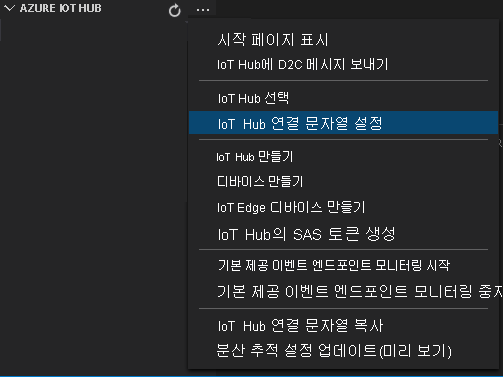
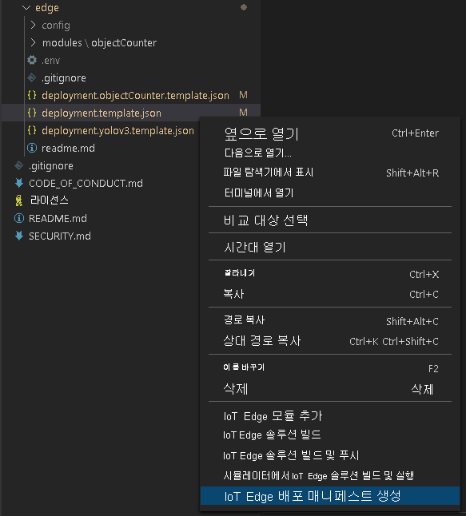

배포 매니페스트는 에지 디바이스에 배포되는 모듈을 정의합니다. 또한 해당 모듈에 대한 구성 설정을 정의합니다.

다음 단계에 따라 템플릿 파일에서 매니페스트를 생성한 다음, 에지 디바이스에 배포합니다.

1.  Visual Studio Code를 엽니다.
1.  **AZURE IOT HUB** 창 옆에 있는 **추가 작업** 아이콘을 선택하여 IoT Hub 연결 문자열을 설정합니다. _src/cloud-to-device-console-app/appsettings.json_ 파일에서 문자열을 복사할 수 있습니다.

    

    > [!NOTE]
    > IoT Hub에 대한 기본 제공 엔드포인트 정보를 제공하라는 메시지가 표시될 수 있습니다. 해당 정보를 가져오려면 Azure Portal에서 IoT Hub로 이동하여 왼쪽 탐색 창에서 **기본 제공 엔드포인트** 옵션을 찾습니다. 여기를 클릭하고 **Event Hub 호환 엔드포인트** 섹션에서 **Event Hub 호환 엔드포인트** 를 찾습니다. 상자의 텍스트를 복사하여 사용합니다. 엔드포인트는 다음과 같이 표시됩니다.  `Endpoint=sb://iothub-ns-xxx.servicebus.windows.net/;SharedAccessKeyName=iothubowner;SharedAccessKey=XXX;EntityPath=<IoT Hub name>`

1.  **src/edge/deployment.template.json** 을 마우스 오른쪽 단추로 클릭하고 **IoT Edge 배포 매니페스트 생성** 을 선택합니다.

    

    이렇게 하면 _src/edge/config_ 폴더에 _deployment.amd64.json_ 이라는 매니페스트 파일이 생성됩니다.

1.  **src/edge/config/deployment.amd64.json** 을 마우스 오른쪽 단추로 클릭하고 **단일 디바이스용 배포 만들기** 를 선택하고 에지 디바이스의 이름을 선택합니다.

    

1.  IoT Hub 디바이스를 선택하라는 메시지가 표시되면 드롭다운 메뉴에서 **avasample-iot-edge-device** 를 선택합니다.
1.  약 30초 후 창의 왼쪽 아래 모서리에서 Azure IoT Hub를 새로 고칩니다. 이제 에지 디바이스에 다음과 같은 배포된 모듈이 표시됩니다.

    - Video Analyzer 에지 모듈(모듈 이름 `avaedge`)
    - RTSP(Real-Time Streaming Protocol) 시뮬레이터(`rtspsim` 모듈 이름)
