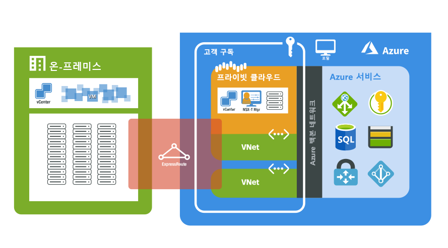

# AVS(Azure VMware 솔루션) 미리 보기란?

AVS(Azure VMware 솔루션)는 Azure에서 프라이빗 클라우드를 제공합니다. 프라이빗 클라우드에는 전용 운영 체제 미설치 Azure 인프라에서 구축된 vSphere 클러스터가 포함됩니다. 여러 클러스터를 단일 프라이빗 클라우드에 포함하는 기능을 사용하여 프라이빗 클라우드 클러스터를 3개에서 16개의 호스트로 확장할 수 있습니다. 모든 프라이빗 클라우드는 vCenter Server, VSAN, vSphere 및 NSX-T를 통해 프로비저닝됩니다. 온-프레미스 환경에서 워크로드를 마이그레이션하고, 새 가상 머신을 만들거나 배포하며, 프라이빗 클라우드에서 Azure 서비스를 사용할 수 있습니다.

AVS는 향상된 기능과 업그레이드에 대해 지속적으로 유효성을 검사하고 테스트하는 VMware 유효성이 검사된 솔루션입니다. 프라이빗 클라우드 인프라 및 소프트웨어는 Microsoft에서 관리 및 유지 관리하므로 프라이빗 클라우드에서 워크로드를 개발하고 실행하는 데 집중할 수 있습니다.

다음 다이어그램에서는 Azure, Azure 서비스 및 온-프레미스 환경에서 프라이빗 클라우드와 VNet 간의 인접성을 보여 줍니다. 프라이빗 클라우드에서 Azure 서비스 또는 VNet으로의 네트워크 액세스는 Azure 서비스 엔드포인트의 SLA 기반 통합을 제공합니다. 온-프레미스 환경의 프라이빗 클라우드 액세스는 ExpressRoute Global Reach를 프라이빗 및 보안 연결에 사용합니다.

## 호스트, 클러스터 및 프라이빗 클라우드

AVS 프라이빗 클라우드 및 클러스터는 운영 체제 미설치 하이퍼 수렴형 Azure 인프라 호스트에서 구축됩니다. 고성능 호스트에는 576GB RAM 및 듀얼 Intel 18 코어, 2.3GHz 프로세서가 있습니다. HE 호스트에는 총 15.36TB(SSD) 원시 vSAN 용량 계층 및 3.2TB(NVMe) vSAN 캐시 계층이 있는 두 개의 vSAN 디스크 그룹이 있습니다.

새 프라이빗 클라우드는 Azure Portal 또는 Azure CLI를 통해 배포됩니다.

## 네트워킹

프라이빗 클라우드가 배포되면 관리, 프로비전 및 vMotion을 위한 개인 네트워크가 만들어집니다. 이러한 개인 네트워크는 vCenter 및 NSX-T 관리자에 대한 액세스와 가상 머신 vMotion 또는 배포에 사용됩니다. 모든 개인 네트워크는 Azure의 VNet 또는 온-프레미스 환경에서 액세스할 수 있습니다. ExpressRoute Global Reach는 프라이빗 클라우드를 온-프레미스 환경에 연결하는 데 사용되며, 이 연결에는 구독 시 ExpressRoute 회로가 있는 VNet이 필요합니다.

프라이빗 클라우드가 배포되면 인터넷 및 Azure 서비스에 대한 액세스가 프로비저닝됩니다. 프로덕션 워크로드 네트워크의 VM에서 Azure 또는 인터넷 기반 서비스를 사용할 수 있도록 액세스 권한이 제공됩니다. 인터넷 액세스는 기본적으로 새 프라이빗 클라우드에 사용하지 않도록 설정되며 언제든지 사용하거나 사용하지 않도록 설정할 수 있습니다.

네트워킹 및 상호 연결에 대한 자세한 내용은 [네트워킹 개념](concepts-networking.md) 문서를 참조하세요.

## 액세스 및 보안

보안 강화를 위해 AVS 프라이빗 클라우드에서는 vSphere 역할 기반 액세스 제어를 사용합니다. vSphere SSO LDAP 기능은 Azure Active Directory와 통합할 수 있습니다. ID 및 권한에 대한 자세한 내용은 [액세스 및 ID 개념](concepts-identity.md) 문서를 참조하세요.

vSAN 저장 데이터 암호화는 기본적으로 사용하도록 설정되며, vSAN 데이터 저장소 보안을 제공하는 데 사용됩니다. [스토리지 개념](concepts-storage.md) 문서에서 자세히 설명하고 있습니다.

## 호스트 및 소프트웨어 수명 주기 유지 관리

AVS 프라이빗 클라우드 및 VMware 소프트웨어를 정기적으로 업그레이드하면 프라이빗 클라우드에서 최신 보안, 안정성 및 기능 세트가 실행됩니다. 플랫폼 유지 관리 및 업그레이드에 대한 자세한 내용은 [업그레이드 개념](concepts-upgrades.md) 문서에서 확인할 수 있습니다.

## 프라이빗 클라우드 모니터링

[Azure Monitor에서 로그](../azure-monitor/overview.md)를 사용하여 AVS 프라이빗 클라우드에서 실행되는 가상 머신의 로그를 수집할 수 있습니다. 온-프레미스 VM에서 실행하는 것과 동일한 쿼리를 사용하여 AVS 프라이빗 클라우드에서 실행되는 Linux 및 Windows 가상 머신에서 [MMA 에이전트를 다운로드하여 설치](../azure-monitor/platform/log-analytics-agent.md#installation-and-configuration)할 수 있습니다. 일반적으로 가상 머신에서 실행하는 것과 동일한 쿼리를 실행할 수 있습니다. 쿼리를 만드는 방법에 대한 자세한 내용은 [쿼리를 작성하는 방법](../azure-monitor/log-query/log-query-overview.md#how-can-i-learn-how-to-write-queries)을 참조하세요.

## 다음 단계

다음 단계에서는 주요 [프라이빗 클라우드 및 클러스터 개념](concepts-private-clouds-clusters.md)에 대해 알아봅니다.

<!-- LINKS - external -->

<!-- LINKS - internal -->
[concepts-private-clouds-clusters]: ./concepts-private-clouds-clusters.md
