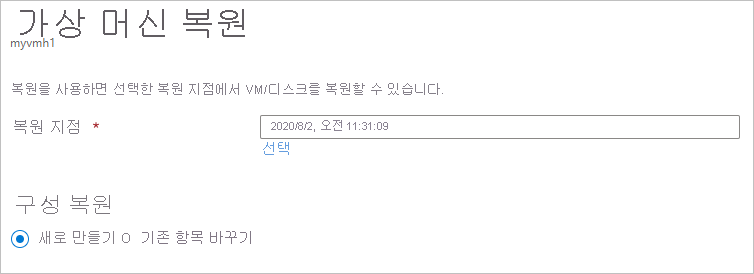
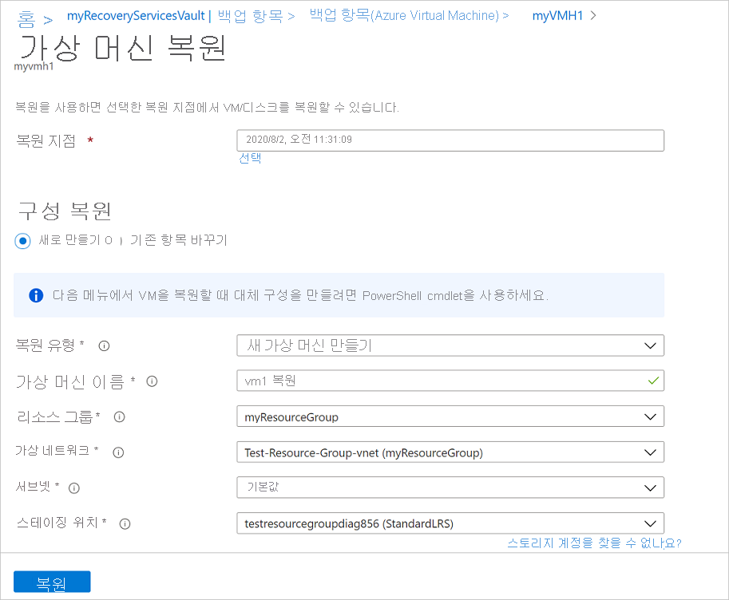
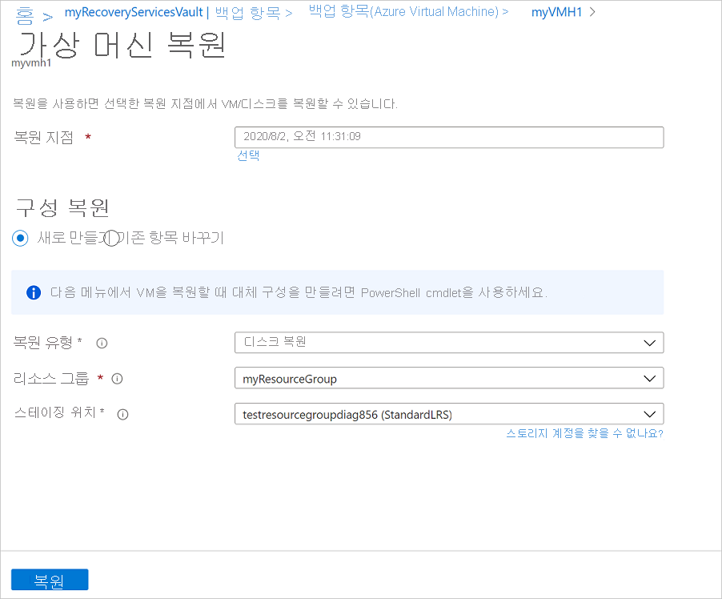
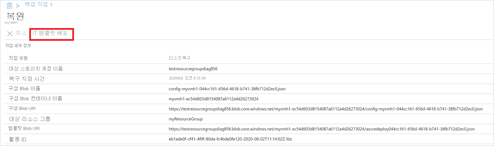
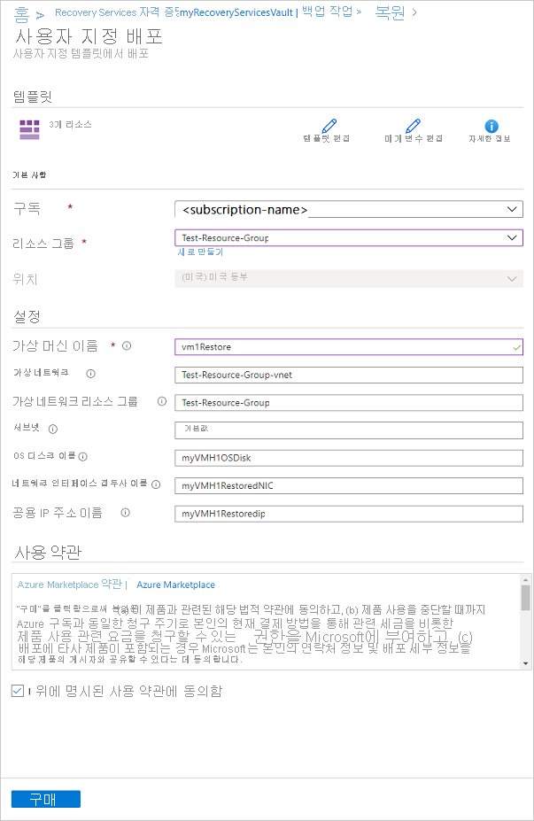
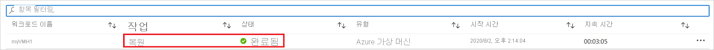

# Azure VM 복원

이 문서에서는 [Azure Backup](backup-overview.md) Recovery Services 자격 증명 모음에 저장된 복구 지점에서 Azure VM 데이터를 복원하는 방법에 대해 설명합니다.

### 복원 옵션

Azure Backup은 VM을 복원하는 다양한 방법을 제공합니다.

**복원 옵션** | **세부 정보**
--- | ---
**새 VM 만들기** | 복원 지점에서 기본 VM을 빠르게 만들고, 준비하고, 실행할 수 있습니다.   VM에 대한 이름을 지정하고, VM을 배치할 리소스 그룹과 VNet(가상 네트워크)을 선택하고, 스토리지 유형을 지정할 수 있습니다.
**디스크 복원** | 새 VM을 만드는 데 사용할 수 있는 VM 디스크를 복원합니다.   Azure Backup은 VM을 사용자 지정하고 만드는 데 도움이 되는 템플릿을 제공합니다.    이 옵션은 VHD를 지정된 스토리지 계정으로 복사합니다. 복원 작업은 다운로드하여 사용자 지정 VM 설정을 지정하고 VM을 만드는 데 사용할 수 있는 템플릿을 생성합니다.   저장소 계정 자격 증명 모음으로 동일한 위치에 있어야 합니다. 없는 경우 스토리지 계정을 만듭니다.   스토리지 계정 복제 유형이 표시됩니다. ZRS(영역 중복 스토리지)는 지원되지 않습니다.   또는 디스크를 기존 VM에 연결하거나 PowerShell을 사용하여 새 VM을 만들 수 있습니다.   이 옵션은 VM을 사용자 지정하거나, 백업 시 존재하지 않았던 구성 설정을 추가하거나, 템플릿 또는 PowerShell을 사용하여 구성해야 하는 설정을 추가하려는 경우에 유용합니다.
**기존 항목 바꾸기** | 디스크를 복원하고 이 디스크를 사용하여 기존 VM의 디스크를 바꿀 수 있습니다.   현재 VM이 있어야 합니다. VM이 삭제된 경우에는 이 옵션을 사용할 수 없습니다.   Azure Backup은 디스크를 바꾸기 전에 기존 VM의 스냅숏을 만듭니다. 스냅숏은 지정한 준비 위치에 저장됩니다. 그런 다음, 선택한 복원 지점을 사용하여 VM에 연결된 기존 디스크를 바꿉니다.   만든 스냅숏은 지정된 보존 정책에 따라 자격 증명 모음에 복사되어 유지됩니다.    기존 항목 바꾸기는 암호화되지 않은 관리 VM에 대해 지원됩니다. 관리되지 않는 디스크, [일반화된 VM](https://docs.microsoft.com/azure/virtual-machines/windows/capture-image-resource) 또는 [사용자 지정 이미지를 사용하여 만든](https://azure.microsoft.com/resources/videos/create-a-custom-virtual-machine-image-in-azure-resource-manager-with-powershell/) VM에 대해서는 지원되지 않습니다.   현재 VM보다 많거나 적은 디스크가 복원 지점에 있는 경우 복원 지점의 디스크 수에는 VM 구성만 반영됩니다.  

> [!NOTE]
> Azure VM에서 특정 파일과 폴더를 복구할 수도 있습니다. [자세히 알아보기](backup-azure-restore-files-from-vm.md).
>
> Azure VM에 대해 [최신 버전](backup-instant-restore-capability.md)의 Azure Backup을 실행하는 경우(즉시 복원이라고 함), 스냅숏은 최대 7일 동안 유지되며 백업 데이터를 자격 증명 모음으로 보내기 전에 스냅숏에서 VM을 복원할 수 있습니다. 지난 7일간의 백업에서 VM을 복원하려면 자격 증명 모음이 아니라 스냅숏에서 복원하는 것이 더 빠릅니다.

## 시작하기 전에

VM을 복원 하려면 (새 VM 만들기) 올바른 역할 기반 액세스 제어 (RBAC) 했는지 확인 [권한을](backup-rbac-rs-vault.md#mapping-backup-built-in-roles-to-backup-management-actions) VM 복원 작업에 대 한 합니다.

권한이 없는 경우 [디스크 복원](#restore-disks), 한 다음 디스크를 복원한 후 할 수 있습니다 [템플릿을 사용 하 여](#use-templates-to-customize-a-restored-vm) 새 VM을 만드는 복원 작업의 일부로 생성 된 합니다.

## 복원 지점 선택

1. 복원하려는 VM과 연결된 자격 증명 모음에서 **백업 항목**  > **Azure Virtual Machine**을 차례로 클릭합니다.
2. VM을 클릭합니다. 기본적으로 VM 대시보드에는 지난 30일간의 복구 지점이 표시됩니다. 30일 이전의 복구 지점을 표시하거나, 날짜, 시간 범위 및 다양한 유형의 스냅숏 일관성을 기준으로 복구 지점을 찾도록 필터링할 수 있습니다.
3. VM을 복원하려면 **VM 복원**을 클릭합니다.

    

4. 복구에 사용할 복원 지점을 선택합니다.

## VM 복원 구성 선택

1. **복원 구성**에서 복원 옵션을 선택합니다.
    - **새로 만들기**: 새 VM을 만들려면 이 옵션을 사용합니다. 간단한 설정으로 VM을 만들거나, 디스크를 복원하고 사용자 지정된 VM을 만들 수 있습니다.
    - **기존 항목 바꾸기**: 기존 VM의 디스크를 바꾸려면 이 옵션을 사용합니다.

        

2. 선택한 복원 옵션에 대한 설정을 지정합니다.

## VM 만들기

[복원 옵션](#restore-options) 중 하나로, 복원 지점의 기본 설정을 사용하여 VM을 빠르게 만들 수 있습니다.

1. **복원 구성** > **새로 만들기** > **복원 유형**에서 **가상 머신 만들기**를 선택합니다.
2. **가상 머신 이름**에서 구독에 없는 VM을 지정합니다.
3. **리소스 그룹**에서 새 VM에 대해 기존 리소스 그룹을 선택하거나, 새 리소스 그룹을 전역 고유 이름으로 만듭니다. 이미 있는 이름을 할당하면 Azure에서 VM과 동일한 이름을 그룹에 할당합니다.
4. **가상 네트워크**에서 VM을 배치할 VNet를 선택합니다. 구독과 연관된 모든 VNet가 표시됩니다. 서브넷을 선택합니다. 기본적으로 첫 번째 서브넷이 선택됩니다.
5. **스토리지 위치**에서 VM에 대한 스토리지 유형을 지정합니다.

    

6. **복원 구성**에서 **확인**을 선택합니다. **복원**에서 **복원**을 클릭하여 복원 작업을 트리거합니다.

## 디스크 복원

[복원 옵션](#restore-options) 중 하나로, 복원 지점에서 디스크를 만들 수 있습니다. 그런 다음, 이 디스크를 사용하여 다음 중 하나를 수행할 수 있습니다.

- 복원 작업 중에 생성된 템플릿을 사용하여 설정을 사용자 지정하고 VM 배포를 트리거합니다. 기본 템플릿 설정을 편집하고 VM 배포용 템플릿을 제출합니다.
- [복원된 디스크](https://docs.microsoft.com/azure/virtual-machines/windows/attach-managed-disk-portal)를 기존 VM에 연결합니다.
- [새 VM을 만들](https://docs.microsoft.com/azure/backup/backup-azure-vms-automation#create-a-vm-from-restored-disks) PowerShell을 사용 하 여 복원된 된 디스크에서 합니다.

1. **복원 구성** > **새로 만들기** > **복원 유형**에서 **복원 디스크**를 선택합니다.
2. **리소스 그룹**에서 복원된 디스크에 대해 기존 리소스 그룹을 선택하거나, 새 리소스 그룹을 전역 고유 이름으로 만듭니다.
3. **스토리지 계정**에서 VHD를 복사할 계정을 지정합니다. 계정이 자격 증명 모음과 동일한 지역에 있는지 확인합니다.

    

4. **복원 구성**에서 **확인**을 선택합니다. **복원**에서 **복원**을 클릭하여 복원 작업을 트리거합니다.

VM 복원 되는 동안 Azure Backup 저장소 계정을 사용 하지 않습니다. 하지만의 경우 **디스크 복원** 하 고 **즉시 복원을**, 저장소 계정은 템플릿을 저장 하는 데 사용 됩니다.

### 템플릿을 사용하여 복원된 VM 사용자 지정

디스크가 복원되면 복원 작업의 일부로 생성된 템플릿을 사용하여 새 VM을 사용자 지정하고 만듭니다.

1. 관련 작업에 대한 **복원 작업 세부 정보**를 엽니다.

2. **복원 작업 세부 정보**에서 **템플릿 배포** 단추를 클릭하여 템플릿 배포를 시작합니다.

    

3. 템플릿에 제공된 VM 설정을 사용자 지정하려면 **템플릿 편집**을 클릭합니다. 사용자 지정을 추가하려면 **매개 변수 편집**을 클릭합니다.
    - 사용자 지정 템플릿에서 리소스를 배포하는 방법에 대해 [자세히 알아보세요](../azure-resource-manager/resource-group-template-deploy-portal.md#deploy-resources-from-custom-template).
    - 템플릿 작성에 대해 [자세히 알아보세요](../azure-resource-manager/resource-group-authoring-templates.md).

   

4. VM에 대한 사용자 지정 값을 입력하고, **사용 약관**에 동의하고, **구매**를 클릭합니다.

   

## 기존 디스크 바꾸기

[복원 옵션](#restore-options) 중 하나로, 기존 VM 디스크를 선택한 복원 지점으로 바꿀 수 있습니다. 모든 복원 옵션을 [검토](#restore-options)합니다.

1. **복원 구성**에서 **기존 항목 바꾸기**를 클릭합니다.
2. **복원 유형**에서 **디스크 바꾸기**를 선택합니다. 이는 기존 VM 디스크를 바꾸는 데 사용할 복원 지점입니다.
3. **준비 위치**에서 현재 관리 디스크의 스냅숏을 저장해야 하는 위치를 지정합니다.

   

## 특별 한 구성이 있는 Vm 복원

VM을 복원해야 하는 일반적인 시나리오는 여러 가지가 있습니다.

**시나리오** | **지침**
--- | ---
**하이브리드 사용 혜택을 사용하여 VM 복원** | Windows VM에서 [HUB(하이브리드 사용 혜택) 라이선스](../virtual-machines/windows/hybrid-use-benefit-licensing.md)를 사용하는 경우, 디스크를 복원하고 제공된 템플릿(**라이선스 유형** 이 **Windows_Server**로 설정됨) 또는 PowerShell을 사용하여 새 VM을 만듭니다.  이 설정은 VM을 만든 후에 적용할 수도 있습니다.
**Azure 데이터 센터 재해 중 VM 복원** | 자격 증명 모음에서 GRS를 사용하고 VM에 대한 기본 데이터 센터의 작동이 중단되면, Azure Backup에서 쌍을 이루는 데이터 센터로 백업된 VM을 복원할 수 있습니다. 쌍을 이루는 데이터 센터에서 스토리지 계정을 선택하고 정상적으로 복원합니다. Azure Backup은 쌍을 이루는 위치에서 컴퓨팅 서비스를 사용하여 복원된 VM을 만듭니다. 데이터 센터 복원력에 대해 [자세히 알아보세요](../resiliency/resiliency-technical-guidance-recovery-loss-azure-region.md).
**단일 도메인에서 단일 도메인 컨트롤러 VM 복원** | 다른 VM과 마찬가지로 VM을 복원합니다. 다음 사항에 유의하세요.   Azure VM을 Active Directory 관점에서 다른 VM 비슷합니다.   Active Directory 복원 모드(DSRM)도 사용할 수 있으므로 모든 Directory Services 복원 모드를 실행할 수 있습니다. 가상화된 도메인 컨트롤러에 대한 백업 및 복원 고려 사항에 대해 [자세히 알아보세요](https://docs.microsoft.com/windows-server/identity/ad-ds/get-started/virtual-dc/virtualized-domain-controllers-hyper-v).
**단일 도메인에서 여러 도메인 컨트롤러 VM 복원** | 네트워크를 통해 동일한 도메인에 다른 도메인 컨트롤러에 연결할 수 경우 도메인 컨트롤러 VM 처럼 복원할 수 있습니다. 도메인에서 마지막으로 남아 있는 도메인 컨트롤러이거나 격리된 네트워크에서 복구가 수행되면 [포리스트 복구](https://docs.microsoft.com/windows-server/identity/ad-ds/manage/ad-forest-recovery-single-domain-in-multidomain-recovery)를 사용합니다.
**단일 포리스트에 여러 도메인 복원** | [포리스트 복구](https://docs.microsoft.com/windows-server/identity/ad-ds/manage/ad-forest-recovery-single-domain-in-multidomain-recovery)를 사용하는 것이 좋습니다.
**완전 복원** | Azure VM과 온-프레미스 하이퍼바이저의 주요 차이점은 Azure에서 사용할 수 있는 VM 콘솔이 없다는 것입니다. BMR(완전 복구) 유형 백업을 사용한 복구와 같은 특정 시나리오에서는 콘솔이 필요합니다. 하지만 자격 증명 모음의 VM 복원이 BMR로 완전히 대체됩니다.
**특수 네트워크 구성으로 VM 복원** | 특수 네트워크 구성에는 내부 또는 외부 부하 분산을 사용하거나, 여러 NICS를 사용하거나, 예약된 여러 IP 주소를 사용하는 VM이 포함되어 있습니다. [디스크 복원 옵션](#restore-disks)을 사용하여 이러한 VM을 복원합니다. 이 옵션을 지정 된 저장소 계정으로 Vhd의 복사본을 만듭니다 및 사용 하 여 VM을 만들 수 있습니다는 [내부](https://azure.microsoft.com/documentation/articles/load-balancer-internal-getstarted/) 하거나 [외부](https://azure.microsoft.com/documentation/articles/load-balancer-internet-getstarted/) 부하 분산 장치 [다중 NIC](../virtual-machines/windows/multiple-nics.md), 또는 [예약 된 IP 주소를 여러](../virtual-network/virtual-network-multiple-ip-addresses-powershell.md), 구성에 따라 합니다.
**C/서브넷의 네트워크 보안 그룹 (NSG)** | Azure VM backup vnet, 서브넷 및 NIC 수준에서 백업 및 복원의 NSG 정보를 지원합니다.
**영역 고정 Vm** | Azure Backup에는 영역이 설정 된 고정 된 Vm의 백업 및 복원을 지원합니다. [자세히 알아보기](https://azure.microsoft.com/global-infrastructure/availability-zones/)

## 복원 작업 추적
복원 작업이 트리거되면 백업 서비스에서 추적 작업을 만듭니다. Azure Backup에서 작업에 대한 알림을 포털에 표시합니다. 표시되지 않으면 **알림** 기호를 클릭하여 표시합니다.

 다음과 같이 복원을 추적합니다.

1. 작업에 대한 작업을 보려면 알림 하이퍼링크를 클릭합니다. 또는 자격 증명 모음에서 **백업 작업**을 클릭한 다음, 관련 VM을 클릭합니다.

    

2. 복원 진행 상황을 모니터링하려면 상태가 **진행 중**인 복원 작업을 클릭합니다. 복원 진행 상황에 대한 정보를 보여 주는 진행률 표시줄이 표시됩니다.

    - **예상 복원 시간**: 처음에는 복원 작업을 완료하는 데 걸리는 시간을 제공합니다. 작업이 진행됨에 따라 소요 시간이 감소하고, 복원 작업이 완료되면 0에 도달합니다.
    - **복원 비율**: 수행되는 복원 작업에 대한 백분율을 표시합니다.
    - **전송된 바이트 수**: 새 VM을 만들어 복원하는 경우 전송될 총 바이트 수와 대비하여 전송된 바이트 수를 표시합니다.

## 복원 후 단계

VM이 복원되면 주의해야 할 몇 가지 사항이 있습니다.

- 백업 구성 중에 제공되는 확장이 설치되지만 사용하도록 설정되어 있지 않습니다. 문제가 있으면 확장을 다시 설치합니다.
- 백업된 VM에 고정 IP 주소가 있으면 복원된 VM에서 동적 IP 주소를 사용하도록 하여 충돌을 방지합니다. [고정 IP 주소는 복원된 VM에 추가](../virtual-network/virtual-networks-reserved-private-ip.md#how-to-add-a-static-internal-ip-to-an-existing-vm)할 수 있습니다.
- 복원된 VM에는 가용성 집합이 없습니다. 디스크 복원 옵션을 사용하는 경우 제공된 템플릿 또는 PowerShell을 사용하여 디스크에서 VM을 만들 때 [가용성 집합을 지정](../virtual-machines/windows/tutorial-availability-sets.md)할 수 있습니다.
- Ubuntu와 같은 cloud-init 기반 Linux 배포를 사용하면 보안상의 이유로 복원 후에 암호가 차단됩니다. 복원된 VM에서 VMAccess 확장을 사용하여 [암호를 재설정](../virtual-machines/linux/reset-password.md)하세요. 복원 후에 암호를 다시 설정할 필요가 없도록 이러한 배포에서 SSH 키를 사용하는 것이 좋습니다.

## 복원된 VM 백업

- VM을 원래 백업한 VM과 동일한 이름의 리소스 그룹에 복원한 경우 복원 후에도 VM에서 계속 백업됩니다.
- VM을 다른 리소스 그룹에 복원했거나 복원된 VM에 다른 이름을 지정한 경우 복원된 VM에 대한 백업을 설정해야 합니다.

## 다음 단계

- 복원 프로세스 중에 문제가 발생하는 경우 일반적인 문제 및 오류를 [검토](backup-azure-vms-troubleshoot.md#restore)합니다.
- VM이 복원되면 [가상 머신 관리](backup-azure-manage-vms.md)에 대해 알아봅니다.
