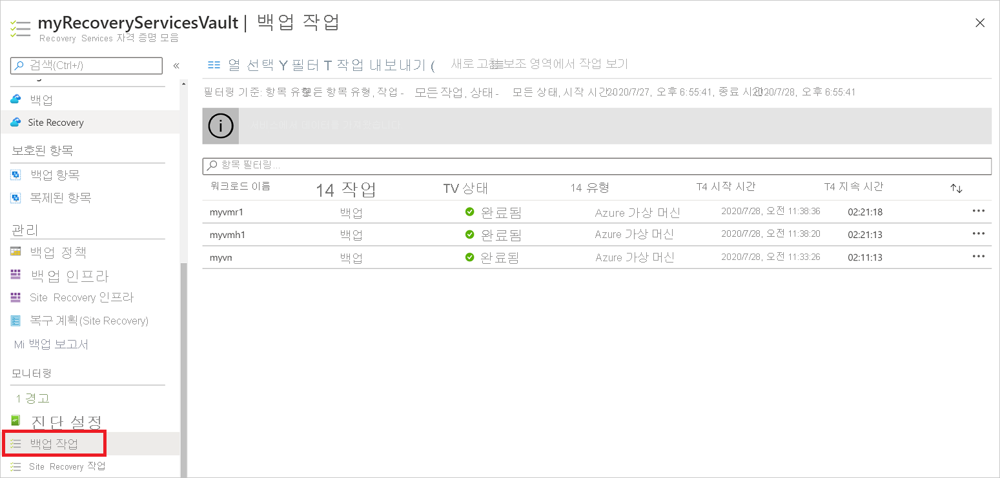
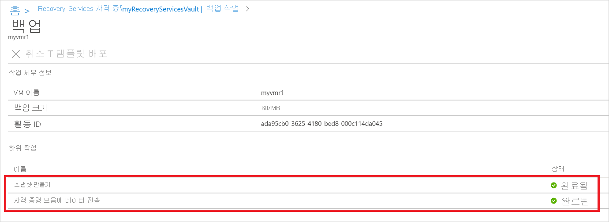

# <a name="back-up-azure-vms-in-a-recovery-services-vault"></a>Recovery Services 자격 증명 모음에 Azure VM 백업

이 문서에서는 [Azure Backup](backup-overview.md) 서비스를 사용 하 여 Recovery Services 자격 증명 모음에서 Azure vm을 백업 하는 방법을 설명 합니다.

이 문서에서는 다음 방법을 설명합니다.

> [!div class="checklist"]
>
> * Azure VM을 준비합니다.
> * 자격 증명 모음을 만듭니다.
> * Vm을 검색 하 고 백업 정책을 구성 합니다.
> * Azure Vm에 대 한 백업을 사용 하도록 설정 합니다.
> * 초기 백업을 실행합니다.

> [!NOTE]
> 이 문서에서는 자격 증명 모음을 설정 하 고 백업할 Vm을 선택 하는 방법을 설명 합니다. 여러 VM을 백업하는 경우에 유용합니다. 또는 VM 설정에서 직접 [단일 AZURE vm을 백업할](backup-azure-vms-first-look-arm.md) 수 있습니다.

## <a name="before-you-start"></a>시작하기 전에

* Azure VM 백업 아키텍처를 [검토](backup-architecture.md#architecture-direct-backup-of-azure-vms) 합니다.
* Azure VM 백업 및 백업 확장에 대해 [자세히 알아봅니다](backup-azure-vms-introduction.md).
* 백업을 구성 하기 전에 [지원 매트릭스를 검토](backup-support-matrix-iaas.md) 합니다.

또한 경우에 따라 몇 가지 작업을 수행 해야 할 수도 있습니다.

* Vm **에 vm 에이전트 설치**: Azure Backup는 컴퓨터에서 실행 되는 azure vm 에이전트에 확장을 설치 하 여 azure vm을 백업 합니다. Azure marketplace 이미지에서 VM을 만든 경우 에이전트가 설치 되 고 실행 됩니다. 사용자 지정 VM을 만들거나 온-프레미스 컴퓨터를 마이그레이션하는 경우 [에이전트를 수동으로 설치](#install-the-vm-agent)해야 할 수 있습니다.
* **아웃 바운드 액세스 명시적 허용**: 일반적으로 Azure VM에 대 한 아웃 바운드 네트워크 액세스를 Azure Backup와 통신 하기 위해 명시적으로 허용 하지 않아도 됩니다. 그러나 연결을 시도할 때 **ExtensionSnapshotFailedNoNetwork** 오류가 표시 되는 일부 vm에 연결 문제가 발생할 수 있습니다. 이 경우 [아웃 바운드 액세스를 명시적으로 허용](#explicitly-allow-outbound-access)해야 하므로 Azure Backup 확장은 백업 트래픽에 대해 AZURE 공용 IP 주소와 통신할 수 있습니다.

## <a name="create-a-vault"></a>자격 증명 모음 만들기

 자격 증명 모음은 백업과 시간 경과에 따라 생성된 복구 지점을 저장하고 백업된 머신과 연결된 백업 정책을 저장합니다. 다음과 같이 자격 증명 모음을 만듭니다.

1. [Azure portal](https://portal.azure.com/)에 로그인합니다.
2. 검색에 **Recovery Services**을 입력 합니다. **서비스**에서 **Recovery Services 자격 증명 모음**을 클릭 합니다.

      <br/>

3. **Recovery Services 자격 증명 모음** 메뉴에서 **+ 추가**를 클릭 합니다.

     

4. **Recovery Services 자격 증명 모음**에서 자격 증명 모음을 식별 하기 위한 이름을 입력 합니다.
    * 이름은 Azure 구독에 대해 고유해야 합니다.
    * 2~50자를 포함할 수 있습니다.
    * 문자로 시작해야 하며, 문자, 숫자, 하이픈만 사용할 수 있습니다.
5. 자격 증명 모음을 만들어야 하는 Azure 구독, 리소스 그룹 및 지역을 선택 합니다. 그런 다음, **만들기**를 클릭합니다.
    * 자격 증명 모음을 만드는 데 시간이 걸릴 수 있습니다.
    * 포털의 오른쪽 위 영역에 있는 상태 알림을 모니터링합니다.

자격 증명 모음이 생성 되 면 Recovery Services 자격 증명 모음 목록에 표시 됩니다. 자격 증명 모음이 표시되지 않으면 **새로 고침**을 선택합니다.


> [!NOTE]
> Azure Backup 서비스는 명명 형식 **AzureBackupRG_geography_number** (예: AzureBackupRG_northeurope_1)를 사용 하 여 스냅숏을 저장할 별도의 리소스 그룹 (VM 리소스 그룹 제외)을 만듭니다. 이 리소스 그룹의 데이터는 Azure 가상 머신 백업 정책의 *즉시 복구 스냅숏 유지* 섹션에 지정 된 기간 (일) 동안 보존 됩니다.  이 리소스 그룹에 잠금을 적용 하면 백업 오류가 발생할 수 있습니다.<br>
또한이 리소스 그룹은 모든 이름/태그 제한에서 제외 되어야 합니다. 제한 정책에 따라 다시 백업 오류가 발생 하 여 리소스 지점 컬렉션 만들기가 차단 됩니다.

### <a name="modify-storage-replication"></a>저장소 복제 수정

기본적으로 자격 증명 모음은 [GRS (지역 중복 저장소)](https://docs.microsoft.com/azure/storage/common/storage-redundancy-grs)를 사용 합니다.

* 자격 증명 모음이 기본 백업 메커니즘인 경우 GRS를 사용 하는 것이 좋습니다.
* 저렴 한 옵션으로 [LRS (로컬 중복 저장소)](https://docs.microsoft.com/azure/storage/common/storage-redundancy-lrs?toc=%2fazure%2fstorage%2fblobs%2ftoc.json) 를 사용할 수 있습니다.

저장소 복제 유형을 다음과 같이 수정 합니다.

1. 새 자격 증명 모음에서 **설정** 섹션의 **속성** 을 클릭 합니다.
2. **속성**의 **백업 구성**에서 **업데이트**를 클릭 합니다.
3. 저장소 복제 유형을 선택 하 고 **저장**을 클릭 합니다.

      

> [!NOTE]
   > 자격 증명 모음을 설정 하 고 백업 항목을 포함 한 후에는 저장소 복제 유형을 수정할 수 없습니다. 이 작업을 수행 하려는 경우 자격 증명 모음을 다시 만들어야 합니다.

## <a name="apply-a-backup-policy"></a>백업 정책 적용

자격 증명 모음에 대 한 백업 정책을 구성 합니다.

1. 자격 증명 모음에서 **개요** 섹션의 **+ Backup** 을 클릭 합니다.

   

2. **워크 로드가 실행 되는 위치** > **백업 목표** 에서 **Azure**를 선택 합니다. **백업할 항목** 에서 **가상 컴퓨터** >  **확인**을 선택 합니다. 이렇게 하면 자격 증명 모음에 VM 확장을 등록합니다.

   

3. **백업 정책**에서 자격 증명 모음과 연결하려는 정책을 선택합니다.
    * 기본 정책은 하루에 한 번 VM을 백업 합니다. 매일 백업은 30 일 동안 보존 됩니다. 즉시 복구 스냅숏은 이틀 동안 보존 됩니다.
    * 기본 정책을 사용 하지 않으려면 **새로 만들기**를 선택 하 고 다음 절차에 설명 된 대로 사용자 지정 정책을 만듭니다.

      

4. **가상 컴퓨터 선택**에서 정책을 사용 하 여 백업할 vm을 선택 합니다. 그런 후 **OK**를 클릭합니다.

   * 선택한 Vm의 유효성이 검사 됩니다.
   * 자격 증명 모음과 동일한 지역에만 VM을 선택할 수 있습니다.
   * VM은 단일 자격 증명 모음에만 백업할 수 있습니다.

     

5. **백업**에서 **백업 사용**을 클릭 합니다. 이렇게 하면 자격 증명 모음과 VM에 정책을 배포하고 Azure VM에서 실행되는 VM 에이전트에 백업 확장을 설치합니다.

     

백업 사용 단추를 클릭한 후 다음을 수행합니다.

* 백업 서비스는 VM의 실행 여부와 상관 없이 백업 확장을 설치합니다.
* 초기 백업은 백업 일정에 따라 실행 됩니다.
* 백업이 실행 되는 경우 다음을 참고 하십시오.
  * 실행 중인 VM은 응용 프로그램 일치 복구 지점을 캡처할 가능성이 가장 큽니다.
  * 그러나 VM이 해제 된 경우에도 백업 됩니다. 이러한 VM을 오프 라인 VM 이라고 합니다. 이 경우 복구 지점은 크래시 일관성을 유지 합니다.

### <a name="create-a-custom-policy"></a>사용자 지정 정책 만들기

새 백업 정책을 만들도록 선택한 경우 정책 설정을 입력 합니다.

1. **정책 이름**에서 의미 있는 이름을 지정 합니다.
2. **백업 일정**에서 백업을 수행 해야 하는 시기를 지정 합니다. Azure Vm에 대해 매일 또는 매주 백업을 수행할 수 있습니다.
3. **즉시**복원에서 즉시 복원에 대 한 스냅숏을 로컬로 보존할 기간을 지정 합니다.
    * 복원 하면 백업 된 VM 디스크가 저장소에서 네트워크를 통해 복구 저장소 위치로 복사 됩니다. 즉시 복원을 사용 하면 백업 데이터가 자격 증명 모음에 전송 될 때까지 기다리지 않고 백업 작업 중에 수행 되는 로컬로 저장 된 스냅숏을 활용할 수 있습니다.
    * 하루에서 5 일 사이에 즉시 복원에 대 한 스냅숏을 유지할 수 있습니다. 기본 설정은 이틀입니다.
4. **보존 범위**에서 매일 또는 매주 백업 시점을 유지 하려는 기간을 지정 합니다.
5. **월간 백업 지점 보존**에서 매일 또는 매주 백업의 월간 백업을 유지할지 여부를 지정 합니다.
6. **확인** 을 클릭하여 정책을 저장합니다.

    

> [!NOTE]
   > Azure Backup은 Azure VM 백업을 위한 일광 절약 시간 변경에 대한 자동 시계 조정을 지원하지 않습니다. 시간이 변경 되 면 필요에 따라 백업 정책을 수동으로 수정 합니다.

## <a name="trigger-the-initial-backup"></a>초기 백업 트리거

초기 백업은 일정에 따라 실행 되지만 다음과 같이 즉시 실행할 수 있습니다.

1. 자격 증명 모음 메뉴에서 **백업 항목**을 클릭합니다.
2. **Backup 항목**에서 **Azure Virtual Machine**을 클릭 합니다.
3. **백업 항목** 목록에서 줄임표 (...)를 클릭 합니다.
4. **지금 백업**을 클릭합니다.
5. **지금 백업**에서 달력 컨트롤을 사용 하 여 복구 지점을 유지할 마지막 날을 선택 합니다. 그런 후 **OK**를 클릭합니다.
6. 포털 알림을 모니터링합니다. 자격 증명 모음 대시보드 > **백업 작업** > **진행 중**에서 작업 진행률을 모니터링할 수 있습니다. VM의 크기에 따라 초기 백업을 만드는 데 시간이 걸릴 수 있습니다.

## <a name="verify-backup-job-status"></a>백업 작업 상태 확인

각 VM 백업에 대 한 백업 작업 세부 정보는 다음 두 단계로 구성 됩니다. **스냅숏** 단계 다음에는 **자격 증명 모음으로 데이터 전송** 단계가 나옵니다.<br/>
스냅숏 단계를 통해 **즉시 복원** 하기 위해 디스크와 함께 저장 되는 복구 지점의 가용성을 보장 하 고 사용자가 구성한 스냅숏 보존 기간에 따라 최대 5 일 동안 사용할 수 있습니다. 자격 증명 모음으로 데이터 전송은 장기 보존을 위해 자격 증명 모음에 복구 지점을 만듭니다. 데이터를 자격 증명 모음으로 전송은 스냅숏 단계가 완료 된 후에만 시작 됩니다.

  

백 엔드에서 실행 되는 두 개의 **하위 작업** 은 아래와 같이 **백업 작업** 세부 정보 블레이드에서 확인할 수 있는 프런트 엔드 백업 작업용으로 하나입니다.

  

**데이터를 자격 증명 모음에 전송** 단계는 디스크 크기, 디스크당 변동 및 기타 여러 가지 요소에 따라 완료 하는 데 며칠이 걸릴 수 있습니다.

작업 상태는 다음 시나리오에 따라 달라질 수 있습니다.

**스냅샷** | **자격 증명 모음으로 데이터 전송** | **작업 상태**
--- | --- | ---
Completed | 진행 중 | 진행 중
Completed | 생략 | Completed
Completed | Completed | Completed
Completed | 실패 | 완료 되었지만 경고 발생
실패 | 실패 | 실패

이제이 기능을 사용 하는 경우 동일한 VM에 대해 두 개의 백업이 병렬로 실행 될 수 있지만 두 단계 (스냅숏, 자격 증명 모음에 데이터 전송)는 하나의 하위 작업만 실행할 수 있습니다. 따라서 진행 중인 백업 작업이 발생 하 여 다음 날의 백업이 실패 하는 경우이 분리 기능이 사용 되지 않습니다. 이후 날의 백업은 이전 날짜의 백업 작업이 진행 중일 경우 **자격 증명 모음으로 데이터를 전송** 하는 동안 스냅숏이 완료 될 수 있습니다.
자격 증명 모음에 생성 된 증분 복구 지점은 자격 증명 모음에서 만든 마지막 복구 지점부터 모든 변동 (code)을 캡처합니다. 사용자에 게는 비용에 영향을 주지 않습니다.

## <a name="optional-steps-install-agentallow-outbound"></a>선택적 단계 (에이전트 설치/아웃 바운드 허용)

### <a name="install-the-vm-agent"></a>VM 에이전트 설치

Azure Backup은 컴퓨터에서 실행 중인 Azure VM 에이전트에 확장을 설치하여 Azure VM을 백업합니다. Azure Marketplace 이미지에서 VM을 만든 경우 에이전트가 설치 되어 실행 되 고 있는 것입니다. 사용자 지정 VM을 만들거나 온-프레미스 컴퓨터를 마이그레이션하는 경우 표에 요약 된 대로 에이전트를 수동으로 설치 해야 할 수 있습니다.

**VM** | **세부 정보**
--- | ---
**Windows** | 1. 에이전트 MSI 파일을 [다운로드 하 여 설치](https://go.microsoft.com/fwlink/?LinkID=394789&clcid=0x409) 합니다.<br/><br/> 2. 컴퓨터에 대 한 관리자 권한으로를 설치 합니다.<br/><br/> 3. 설치를 확인 합니다. VM의 *C:\windowsazure\\oms* 에서 **waappagent.exe** > **속성**을 마우스 오른쪽 단추로 클릭 합니다. **세부 정보** 탭에서 **제품 버전** 을 2.6.1198.718 이상 이상으로 설정 해야 합니다.<br/><br/> 에이전트를 업데이트 하는 경우 백업 작업이 실행 되 고 있지 않은지 확인 한 후 [에이전트를 다시 설치](https://go.microsoft.com/fwlink/?LinkID=394789&clcid=0x409)하십시오.
**Linux** | 배포의 패키지 리포지토리에서 RPM 또는 DEB 패키지를 사용 하 여를 설치 합니다. 이는 Azure Linux 에이전트를 설치 하 고 업그레이드 하는 데 선호 되는 방법입니다. 모든 [인증 배포 공급자](https://docs.microsoft.com/azure/virtual-machines/linux/endorsed-distros)는 이미지 및 리포지토리에 Azure Linux 에이전트 패키지를 통합합니다. 에이전트는 [GitHub](https://github.com/Azure/WALinuxAgent)에서 사용할 수 있지만 설치하지 않는 것이 좋습니다.<br/><br/> 에이전트를 업데이트 하는 경우 백업 작업이 실행 되 고 있지 않은지 확인 하 고 이진 파일을 업데이트 합니다.

### <a name="explicitly-allow-outbound-access"></a>아웃 바운드 액세스를 명시적으로 허용

VM에서 실행 되는 백업 확장에는 Azure 공용 IP 주소에 대 한 아웃 바운드 액세스가 필요 합니다.

* 일반적으로 Azure Backup와 통신 하기 위해 Azure VM에 대 한 아웃 바운드 네트워크 액세스를 명시적으로 허용 하지 않아도 됩니다.
* Vm을 연결 하는 데 문제가 발생 하거나 연결을 시도할 때 **ExtensionSnapshotFailedNoNetwork** 오류가 표시 되는 경우 백업 확장이 백업에 대 한 AZURE 공용 IP 주소와 통신할 수 있도록 명시적으로 액세스를 허용 해야 합니다. 교통. 액세스 방법은 다음 표에 요약 되어 있습니다.

**옵션** | **작업** | **세부 정보**
--- | --- | ---
**NSG 규칙 설정** | [Azure 데이터 센터 IP 범위](https://www.microsoft.com/download/details.aspx?id=41653)를 허용 합니다.<br/><br/> 모든 주소 범위를 허용 하 고 관리 하는 대신 [서비스 태그](backup-azure-arm-vms-prepare.md#set-up-an-nsg-rule-to-allow-outbound-access-to-azure)를 사용 하 여 Azure Backup 서비스에 대 한 액세스를 허용 하는 규칙을 추가할 수 있습니다. | [서비스 태그](../virtual-network/security-overview.md#service-tags)에 대해 자세히 알아보세요.<br/><br/> 서비스 태그는 액세스 관리를 간소화 하며 추가 비용이 발생 하지 않습니다.
**프록시 배포** | 트래픽 라우팅을 위해 HTTP 프록시 서버를 배포합니다. | 스토리지뿐만 아니라 Azure 전체에 대한 액세스를 제공합니다.<br/><br/> 스토리지 URL에 대한 세분화된 제어가 허용됩니다.<br/><br/> VM에 대한 인터넷 액세스의 단일 지점입니다.<br/><br/> 프록시에 대한 추가 비용이 없습니다.
**Azure Firewall 설정** | Azure Backup 서비스에 대한 FQDN 태그를 사용하여 VM에서 Azure Firewall을 통해 트래픽을 허용합니다. | VNet 서브넷에 Azure 방화벽이 설정 되어 있는 경우 간단 하 게 사용할 수 있습니다.<br/><br/> 사용자 고유의 FQDN 태그를 만들거나 태그에서 fqdn을 수정할 수 없습니다.<br/><br/> Azure Vm에 관리 디스크가 있는 경우 방화벽에서 추가 포트 (8443)를 열어야 할 수도 있습니다.

#### <a name="establish-network-connectivity"></a>네트워크 연결 설정

NSG, 프록시 또는 방화벽을 통해 연결 설정

##### <a name="set-up-an-nsg-rule-to-allow-outbound-access-to-azure"></a>Azure에 아웃바운드 액세스를 허용하도록 NSG 규칙 설정

NSG가 VM 액세스를 관리 하는 경우 필요한 범위 및 포트에 대 한 백업 저장소에 대 한 아웃 바운드 액세스를 허용 합니다.

1. VM 속성 > **네트워킹**에서 **아웃 바운드 포트 규칙 추가**를 선택 합니다.
2. **아웃 바운드 보안 규칙 추가**에서 **고급**을 선택 합니다.
3. **원본**에서 **VirtualNetwork**를 선택합니다.
4. **원본 포트 범위**에서 별표 (*)를 입력 하 여 모든 포트에서 아웃 바운드 액세스를 허용 합니다.
5. **대상**에서 **서비스 태그**를 선택합니다. 목록에서 **Storage.region**을 선택합니다. 지역은 자격 증명 모음 및 백업 하려는 Vm이 있는 위치입니다.
6. **대상 포트 범위**에서 포트를 선택합니다.
    * 암호화 되지 않은 저장소 계정으로 관리 되지 않는 디스크를 사용 하는 VM: 80
    * 암호화 된 저장소 계정에 관리 되지 않는 디스크를 사용 하는 VM: 443 (기본 설정)
    * 관리 디스크를 사용 하는 VM: 8443.
7. **프로토콜**에서 **TCP**를 선택합니다.
8. **우선 순위**에서 모든 거부 규칙보다 더 작은 우선 순위 값을 지정합니다.

   액세스를 거부 하는 규칙이 있는 경우 새 허용 규칙이 높아야 합니다. 예를 들어 우선 순위 1000에서 **Deny_All** 규칙이 있는 경우 새 규칙은 1000 미만으로 설정해야 합니다.
9. 규칙에 대 한 이름 및 설명을 입력 하 고 **확인**을 선택 합니다.

아웃바운드 액세스를 허용하는 여러 VM에 NSG 규칙을 적용할 수 있습니다. 이 비디오에서는 프로세스에 대해 설명합니다.

>[!VIDEO https://www.youtube.com/embed/1EjLQtbKm1M]

##### <a name="route-backup-traffic-through-a-proxy"></a>프록시를 통해 백업 트래픽 라우팅

프록시를 통해 백업 트래픽을 라우팅한 다음, 필요한 Azure 범위에 액세스할 수 있는 권한을 프록시에 부여할 수 있습니다. 다음을 허용 하도록 프록시 VM을 구성 합니다.

* Azure VM은 프록시를 통해 공용 인터넷으로 향하는 모든 HTTP 트래픽을 라우팅해야 합니다.
* 프록시는 해당 하는 가상 네트워크의 Vm에서 들어오는 트래픽을 허용 해야 합니다.
* NSG **NSF-lockdown**은 프록시 VM에서 들어오는 아웃바운드 인터넷 트래픽을 허용하는 규칙이 필요합니다.

###### <a name="set-up-the-proxy"></a>프록시 설정

시스템 계정 프록시가 없는 경우 다음과 같이 설정합니다.

1. [PsExec](https://technet.microsoft.com/sysinternals/bb897553)을 다운로드합니다.
2. **PsExec.exe-i-s cmd.exe**를 실행하여 시스템 계정에서 명령 프롬프트를 실행합니다.
3. 시스템 컨텍스트에서 브라우저를 실행합니다. 예를 들어 Internet Explorer에 **%Programfiles%\internet explorer\ Explorer\iexplore.exe** 를 사용 합니다.  
4. 프록시 설정을 정의합니다.
   * Linux 머신:
     * 이 줄을 **/etc/environment** 파일에 추가합니다.
       * **http_proxy = http:\//프록시 IP 주소: 프록시 포트**
     * 이 줄을 **/etc/waagent.conf** 파일에 추가합니다.
         * **HttpProxy.Host=proxy IP address**
         * **HttpProxy.Port=proxy port**
   * Windows 머신의 브라우저 설정에서 프록시를 사용함으로 지정합니다. 현재 사용자 계정에서 프록시를 사용하는 경우 시스템 계정 수준에서 설정을 적용하려면 이 스크립트를 사용할 수 있습니다.

       ```powershell
      $obj = Get-ItemProperty -Path Registry::"HKEY_CURRENT_USER\Software\Microsoft\Windows\CurrentVersion\Internet Settings\Connections"
      Set-ItemProperty -Path Registry::"HKEY_USERS\S-1-5-18\Software\Microsoft\Windows\CurrentVersion\Internet Settings\Connections" -Name DefaultConnectionSettings -Value $obj.DefaultConnectionSettings
      Set-ItemProperty -Path Registry::"HKEY_USERS\S-1-5-18\Software\Microsoft\Windows\CurrentVersion\Internet Settings\Connections" -Name SavedLegacySettings -Value $obj.SavedLegacySettings
      $obj = Get-ItemProperty -Path Registry::"HKEY_CURRENT_USER\Software\Microsoft\Windows\CurrentVersion\Internet Settings"
      Set-ItemProperty -Path Registry::"HKEY_USERS\S-1-5-18\Software\Microsoft\Windows\CurrentVersion\Internet Settings" -Name ProxyEnable -Value $obj.ProxyEnable
      Set-ItemProperty -Path Registry::"HKEY_USERS\S-1-5-18\Software\Microsoft\Windows\CurrentVersion\Internet Settings" -Name Proxyserver -Value $obj.Proxyserver

       ```

###### <a name="allow-incoming-connections-on-the-proxy"></a>프록시에서 들어오는 연결 허용

프록시 설정에서 들어오는 연결을 허용합니다.

1. Windows 방화벽에서 **고급 보안이 포함 된 Windows 방화벽**을 엽니다.
2. 마우스 오른쪽 단추로 **인바운드 규칙** > **새 규칙**을 클릭합니다.
3. **규칙 유형**에서 **사용자 지정** > **다음**을 선택 합니다.
4. **프로그램**에서 **모든 프로그램** > **다음**을 선택합니다.
5. **프로토콜 및 포트**에서:
   * 유형을 **TCP**로 설정 합니다.
   * **로컬 포트** 를 **특정 포트로**설정 합니다.
   * **모든 포트**에 **원격 포트** 를 설정 합니다.

6. 마법사를 끝내고 규칙 이름을 지정합니다.

###### <a name="add-an-exception-rule-to-the-nsg-for-the-proxy"></a>NSG에 프록시에 대한 예외 규칙 추가

NSG **NSF-lockdown**에서 10.0.0.5의 모든 포트에서 오는 트래픽을 포트 80(HTTP) 또는 443(HTTPS)의 모든 인터넷 주소에 허용합니다.

다음 PowerShell 스크립트에서는 트래픽을 허용하는 예제를 제공합니다.
모든 공용 인터넷 주소에 대해 아웃 바운드를 허용 하는 대신 IP 주소 범위 (`-DestinationPortRange`)를 지정 하거나, 저장소. 지역 서비스 태그를 사용할 수 있습니다.

```powershell
Get-AzureNetworkSecurityGroup -Name "NSG-lockdown" |
Set-AzureNetworkSecurityRule -Name "allow-proxy " -Action Allow -Protocol TCP -Type Outbound -Priority 200 -SourceAddressPrefix "10.0.0.5/32" -SourcePortRange "*" -DestinationAddressPrefix Internet -DestinationPortRange "80-443"
```

##### <a name="allow-firewall-access-with-an-fqdn-tag"></a>FQDN 태그를 사용 하 여 방화벽 액세스 허용

Azure Backup에 대 한 네트워크 트래픽에 대 한 아웃 바운드 액세스를 허용 하도록 Azure 방화벽을 설정할 수 있습니다.

* Azure Firewall 배포에 대해 [알아보기](https://docs.microsoft.com/azure/firewall/tutorial-firewall-deploy-portal)
* FQDN 태그에 대해 [읽어보기](https://docs.microsoft.com/azure/firewall/fqdn-tags)

## <a name="next-steps"></a>다음 단계

* [AZURE vm 에이전트](backup-azure-troubleshoot-vm-backup-fails-snapshot-timeout.md) 또는 [azure vm 백업](backup-azure-vms-troubleshoot.md)관련 문제를 해결 합니다.
* [복원](backup-azure-arm-restore-vms.md) Azure Vm.
