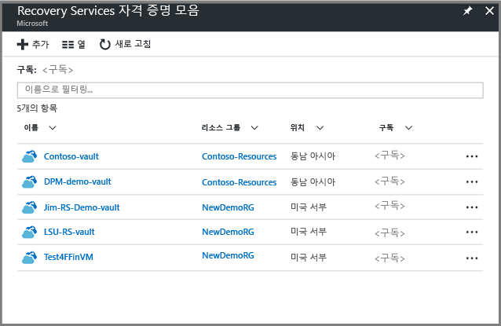
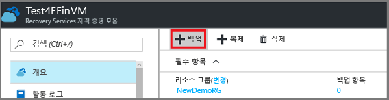
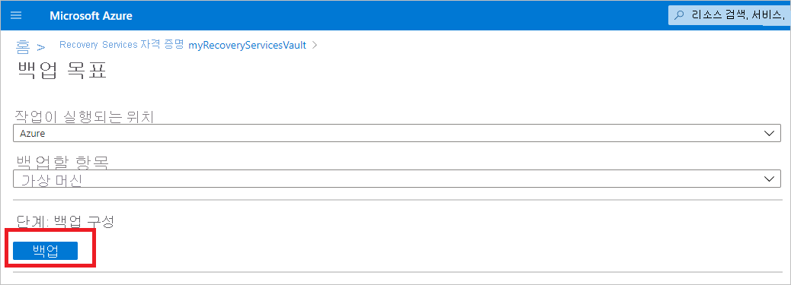
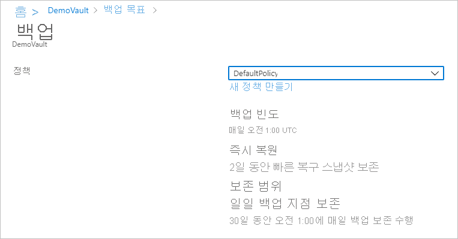
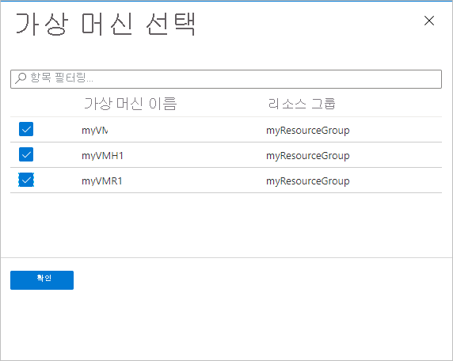
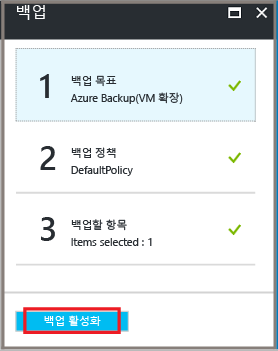

# <a name="back-up-azure-vms-in-a-recovery-services-vault"></a>Recovery Services 자격 증명 모음에 Azure VM 백업

이 문서에서는 Recovery Services 자격 증명 모음에 Azure Vm을 백업 하는 방법을 설명를 사용 하는 [Azure Backup](backup-overview.md) 서비스입니다. 

이 문서에서는 다음 방법을 설명합니다.

> [!div class="checklist"]
> * Azure VM을 준비합니다.
> * 자격 증명 모음을 만듭니다.
> * Vm을 검색 하 고 백업 정책을 구성 합니다.
> * Azure Vm에 대 한 backup을 사용 합니다.
> * 초기 백업을 실행합니다.


> [!NOTE]
> 이 문서에서는 자격 증명 모음을 설정 하 고 백업할 Vm을 선택 하는 방법을 설명 합니다. 여러 VM을 백업하는 경우에 유용합니다. 또는 수 있습니다 [단일 Azure VM 백업](backup-azure-vms-first-look-arm.md) VM 설정에서 직접.

## <a name="before-you-start"></a>시작하기 전에


- [검토](backup-architecture.md#architecture-direct-backup-of-azure-vms) Azure VM 백업 아키텍처입니다.
- Azure VM 백업 및 백업 확장에 대해 [자세히 알아봅니다](backup-azure-vms-introduction.md).
- [지원 매트릭스 검토.](backup-support-matrix-iaas.md) backup을 구성 하기 전에 합니다.

또한 일부 상황에서 작업을 수행 해야 할 수 있는 작업의 두 가지가 있습니다.

- **VM에 VM 에이전트 설치**: Azure Backup은 컴퓨터에서 실행 중인 Azure VM 에이전트에 확장을 설치하여 Azure VM을 백업합니다. VM을 만든 경우 Azure marketplace 이미지에서 에이전트를 설치 하 고 실행. 사용자 지정 VM을 만들거나 온-프레미스 컴퓨터를 마이그레이션한 경우 해야 [에이전트를 수동으로 설치](#install-the-vm-agent)합니다.
- **아웃 바운드 액세스를 명시적으로 허용**: 일반적으로 명시적으로 Azure Backup을 사용 하 여 통신을 위해에서 Azure VM에 대 한 아웃 바운드 네트워크 액세스를 허용 하도록 필요가 없습니다. 그러나 일부 Vm 발생할 연결 문제를 보여 주는 합니다 **ExtensionSnapshotFailedNoNetwork** 연결 하려고 하는 동안 오류가 발생 했습니다. 이 경우 수행 해야 합니다 [아웃 바운드 액세스를 명시적으로 허용](#explicitly-allow-outbound-access), 백업 트래픽에 대해 Azure 공용 IP 주소를 사용 하 여 Azure Backup 확장 통신할 수 있도록 합니다.


## <a name="create-a-vault"></a>자격 증명 모음 만들기

 자격 증명 모음은 백업과 시간 경과에 따라 생성된 복구 지점을 저장하고 백업된 머신과 연결된 백업 정책을 저장합니다. 다음과 같이 자격 증명 모음을 만듭니다.    

1. [Azure Portal](https://portal.azure.com/)에 로그인합니다.    
2. 검색에서 입력 **Recovery Services**합니다. 아래 **Services**, 클릭 **Recovery Services 자격 증명 모음**합니다.   

      <br/> 

3. **Recovery Services 자격 증명 모음** 메뉴에서 클릭 **+ 추가**합니다.    

        

4. **Recovery Services 자격 증명 모음**, 자격 증명 모음을 식별 하는 친숙 한 이름 입력 합니다.   
    - 이름은 Azure 구독에 대해 고유해야 합니다.   
    - 2~50자를 포함할 수 있습니다.    
    - 문자로 시작해야 하며, 문자, 숫자, 하이픈만 사용할 수 있습니다.   
5. Azure 구독, 리소스 그룹 및 자격 증명 모음을 만들 지역을 선택 합니다. 그런 다음, **만들기**를 클릭합니다.    
    - 자격 증명 모음을 만드는 데 시간이 걸릴 수 있습니다.  
    - 포털의 오른쪽 위 영역에 있는 상태 알림을 모니터링합니다.   


 자격 증명 모음을 만든 후 Recovery Services 자격 증명 모음 목록에 나타납니다. 자격 증명 모음이 표시되지 않으면 **새로 고침**을 선택합니다.
 
    

### <a name="modify-storage-replication"></a>저장소 복제를 수정 합니다.

기본적으로 사용 하 여 자격 증명 모음 [지역 중복 저장소 (GRS)](https://docs.microsoft.com/azure/storage/common/storage-redundancy-grs)합니다.

- 기본 백업 메커니즘 자격 증명 모음을 사용 하는 경우에 GRS를 사용 하는 것이 좋습니다.
- 사용할 수 있습니다 [로컬 중복 저장소 (LRS)](https://docs.microsoft.com/azure/storage/common/storage-redundancy-lrs?toc=%2fazure%2fstorage%2fblobs%2ftoc.json) 저렴 한 옵션에 대 한 합니다.

저장소 복제 유형을 다음과 같이 수정 합니다.

1. 새 자격 증명 모음에서 클릭 **속성** 에 **설정** 섹션입니다.
2. **속성**아래에 있는 **Backup 구성**, 클릭 **업데이트**합니다.
3. 저장소 복제 유형을 선택 하 고 클릭 **저장할**합니다.

      
> [!NOTE]
   > 자격 증명 모음 설정 되 고 백업 항목을 포함 한 후에 저장소 복제 유형을 수정할 수 없습니다. 이 작업을 수행 하려는 경우에 자격 증명 모음을 다시 해야 합니다. 

## <a name="apply-a-backup-policy"></a>백업 정책 적용

자격 증명 모음에 대 한 백업 정책을 구성 합니다.

1. 자격 증명 모음에서 클릭 **+ 백업** 에 **개요** 섹션입니다.

   


2. **Backup 목표** > **작업이 실행 되는 위치?** 선택 **Azure**합니다. **무엇을 백업 하 시겠습니까?** 선택 **가상 머신** >  **확인**합니다. 이렇게 하면 자격 증명 모음에 VM 확장을 등록합니다.

   

3. **백업 정책**에서 자격 증명 모음과 연결하려는 정책을 선택합니다. 
    - 기본 정책 하루에 한 번 VM을 백업합니다. 일별 백업 30 일 동안 유지 됩니다. 인스턴트 복구 스냅숏은 2 일 동안 보존 됩니다.
    - 기본 정책을 사용 하지 않으려는 경우 선택 **새로 만들기**, 다음 절차에 설명 된 대로 사용자 지정 정책을 만듭니다.

      

4. **가상 머신 선택**, 정책을 사용 하 여 백업 하려는 Vm을 선택 합니다. 그런 후 **OK**를 클릭합니다.

   - 선택한 Vm 유효성이 검사 됩니다.
   - 자격 증명 모음과 동일한 지역에만 VM을 선택할 수 있습니다.
   - VM은 단일 자격 증명 모음에만 백업할 수 있습니다.

     

5. **백업**, 클릭 **백업 사용**합니다. 이렇게 하면 자격 증명 모음과 VM에 정책을 배포하고 Azure VM에서 실행되는 VM 에이전트에 백업 확장을 설치합니다.
     
     

백업 사용 단추를 클릭한 후 다음을 수행합니다.

- 백업 서비스는 VM의 실행 여부와 상관 없이 백업 확장을 설치합니다.
- 백업 일정에 따라 초기 백업을 실행 됩니다.
- 백업을 실행 하는 경우는 note:
    - 실행 중인 VM을 캡처하는 응용 프로그램 일치 복구 지점에 대 한 가장 큰 기회를 경우
    - 그러나 VM를 해제 하는 경우에 백업 합니다. 이러한 VM은 오프 라인 VM 이라고 합니다. 이 경우 복구 지점은 크래시 일치 됩니다.
    

### <a name="create-a-custom-policy"></a>사용자 지정 정책 만들기

새 백업 정책 만들기를 선택한 경우 정책 설정을 입력 합니다.

1. **정책 이름**, 의미 있는 이름을 지정 합니다.
2. **백업 일정** 백업을 수행할 시기를 지정 합니다. Azure Vm에 대 한 매일 또는 매주 백업을 수행할 수 있습니다.
2. **즉시 복원을**, 빠른 복원에 대 한 로컬 스냅숏을 유지 하려는 기간을 지정 합니다.
    - 를 복원 하면 백업 vm 디스크는 저장소에서 복사를 네트워크에서 복구 저장소 위치를 통해. 즉시 복원을 사용 하 여 로컬로 저장 된 스냅숏을 백업 작업을 하는 동안 백업 데이터를 자격 증명 모음으로 전송 될 때까지 기다리지 않고를 활용할 수 있습니다.
    - 1-5 일 사이 대 한 인스턴트 복원에 대 한 스냅숏을 유지할 수 있습니다. 2 일에는 기본 설정입니다.
3. **보존 범위**, 매일 또는 매주 백업 지점을 유지 하려는 기간을 지정 합니다.
4. **월간 백업 지점 보존**, 월간 일별 또는 주별 백업의 백업 보관 것인지 여부를 지정 합니다. 
5. **확인** 을 클릭하여 정책을 저장합니다.

    

> [!NOTE]
   > Azure Backup은 Azure VM 백업을 위한 일광 절약 시간 변경에 대한 자동 시계 조정을 지원하지 않습니다. 시간 변경이 일어나는 경우 처럼 수동으로 필요에 따라 백업 정책을 수정 합니다.

## <a name="trigger-the-initial-backup"></a>초기 백업을 트리거합니다

초기 백업은 일정에 따라 실행 됩니다 있지만 즉시 같이 바로 실행할 수 있습니다.

1. 자격 증명 모음 메뉴에서 **백업 항목**을 클릭합니다.
2. **백업 항목**에서 **Azure Virtual Machine**을 클릭합니다.
3. 에 **Backup 항목** 목록에서 줄임표 (...)를 클릭 합니다.
4. **지금 백업**을 클릭합니다.
5. **지금 Backup**, 달력 컨트롤을 사용 하 여 복구 지점을 유지 되어야 하는 마지막 날을 선택 합니다. 그런 후 **OK**를 클릭합니다.
6. 포털 알림을 모니터링합니다. 자격 증명 모음 대시보드 > **백업 작업** > **진행 중**에서 작업 진행률을 모니터링할 수 있습니다. VM의 크기에 따라 초기 백업을 만드는 데 시간이 걸릴 수 있습니다.

## <a name="optional-steps-install-agentallow-outbound"></a>선택적 단계 (에이전트/아웃 바운드 허용 설치)
### <a name="install-the-vm-agent"></a>VM 에이전트 설치

Azure Backup은 컴퓨터에서 실행 중인 Azure VM 에이전트에 확장을 설치하여 Azure VM을 백업합니다. VM을 만든 경우 Azure Marketplace 이미지에서 에이전트를 설치 하 고 실행. 사용자 지정 VM을 만들거나 온-프레미스 컴퓨터를 마이그레이션한 경우에 표에 요약 된 대로 수동으로 에이전트를 설치 하는 것이 해야 합니다.

**VM** | **세부 정보**
--- | ---
**Windows** | 1. 에이전트 MSI 파일을 [다운로드하여 설치](https://go.microsoft.com/fwlink/?LinkID=394789&clcid=0x409)합니다.<br/><br/> 2. 컴퓨터의 관리자 권한으로 설치합니다.<br/><br/> 3. 설치를 확인 합니다. *C:\WindowsAzure\Packages* VM에서 마우스 오른쪽 단추로 클릭 **WaAppAgent.exe** > **속성**합니다. 에 **세부 정보** 탭 **제품 버전** 2.6.1198.718 해야 이상.<br/><br/> 에이전트를 업데이트 하는 경우는 백업 작업이 실행 되 고 있는지, 및 [에이전트를 다시 설치](https://go.microsoft.com/fwlink/?LinkID=394789&clcid=0x409)합니다.
**Linux** | 배포 패키지 리포지토리에서 RPM 또는 DEB 패키지를 사용 하 여 설치 합니다. 이 방법은 설치 및 Azure Linux 에이전트 업그레이드에 대 한 기본 설정 합니다. 모든 [인증 배포 공급자](https://docs.microsoft.com/azure/virtual-machines/linux/endorsed-distros)는 이미지 및 리포지토리에 Azure Linux 에이전트 패키지를 통합합니다. 에이전트는 [GitHub](https://github.com/Azure/WALinuxAgent)에서 사용할 수 있지만 설치하지 않는 것이 좋습니다.<br/><br/> 에이전트를 업데이트 하는 경우 백업 작업이 실행 되 고 업데이트 이진 파일에 있는지 확인 합니다.

### <a name="explicitly-allow-outbound-access"></a>명시적으로 아웃 바운드 액세스 허용

VM에서 실행 중인 백업 확장이 Azure 공용 IP 주소에 아웃 바운드 액세스를 해야 합니다.

- 일반적으로 명시적으로 Azure Backup을 사용 하 여 통신을 위해에서 Azure VM에 대 한 아웃 바운드 네트워크 액세스를 허용 하도록 필요가 없습니다.
- 오류를 표시 하는 경우 또는 실행 문제가 vm에 연결 **ExtensionSnapshotFailedNoNetwork** 연결을 시도할 때 명시적으로 허용 해야 액세스 백업 확장이 Azure 공용 IP와 통신할 수 있도록 백업 트래픽에 대 한 주소입니다. 액세스 메서드는 다음 표에 요약 되어 있습니다.


**옵션** | **작업** | **세부 정보** 
--- | --- | --- 
**NSG 규칙 설정** | [Azure 데이터 센터 IP 범위](https://www.microsoft.com/download/details.aspx?id=41653)를 허용합니다.<br/><br/> 허용 및 모든 주소 범위 관리를 대신 사용 하 여 Azure Backup 서비스에 대 한 액세스를 허용 하는 규칙을 추가할 수 있습니다는 [서비스 태그](backup-azure-arm-vms-prepare.md#set-up-an-nsg-rule-to-allow-outbound-access-to-azure)합니다. | [서비스 태그](../virtual-network/security-overview.md#service-tags)에 대해 자세히 알아보세요.<br/><br/> 서비스 태그 액세스 관리를 간소화 하 고 추가 비용이 발생 하지 않습니다.
**프록시 배포** | 트래픽 라우팅을 위해 HTTP 프록시 서버를 배포합니다. | 저장소뿐만 아니라 Azure 전체에 대한 액세스를 제공합니다.<br/><br/> 스토리지 URL에 대한 세분화된 제어가 허용됩니다.<br/><br/> VM에 대한 인터넷 액세스의 단일 지점입니다.<br/><br/> 프록시에 대한 추가 비용이 없습니다.
**Azure Firewall 설정** | Azure Backup 서비스에 대한 FQDN 태그를 사용하여 VM에서 Azure Firewall을 통해 트래픽을 허용합니다. | VNet 서브넷에서 설정 하는 Azure 방화벽이 있는 경우 사용 하기 간편 합니다.<br/><br/> 사용자 고유의 FQDN 태그를 만들거나 태그에 Fqdn을 수정할 수 없습니다.<br/><br/> Azure Vm 디스크를 관리 하는 경우 추가 열어야 할 수 있습니다 (8443) 방화벽에서 포트입니다.

#### <a name="establish-network-connectivity"></a>네트워크 연결 설정

프록시 또는 방화벽을 통해 NSG 사용 하 여 연결 설정

##### <a name="set-up-an-nsg-rule-to-allow-outbound-access-to-azure"></a>Azure에 아웃바운드 액세스를 허용하도록 NSG 규칙 설정

NSG가 VM 액세스를 관리 하는 경우 필요한 범위 및 포트에 백업 저장소에 대 한 아웃 바운드 액세스를 허용 합니다.

1. VM 속성에서 > **네트워킹**를 선택 **아웃 바운드 포트 규칙 추가**합니다.
2. **아웃 바운드 보안 규칙 추가**를 선택 **고급**합니다.
3. **원본**에서 **VirtualNetwork**를 선택합니다.
4. **원본 포트 범위**, 모든 포트에서 아웃 바운드 액세스를 허용 하려면 별표 (*)를 입력 합니다.
5. **대상**에서 **서비스 태그**를 선택합니다. 목록에서 **Storage.region**을 선택합니다. 지역은, 자격 증명 모음 및 백업 하려는 Vm 있는 위치입니다.
6. **대상 포트 범위**에서 포트를 선택합니다.
    - 암호화되지 않은 스토리지 계정을 사용하는 비관리형 VM: 80
    - 암호화된 스토리지 계정을 사용하는 비관리형 VM: 443(기본 설정)
    - 관리형 VM: 8443
7. **프로토콜**에서 **TCP**를 선택합니다.
8. **우선 순위**에서 모든 거부 규칙보다 더 작은 우선 순위 값을 지정합니다.
   
   에 대 한 액세스를 거부 하는 규칙이 있는 경우 새 규칙 높아야 허용 합니다. 예를 들어 우선 순위 1000에서 **Deny_All** 규칙이 있는 경우 새 규칙은 1000 미만으로 설정해야 합니다.
9. 이름 및 규칙에 대 한 설명을 제공 하 고 선택 **확인**합니다.

아웃바운드 액세스를 허용하는 여러 VM에 NSG 규칙을 적용할 수 있습니다. 이 비디오에서는 프로세스에 대해 설명합니다.

>[!VIDEO https://www.youtube.com/embed/1EjLQtbKm1M]


##### <a name="route-backup-traffic-through-a-proxy"></a>프록시를 통해 백업 트래픽 라우팅

프록시를 통해 백업 트래픽을 라우팅한 다음, 필요한 Azure 범위에 액세스할 수 있는 권한을 프록시에 부여할 수 있습니다. 프록시는 다음을 허용 하도록 VM을 구성 합니다.

- Azure VM은 프록시를 통해 공용 인터넷으로 향하는 모든 HTTP 트래픽을 라우팅해야 합니다.
- 프록시는 해당 가상 네트워크의 Vm에서 들어오는 트래픽을 허용 해야 합니다.
- NSG **NSF-lockdown**은 프록시 VM에서 들어오는 아웃바운드 인터넷 트래픽을 허용하는 규칙이 필요합니다.

###### <a name="set-up-the-proxy"></a>프록시 설정

시스템 계정 프록시가 없는 경우 다음과 같이 설정합니다.

1. [PsExec](https://technet.microsoft.com/sysinternals/bb897553)을 다운로드합니다.
2. **PsExec.exe-i-s cmd.exe**를 실행하여 시스템 계정에서 명령 프롬프트를 실행합니다.
3. 시스템 컨텍스트에서 브라우저를 실행합니다. 사용 예를 들어 **%PROGRAMFILES%\Internet Explorer\iexplore.exe** Internet Explorer에 대 한 합니다.  
4. 프록시 설정을 정의합니다.
   - Linux 머신:
     - 이 줄을 **/etc/environment** 파일에 추가합니다.
       - **http_proxy = http: \/ /프록시 IP 주소: 프록시 포트**
     - 이 줄을 **/etc/waagent.conf** 파일에 추가합니다.
         - **HttpProxy.Host=proxy IP address**
         - **HttpProxy.Port=proxy port**
   - Windows 머신의 브라우저 설정에서 프록시를 사용함으로 지정합니다. 현재 사용자 계정에서 프록시를 사용하는 경우 시스템 계정 수준에서 설정을 적용하려면 이 스크립트를 사용할 수 있습니다.
       ```powershell
      $obj = Get-ItemProperty -Path Registry::"HKEY_CURRENT_USER\Software\Microsoft\Windows\CurrentVersion\Internet Settings\Connections"
      Set-ItemProperty -Path Registry::"HKEY_USERS\S-1-5-18\Software\Microsoft\Windows\CurrentVersion\Internet Settings\Connections" -Name DefaultConnectionSettings -Value $obj.DefaultConnectionSettings
      Set-ItemProperty -Path Registry::"HKEY_USERS\S-1-5-18\Software\Microsoft\Windows\CurrentVersion\Internet Settings\Connections" -Name SavedLegacySettings -Value $obj.SavedLegacySettings
      $obj = Get-ItemProperty -Path Registry::"HKEY_CURRENT_USER\Software\Microsoft\Windows\CurrentVersion\Internet Settings"
      Set-ItemProperty -Path Registry::"HKEY_USERS\S-1-5-18\Software\Microsoft\Windows\CurrentVersion\Internet Settings" -Name ProxyEnable -Value $obj.ProxyEnable
      Set-ItemProperty -Path Registry::"HKEY_USERS\S-1-5-18\Software\Microsoft\Windows\CurrentVersion\Internet Settings" -Name Proxyserver -Value $obj.Proxyserver

       ```

###### <a name="allow-incoming-connections-on-the-proxy"></a>프록시에서 들어오는 연결 허용

프록시 설정에서 들어오는 연결을 허용합니다.

1. Windows 방화벽에서 엽니다 **Windows Firewall with Advanced Security**합니다.
2. 마우스 오른쪽 단추로 **인바운드 규칙** > **새 규칙**을 클릭합니다.
3. **규칙 유형**를 선택 **사용자 지정** > **다음**합니다.
4. **프로그램**에서 **모든 프로그램** > **다음**을 선택합니다.
5. **프로토콜 및 포트**:
   - 유형을 설정 **TCP**합니다.
   - 설정할 **로컬 포트** 하 **특정 포트**합니다.
   - 설정할 **원격 포트** 하 **모든 포트**합니다.
  
6. 마법사를 끝내고 규칙 이름을 지정합니다.

###### <a name="add-an-exception-rule-to-the-nsg-for-the-proxy"></a>NSG에 프록시에 대한 예외 규칙 추가

NSG **NSF-lockdown**에서 10.0.0.5의 모든 포트에서 오는 트래픽을 포트 80(HTTP) 또는 443(HTTPS)의 모든 인터넷 주소에 허용합니다.

다음 PowerShell 스크립트에서는 트래픽을 허용하는 예제를 제공합니다.
모든 공용 인터넷 주소에 아웃 바운드를 허용 하는 대신 IP 주소 범위를 지정할 수 있습니다 (`-DestinationPortRange`), 또는 storage.region 서비스 태그를 사용 합니다.   

```powershell
Get-AzureNetworkSecurityGroup -Name "NSG-lockdown" |
Set-AzureNetworkSecurityRule -Name "allow-proxy " -Action Allow -Protocol TCP -Type Outbound -Priority 200 -SourceAddressPrefix "10.0.0.5/32" -SourcePortRange "*" -DestinationAddressPrefix Internet -DestinationPortRange "80-443"
```

##### <a name="allow-firewall-access-with-an-fqdn-tag"></a>FQDN 태그를 사용 하 여 방화벽 액세스를 허용 합니다.

Azure backup 네트워크 트래픽에 대 한 아웃 바운드 액세스를 허용 하도록 Azure 방화벽을 설정할 수 있습니다.

- Azure Firewall 배포에 대해 [알아보기](https://docs.microsoft.com/azure/firewall/tutorial-firewall-deploy-portal)
- FQDN 태그에 대해 [읽어보기](https://docs.microsoft.com/azure/firewall/fqdn-tags)


## <a name="next-steps"></a>다음 단계

- 문제를 해결 [Azure VM 에이전트](backup-azure-troubleshoot-vm-backup-fails-snapshot-timeout.md) 하거나 [Azure VM 백업](backup-azure-vms-troubleshoot.md)합니다.
- [복원](backup-azure-arm-restore-vms.md) Azure Vm입니다.

