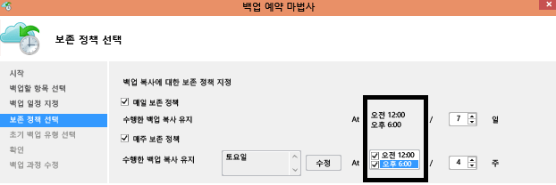

# Azure Backup - 질문과 대답
이 문서에서는 Azure Backup 서비스에 대한 일반적인 질문과 대답을 제공합니다.

## Recovery Services 자격 증명 모음

### 각 Azure 구독에 만들 수 있는 자격 증명 모음의 개수에 제한이 있나요?
예. 구독당 Azure Backup의 지원되는 지역당 최대 500개의 Recovery Services 자격 증명 모음을 만들 수 있습니다. 추가 자격 증명 모음이 필요한 경우 추가 구독을 만드세요.

### 각 자격 증명 모음에 대해 등록할 수 있는 서버/컴퓨터 수에 제한이 있나요?
자격 증명 모음당 최대 1000대의 Azure 가상 머신을 등록할 수 있습니다. Microsoft Azure Backup Agent를 사용하면 자격 증명 모음당 MAB Agent를 50개까지 등록할 수 있습니다. 또한 자격 증명 모음에 50대의 MAB 서버/DPM 서버를 등록할 수 있습니다.

### 내 조직에 하나의 자격 증명 모음이 있는 경우 데이터를 복원할 때 자격 증명 모음의 다른 서버에서 데이터를 어떻게 격리할 수 있나요?
백업을 설정할 때 함께 복구하려는 서버 데이터는 동일한 암호를 사용해야 합니다. 특정 서버로 복구를 격리하려는 경우 해당 서버에 대해서만 암호를 사용합니다. 예를 들어 인사부 서버가 첫 번째 암호화 암호를 사용하고, 회계 서버가 두 번째, 저장소 서버가 세 번째 암호화 암호를 사용할 수 있습니다.

### 구독 간에 내 자격 증명 모음을 이동할 수 있나요?
예. Recovery Services 자격 증명 모음을 이동하려면 이 [문서](backup-azure-move-recovery-services-vault.md)를 참조하세요.

### 백업 데이터를 다른 자격 증명 모음에 이동할 수 있나요?
아니요. 자격 증명 모음에 저장된 백업 데이터는 다른 자격 증명 모음으로 옮길 수 없습니다.

### 백업 후 GRS에서 LRS로 변경할 수 있나요?
아니요. Recovery Services 자격 증명 모음은 백업을 저장하기 전에만 저장소 옵션을 변경할 수 있습니다.

### Recovery Services 자격 증명 모음에 백업된 VM에 대해 ILR(항목 수준 복원)을 수행할 수 있나요?
- ILR은 Azure VM 백업을 통해 백업한 Azure VM에 대해 지원됩니다. 자세한 내용은 [문서](backup-azure-restore-files-from-vm.md)를 참조하세요.
- ILR 온-프레미스 Vm의 온라인 복구 지점을 Azure backup Server 또는 System Center DPM 백업에 대 한 지원 되지 않습니다.

## Azure Backup 에이전트

### Azure VM 백업용 Azure Backup 에이전트에 대한 일반적인 질문은 어디에서 찾을 수 있나요?

- Azure VM에서 실행되는 에이전트의 경우 이 [FAQ](backup-azure-vm-backup-faq.md)를 읽어보세요.
- Azure 파일 폴더를 백업하는 데 사용하는 에이전트의 경우 이 [FAQ](backup-azure-file-folder-backup-faq.md)를 읽어보세요.

## VMware 및 Hyper-V 백업

### VMware vCenter 서버를 Azure에 백업할 수 있나요?
예. VMware vCenter Server 및 ESXi 호스트를 Azure에 백업하는 데 Azure Backup Server를 사용할 수 있습니다.

- 지원되는 버전에 대해 [자세히 알아봅니다](backup-mabs-protection-matrix.md).
- [다음 단계를 수행](backup-azure-backup-server-vmware.md)하여 VMware 서버를 백업합니다.

### 온-프레미스 VMware/Hyper-V 클러스터 전체를 복구하려면 별도 라이선스가 필요하나요?
VMware/Hyper-V 보호를 위해 별도 라이선스는 필요 없습니다.

- System Center 고객인 경우 System Center DPM(Data Protection Manager)을 사용하여 VMware VM을 보호합니다.
- System Center 고객이 아닌 경우에는 Azure Backup Server(종량제)를 사용하여 VMware VM을 보호할 수 있습니다.

## DPM 및 Azure Backup 서버 백업

### 어떤 DPM 버전이 지원되나요?
지원되는 DPM 버전은 [지원 매트릭스](backup-azure-dpm-introduction.md#prerequisites-and-limitations)에 요약되어 있습니다. DPM 서버에서 최신 DPM 업데이트를 설치하고, [최신 버전](https://aka.ms/azurebackup_agent)의 Azure Backup 에이전트를 실행하는 것이 좋습니다.

### 여러 자격 증명 모음에 서버를 등록할 수 있나요?
아니요. DPM 또는 Azure Backup 서버는 하나의 자격 증명 모음에만 등록할 수 있습니다.

### Azure Backup 서버를 사용하여 물리적 서버에 대한 BMR(완전 복구) 백업을 만들 수 있나요?  
예.

### Azure Stack에서 DPM을 사용하여 앱을 백업할 수 있나요?
아니요. Azure Backup을 사용하여 Azure Stack을 보호할 수 있으며 Azure Backup은 DPM을 사용하여 Azure Stack에 있는 앱을 백업하는 기능은 지원하지 않습니다.

### 내 파일 및 폴더를 보호하기 위해 Azure Backup 에이전트를 설치한 경우 Azure에 온-프레미스 워크로드를 백업하기 위해 System Center DPM을 설치할 수 있나요?
예. 하지만 DPM을 먼저 설치한 후 Azure Backup 에이전트를 설치해야 합니다.  구성 요소를 이 순서대로 설치하면 Azure Backup 에이전트는 DPM과 함께 작동합니다. DPM을 설치하기 전에 Azure Backup 에이전트를 설치하는 것이 권장되지 않으며 지원되지 않습니다.

## 일반 백업

### 백업 일정에 제한이 있나요?
예.
- 최대 하루 3번, Windows Server 또는 Windows 컴퓨터를 백업할 수 있습니다. 예약 정책을 매일 또는 매주 일정으로 설정할 수 있습니다.
- 최대 하루 2번, DPM을 백업할 수 있습니다. 예약 정책을 매일, 매주, 매월 및 매년으로 설정할 수 있습니다.
- Azure VM을 하루에 한 번 백업합니다.

### 어떤 운영 체제에서 백업이 지원되나요?
Azure Backup은 Azure Backup Server 및 DPM으로 보호되는 파일, 폴더 및 앱을 백업하기 위해 다음과 같은 운영 체제를 지원합니다.

**OS** | **SKU** | **세부 정보**
--- | --- | ---
워크스테이션 | |
Windows 10 64비트 | Enterprise, Pro, Home | 컴퓨터에서 최신 서비스 팩과 업데이트가 실행되어야 합니다.
Windows 8.1 64비트 | Enterprise, Pro | 컴퓨터에서 최신 서비스 팩과 업데이트가 실행되어야 합니다.
Windows 8 64비트 | Enterprise, Pro | 컴퓨터에서 최신 서비스 팩과 업데이트가 실행되어야 합니다.
Windows 7 64비트 | Ultimate, Enterprise, Professional, Home Premium, Home Basic, Starter | 컴퓨터에서 최신 서비스 팩과 업데이트가 실행되어야 합니다.
서버 | |
Windows Server 2019 64 bit | Standard, Datacenter, Essentials | 최신 서비스 팩/업데이트를 포함합니다.
Windows Server 2016 64비트 | Standard, Datacenter, Essentials | 최신 서비스 팩/업데이트를 포함합니다.
Windows Server 2012 R2 64비트 | Standard, Datacenter, Foundation | 최신 서비스 팩/업데이트를 포함합니다.
Windows Server 2012 64비트 | Datacenter, Foundation, Standard | 최신 서비스 팩/업데이트를 포함합니다.
Windows Storage Server 2016 64비트 | Standard, Workgroup | 최신 서비스 팩/업데이트를 포함합니다.
Windows Storage Server 2012 R2 64비트 | Standard, Workgroup, Essential | 최신 서비스 팩/업데이트를 포함합니다.
Windows Storage Server 2012 64비트 | Standard, Workgroup | 최신 서비스 팩/업데이트를 포함합니다.
Windows Server 2008 R2 SP1 64비트 | Standard, Enterprise, Datacenter, Foundation | 최신 업데이트를 포함합니다.
Windows Server 2008 64비트 | Standard, Enterprise, Datacenter | 최신 업데이트를 포함합니다.

Azure VM Linux 백업의 경우 Azure Backup은 Core OS Linux 및 32비트 운영 체제를 제외한 [Azure 인증 배포 목록](../virtual-machines/linux/endorsed-distros.md)을 지원합니다. VM에서 VM 에이전트를 사용할 수 있고 Python에 대한 지원이 있는 한 다른 Bring-Your-Own Linux 배포가 작동할 수 있습니다.

### 데이터 백업에 대한 크기 제한이 있나요?
크기 제한은 다음과 같습니다.

OS/컴퓨터 | 데이터 원본의 크기 제한
--- | --- 
Windows 8 이상 | 54,400GB
Windows 7 |1700GB
Windows Server 2012 이상 | 54,400GB
Windows Server 2008, Windows Server 2008 R2 | 1700GB
Azure VM | 데이터 디스크 16개   최대 4095GB의 데이터 디스크

### 데이터 원본 크기는 어떻게 결정하나요?
다음 표에서는 각 데이터 원본 크기가 어떻게 결정되는지를 설명합니다.

**데이터 원본** | **세부 정보**
--- | ---
볼륨 |백업되는 단일 볼륨 VM에서 백업되는 데이터 양
SQL Server 데이터베이스 |백업되는 단일 SQL Database 크기
SharePoint | 백업되는 SharePoint 팜 내의 콘텐츠 및 구성 데이터베이스 합계
Exchange |백업되는 Exchange 서버의 모든 Exchange 데이터베이스 합계
BMR/시스템 상태 |백업되는 컴퓨터의 각 개별 BMR 복사본 또는 시스템 상태

### Recovery Services 자격 증명 모음을 사용하여 백업되는 데이터의 양에 제한이 있나요?
Recovery Services 자격 증명 모음을 사용하여 백업할 수 있는 데이터의 양에는 제한이 없습니다.

### Recovery Services 자격 증명 모음에 전송된 데이터가 백업을 위해 선택한 데이터의 크기보다 작은 이유는 무엇인가요?
Azure Backup 에이전트 또는 DPM 또는 Azure Backup 서버에서 백업된 데이터를 전송하기 전에 압축하고 암호화합니다. 압축 및 암호화를 적용하면 자격 증명 모음에 있는 데이터 크기가 30-40% 줄어듭니다.

### 자격 증명 모음의 복구 지점에서 개별 파일을 삭제할 수 있나요?
아니요. Azure Backup은 저장된 백업에서 개별 항목의 삭제나 제거를 지원하지 않습니다.

### 백업이 시작된 후 백업 작업을 취소하면 전송된 백업 데이터가 삭제되나요?
아니요. 백업 작업이 취소되기 전에 자격 증명 모음으로 전송된 모든 데이터는 자격 증명 모음에 유지됩니다.

- Azure Backup은 백업하는 동안 백업 데이터에 검사점을 간혹 추가하는 검사점 메커니즘을 사용합니다.
- 백업 데이터에 검사점이 있기 때문에 다음 백업 프로세스에서는 파일의 무결성을 유효성 검사할 수 있습니다.
- 다음 백업 작업은 이전에 백업한 데이터에 대해 증분됩니다. 증분 백업은 새 데이터 또는 변경된 데이터만 전송하므로 대역폭의 사용률을 개선합니다.

Azure VM에 대한 백업 작업을 취소하면 모든 전송된 데이터는 무시됩니다. 다음 백업 작업은 마지막으로 성공한 백업 작업에서 증분 데이터를 전송합니다.

## 보존 및 복구

### DPM에 대한 보존 정책과 DPM이 없는 Windows 컴퓨터에 대한 보존 정책이 동일한가요?
예. 둘 다 일별, 주별, 월별, 연도별 보존 정책을 포함합니다.

### 보존 정책을 사용자 지정할 수 있나요?
예. 정책을 사용자 지정할 수 있습니다. 예를 들어 연도별 및 월별은 제외하고 주별 및 일별 보존 요구 사항만 구성할 수 있습니다.

### 백업 일정 및 보존 정책의 시간을 다르게 지정할 수 있나요?
아니요. 보존 정책은 백업 지점에만 적용할 수 있습니다. 예를 들어, 이 이미지는 오전 12시와 오후 6시에 수행되는 백업의 보존 정책을 보여 줍니다.

### 오랜 시간 동안 백업을 유지하면 오래된 데이터 지점을 복구하는 데 시간이 더 걸리나요?  
아니요. 가장 오래된 지점이나 최신 지점을 복구하는 시간은 같습니다. 각 복구 지점은 전체 지점처럼 동작합니다.

### 각 복구 지점이 전체 지점과 같은 경우 총 청구 가능 백업 저장소에 영향을 주나요?
일반적인 장기 보존 지점 제품은 백업 데이터를 전체 지점으로 저장합니다.

    - 전체 지점은 저장소를 *비효율적* 으로 사용하지만 복원은 쉽고 빠릅니다.
    - 증분 복사본은 저장소를 *효율적* 으로 사용하지만 데이터 체인을 복원해야 하며 이는 복구 시간에 영향을 줍니다.

Azure Backup 저장소 아키텍처는 데이터를 빠르게 복원할 수 있게 최적화하여 저장하고 저장소 비용을 낮춰 두 가지 이점을 모두 제공합니다. 이 방법을 사용하면 수신 및 발신 대역폭이 효율적으로 사용됩니다. 데이터를 복구하는 데 필요한 데이터 저장소와 시간의 양이 최소로 유지됩니다. [증분 백업](https://azure.microsoft.com/blog/microsoft-azure-backup-save-on-long-term-storage/)에 대해 자세히 알아보세요.

### 만들 수 있는 복구 지점의 수에 제한이 있나요?
보호된 인스턴스당 최대 9999개의 복구 지점을 만들 수 있습니다. 보호된 인스턴스는 Azure로 백업하는 컴퓨터, 서버(실제 또는 가상) 또는 워크로드입니다.

- [백업 및 보존](./backup-introduction-to-azure-backup.md#backup-and-retention)에 대해 자세히 알아보세요.
- [보호된 인스턴스](./backup-introduction-to-azure-backup.md#what-is-a-protected-instance)에 대해 자세히 알아보세요.

### Azure에 백업된 데이터를 몇 번이나 복구할 수 있나요?
Azure Backup에서 수행할 수 있는 복구 횟수에는 제한이 없습니다.

### 데이터를 복원할 때 Azure의 송신 트래픽에 대해 요금을 납부하나요?
아니요. 복구는 무료이며 송신 트래픽에는 요금이 부과되지 않습니다.

### 백업 정책을 변경하면 어떻게 되나요?
새 정책을 적용하면 새 정책의 일정 및 보존을 따릅니다.

- 보존 기간을 늘리면 기존 복구 지점이 새 정책에 따라 유지되도록 표시됩니다.
- 보존 기간을 줄이면 다음 정리 작업에서 정리(prune) 표시되고 결과적으로 삭제됩니다.

## 암호화

### Azure에 전송되는 데이터는 암호화되나요?
예. 데이터는 AES256을 사용하여 온-프레미스 컴퓨터에서 암호화됩니다. 데이터는 안전한 HTTPS 연결을 통해 전송됩니다. 클라우드에서 전송되는 데이터는 스토리지와 복구 서비스 간의 HTTPS 링크에 의해서만 보호됩니다. iSCSI 프로토콜은 복구 서비스와 사용자 컴퓨터 간에 전송되는 데이터를 보호합니다. 보안 터널링은 iSCSI 채널을 보호하는 데 사용됩니다.

### Azure의 백업 데이터도 암호화되나요?
예. Azure의 미사용 데이터도 암호화됩니다.

- 온-프레미스 백업의 경우 미사용 데이터 암호화 기능은 Azure에 백업할 때 제공한 암호를 사용하여 제공됩니다.
- Azure VM의 경우 SSE(스토리지 서비스 암호화)를 사용하여 미사용 데이터가 암호화됩니다.

Microsoft는 어떠한 경우에도 백업 데이터를 암호 해독하지 않습니다.

### 백업 데이터를 암호화하는 데 사용되는 암호화 키의 최소 길이는 어느 정도인가요?
Azure 백업 에이전트를 사용하는 경우 암호화 키는 16자 이상이어야 합니다. Azure VM의 경우 Azure Key Vault에서 사용하는 키의 길이는 제한되지 않습니다.

### 암호화 키를 잃어버리면 어떻게 되나요? 데이터를 복구할 수 있나요? Microsoft에서 데이터를 복구할 수 있나요?
백업 데이터를 암호화하는 데 사용되는 키는 사용자 사이트에만 존재합니다. Microsoft는 Azure에 복사본을 유지하지 않으며 키에 대한 어떠한 액세스 권한도 없습니다. 이 키를 잃어버리면 Microsoft는 백업 데이터를 복구할 수 없습니다.

## 다음 단계

다른 FAQ를 읽어보세요.

- Azure VM에 대한 [일반 질문](backup-azure-vm-backup-faq.md)
- Azure Backup 에이전트에 대한 [일반 질문](backup-azure-file-folder-backup-faq.md)
