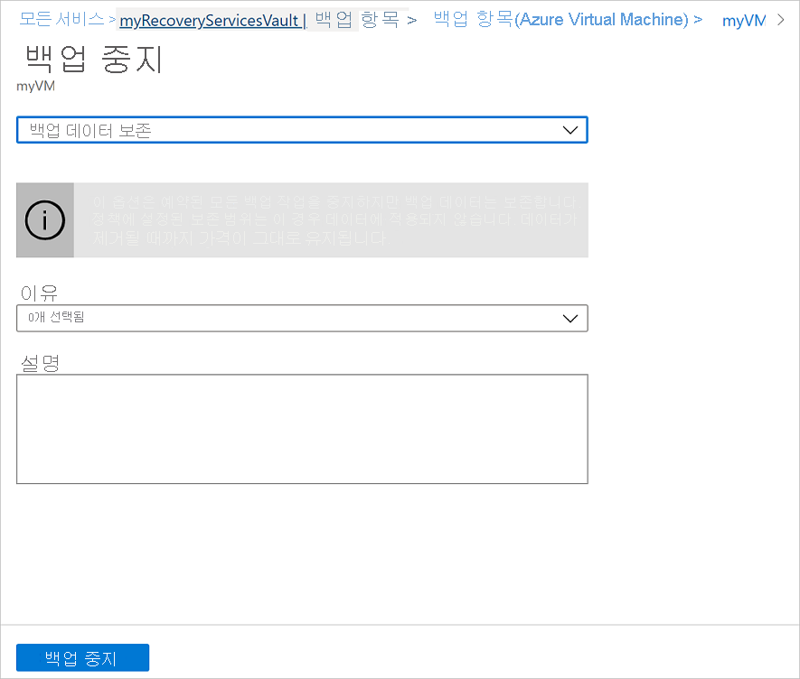
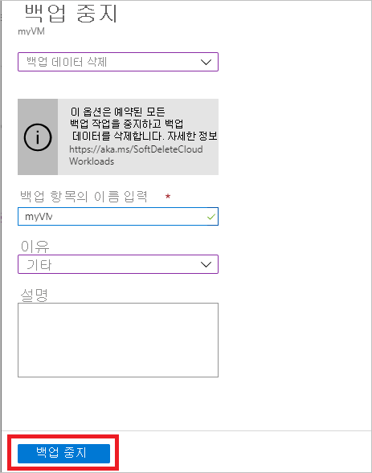

# Azure Backup 서비스를 사용 하 여 Azure VM 백업 관리

이 문서에서는 [Azure Backup 서비스](backup-overview.md)를 사용 하 여 백업 된 Azure vm (가상 컴퓨터)을 관리 하는 방법을 설명 합니다. 또한이 문서에서는 자격 증명 모음 대시보드에서 찾을 수 있는 백업 정보를 요약 합니다.

Azure Portal에서 Recovery Services 자격 증명 모음 대시보드는 다음을 비롯 한 자격 증명 모음 정보에 대 한 액세스를 제공 합니다.

* 최신 백업(최신 복원 지점이기도 함)
* 백업 정책입니다.
* 모든 백업 스냅숏의 전체 크기입니다.
* 백업을 사용할 수 있는 Vm의 수입니다.

대시보드를 사용 하 고 개별 Vm으로 드릴 다운 하 여 백업을 관리할 수 있습니다. 컴퓨터 백업을 시작 하려면 대시보드에서 자격 증명 모음을 엽니다.

## 대시보드에서 Vm 보기

자격 증명 모음 대시보드에서 Vm을 보려면 다음을 수행 합니다.

1. [Azure Portal](https://portal.azure.com/)에 로그인합니다.
2. 허브 메뉴에서 **찾아보기**를 선택 합니다. 리소스 목록에서 **Recovery Services**를 입력합니다. 입력 하는 경우에는 입력에 따라 목록이 필터링 됩니다. **Recovery Services 자격 증명 모음**을 선택합니다.

    

3. 사용 편의성을 위해 자격 증명 모음을 마우스 오른쪽 단추로 클릭 하 고 **대시보드에 고정**을 선택 합니다.
4. 자격 증명 모음 대시보드를 엽니다.

    

5. **Backup 항목** 타일에서 **Azure Virtual Machines**를 선택 합니다.

    

6. **백업 항목** 창에서 보호 된 vm의 목록을 볼 수 있습니다. 이 예에서 자격 증명 모음은 하나의 가상 머신 demobackup을 보호 합니다.  

    

7. 자격 증명 모음 항목의 대시보드에서 백업 정책을 수정 하 고, 요청 시 백업을 실행 하 고, Vm의 보호를 중지 하거나 다시 시작 하 고, 백업 데이터를 삭제 하 고, 복원 지점이 표시 되 고, 복원을 실행 합니다.

    

## VM에 대 한 백업 정책 관리

백업 정책을 관리 하려면 다음을 수행 합니다.

1. [Azure Portal](https://portal.azure.com/)에 로그인합니다. 자격 증명 모음 대시보드를 엽니다.
2. **Backup 항목** 타일에서 **Azure Virtual Machines**를 선택 합니다.

    

3. **백업 항목** 창에서 최근 복원 시점 시간을 사용 하 여 보호 된 vm 및 마지막 백업 상태 목록을 볼 수 있습니다.

    

4. 자격 증명 모음 항목의 대시보드에서 백업 정책을 선택할 수 있습니다.

   * 정책을 전환 하려면 다른 정책을 선택한 다음 **저장**을 선택 합니다. 자격 증명 모음에 새 정책이 즉시 적용됩니다.

     

## 주문형 백업 실행

보호를 설정한 후에는 VM의 주문형 백업을 실행할 수 있습니다. 이러한 세부 정보를 염두에 두어야 합니다.

* 초기 백업이 보류 중인 경우 주문형 백업은 Recovery Services 자격 증명 모음에 VM의 전체 복사본을 만듭니다.
* 초기 백업이 완료 되 면 주문형 백업은 이전 스냅숏의 변경 내용을 Recovery Services 자격 증명 모음으로 보냅니다. 즉, 이후의 백업은 항상 증분입니다.
* 주문형 백업의 보존 범위는 백업을 트리거할 때 지정 하는 보존 값입니다.

요청 시 백업을 트리거하려면 다음을 수행합니다.

1. [자격 증명 모음 항목 대시보드의](#view-vms-on-the-dashboard) **보호 된 항목**에서 **백업 항목**을 선택 합니다.

    

2. **Backup 관리 유형**에서 **Azure Virtual Machine**을 선택 합니다. **Backup 항목 (Azure Virtual Machine)** 창이 나타납니다.
3. VM을 선택 하 고 **지금 백업** 을 선택 하 여 요청 시 백업을 만듭니다. **지금 Backup** 창이 나타납니다.
4. **백업 보존 기간** 필드에서 백업을 보존할 날짜를 지정 합니다.

    

5. **확인** 을 선택 하 여 백업 작업을 실행 합니다.

작업 진행률을 추적 하려면 자격 증명 모음 대시보드에서 **백업 작업** 타일을 선택 합니다.

## VM 보호 중지

VM 보호를 중지 하는 방법에는 다음 두 가지가 있습니다.

* **보호를 중지 하 고 백업 데이터를 보존**합니다. 이 옵션은 VM을 보호 하는 이후 모든 백업 작업을 중지 합니다. 그러나 Azure Backup 서비스에서 백업 된 복구 지점은 유지 됩니다.  자격 증명 모음에서 복구 지점이 유지 되도록 요금을 지불 해야 합니다 (자세한 내용은 [Azure Backup 가격](https://azure.microsoft.com/pricing/details/backup/) 정보 참조). 필요한 경우 VM을 복원할 수 있습니다. VM 보호를 다시 시작 하기로 결정 한 경우 *백업 다시 시작* 옵션을 사용할 수 있습니다.
* **보호를 중지 하 고 백업 데이터를 삭제**합니다. 이 옵션을 선택 하면 이후의 모든 백업 작업이 VM을 보호 하 고 모든 복구 지점이 삭제 되지 않습니다. VM을 복원 하거나 *백업 다시 시작* 옵션을 사용할 수 없습니다.

>[!NOTE]
>백업을 중지하지 않고 데이터 원본을 삭제하면 새 백업이 실패합니다. 이전 복구 지점은 정책에 따라 만료 되지만, 백업을 중지 하 고 데이터를 삭제할 때까지 마지막 복구 지점은 항상 유지 됩니다.
>

### 보호 중지 및 백업 데이터 보존

보호를 중지 하 고 VM의 데이터를 유지 하려면:

1. [자격 증명 모음 항목의 대시보드에서](#view-vms-on-the-dashboard) **백업 중지**를 선택 합니다.
2. **백업 데이터 보존**을 선택 하 고 필요에 따라 선택 내용을 확인 합니다. 원하는 경우 주석을 추가 합니다. 항목의 이름을 잘 모르는 경우에는 느낌표 위에 마우스를 올려 놓으면 이름이 표시 됩니다.

    

알림을 통해 백업 작업이 중지 되었음을 알 수 있습니다.

### 보호 중지 및 백업 데이터 삭제

VM의 보호를 중지 하 고 데이터를 삭제 하려면:

1. [자격 증명 모음 항목의 대시보드에서](#view-vms-on-the-dashboard) **백업 중지**를 선택 합니다.
2. **백업 데이터 삭제**를 선택 하 고 필요에 따라 선택 내용을 확인 합니다. 원하는 경우 백업 항목의 이름을 입력 하 고 주석을 추가 합니다.

    

## VM 보호 다시 시작

VM 보호를 중지 하는 동안 [보호 중지 및 백업 데이터 보존](#stop-protection-and-retain-backup-data) 옵션을 선택한 경우 **백업 다시 시작**을 사용할 수 있습니다. [보호 중지 및 백업 데이터 삭제](#stop-protection-and-delete-backup-data) 옵션을 선택 하거나 [백업 데이터를 삭제](#delete-backup-data)하는 경우에는이 옵션을 사용할 수 없습니다.

VM에 대 한 보호를 다시 시작 하려면:

1. [자격 증명 모음 항목의 대시보드에서](#view-vms-on-the-dashboard) **백업 다시 시작**을 선택 합니다.

2. [백업 정책 관리](#manage-backup-policy-for-a-vm) 의 단계에 따라 VM에 대 한 정책을 할당 합니다. VM의 초기 보호 정책을 선택할 필요가 없습니다.
3. VM에 백업 정책을 적용 하면 다음과 같은 메시지가 표시 됩니다.

    

## 백업 데이터 삭제

VM의 백업 데이터를 삭제 하는 방법에는 다음 두 가지가 있습니다.

* 자격 증명 모음 항목 대시보드에서 백업 중지를 선택 하 고 [보호 중지 및 백업 데이터 삭제](#stop-protection-and-delete-backup-data) 에 대 한 지침을 따릅니다.

  

* 자격 증명 모음 항목 대시보드에서 백업 데이터 삭제를 선택 합니다. 이 옵션은 VM 보호를 중지 하는 동안 [보호를 중지 하 고 백업 데이터 보존](#stop-protection-and-retain-backup-data) 옵션을 선택한 경우에 사용할 수 있습니다.

  

  * [자격 증명 모음 항목 대시보드에서](#view-vms-on-the-dashboard) **백업 데이터 삭제**를 선택 합니다.
  * 복구 지점이 삭제 되도록 확인할 백업 항목의 이름을 입력 합니다.

    

  * 항목에 대 한 백업 데이터를 삭제 하려면 **삭제**를 선택 합니다. 알림 메시지를 통해 백업 데이터가 삭제 되었음을 알 수 있습니다.

데이터를 보호 하기 위해 Azure Backup에는 일시 삭제 기능이 포함 되어 있습니다. 일시 삭제를 사용 하면 VM의 백업 (모든 복구 시점)이 삭제 된 후에도 백업 데이터는 14 일 동안 보존 됩니다. 자세한 내용은 [일시 삭제 설명서](https://docs.microsoft.com/azure/backup/backup-azure-security-feature-cloud)를 참조 하세요.

  > [!NOTE]
  > 백업 데이터를 삭제 하면 연결 된 모든 복구 지점이 삭제 됩니다. 삭제할 특정 복구 지점은 선택할 수 없습니다.

### 주 데이터 원본이 더 이상 존재 하지 않는 백업 항목

* Azure backup에 대해 구성 된 Azure Vm이 보호를 중지 하지 않고 삭제 되거나 이동 되 면 예약 된 백업 작업과 주문형 (임시) 백업 작업이 모두 실패 하 고 UserErrorVmNotFoundV2 오류가 발생 합니다. 백업 사전 검사는 실패 한 요청 시 백업 작업에 대해서만 중요 한 것으로 표시 됩니다 (실패 한 예약 작업은 표시 되지 않음).
* 이러한 백업 항목은 사용자가 설정한 백업 및 보존 정책을 준수 하는 시스템에서 활성 상태로 유지 됩니다. 이러한 Azure Vm에 대 한 백업 된 데이터는 보존 정책에 따라 보존 됩니다. 만료 된 복구 지점 (마지막 복구 지점 제외)은 백업 정책에 설정 된 보존 범위에 따라 정리 됩니다.
* 사용자는 추가 비용을 방지 하기 위해 주 데이터 원본이 더 이상 존재 하지 않는 백업 항목을 삭제 하는 것이 좋습니다 .이 경우에는 마지막 복구 지점이 영구적으로 유지 되 고 해당 사용자에 게 적용 되는 백업 가격에 따라 요금이 청구 되기 때문에 삭제 리소스의 백업 항목/데이터가 더 이상 필요 하지 않은 경우

## 다음 단계

* [Vm의 설정에서 Azure vm을 백업](backup-azure-vms-first-look-arm.md)하는 방법에 대해 알아봅니다.
* [Vm을 복원](backup-azure-arm-restore-vms.md)하는 방법을 알아봅니다.
* [AZURE VM 백업을 모니터링](backup-azure-monitor-vms.md)하는 방법에 대해 알아봅니다.
