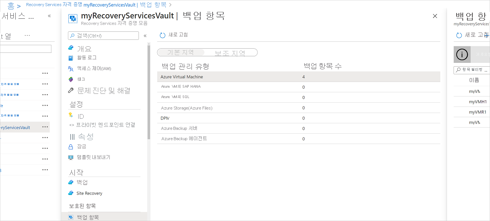
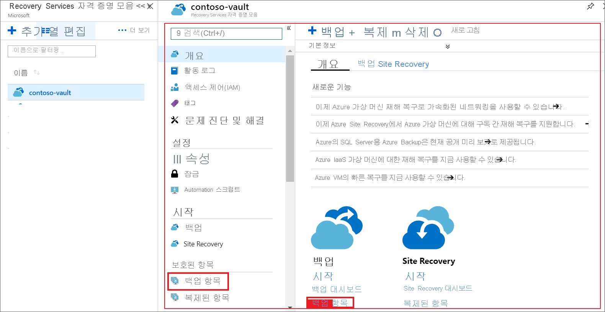
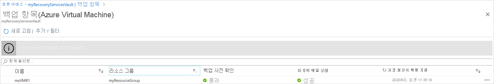
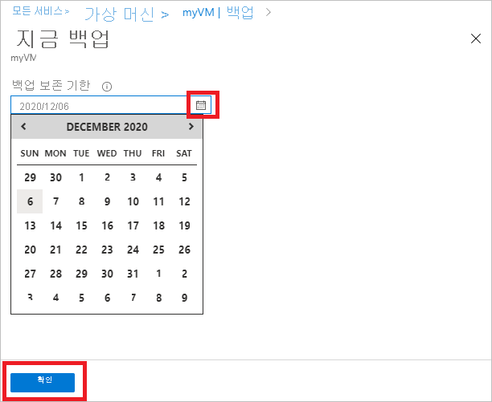

# Azure VM 백업 관리

이 문서를 사용 하 여 백업 되는 Azure virtual machines (Vm)를 관리 하는 방법에 설명 합니다 [Azure Backup 서비스](backup-overview.md)합니다. 이 문서에는 자격 증명 모음 대시보드에서 백업 정보를 찾을 수 있습니다 요약 되어 있습니다.

Azure portal에서 Recovery Services 자격 증명 모음 대시보드 정보를 자격 증명 모음에 대 한 액세스를 제공 포함:

* 최신 백업(최신 복원 지점이기도 함)
* 백업 정책입니다.
* 모든 백업 스냅숏의 총 크기입니다.
* 백업을 사용할 수 있는 Vm의 수입니다.

대시보드를 사용 하 고 개별 Vm으로 드릴 다운 하 여 백업을 관리할 수 있습니다. 컴퓨터 백업을 시작 하려면 대시보드에서 자격 증명 모음을 엽니다.

## 대시보드에서 Vm 보기

자격 증명 모음 대시보드에서 Vm을 보려면:

1. [Azure Portal](https://portal.azure.com/)에 로그인합니다.
2. 허브 메뉴에서 선택 **찾아보기**합니다. 리소스 목록에서 **Recovery Services**를 입력합니다. 입력할 때 목록이 입력에 따라 필터링 됩니다. **Recovery Services 자격 증명 모음**을 선택합니다.

    

3. 사용 편의성을 위해 선택한 자격 증명 모음을 마우스 오른쪽 단추로 **대시보드에 고정**합니다.
4. 자격 증명 모음 대시보드를 엽니다.

    

5. 에 **Backup 항목** 타일을 선택 **Azure Virtual Machines**합니다.

    

6. 에 **Backup 항목** 블레이드에서 보호 된 Vm 목록을 볼 수 있습니다. 이 예제에서는 자격 증명 모음 보호 한 가상 머신: demobackup 합니다.  

    

7. 자격 증명 모음 항목 대시보드에서 백업 정책을 수정, 주문형 백업 중지를 실행 또는 Vm에 대 한 보호를 다시 시작, 백업 데이터 삭제, 복원 지점 확인 및 복원을 실행 합니다.

    

## VM에 대 한 백업 정책 관리

백업 정책을 관리 합니다.

1. [Azure Portal](https://portal.azure.com/)에 로그인합니다. 자격 증명 모음 대시보드를 엽니다.
2. 에 **Backup 항목** 타일을 선택 **Azure Virtual Machines**합니다.

    

3. 에 **Backup 항목** 블레이드에서 최신 복원 지점 시간을 사용 하 여 마지막 백업 상태 및 보호 된 Vm 목록을 볼 수 있습니다.

    

4. 자격 증명 모음 항목 대시보드에서 백업 정책을 선택할 수 있습니다.

   * 정책 전환 다른 정책을 선택한 다음 선택 **저장할**합니다. 자격 증명 모음에 새 정책이 즉시 적용됩니다.

     

## 요청 시 백업 실행
보호를 설정한 후 vm을 주문형 백업을 실행할 수 있습니다. 이러한 세부 사항을 염두에 두십시오.

- 초기 백업이 보류 중인 경우 주문형 백업을 Recovery Services 자격 증명 모음에 VM의 전체 복사본을 만듭니다.
- 초기 백업이 완료 되 면-주문형 백업 변경 내용만 보냅니다는 이전 스냅숏에서 Recovery Services 자격 증명 모음입니다. 즉, 이후 백업은 항상 증분 형입니다.
- 주문형 백업의 보존 범위는 백업을 트리거하는 경우 지정 된 보존 값입니다.

요청 시 백업을 트리거하려면 다음을 수행합니다.

1. 에 [자격 증명 모음 항목 대시보드](#view-vms-on-the-dashboard)아래에 있는 **보호 된 항목**를 선택 **Backup 항목**합니다.

    

2. **백업 관리 유형**를 선택 **Azure Virtual Machine**합니다. 합니다 **Backup 항목 (Azure 가상 머신)** 블레이드가 표시 됩니다.
3. VM을 선택 하 고 선택 **지금 Backup** 주문형 백업을 만듭니다. 합니다 **지금 Backup** 블레이드가 표시 됩니다.
4. 에 **백업 보존** 필드 백업을 보존할 날짜를 지정 합니다.

    

5. 선택 **확인** 백업 작업을 실행 합니다.

자격 증명 모음 대시보드에서 작업의 진행률을 추적 하려면 선택 합니다 **백업 작업** 바둑판식으로 배열 합니다.

## VM 보호 중지

두 가지 방법으로 VM 보호를 중지 하려면:

- 미래의 모든 백업 작업을 중지하고 모든 복구 지점을 삭제 이 경우 VM을 복원할 수 없습니다.
- 모든 미래의 백업 작업을 중지 하 고 복구 지점을 유지 합니다. 자격 증명 모음의 복구 지점을 유지 하는 데 비용을 지불 해야 하지만 필요한 경우 VM을 복원할 수 있습니다. 자세한 내용은 [Azure Backup 가격](https://azure.microsoft.com/pricing/details/backup/)합니다.

>[!NOTE]
>백업 중지 하지 않고 데이터 소스를 삭제 하면 새 백업이 실패 합니다. 정책에 따라 이전 복구 지점이 만료는 있지만 마지막 복구 지점이 하나는 백업을 중지 하 고 데이터를 삭제할 때까지 항상 유지 됩니다.
>

VM에 대 한 보호를 중지 합니다.

1. 에 [자격 증명 모음 항목의 대시보드에서](#view-vms-on-the-dashboard)를 선택 **백업 중지**합니다.
2. 또는 유지 하 고, 백업 데이터를 삭제 하 고, 필요에 따라 선택 사항을 확인 여부를 선택 합니다. 원하는 경우 주석을 추가 합니다. 항목의 이름을 모르는 경우 이름을 보려면 느낌표 위로 마우스를 가져갑니다.

    

     알림을 알려줍니다 백업 작업이 중지 되었습니다.

## VM 보호 다시 시작

VM을 중지 하는 경우 백업 데이터를 유지 하면 보호를 나중에 다시 시작할 수 있습니다. 백업 데이터를 삭제 하는 경우에 보호를 다시 시작할 수 없습니다.

VM에 대 한 보호를 다시 시작

1. 에 [자격 증명 모음 항목의 대시보드에서](#view-vms-on-the-dashboard)를 선택 **백업 다시 시작**합니다.

2. 단계를 따릅니다 [백업 정책 관리](#manage-backup-policy-for-a-vm) VM에 대 한 정책을 할당 합니다. VM의 초기 보호 정책을 선택 하려면 필요가 없습니다.
3. 백업 정책을 VM에 적용 하면 다음과 같은 메시지가 표시:

    

## 백업 데이터 삭제

VM의 백업 데이터를 삭제할 수 있습니다 합니다 **백업 중지** 작업 백업 작업이 완료 된 후 또는 합니다. 백업 데이터를 삭제 하기 전에 이러한 세부 사항에 유의 해야 합니다.

- 며칠이 나 몇 주가 복구 지점을 삭제 하기 전에 대기 하는 것이 좋습니다 수 있습니다.
- 프로세스와 달리이 복구 지점을 복원에 대 한 백업 데이터를 삭제 하면 선택할 수는 없으며 특정 복구 지점을 삭제 하도록 합니다. 백업 데이터를 삭제 하면 모든 관련된 복구 지점 삭제 합니다.

을 중지 하거나 VM의 백업 작업을 비활성화 한 후에 백업 데이터를 삭제할 수 있습니다.

1. 에 [자격 증명 모음 항목 대시보드](#view-vms-on-the-dashboard)를 선택 **백업 데이터 삭제**합니다.

    

1. 복구 지점을 삭제 되도록 확인 하려면 백업 항목의 이름을 입력 합니다.

    

1. 선택 항목에 대 한 백업 데이터를 삭제 하려면 **삭제**합니다. 알림 메시지를 통해 백업 데이터를 삭제 했을 알 수 있습니다.

## 다음 단계
- 설명 하는 방법 [VM의 설정에서 Azure Vm 백업](backup-azure-vms-first-look-arm.md)합니다.
- 설명 하는 방법 [Vm 복원](backup-azure-arm-restore-vms.md)합니다.
- 설명 하는 방법 [Azure VM 백업 모니터링](backup-azure-monitor-vms.md).
