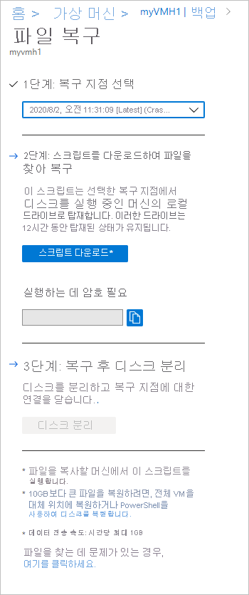
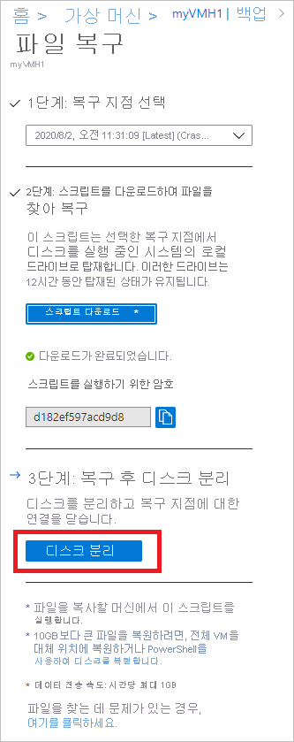

# <a name="recover-files-from-azure-virtual-machine-backup"></a>Azure Virtual Machine 백업에서 파일 복구

Azure Backup에서는 복구 지점이라고도 하는 Azure VM 백업에서 [Azure VM(가상 머신) 및 디스크](./backup-azure-arm-restore-vms.md)를 복원하는 기능을 제공합니다. 이 문서에서는 Azure VM Backup에서 파일 및 폴더를 어떻게 복구할 수 있는지 설명합니다. 파일 및 폴더 복원은 Resource Manager 모델을 사용하여 배포된 Azure VM에서만 사용 가능하며 Recovery Services 자격 증명 모음에 대해 보호됩니다.

> [!Note]
> 이 기능은 Resource Manager 모델을 사용하여 배포된 Azure VM에서 사용 가능하며 Recovery Services 자격 증명 모음에 대해 보호됩니다.
> 암호화된 VM 백업으로부터 파일 복구는 지원되지 않습니다.
>

## <a name="mount-the-volume-and-copy-files"></a>볼륨 탑재 및 파일 복사

복구 지점에서 파일 또는 폴더를 복원하려면 가상 머신으로 이동하고 원하는 복구 지점을 선택합니다.

1. [Azure Portal](https://portal.Azure.com)에 로그인하고 왼쪽 창에서 **가상 머신**를 클릭합니다. 가상 머신 목록에서 가상 머신을 선택하여 해당 가상 머신의 대시보드를 엽니다.

2. 가상 머신의 메뉴에서 **Backup**을 클릭하여 Backup 대시보드를 엽니다.

    

3. Backup 대시보드 메뉴에서 **파일 복구**를 클릭합니다.

    

    **파일 복구** 메뉴가 열립니다.

    

4. **복구 지점 선택** 드롭다운 메뉴에서 원하는 파일이 있는 복구 지점을 선택합니다. 기본적으로 최신 복구 지점을 선택합니다.

5. 복구 지점에서 파일을 복사하는 데 사용할 소프트웨어를 다운로드하려면 **실행 파일 다운로드**(Windows Azure VM의 경우) 또는 **스크립트 다운로드**를 클릭합니다(Linux Azure VM의 경우 python 스크립트가 생성됨).

    

    Azure가 실행 파일 또는 스크립트를 로컬 컴퓨터로 다운로드합니다.

    

    실행 파일 또는 스크립트를 관리자 권한으로 실행하려면 다운로드 파일을 컴퓨터에 저장하는 것이 좋습니다.

6. 실행 파일 또는 스크립트는 암호로 보호되어 암호가 필요합니다. **파일 복구** 메뉴에서 복사 버튼을 클릭하여 암호를 메모리에 로드합니다.

    

7. 다운로드 위치(일반적으로 다운로드 폴더)에서 실행 파일 또는 스크립트를 마우스 오른쪽 단추로 클릭하고 관리자 자격 증명을 사용하여 실행합니다. 메시지가 표시되면 암호를 입력하거나 메모리에서 암호를 붙여넣고 Enter를 누릅니다. 올바른 암호를 입력하면 스크립트가 복구 지점에 연결됩니다.

    

    제한된 액세스를 포함하는 컴퓨터에서 스크립트를 실행하는 경우 다음에 대한 액세스 권한이 있는지 확인합니다.

    - download.microsoft.com
    - Recovery Service URL(복구 서비스 자격 증명 모음이 있는 지역을 참조하는 지역 이름)
        - https:\//pod01-rec2.geo-name.backup.windowsazure.com (에 대 한 Azure 공용 지역)
        - https:\//pod01-rec2.geo-name.backup.windowsazure.cn (에 대 한 Azure 중국)
        - https:\//pod01-rec2.geo-name.backup.windowsazure.us (에 대 한 Azure US Government)
        - https:\//pod01-rec2.geo-name.backup.windowsazure.de (에 대 한 Azure Germany)
    - 아웃바운드 포트 3260

> [!Note]
> 
> * 다운로드 한 스크립트 파일 이름 합니다 **지역 이름** URL에서를 입력 하도록 합니다. 에 대 한 예를 들어: 다운로드 한 스크립트 이름을 사용 하 여 시작 \'VMname\'\_\'geoname\'_\'GUID\', ContosoVM_wcus_12345678 같은...<br><br>
> * Url "https:\//pod01-rec2.wcus.backup.windowsazure.com"


   Linux의 경우 스크립트는 복구 지점에 연결하는 데 'open-iscsi' 및 'lshw' 구성 요소가 필요합니다. 컴퓨터에 스크립트가 실행되는 구성 요소가 없는 경우 스크립트에서 구성 요소 설치를 허가할지 묻습니다. 동의하여 필요한 구성 요소를 설치 합니다.

   스크립트가 실행되는 컴퓨터와 복구 지점의 데이터 간에 보안 채널을 구축하는 데 사용되는 구성 요소를 다운로드하려면 download.microsoft.com에 대한 액세스 권한이 필요합니다.

   백업된 VM과 동일한(또는 호환) 운영 체제가 있는 모든 컴퓨터에서 스크립트를 실행할 수 있습니다. 호환되는 운영 체제는 [호환되는 OS 표](backup-azure-restore-files-from-vm.md#system-requirements)를 참조하세요. 보호된 Azure 가상 머신에서 Windows 저장소 공간(Windows Azure VM의 경우) 또는 LVM/RAID 배열(Linux VM의 경우)을 사용하는 경우 동일한 가상 머신에서 실행 파일 또는 스크립트를 실행할 수 없습니다. 대신, 호환되는 운영 체제로 다른 컴퓨터에서 실행 파일 또는 스크립트를 실행합니다.

### <a name="identifying-volumes"></a>볼륨 식별

#### <a name="for-windows"></a>Windows의 경우

실행 파일을 실행하면 운영 체제는 새 볼륨을 탑재하고 드라이브 문자를 할당합니다. Windows 탐색기 또는 파일 탐색기를 사용하여 해당 드라이브를 탐색할 수 있습니다. 볼륨에 할당된 드라이브 문자는 원래 가상 컴퓨터와 다를 수 있지만 볼륨 이름은 유지됩니다. 예를 들어 원래 가상 컴퓨터에서 볼륨이 "데이터 디스크(E:`\`)"인 경우 해당 볼륨은 로컬 컴퓨터에서 "데이터 디스크('임의 드라이브 문자':`\`)로 연결할 수 있습니다. 사용자의 파일/폴더를 찾을 때까지 스크립트 출력에 나와 있는 모든 볼륨을 탐색합니다.  

   

#### <a name="for-linux"></a>Linux의 경우

Linux에서 복구 지점의 볼륨은 스크립트가 실행되는 폴더에 탑재됩니다. 연결된 디스크, 볼륨 및 해당 탑재 경로는 적절하게 표시됩니다. 이러한 탑재 경로는 루트 수준 액세스 권한이 있는 사용자에게 표시됩니다. 스크립트 출력에서 언급한 볼륨을 통해 찾습니다.

  

## <a name="closing-the-connection"></a>연결 닫기

파일을 식별하고 로컬 저장소 위치에 복사한 후에는 추가 드라이브를 제거(또는 분리)합니다. 드라이브를 분리하려면 Azure Portal의 **파일 복구** 메뉴에서 **디스크 분리**를 클릭합니다.



디스크가 분리되면 메시지가 표시됩니다. 디스크를 제거할 수 있도록 연결을 새로 고치는 데 몇 분이 소요될 수 있습니다.

Linux에서 복구 지점에 대한 연결이 단절된 후 OS는 해당 탑재 경로를 자동으로 제거하지 않습니다. 탑재 경로는 "분리된" 볼륨으로 존재하고 표시되지만 파일에 액세스하거나 파일을 액세스/작성할 때 오류를 throw합니다. 수동으로 제거할 수도 있습니다. 스크립트는 실행 시 모든 이전 복구 지점에서 존재하는 이러한 볼륨을 식별하고 승인 시 정리합니다.

## <a name="special-configurations"></a>특수 구성

### <a name="dynamic-disks"></a>동적 디스크

보호된 Azure VM에 다음과 같은 특성 중 하나 또는 달 다를 포함한 볼륨이 있는 경우 동일한 VM에서 실행 스크립트를 실행할 수 없습니다.

- 여러 디스크에 걸쳐 있는 볼륨(스팬 및 스트라이프 볼륨)
- 동적 디스크의 장애 조치 볼륨(미러 및 RAID-5 볼륨)

대신, 호환되는 운영 체제로 다른 컴퓨터에서 실행 가능한 스크립트를 실행합니다.

### <a name="windows-storage-spaces"></a>Windows 저장소 공간

Windows 저장소 공간은 저장소를 가상화할 수 있는 Windows 기술입니다. Windows 저장소 공간을 사용하면 업계 표준 디스크를 저장소 풀로 그룹화할 수 있습니다. 그런 다음 해당 저장소 풀의 사용 가능한 공간을 사용하여 저장소 공간이라는 가상 디스크를 만들 수 있습니다.

보호된 Azure VM에서 Windows 저장소 공간을 사용하는 경우 동일한 VM에서는 실행 가능한 스크립트를 실행할 수 없습니다. 대신, 호환되는 운영 체제로 다른 컴퓨터에서 실행 가능한 스크립트를 실행합니다.

### <a name="lvmraid-arrays"></a>LVM/RAID 배열

Linux에서 LVM(논리 볼륨 관리자) 및/또는 소프트웨어 RAID 배열은 여러 디스크에 걸쳐 논리 볼륨을 관리하는 데 사용됩니다. 보호된 Linux VM에서 LVM 및/또는 RAID 배열을 사용하는 경우 동일한 VM에서 스크립트를 실행할 수 없습니다. 대신 호환되는 OS로 다른 컴퓨터에서 스크립트를 실행하고 보호된 VM의 파일 시스템을 지원합니다.

다음 스크립트 출력은 파티션 형식으로 LVM 및/또는 RAID 배열 디스크 및 볼륨을 표시합니다.

   

이 파티션을 온라인 상태로 만들려면 다음 섹션의 명령을 실행합니다.

#### <a name="for-lvm-partitions"></a>LVM 파티션의 경우

실제 볼륨에 볼륨 그룹 이름을 나열합니다.

```bash
#!/bin/bash
$ pvs <volume name as shown above in the script output>
```

볼륨 그룹에 모든 논리 볼륨, 이름 및 해당 경로를 나열합니다.

```bash
#!/bin/bash
$ lvdisplay <volume-group-name from the pvs command’s results>
```

선택한 경로에 논리 볼륨을 탑재하려면.

```bash
#!/bin/bash
$ mount <LV path> </mountpath>
```

#### <a name="for-raid-arrays"></a>RAID 배열의 경우

다음 명령은 모든 RAID 디스크에 대한 세부 정보를 표시합니다.

```bash
#!/bin/bash
$ mdadm –detail –scan
```

 관련 RAID 디스크는 `/dev/mdm/<RAID array name in the protected VM>`으로 표시됩니다.

RAID 디스크에 실제 볼륨이 있는 경우 탑재 명령을 사용합니다.

```bash
#!/bin/bash
$ mount [RAID Disk Path] [/mountpath]
```

RAID 디스크에 다른 LVM이 구성되어 있는 경우 LVM 파티션에 대한 이전 절차를 사용하되 RAID 디스크 이름 대신에 볼륨 이름을 사용합니다.

## <a name="system-requirements"></a>시스템 요구 사항

### <a name="for-windows-os"></a>Windows OS의 경우

다음 표에서는 서버와 컴퓨터 운영 체제 간의 호환성을 보여 줍니다. 파일을 복구할 경우 이전 또는 미래 운영 체제 버전으로 파일을 복원할 수 없습니다. 예를 들어 Windows Server 2016 VM의 파일을 Windows Server 2012 또는 Windows 8 컴퓨터로 복원할 수 없습니다. VM의 파일을 같은 서버 운영 체제 또는 호환되는 클라이언트 운영 체제로 복원할 수 있습니다.

|서버 OS | 호환되는 클라이언트 OS  |
| --------------- | ---- |
| Windows Server 2016    | 윈도우 10 |
| Windows Server 2012 R2 | Windows 8.1 |
| Windows Server 2012    | Windows 8  |
| Windows Server 2008 R2 | Windows 7   |

### <a name="for-linux-os"></a>Linux OS

Linux에서 파일을 복원하는 데 사용하는 컴퓨터의 OS는 보호된 가상 머신의 파일 시스템을 지원해야 합니다. 스크립트를 실행할 컴퓨터를 선택할 때 컴퓨터에 호환되는 OS가 있는지 확인하고 다음 테이블에 나타난 버전 중 하나를 사용합니다.

|Linux OS | 버전  |
| --------------- | ---- |
| Ubuntu | 12.04 이상 |
| CentOS | 6.5 이상  |
| RHEL | 6.7 이상 |
| Debian | 7 이상 |
| Oracle Linux | 6.4 이상 |
| SLES | 12 이상 |
| openSUSE | 42.2 이상 |

> [!Note]
> SLES 12 SP4 OS를 사용 하 여 컴퓨터에서 파일 복구 스크립트를 실행 중인 몇 가지 문제가 발견 했습니다. SLES 팀을 사용 하 여 조사 중입니다.
> 현재, 실행 파일 복구 스크립트를 SLES 12 SP2 및 SP3 운영 체제 버전을 사용 하 여 컴퓨터에서 작동 합니다.
>

스크립트는 복구 지점에 안전하게 연결하고 실행하기 위해 Python 및 bash 구성 요소가 필요합니다.

|구성 요소 | Version  |
| --------------- | ---- |
| bash | 4 이상 |
| python | 2.6.6 이상  |
| TLS | 1.2가 지원되어야 합니다.  |

## <a name="troubleshooting"></a>문제 해결

가상 머신에서 파일을 복구하는 동안 문제가 생기는 경우 다음 표에서 추가 정보를 확인하세요.

| 오류 메시지/시나리오 | 가능한 원인 | 권장 작업 |
| ------------------------ | -------------- | ------------------ |
| Exe 출력: *대상에 연결하는 동안 예외가 발생했습니다.* |스크립트가 복구 지점에 액세스할 수 없습니다.    | 컴퓨터가 이전 액세스 요구 사항을 충족하는지 확인하세요. |  
| Exe 출력: *iSCSI 세션을 통해 대상이 이미 로그인되었습니다.* | 동일한 컴퓨터에서 스크립트가 이미 실행되었고 드라이브가 연결되었습니다. | 복구 지점의 볼륨이 이미 연결되었습니다. 원래 VM과 동일한 드라이브 문자로 탑재되지 않을 수 있습니다. 파일 탐색기에서 사용 가능한 모든 볼륨을 탐색하여 파일을 찾습니다. |
| Exe 출력: *디스크가 포털을 통해 분리되었고 12시간 제한을 초과했으므로 이 스크립트는 유효하지 않습니다. 포털에서 새 스크립트를 다운로드하세요.* |    디스크가 포털에서 분리되었거나 12시간 제한을 초과했습니다. | 이 특정 exe는 현재 유효하지 않고 실행할 수 없습니다. 복구 지정 시간의 파일에 액세스하려면 포털에서 새 exe를 찾으세요.|
| exe가 실행되는 머신에서: 분리 단추를 클릭하면 새 볼륨이 분리되지 않습니다. | 머신에서 iSCSI 초기자가 응답하지 않거나 대상에 대한 연결을 새로 고치지 않고 캐시를 유지 관리하지 않습니다. |  **분리**를 클릭한 후에 잠시 대기합니다. 새 볼륨이 분리되지 않으면 모든 볼륨을 탐색하세요. 모든 볼륨을 탐색하면 초기자가 강제로 연결을 새로 고치도록 하여 디스크를 사용할 수 없다는 오류 메시지와 함께 볼륨이 분리됩니다.|
| Exe 출력: 스크립트가 성공적으로 실행되지만 스크립트 출력에 "New volumes attached(새 볼륨 연결됨)"가 표시되지 않습니다. |    일시적인 오류입니다.    | 볼륨은 이미 연결되었습니다. Explorer를 열어 탐색합니다. 스크립트를 실행할 때마다 동일한 컴퓨터를 사용하는 경우 컴퓨터를 다시 시작하면 목록이 후속 exe 실행에 표시됩니다. |
| Linux 특정: 원하는 볼륨을 볼 수 없습니다. | 스크립트가 실행되는 컴퓨터의 OS는 보호된 VM의 기본 파일 시스템을 인식하지 못할 수도 있습니다. | 복구 지점이 충돌 일관성 또는 파일 일관성인지 확인합니다. 파일 일관성인 경우 OS가 보호된 VM의 파일 시스템을 인식하는 다른 컴퓨터에서 스크립트를 실행합니다. |
| Windows 특정: 원하는 볼륨을 볼 수 없습니다. | 디스크가 연결되었을 수도 있지만 볼륨이 구성되지 않았습니다. | 디스크 관리 화면에서 복구 지점과 관련된 추가 디스크를 식별합니다. 이러한 디스크가 오프라인 상태이면 디스크를 마우스 오른쪽 단추로 클릭하고 '온라인'을 클릭하여 온라인 상태로 전환합니다.|

## <a name="security"></a>보안

이 섹션에서는 사용자가 기능의 보안 측면을 인식 되도록 Azure VM 백업 으로부터 파일 복구가의 구현을 위해 다양 한 보안 조치를 설명 합니다.

### <a name="feature-flow"></a>기능 흐름

이 기능 전체 VM 또는 VM을 복원 하지 않고도 VM 데이터를 액세스 하기 위해 작성 된 디스크에 최소 단계입니다. VM 데이터에 대 한 액세스 (아래 표시 된 것 처럼 실행 하는 경우 복구 볼륨을 탑재)는 스크립트를 통해 제공 되 고 모든 보안 구현의 토대를 형성 하므로

  

### <a name="security-implementations"></a>보안 구현

#### <a name="select-recovery-point-who-can-generate-script"></a>복구 지점 (하는 스크립트를 생성할 수)를 선택 합니다.

스크립트에 대 한 액세스는 제공 VM 데이터를 처음부터 생성할 수 있는 사용자를 제어 하는 것이 중요 합니다. Azure portal에 로그인 해야 하 고 해야 하나 [RBAC 권한이](backup-rbac-rs-vault.md#mapping-backup-built-in-roles-to-backup-management-actions) 스크립트를 생성 하는 일을 할 수 있습니다.

파일 복구 VM 복원 및 디스크 복원에 대 한 동일한 수준의 필요에 따라 권한 부여 해야합니다. 즉, 권한이 있는 사용자만 수 뷰 VM 데이터 스크립트를 생성할 수 있습니다.

생성된 된 스크립트는 Azure Backup 서비스에 대 한 공식 Microsoft 인증서로 서명 됩니다. 스크립트를 사용 하 여 변조 있음을 나타내고 서명이 손상 된 OS에서 스크립트를 실행 하려고 잠재적 위험으로 강조 표시 됩니다.

#### <a name="mount-recovery-volume-who-can-run-script"></a>탑재 복구 볼륨 (하는 스크립트를 실행할 수 있음)

관리자만 스크립트를 실행할 수 및 관리자 모드에서 실행 해야 합니다. 스크립트는만 미리 생성 된 일련의 단계를 실행 하 고 외부 소스에서 입력을 허용 하지 않습니다.

스크립트를 실행 하려면만에 나와 있는 권한 있는 사용자에 게 스크립트의 생성 시점에 Azure portal 또는 PowerShell/CLI 암호 하나 필요 합니다. 이 스크립트를 다운로드 하는 권한 있는 사용자는도 스크립트를 실행 하는 일을 담당 하는 것입니다.

#### <a name="browse-files-and-folders"></a>파일 및 폴더 찾아보기

스크립트 파일 및 폴더를 이동할 컴퓨터에서 iSCSI 초기자를 사용 하 고 iSCSI 대상으로 구성 된 복구 지점에 연결. 다음 시나리오 중 하나 또는 모든 구성 요소를 모방/스푸핑 시도 하나 있는 가정할 수 있습니다.

각 구성 요소를 인증 하는 다른 있도록 상호 CHAP 인증 메커니즘을 사용 합니다. 즉, iscsi 및 스크립트를 실행 하는 컴퓨터에 연결 되어야 가짜 대상에 연결 하는 가짜 초기자에 대 한 매우 어렵습니다.

복구 서비스와 컴퓨터 간의 데이터 흐름은 TCP를 통한 보안 SSL 터널을 작성 하 여 보호 됩니다 ([TLS 1.2가 지원 되어야](#system-requirements) 스크립트를 실행 하는 컴퓨터에서)

모든 파일 액세스 제어 목록 (ACL)는 부모/백업 VM에 탑재 된 파일 시스템에도 유지 됩니다.

스크립트는 복구 지점에 대 한 읽기 전용으로 액세스할 하 고 12 시간 동안만 유효 합니다. 이전에 대 한 액세스를 제거 하려는 경우 Azure Portal/PowerShell/CLI에 로그인 하 고 수행 합니다 **디스크를 분리** 해당 특정 복구 지점에 대 한 합니다. 스크립트를 즉시 무효화 됩니다.
