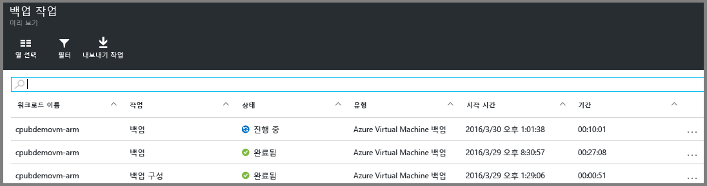

<properties
	pageTitle="소개: 복구 서비스 자격 증명 모음으로 Azure VM 보호 | Microsoft Azure"
	description="복구 서비스 자격 증명 모음으로 Azure VM 보호. Resource Manager에 의해 배포된 VM, 클래식으로 배포된 VM 및 프리미엄 저장소 VM의 백업을 사용하여 데이터를 보호합니다. 복구 서비스 자격 증명 모음을 만들고 등록합니다. Azure에서 VM을 등록하고 정책을 만들며 VM을 보호합니다."
	services="backup"
	documentationCenter=""
	authors="markgalioto"
	manager="cfreeman"
	editor=""
	keyword="backups; vm backup"/>

<tags
	ms.service="backup"
	ms.workload="storage-backup-recovery"
	ms.tgt_pltfrm="na"
	ms.devlang="na"
	ms.topic="hero-article"
	ms.date="09/15/2016"
	ms.author="markgal; jimpark"/>

# 소개: 복구 서비스 자격 증명 모음으로 Azure VM 보호

> [AZURE.SELECTOR]
- [복구 서비스 자격 증명 모음으로 VM 보호](backup-azure-vms-first-look-arm.md)
- [백업 자격 증명으로 VM 보호](backup-azure-vms-first-look.md)

이 자습서에서는 복구 서비스 자격 증명 모음을 만들고 Azure 가상 컴퓨터(VM)를 백업하기 위한 단계를 안내합니다. 복구 서비스 자격 증명 모음이 보호하는 항목:

- Azure Resource Manager 배포 VM
- 클래식 VM
- 표준 저장소 VM
- 프리미엄 저장소 VM
- Azure 디스크 암호화와 BEK 및 KEK(Powershell을 사용하여 지원됨)를 사용하여 암호화된 VM

Premium Storage VM을 보호하는 방법에 대한 자세한 내용은 [Premium Storage VM 백업 및 복원](backup-introduction-to-azure-backup.md#back-up-and-restore-premium-storage-vms)을 참조하세요.

>[AZURE.NOTE] 이 자습서에서는 Azure 구독에 이미 VM이 있으며 VM에 액세스하는 백업 서비스를 허용하도록 조치를 취했다고 가정합니다.

[AZURE.INCLUDE [learn-about-Azure-Backup-deployment-models](../../includes/backup-deployment-models.md)]

높은 수준에서 볼 때 다음 단계를 완료해야 합니다.

1. VM에 대한 복구 서비스 자격 증명 모음을 만듭니다.
2. Azure 포털을 사용하여 시나리오를 선택하고 정책을 설정하며 보호할 항목을 식별합니다.
3. 초기 백업을 실행합니다.

## VM에 대한 복구 서비스 자격 증명 모음 만들기

복구 서비스 자격 증명 모음은 시간이 지남에 따라 생성된 모든 백업과 복구 지점을 저장하는 엔터티입니다. 복구 서비스 자격 증명 모음에는 보호된 VM에 적용된 백업 정책이 포함됩니다.

>[AZURE.NOTE] VM 백업은 로컬 프로세스입니다. 한 위치의 VM을 다른 위치의 복구 서비스 자격 증명 모음으로 백업할 수 없습니다. 따라서 VM을 백업할 모든 Azure 위치에 대해 해당 위치에 하나 이상의 복구 서비스 자격 증명 모음이 존재해야 합니다.

복구 서비스 자격 증명 모음을 만들려면:

1. [Azure 포털](https://portal.azure.com/)에 로그인합니다.

2. 허브 메뉴에서 **찾아보기**를 클릭하고 리소스 목록에서 **복구 서비스**를 입력합니다. 입력을 시작하면 입력한 내용을 바탕으로 목록이 필터링됩니다. **복구 서비스 자격 증명 모음**을 클릭합니다.

      

    복구 서비스 자격 증명 모음의 목록이 표시됩니다.

3. **복구 서비스 자격 증명 모음** 메뉴에서 **추가**를 클릭합니다.

    

    복구 서비스 자격 증명 모음 블레이드가 열리고 **이름**, **구독**, **리소스 그룹** 및 **위치**를 입력하라는 메시지가 표시됩니다.

    

4. **이름**에 자격 증명 모음을 식별하기 위한 이름을 입력합니다. 이름은 Azure 구독에 대해 고유해야 합니다. 이름을 2~50자 사이로 입력합니다. 문자로 시작해야 하며, 문자, 숫자, 하이픈만 사용할 수 있습니다.

5. **구독**을 클릭하여 사용 가능한 구독 목록을 볼 수 있습니다. 사용할 구독을 잘 모르는 경우 기본(또는 제안된) 구독을 사용합니다. 조직 계정이 여러 Azure 구독과 연결된 경우에만 여러 항목을 선택할 수 있습니다.

6. **리소스 그룹**을 클릭하여 사용 가능한 리소스 그룹 목록을 표시하거나 **새로 만들기**를 클릭하여 리소스 그룹을 만듭니다. 리소스 그룹에 대한 전체 정보는 [Azure Resource Manager 개요](../resource-group-overview.md)를 참조하세요.

7. **위치**를 클릭하여 자격 증명 모음에 대한 지리적 지역을 선택합니다. 자격 증명 모음은 **반드시** 보호하려는 가상 컴퓨터와 동일한 지역에 있어야 합니다.

    >[AZURE.IMPORTANT] VM이 있는 위치를 정확히 알지 못하는 경우 자격 증명 모음 만들기 대화 상자를 닫고 포털에서 가상 컴퓨터의 목록으로 이동합니다. 가상 컴퓨터가 여러 지역에 있으면 각 지역에 복구 서비스 자격 증명 모음을 만듭니다. 첫 번째 위치에서 다음 위치로 이동하기 전에 자격 증명 모음을 만듭니다. 백업 데이터를 저장하기 위해 저장소 계정을 지정할 필요는 없습니다. 복구 서비스 자격 증명 모음 및 Azure 백업 서비스가 자동으로 처리합니다.

8. **만들기**를 클릭합니다. 복구 서비스 자격 증명 모음을 만드는 데 시간이 걸릴 수 있습니다. 포털의 오른쪽 위 영역에 있는 상태 알림을 모니터링합니다. 자격 증명 모음이 생성되면 복구 서비스 자격 증명 모음 목록에 나타납니다.

    

자격 증명 모음을 만들었으므로 저장소 복제를 설정하는 방법에 대해 알아보십시오.

### 저장소 복제 설정

저장소 복제 옵션을 사용하면 지역 중복 저장소와 로컬 중복 저장소 중에서 선택할 수 있습니다. 기본적으로 사용자 자격 증명 모음에는 지역 중복 저장소가 있습니다. 기본 백업인 경우 지역 중복 저장소 옵션이 설정된 상태로 둡니다. 오래 지속되지 않는 저렴한 옵션을 원하는 경우에는 로컬 중복 저장소를 선택합니다. [지역 중복](../storage/storage-redundancy.md#geo-redundant-storage) 및 [로컬 중복](../storage/storage-redundancy.md#locally-redundant-storage) 저장소 옵션에 대한 자세한 내용은 [Azure Storage 복제 개요](../storage/storage-redundancy.md)를 참조하세요.

저장소 복제 설정을 편집하려면

1. 자격 증명 모음 대시보드 및 설정 블레이드를 열 자격 증명 모음을 선택합니다. **설정** 블레이드가 열리지 않을 경우 자격 증명 모음 대시보드에서 **모든 설정**을 클릭합니다.

2. **설정** 블레이드에서 **백업 인프라** > **백업 구성**을 클릭하여 **백업 구성** 블레이드를 엽니다. **백업 구성** 블레이드에서 자격 증명 모음에 대한 저장소 복제 옵션을 선택합니다.

    

    자격 증명 모음에 대한 저장소 옵션을 선택하면 자격 증명 모음이 있는 VM에 연결할 준비가 됩니다. 연결을 시작하려면 Azure 가상 컴퓨터를 검색하고 등록해야 합니다.

## 백업 목표 선택, 정책 설정, 보호할 항목 정의

자격 증명 모음으로 VM을 등록하기 전에 검색 프로세스를 실행하여 구독에 추가된 새 가상 컴퓨터를 식별하도록 합니다. 프로세스는 클라우드 서비스 이름 및 지역과 같은 추가 정보와 함께 구독의 가상 컴퓨터 목록을 Azure에 쿼리합니다. Azure 포털에서 시나리오란 복구 서비스 자격 증명 모음에 저장할 항목을 가리킵니다. 정책은 복구 지점이 발생하는 빈도 및 시기에 대한 일정입니다. 정책에는 복구 지점의 보존 범위도 포함됩니다.

1. 복구 서비스 자격 증명 모음이 이미 열려 있으면 2단계를 진행합니다. 복구 서비스 자격 증명 모음이 열려 있지 않지만 Azure 포털에 있는 경우 허브 메뉴에서 **찾아보기**를 클릭합니다.

  - 리소스 목록에서 **복구 서비스**를 입력합니다.
  - 입력을 시작하면 입력한 내용을 바탕으로 목록이 필터링됩니다. **복구 서비스 자격 증명 모음**이 표시되면 클릭합니다.

      

    복구 서비스 자격 증명 모음의 목록이 표시됩니다.
  - 복구 서비스 자격 증명 모음의 목록에서 자격 증명 모음을 선택합니다.

    선택한 자격 증명 모음 대시보드가 열립니다.

    

2. 자격 증명 모음 대시보드 메뉴에서 **백업**을 클릭하여 백업 블레이드를 엽니다.

    

    블레이드가 열리면 백업 서비스에서 구독에 있는 모든 새 VM을 검색합니다.

    

3. 백업 블레이드에서 **백업 목표**를 클릭하여 백업 목표 블레이드를 엽니다.

    

4. 백업 목표 블레이드에서 **워크로드 실행 위치**를 Azure로 설정하고 **백업할 항목**을 가상 컴퓨터로 설정한 다음 **확인**을 클릭합니다.

    백업 목표 블레이드가 닫히고 백업 정책 블레이드가 열립니다.

    

5. 백업 정책 블레이드에서 자격 증명 모음에 적용할 백업 정책을 선택하고 **확인**을 클릭합니다.

    

    상세 정보에 기본 정책에 대한 자세한 내용이 나열됩니다. 정책을 만들려는 경우 드롭다운 메뉴에서 **새로 만들기**를 선택합니다. 드롭다운 메뉴는 스냅숏을 생성하는 시간을 오후 7시로 전환하는 옵션도 제공합니다. 백업 정책 정의에 대한 지침은 [백업 정책 정의](backup-azure-vms-first-look-arm.md#defining-a-backup-policy)를 참조하세요. **확인**을 클릭하면 백업 정책이 자격 증명 모음과 연결됩니다.

    다음으로 자격 증명 모음과 연결할 VM을 선택합니다.

6. 지정된 정책과 연결할 가상 컴퓨터를 선택하고 **선택**을 클릭합니다.

    

    원하는 VM이 표시되지 않으면 복구 서비스 자격 증명 모음과 같은 Azure 위치에 있는지 확인하세요.

7. 이제 자격 증명 모음에 대한 모든 설정을 정의했으므로 백업 블레이드에서 페이지 맨 아래에 있는 **백업 사용**을 클릭합니다. 그러면 정책이 자격 증명 모음 및 VM에 배포됩니다.

    

## 초기 백업

백업 정책이 가상 컴퓨터에 배포되었다고 해서 데이터가 백업된 것은 아닙니다. 기본적으로 첫 번째 예약된 백업(백업 정책에 정의된 대로)은 초기 백업입니다. 초기 백업이 발생할 때까지 **백업 작업** 블레이드에서 최신 백업 상태가 **경고(초기 백업 보류 중)**로 표시됩니다.

초기 백업을 곧 시작할 예정이 아니라면 **지금 백업**을 실행하는 것이 좋습니다.

**지금 백업**을 실행하려면

1. 자격 증명 모음 대시보드의 **백업** 타일에서 **Azure 가상 컴퓨터**를 클릭합니다.   

    **백업 항목** 블레이드가 열립니다.

2. **백업 항목** 블레이드에서 백업하려는 자격 증명 모음을 마우스 오른쪽 단추로 클릭하고 **지금 백업**을 클릭합니다.

    

    백업 작업이 트리거됩니다.  

    

3. 초기 백업이 완료되었는지 보려면 자격 증명 모음 대시보드의 **백업 작업** 타일에서 **Azure 가상 컴퓨터**를 클릭합니다.

    

    백업 작업 블레이드가 열립니다.

4. 백업 작업 블레이드에서 모든 작업의 상태를 볼 수 있습니다.

    

    >[AZURE.NOTE] 백업 작업의 일부로 Azure 백업 서비스는 각 VM에서 백업 확장에 대한 명령을 발행하여 모든 쓰기를 플러시하고 일관된 스냅숏을 찍습니다.

    백업 작업이 완료되면 상태는 *완료됨*입니다.

[AZURE.INCLUDE [backup-create-backup-policy-for-vm](../../includes/backup-create-backup-policy-for-vm.md)]

## 가상 컴퓨터에 VM 에이전트 설치

필요한 경우 이 정보가 제공됩니다. Azure VM 에이전트는 작업할 백업 확장을 위한 Azure 가상 컴퓨터에 설치되어야 합니다. 그러나 Azure 갤러리에서 VM을 만든 경우 VM 에이전트는 이미 가상 컴퓨터에 있습니다. 온-프레미스 데이터 센터에서 마이그레이션한 VM에는 VM 에이전트가 설치되어 있지 않습니다. 이러한 경우에 VM 에이전트를 설치해야 합니다. Azure VM을 백업하는 데 문제가 있는 경우 Azure VM 에이전트가 가상 컴퓨터에 올바르게 설치되었는지 확인합니다(아래 테이블 참조). 사용자 지정 VM을 만든 경우, 가상 컴퓨터를 프로비전하기 전에 [**VM 에이전트 설치** 확인란이 선택되어 있는지 확인](../virtual-machines/virtual-machines-windows-classic-agents-and-extensions.md)해야 합니다.

[VM 에이전트](https://go.microsoft.com/fwLink/?LinkID=390493&clcid=0x409) 및 [설치 방법](../virtual-machines/virtual-machines-windows-classic-manage-extensions.md)에 대해 알아보세요.

다음 테이블에서는 Windows 및 Linux VM용 VM 에이전트에 대한 추가 정보를 제공합니다.

| **작업** | **Windows** | **Linux** |
| --- | --- | --- |
| VM 에이전트 설치 | <li>[에이전트 MSI](http://go.microsoft.com/fwlink/?LinkID=394789&clcid=0x409)를 다운로드하여 설치합니다. 설치를 완료하려면 관리자 권한이 필요합니다. <li>[VM 속성을 업데이트](http://blogs.msdn.com/b/mast/archive/2014/04/08/install-the-vm-agent-on-an-existing-azure-vm.aspx)하여 에이전트가 설치되었다고 표시합니다. | <li> GitHub에서 최신 [Linux 에이전트](https://github.com/Azure/WALinuxAgent)를 설치합니다. 설치를 완료하려면 관리자 권한이 필요합니다. <li> [VM 속성을 업데이트](http://blogs.msdn.com/b/mast/archive/2014/04/08/install-the-vm-agent-on-an-existing-azure-vm.aspx)하여 에이전트가 설치되었다고 표시합니다. |
| VM 에이전트 업데이트 | VM 에이전트 업데이트는 [VM 에이전트 이진](http://go.microsoft.com/fwlink/?LinkID=394789&clcid=0x409)을 다시 설치하면 되는 간단한 작업입니다.  VM 에이전트를 업데이트하는 동안 실행 중인 백업 작업이 없도록 합니다. | [Linux VM 에이전트 업데이트](../virtual-machines-linux-update-agent.md)의 지침을 따르세요.  VM 에이전트를 업데이트하는 동안 실행 중인 백업 작업이 없도록 합니다. |
| VM 에이전트 설치 유효성 검사 | <li>Azure VM에서 *C:\\WindowsAzure\\Packages* 폴더로 이동합니다. <li>WaAppAgent.exe 파일을 찾습니다.<li> 파일을 마우스 오른쪽 단추로 클릭하고 **속성**으로 이동한 다음 **세부 정보** 탭을 선택합니다. 제품 버전 필드가 2.6.1198.718 이상이어야 합니다. | 해당 없음 |

### 백업 확장

가상 컴퓨터에 VM 에이전트를 설치하면 Azure 백업 서비스는 VM 에이전트에 대한 백업 확장을 설치합니다. Azure 백업 서비스는 추가 사용자 개입 없이 원활하게 백업 확장을 업그레이드 및 패치합니다.

백업 확장은 VM의 실행 여부와 상관없이 백업 서비스에 의해 설치됩니다. 실행 중인 VM은 응용 프로그램 일치 복구 지점을 확보할 수 있는 큰 기회를 제공합니다. 그러나 Azure 백업 서비스는 VM이 꺼져 확장을 설치할 수 없더라도 VM을 계속 백업합니다. 오프라인 VM이라고 합니다. 이 경우 복구 지점은 *충돌 일치*가 됩니다.

## 문제 해결 정보
이 문서의 작업 중 일부를 수행하는 데 문제가 있는 경우 [문제 해결 지침](backup-azure-vms-troubleshoot.md)을 참조하세요.

## 질문이 있으십니까?
질문이 있거나 포함되었으면 하는 기능이 있는 경우 [의견을 보내 주세요](http://aka.ms/azurebackup_feedback).

<!---HONumber=AcomDC_0921_2016-->