# Recovery Services 자격 증명 모음에 Azure Virtual Machines 백업
> [!div class="op_single_selector"]
> * [복구 서비스 자격 증명 모음으로 VM 보호](backup-azure-vms-first-look-arm.md)
> * [백업 자격 증명으로 VM 보호](backup-azure-vms-first-look.md)
>
>

이 자습서에서는 복구 서비스 자격 증명 모음을 만들고 Azure 가상 컴퓨터(VM)를 백업하기 위한 단계를 안내합니다. 복구 서비스 자격 증명 모음이 보호하는 항목:

* Azure Resource Manager 배포 VM
* 클래식 VM
* 표준 저장소 VM
* 프리미엄 저장소 VM
* Managed Disks에서 실행 중인 VM
* Azure Disk Encryption와 BEK 및 KEK를 사용하여 암호화된 VM
* 사용자 지정 사전 스냅숏 및 사후 스냅숏 스크립트를 사용하는 VSS 및 Linux VM을 사용하여 Windows VM의 응용 프로그램 일치 백업

Premium Storage VM 보호에 대한 자세한 내용은 [Premium Storage VM 백업 및 복원](backup-introduction-to-azure-backup.md#using-premium-storage-vms-with-azure-backup) 문서를 참조하세요. Managed Disks VM 지원에 대한 자세한 내용은 [Managed Disks의 VM 백업 및 복원](backup-introduction-to-azure-backup.md#using-managed-disk-vms-with-azure-backup)을 참조하세요. Linux VM을 백업하기 위한 사전 및 사후 스크립트 프레임워크에 대한 자세한 내용은 [사전 스크립트 및 사후 스크립트를 사용하여 응용 프로그램 일치 Linux VM 백업](https://docs.microsoft.com/azure/backup/backup-azure-linux-app-consistent)을 참조하세요.

> [!NOTE]
> 이 자습서에서는 Azure 구독에 이미 VM이 있으며 VM에 액세스하는 백업 서비스를 허용하도록 조치를 취했다고 가정합니다.
>
>

[!INCLUDE [learn-about-Azure-Backup-deployment-models](../../includes/backup-deployment-models.md)]

보호하려는 가상 컴퓨터의 수에 따라 다른 시작 지점에서 시작할 수 있습니다. 한 번의 작업으로 다수의 가상 컴퓨터를 백업하려면 Recovery Services 자격 증명 모음으로 이동하여 [자격 증명 모음 대시보드에서 백업 작업을 시작](backup-azure-vms-first-look-arm.md#configure-the-backup-job-from-the-recovery-services-vault)합니다. 단일 가상 컴퓨터를 백업하려면 VM 관리 블레이드에서 백업 작업을 시작할 수 있습니다.

## VM 관리 블레이드에서 백업 작업 구성

다음 단계를 사용하여 Azure Portal의 가상 컴퓨터 관리 블레이드에서 백업 작업을 구성합니다. 이 단계는 클래식 포털의 가상 컴퓨터에 해당되지 않습니다.

1. [Azure 포털](https://portal.azure.com/)에 로그인합니다.
2. 허브 메뉴에서 **추가 서비스**를 클릭하고 필터 대화 상자에서 **Virtual Machines**를 입력합니다. 입력하면 리소스 목록이 필터링됩니다. 가상 컴퓨터가 표시되면 선택합니다.

  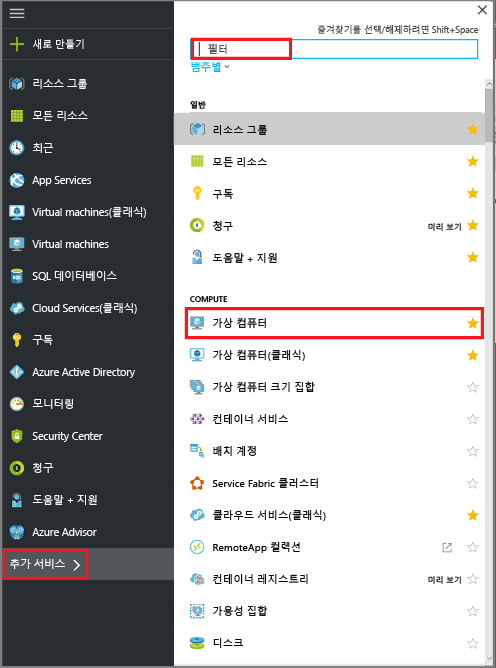

  구독의 가상 컴퓨터(VM) 목록이 나타납니다.

  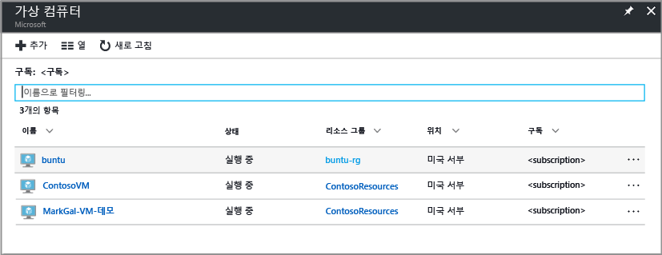

3. 목록에서 백업할 VM을 선택합니다.

  

  VM을 선택하면 가상 컴퓨터 목록이 왼쪽으로 이동하고 가상 컴퓨터 관리 블레이드 및 가상 컴퓨터 대시보드가 열립니다.  
 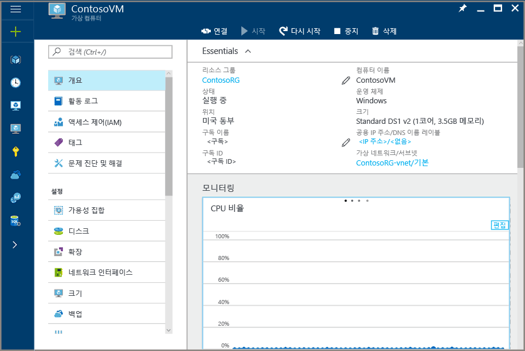

4. VM 관리 블레이드의 **설정** 섹션에서 **백업**을 클릭합니다.  

  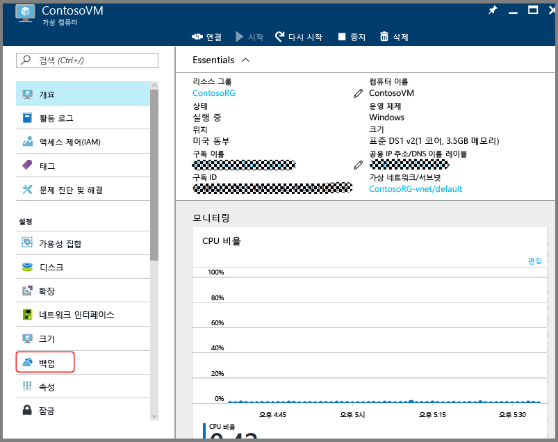

  백업 사용 블레이드가 열립니다.

  

5. Recovery Services 자격 증명 모음의 경우 **기존 항목 선택**을 클릭하고 드롭다운 목록에서 자격 증명 모음을 선택합니다.

  

  Recovery Services 자격 증명 모음이 없거나 새 자격 증명 모음을 사용하려는 경우 **새로 만들기**를 클릭하고 새 자격 증명 모음의 이름을 제공합니다. 새 자격 증명 모음이 가상 컴퓨터와 동일한 리소스 그룹 및 동일한 위치에 생성됩니다. 다른 값으로 Recovery Services 자격 증명 모음을 만들려면 [복구 서비스 자격 증명 모음을 만드는](backup-azure-vms-first-look-arm.md#create-a-recovery-services-vault-for-a-vm) 방법에 대한 섹션을 살펴보세요.

6. 백업 정책의 세부 정보를 보려면 **백업 정책**을 클릭합니다.

  **백업 정책** 블레이드가 열리고 선택한 정책에 대한 세부 정보가 표시됩니다. 다른 정책이 있는 경우 드롭다운 메뉴를 사용하여 다른 백업 정책을 선택합니다. 정책을 만들려는 경우 드롭다운 메뉴에서 **새로 만들기** 를 선택합니다. 백업 정책 정의에 대한 지침은 [백업 정책 정의](backup-azure-vms-first-look-arm.md#defining-a-backup-policy)를 참조하세요. 변경 내용을 백업 정책에 저장하려면 백업 사용 블레이드로 돌아가서 **확인**을 클릭합니다.

  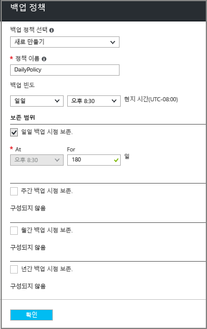

7. 백업 사용 블레이드에서 **백업 사용**을 클릭하여 정책을 배포합니다. 정책을 배포하면 정책이 자격 증명 모음 및 가상 컴퓨터와 연결됩니다.

  

8. 구성 진행률은 포털에 표시되는 알림을 통해 추적할 수 있습니다. 다음 예제는 배포가 시작된 것을 보여줍니다.

  

9. 구성 진행이 완료되면 VM 블레이드에서 **백업**을 클릭하여 백업 항목 블레이드를 열고 세부 정보를 봅니다.

  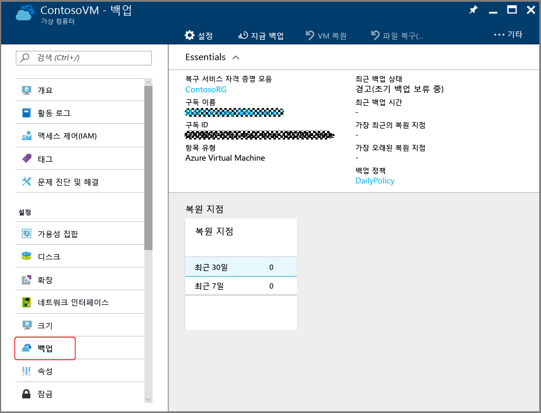

  초기 백업이 완료될 때까지 **마지막 백업 상태**는 **경고(초기 백업 보류 중)**으로 표시됩니다. 다음 예약된 백업 작업이 발생하는 시기를 보려면 **백업 정책** 아래에서 정책의 이름을 클릭합니다. 백업 정책 블레이드가 열리고 예약된 백업 시간이 표시됩니다.

10. 백업 작업을 실행하고 초기 복구 지점을 만들려면 백업 자격 증명 모음 블레이드에서 **지금 백업**을 클릭합니다.

  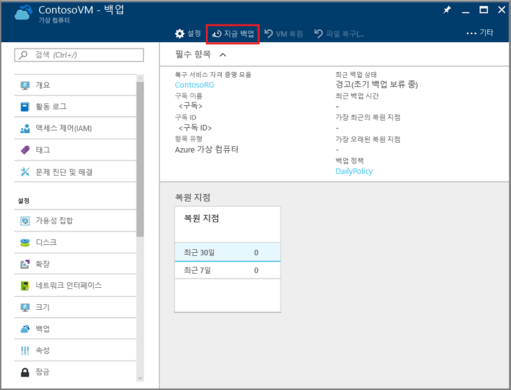

  지금 백업 블레이드가 열립니다.

  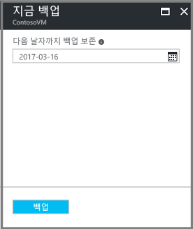

11. 지금 백업 블레이드에서 달력 아이콘을 클릭하고 달력 컨트롤을 사용하여 이 복구 지점을 유지할 마지막 날을 선택하고 **백업**을 클릭합니다.

  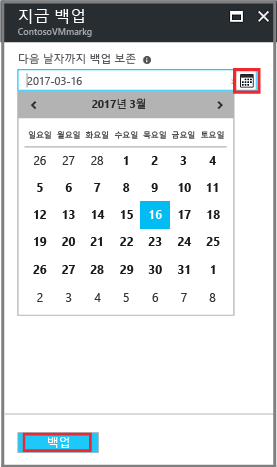

  배포 알림을 통해 백업 작업이 트리거되고 백업 작업 페이지에서 작업의 진행률을 모니터링할 수 있다는 것을 알립니다.

## Recovery Services 자격 증명 모음에서 백업 작업 구성
백업 작업을 구성하려면 다음 단계를 완료합니다.  

1. 가상 컴퓨터에 대한 Recovery Services 자격 증명 모음을 만듭니다.
2. Azure Portal을 사용하여 시나리오를 선택하고 Backup 정책을 설정하며 보호할 항목을 식별합니다.
3. 초기 백업을 실행합니다.

## VM에 대한 복구 서비스 자격 증명 모음 만들기
복구 서비스 자격 증명 모음은 시간이 지남에 따라 생성된 모든 백업과 복구 지점을 저장하는 엔터티입니다. 복구 서비스 자격 증명 모음에는 보호된 VM에 적용된 백업 정책이 포함됩니다.

> [!NOTE]
> VM 백업은 로컬 프로세스입니다. 한 위치의 VM을 다른 위치의 복구 서비스 자격 증명 모음으로 백업할 수 없습니다. 따라서 VM을 백업할 모든 Azure 위치에 대해 해당 위치에 하나 이상의 복구 서비스 자격 증명 모음이 존재해야 합니다.
>
>

복구 서비스 자격 증명 모음을 만들려면:

1. [Azure Portal](https://portal.azure.com/)에 아직 로그인하지 않은 경우 Azure 구독을 사용하여 로그인합니다.
2. 허브 메뉴에서 **추가 서비스**를 클릭하고 필터 대화 상자에서 **Recovery Services**를 입력합니다. 입력하면 리소스 목록이 필터링됩니다. 목록에 Recovery Services 자격 증명 모음이 표시되면 클릭합니다.

      

    구독에 Recovery Services 자격 증명 모음이 있는 경우 자격 증명 모음이 나열됩니다.

    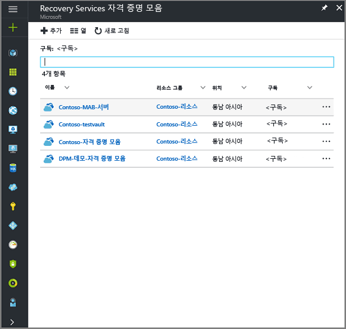
3. **Recovery Services 자격 증명 모음** 메뉴에서 **추가**를 클릭합니다.

    

    복구 서비스 자격 증명 모음 블레이드가 열리고 **이름**, **구독**, **리소스 그룹** 및 **위치**를 입력하라는 메시지가 표시됩니다.

    

4. **이름**에 자격 증명 모음을 식별하기 위한 이름을 입력합니다. 이름은 Azure 구독에 대해 고유해야 합니다. 이름을 2~50자 사이로 입력합니다. 문자로 시작해야 하며, 문자, 숫자, 하이픈만 사용할 수 있습니다.

5. **구독** 섹션에서 드롭다운 메뉴를 사용하여 Azure 구독을 선택합니다. 구독을 하나만 사용하면 해당 구독이 나타나고 다음 단계로 건너뛸 수 있습니다. 사용할 구독을 잘 모르는 경우 기본(또는 제안된) 구독을 사용합니다. 조직 계정이 여러 Azure 구독과 연결된 경우에만 여러 항목을 선택할 수 있습니다.

6. **리소스 그룹** 섹션에서:

    * 리소스 그룹을 만들려면 **새로 만들기**를 선택합니다.
    또는
    * **기존 그룹 사용**을 선택하고 드롭다운 메뉴를 클릭하여 사용 가능한 리소스 그룹 목록을 봅니다.

  리소스 그룹에 대한 전체 정보는 [Azure Resource Manager 개요](../azure-resource-manager/resource-group-overview.md)를 참조하세요.

7. **위치** 를 클릭하여 자격 증명 모음에 대한 지리적 지역을 선택합니다. 선택에 따라 백업 데이터가 전송되는 지역이 결정됩니다.

  > [!IMPORTANT]
  > VM이 있는 위치를 정확히 알지 못하는 경우 자격 증명 모음 만들기 대화 상자를 닫고 포털에서 가상 컴퓨터의 목록으로 이동합니다. 가상 컴퓨터가 여러 지역에 있는 경우 각 지역에 Recovery Services 자격 증명 모음을 만듭니다. 첫 번째 위치에서 다음 위치로 이동하기 전에 자격 증명 모음을 만듭니다. 백업 데이터를 저장하는 데 사용되는 저장소 계정을 지정할 필요는 없습니다. Recovery Services 자격 증명 모음 및 Azure Backup 서비스가 저장소를 자동으로 처리합니다.
  >

8. Recovery Services 자격 증명 모음 블레이드의 하단에서 **만들기**를 클릭합니다.

    Recovery Services 자격 증명 모음을 만드는 데 몇 분 정도 걸릴 수 있습니다. 포털의 오른쪽 위 영역에 있는 상태 알림을 모니터링합니다. 자격 증명 모음이 생성되면 복구 서비스 자격 증명 모음 목록에 나타납니다. 몇 분이 지나도 자격 증명 모음이 보이지 않으면 **새로 고침**을 클릭합니다.

     

    Recovery Services 자격 증명 모음 목록에 사용자의 자격 증명 모음이 보이면 저장소 중복을 설정할 준비가 된 것입니다.

자격 증명 모음을 만들었으므로 저장소 복제를 설정하는 방법에 대해 알아보십시오.

### 저장소 복제 설정
저장소 복제 옵션을 사용하면 지역 중복 저장소와 로컬 중복 저장소 중에서 선택할 수 있습니다. 기본적으로 사용자 자격 증명 모음에는 지역 중복 저장소가 있습니다. 기본 백업의 Recovery Services 자격 증명 모음에서 저장소 복제 옵션을 지역 중복 저장소로 설정해 둡니다. 오래 지속되지 않는 저렴한 옵션을 원하는 경우에는 로컬 중복 저장소를 선택합니다. [지역 중복](../storage/storage-redundancy.md#geo-redundant-storage) 및 [로컬 중복](../storage/storage-redundancy.md#locally-redundant-storage) 저장소 옵션에 대한 자세한 내용은 [Azure Storage 복제 개요](../storage/storage-redundancy.md)를 참조하세요.

저장소 복제 설정을 편집하려면

1. **Recovery Services 자격 증명 모음** 블레이드에서 새 자격 증명 모음을 선택합니다.

  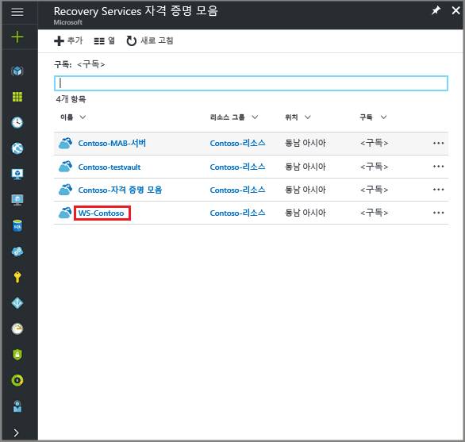

  자격 증명 모음을 선택하면 설정 블레이드(*맨 위에 자격 증명 모음의 이름이 표시된*) 및 자격 증명 모음의 세부 정보 블레이드가 열립니다.

  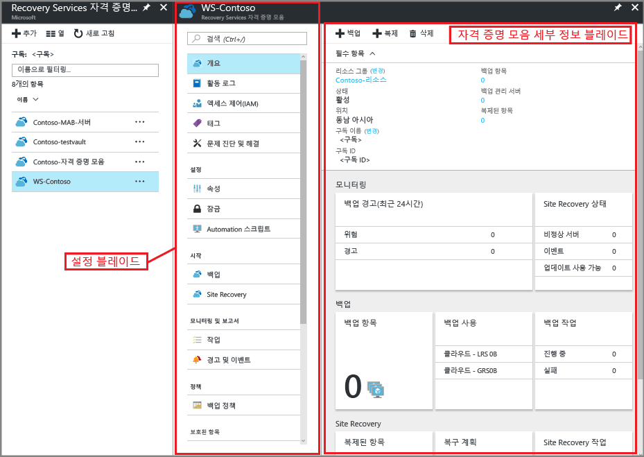

2. 새 자격 증명 모음의 설정 블레이드에서 세로 슬라이드를 사용하여 관리 섹션 쪽으로 아래로 스크롤하여 **백업 인프라**를 클릭합니다.
    [백업 인프라] 블레이드가 열립니다.
3. [백업 인프라] 블레이드에서 **백업 구성**을 클릭하여 **백업 구성** 블레이드를 엽니다.

    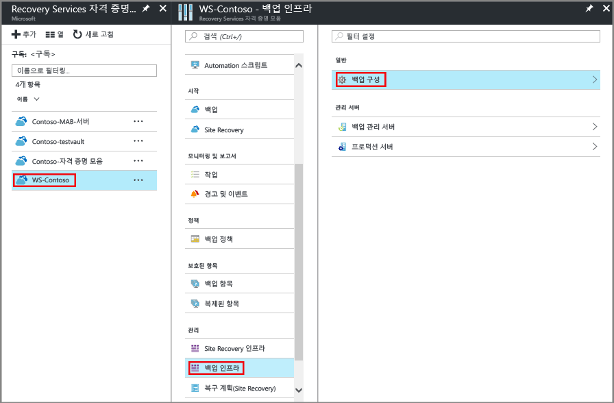
4. 자격 증명 모음에 대해 적절한 저장소 복제 옵션을 선택합니다.

    

    기본적으로 사용자 자격 증명 모음에는 지역 중복 저장소가 있습니다. Azure를 기본 백업 저장소 끝점으로 사용하는 경우 **지역 중복**을 계속 사용합니다. Azure를 기본 백업 저장소 끝점으로 사용하지 않는 경우 Azure Storage 비용이 감소되는 **로컬 중복**을 선택합니다. [지역 중복](../storage/storage-redundancy.md#geo-redundant-storage) 및 [로컬 중복](../storage/storage-redundancy.md#locally-redundant-storage) 저장소 옵션에 대한 자세한 내용은 [저장소 중복 개요](../storage/storage-redundancy.md)를 참조하세요.

## 백업 목표 선택, 정책 설정, 보호할 항목 정의
자격 증명 모음으로 VM을 등록하기 전에 검색 프로세스를 실행하여 구독에 추가된 새 가상 컴퓨터를 식별하도록 합니다. 프로세스는 클라우드 서비스 이름 및 지역과 같은 추가 정보와 함께 구독의 가상 컴퓨터 목록을 Azure에 쿼리합니다. Azure 포털에서 시나리오란 복구 서비스 자격 증명 모음에 저장할 항목을 가리킵니다. 정책은 복구 지점이 발생하는 빈도 및 시기에 대한 일정입니다. 정책에는 복구 지점의 보존 범위도 포함됩니다.

1. 복구 서비스 자격 증명 모음이 이미 열려 있으면 2단계를 진행합니다. 또는 허브 메뉴에서 **추가 서비스**를 클릭하고 리소스 목록에서 **Recovery Services**를 입력한 다음 **Recovery Services 자격 증명 모음**을 클릭합니다.

      

    복구 서비스 자격 증명 모음의 목록이 표시됩니다.

    

    Recovery Services 자격 증명 모음 목록에서 자격 증명 모음을 선택하여 해당 대시보드를 엽니다.

     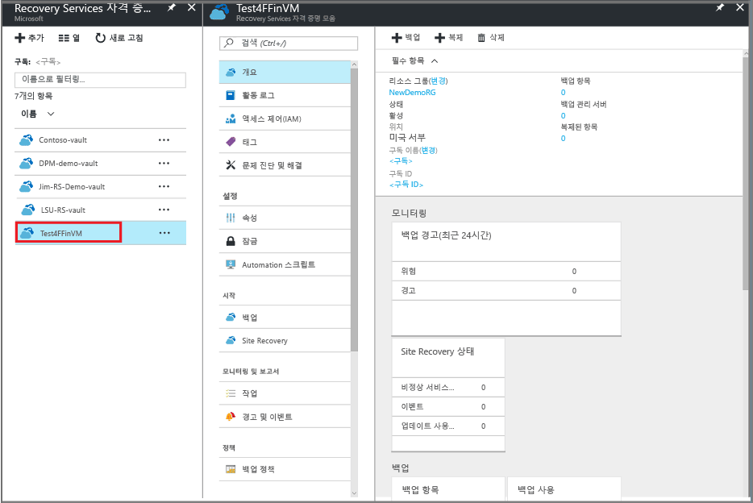

2. 자격 증명 모음 대시보드 메뉴에서 **Backup**을 클릭하여 Backup 블레이드를 엽니다.

    

    백업 및 백업 목표 블레이드가 열립니다.

    
3. 백업 목표 블레이드의 **작업이 실행되는 위치** 드롭다운 메뉴에서 Azure를 선택합니다. **백업할 항목** 드롭다운 메뉴에서 Virtual machine을 선택한 다음 **확인**을 클릭합니다.

    이 작업으로 인해 VM 확장이 자격 증명 모음에 등록됩니다. 백업 목표 블레이드가 닫히고 **백업 정책** 블레이드가 열립니다.

    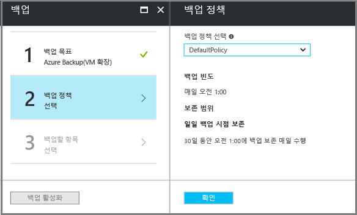

4. 백업 정책 블레이드에서 자격 증명 모음에 적용할 백업 정책을 선택합니다.

    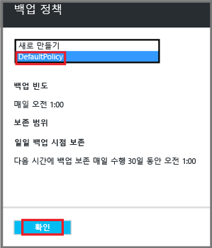

    드롭다운 메뉴 아래에 기본 정책의 상세 정보가 나열됩니다. 정책을 만들려는 경우 드롭다운 메뉴에서 **새로 만들기** 를 선택합니다. 백업 정책 정의에 대한 지침은 [백업 정책 정의](backup-azure-vms-first-look-arm.md#defining-a-backup-policy)를 참조하세요.
    **확인**을 클릭하여 백업 정책을 자격 증명 모음과 연결합니다.

    백업 정책 블레이드가 닫히고 **가상 컴퓨터 선택** 블레이드가 열립니다.
5. **가상 컴퓨터 선택** 블레이드에서, 지정된 정책과 연결할 가상 컴퓨터를 선택하고 **확인**을 클릭합니다.

    

    선택한 가상 컴퓨터의 유효성이 검사됩니다. 원하는 가상 컴퓨터가 표시되지 않으면 Recovery Services 자격 증명 모음과 같은 Azure 위치에 해당 가상 컴퓨터가 있는지 확인하세요. Recovery Services 자격 증명 모음의 위치는 자격 증명 모음 대시보드에 표시됩니다.

6. 이제 자격 증명 모음의 모든 설정을 정의했으므로 백업 블레이드에서 **백업 사용**을 클릭하여 자격 증명 모음 및 VM에 정책을 배포합니다. 백업 정책을 배포해도 가상 컴퓨터의 초기 복구 지점이 만들어지지는 않습니다.

    

백업을 성공적으로 활성화하면 백업 정책이 일정에 따라 실행됩니다. 하지만 첫 번째 백업 작업을 시작합니다.

## 초기 백업
백업 정책이 가상 컴퓨터에 배포되었다고 해서 데이터가 백업된 것은 아닙니다. 기본적으로 첫 번째 예약된 백업(백업 정책에 정의된 대로)은 초기 백업입니다. 초기 백업이 발생할 때까지 **백업 작업** 블레이드에서 최신 백업 상태가 **경고(초기 백업 보류 중)**로 표시됩니다.

초기 백업을 곧 시작할 예정이 아니라면 **지금 백업**을 실행하는 것이 좋습니다.

초기 백업 작업을 실행하려면:

1. 자격 증명 모음 대시보드의 **백업 항목**에 있는 번호를 클릭하거나 **백업 항목** 타일을 클릭합니다.  
  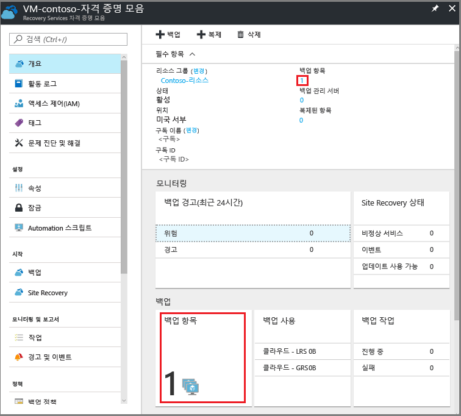

  **백업 항목** 블레이드가 열립니다.

  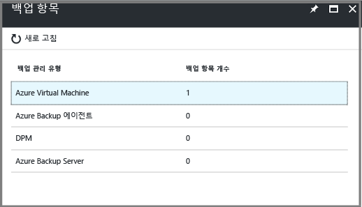

2. **백업 항목** 블레이드에서 항목을 선택합니다.

  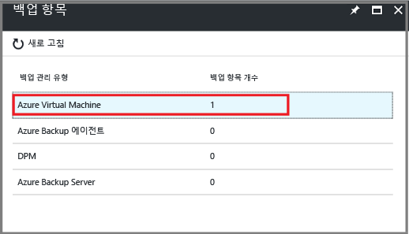

  **백업 항목** 목록이 열립니다.  

  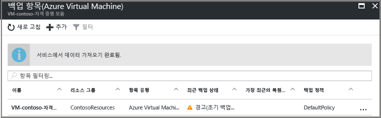

3. **백업 항목** 목록에서 줄임표 **...**를 클릭하여 상황에 맞는 메뉴를 엽니다.

  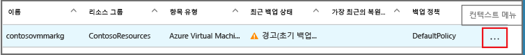

  상황에 맞는 메뉴가 나타납니다.

  

4. 상황에 맞는 메뉴에서 **지금 백업**을 클릭합니다.

  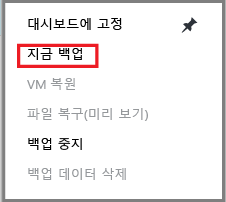

  지금 백업 블레이드가 열립니다.

  

5. 지금 백업 블레이드에서 달력 아이콘을 클릭하고 달력 컨트롤을 사용하여 이 복구 지점을 유지할 마지막 날을 선택하고 **백업**을 클릭합니다.

  

  배포 알림을 통해 백업 작업이 트리거되고 백업 작업 페이지에서 작업의 진행률을 모니터링할 수 있다는 것을 알립니다. VM의 크기에 따라 초기 백업을 만드는 데 시간이 걸릴 수 있습니다.

6. 초기 백업의 상태를 보거나 추적하려면 자격 증명 모음 대시보드의 **백업 작업** 타일에서 **진행 중**을 클릭합니다.

  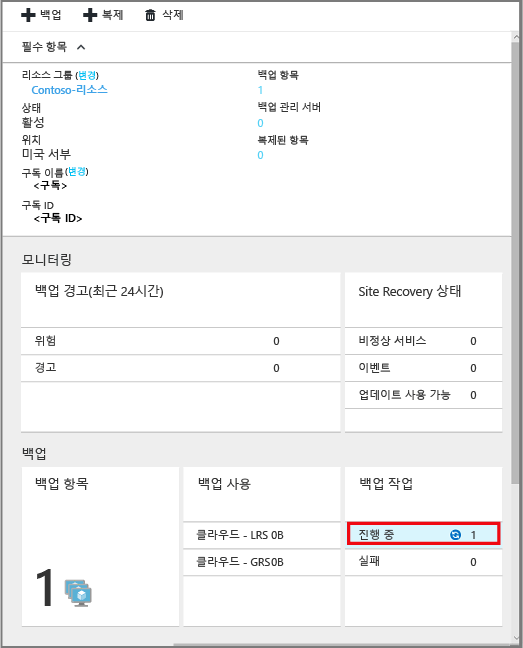

  백업 작업 블레이드가 열립니다.

  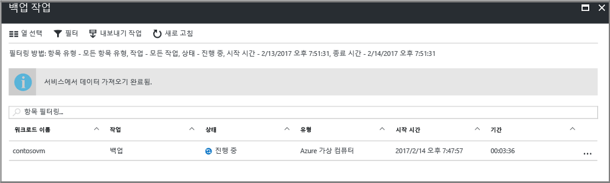

  **백업 작업** 블레이드에서 모든 작업의 상태를 볼 수 있습니다. VM에 대한 백업 작업이 진행 중인지 또는 완료되었는지를 확인합니다. 백업 작업이 완료되면 상태는 *완료됨*입니다.

  > [!NOTE]
  > 백업 작업의 일부로 Azure 백업 서비스는 각 VM에서 백업 확장에 대한 명령을 발행하여 모든 쓰기를 플러시하고 일관된 스냅숏을 찍습니다.
  >
  >

[!INCLUDE [backup-create-backup-policy-for-vm](../../includes/backup-create-backup-policy-for-vm.md)]

## 가상 컴퓨터에 VM 에이전트 설치
필요한 경우 이 정보가 제공됩니다. Azure VM 에이전트는 작업할 백업 확장을 위한 Azure 가상 컴퓨터에 설치되어야 합니다. 그러나 Azure 갤러리에서 VM을 만든 경우 VM 에이전트는 이미 가상 컴퓨터에 있습니다. 온-프레미스 데이터 센터에서 마이그레이션한 VM에는 VM 에이전트가 설치되어 있지 않습니다. 이러한 경우에 VM 에이전트를 설치해야 합니다. Azure VM을 백업하는 데 문제가 있는 경우 Azure VM 에이전트가 가상 컴퓨터에 올바르게 설치되었는지 확인합니다(다음 테이블 참조). 사용자 지정 VM을 만든 경우, 가상 컴퓨터를 프로비전하기 전에 [**VM 에이전트 설치** 확인란이 선택되어 있는지 확인](../virtual-machines/windows/classic/agents-and-extensions.md?toc=%2fazure%2fvirtual-machines%2fwindows%2fclassic%2ftoc.json)해야 합니다.

[VM 에이전트](https://go.microsoft.com/fwLink/?LinkID=390493&clcid=0x409) 및 [설치 방법](../virtual-machines/windows/classic/manage-extensions.md?toc=%2fazure%2fvirtual-machines%2fwindows%2fclassic%2ftoc.json)에 대해 알아보세요.

다음 테이블에서는 Windows 및 Linux VM용 VM 에이전트에 대한 추가 정보를 제공합니다.

| **작업** | **Windows** | **Linux** |
| --- | --- | --- |
| VM 에이전트 설치 |<li>[에이전트 MSI](http://go.microsoft.com/fwlink/?LinkID=394789&clcid=0x409)를 다운로드하여 설치합니다. 설치를 완료하려면 관리자 권한이 필요합니다. <li>[VM 속성을 업데이트](http://blogs.msdn.com/b/mast/archive/2014/04/08/install-the-vm-agent-on-an-existing-azure-vm.aspx) 하여 에이전트가 설치되었다고 표시합니다. |<li> GitHub에서 최신 [Linux 에이전트](https://github.com/Azure/WALinuxAgent) 를 설치합니다. 설치를 완료하려면 관리자 권한이 필요합니다. <li> [VM 속성을 업데이트](http://blogs.msdn.com/b/mast/archive/2014/04/08/install-the-vm-agent-on-an-existing-azure-vm.aspx) 하여 에이전트가 설치되었다고 표시합니다. |
| VM 에이전트 업데이트 |VM 에이전트 업데이트는 [VM 에이전트 이진](http://go.microsoft.com/fwlink/?LinkID=394789&clcid=0x409)을 다시 설치하면 되는 간단한 작업입니다.  VM 에이전트를 업데이트하는 동안 실행 중인 백업 작업이 없도록 합니다. |[Linux VM 에이전트 업데이트](../virtual-machines/linux/update-agent.md?toc=%2fazure%2fvirtual-machines%2flinux%2ftoc.json)의 지침을 따르세요.  VM 에이전트를 업데이트하는 동안 실행 중인 백업 작업이 없도록 합니다. |
| VM 에이전트 설치 유효성 검사 |<li>Azure VM에서 *C:\WindowsAzure\Packages* 폴더로 이동합니다. <li>WaAppAgent.exe 파일을 찾습니다.<li> 파일을 마우스 오른쪽 단추로 클릭하고 **속성**으로 이동한 다음 **세부 정보** 탭을 선택합니다. 제품 버전 필드가 2.6.1198.718 이상이어야 합니다. |해당 없음 |

### 백업 확장
가상 컴퓨터에 VM 에이전트를 설치하면 Azure 백업 서비스는 VM 에이전트에 대한 백업 확장을 설치합니다. Azure 백업 서비스는 추가 사용자 개입 없이 원활하게 백업 확장을 업그레이드 및 패치합니다.

VM을 실행하고 있지 않아도 Backup 서비스가 백업 확장을 설치합니다. 실행 중인 VM은 응용 프로그램 일치 복구 지점을 확보할 수 있는 큰 기회를 제공합니다. 그러나 Azure 백업 서비스는 VM이 꺼져 확장을 설치할 수 없더라도 VM을 계속 백업합니다. 이런 유형의 백업은 오프라인 VM으로 알려져 있으며 복구 지점은 *충돌 일치*입니다.

## 문제 해결 정보
이 문서의 작업 중 일부를 수행하는 데 문제가 있는 경우 [문제 해결 지침](backup-azure-vms-troubleshoot.md)을 참조하세요.

## 가격
Azure VM을 백업하는 비용은 보호된 인스턴스의 수에 기반합니다. 보호된 인스턴스에 대한 정의는 [보호된 인스턴스란 무엇인가요?](backup-introduction-to-azure-backup.md#what-is-a-protected-instance)를 참조하세요. 가상 컴퓨터를 백업하는 비용을 계산하는 예제는 [보호된 인스턴스를 계산하는 방법](backup-azure-vms-introduction.md#calculating-the-cost-of-protected-instances)을 참조하세요. [Backup 가격 책정](https://azure.microsoft.com/pricing/details/backup/)에 대한 정보는 Azure Backup 가격 책정 페이지를 참조하세요.

## 질문이 있으십니까?
질문이 있거나 포함되었으면 하는 기능이 있는 경우 [의견을 보내 주세요](http://aka.ms/azurebackup_feedback).

