<properties
	pageTitle="소개: 백업 자격 증명으로 Azure VM 보호 | Microsoft Azure"
	description="백업 자격 증명으로 Azure VM 보호. 자습서에서는 Azure의 자격 증명 모음 만들기, VM 등록, 정책 만들기, VM 보호를 설명합니다."
	services="backup"
	documentationCenter=""
	authors="markgalioto"
	manager="cfreeman"
	editor=""/>

<tags
	ms.service="backup"
	ms.workload="storage-backup-recovery"
	ms.tgt_pltfrm="na"
	ms.devlang="na"
	ms.topic="hero-article"
	ms.date="09/15/2016"
	ms.author="markgal; jimpark"/>

# 소개: Azure 가상 컴퓨터 백업

> [AZURE.SELECTOR]
- [복구 서비스 자격 증명 모음으로 VM 보호](backup-azure-vms-first-look-arm.md)
- [백업 자격 증명으로 Azure VM 보호](backup-azure-vms-first-look.md)

이 자습서에서는 Azure 가상 컴퓨터(VM)를 Azure의 백업 자격 증명 모음에 백업하는 단계를 안내합니다. 이 문서에서는 VM을 백업하기 위해 클래식 모델 또는 서비스 관리자 배포 모델을 설명합니다. 리소스 그룹에 속해 있는 복구 서비스 자격 증명 모음에 VM을 백업하려는 경우 [소개: 복구 서비스 자격 증명 모음으로 VM 보호](backup-azure-vms-first-look-arm.md)를 참조하세요. 이 자습서를 성공적으로 완료하려면 다음과 같은 필수 조건을 갖추어야 합니다.

- Azure 구독에서 VM을 만들었습니다.
- VM은 Azure공용 IP 주소에 연결되어 있습니다. 자세한 내용은 [네트워크 연결](./backup-azure-vms-prepare.md#network-connectivity)을 참조하세요.

VM을 백업하려면, 5개의 주요 단계가 있습니다.

 백업 자격 증명 모음을 만들거나 기존 백업 자격 증명 모음을 식별합니다.    Azure 클래식 포털을 사용하여 가상 컴퓨터를 검색하고 등록합니다.    VM 에이전트를 설치합니다.    가상 컴퓨터를 보호하는 정책을 만듭니다.    백업을 실행합니다.

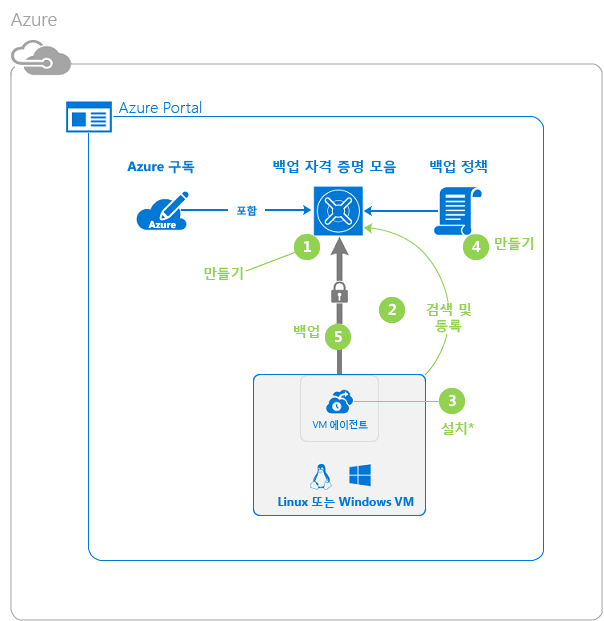

>[AZURE.NOTE] Azure에는 리소스를 만들고 작업하기 위한 두 가지 배포 모델인 [리소스 관리자와 클래식](../resource-manager-deployment-model.md) 모델이 있습니다. 이 자습서는 Azure 클래식 포털에서 만들 수 있는 VM에서 사용하도록 준비되었습니다. Azure 백업 서비스는 리소스 관리자 기반 VM을 지원합니다. 복구 서비스 자격 증명 모음에 VM 백업에 대한 자세한 내용은 [소개: 복구 서비스 자격 증명 모음으로 VM 보호](backup-azure-vms-first-look-arm.md)합니다.

## 1단계 - VM에 대한 백업 자격 증명 모음 만들기

백업 자격 증명 모음은 모든 백업과 시간에 따라 생성된 복구 지점을 저장하는 엔터티입니다. 백업 자격 증명 모음에는 백업 중인 가상 컴퓨터에 적용할 백업 정책도 포함됩니다.

1. [Azure 클래식 포털](http://manage.windowsazure.com/)에 로그인합니다.

2. Azure 포털의 왼쪽 아래 모서리에서 **새로 만들기**를 클릭합니다.

    

3. 빠른 생성 마법사에서 **데이터 서비스** > **복구 서비스** > **백업 자격 증명 모음** > **빠른 생성**을 클릭합니다.

    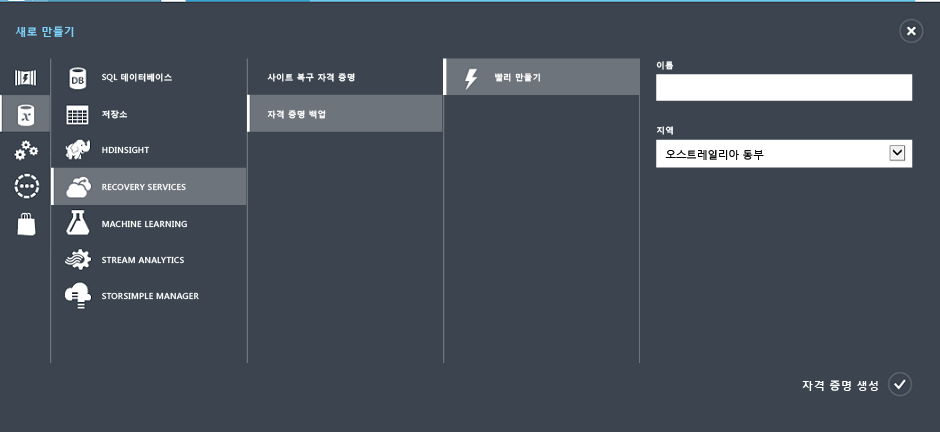

    마법사에서 **이름** 및 **지역**을 입력하라는 메시지를 표시합니다. 구독을 둘 이상 관리하는 경우에는, 구독을 선택하는 대화 상자가 표시됩니다.

4. **이름**에 자격 증명 모음을 식별하기 위한 이름을 입력합니다. 이름은 Azure 구독에 대해 고유해야 합니다.

5. **지역**에서 자격 증명 모음에 대한 지리적 지역을 선택합니다. 자격 증명 모음은 보호하는 가상 컴퓨터와 동일한 지역에 **있어야** 합니다.

    VM이 있는 지역을 알지 못하는 경우 이 마법사를 닫고 Azure 서비스 목록에서 **가상 컴퓨터**를 클릭합니다. 위치 열에는 지역의 이름이 제공됩니다. 가상 컴퓨터가 여러 지역에 있으면 각 지역에 백업 자격 증명 모음을 만듭니다.

6. 마법사에 **구독** 대화 상자가 없으면, 다음 단계로 건너뜁니다. 여러 개의 구독을 작업하는 경우 새로운 백업 자격 증명 모음과 연결할 구독을 선택합니다.

    

7. **자격 증명 모음 만들기**를 클릭합니다. 백업 자격 증명 모음을 만드는 데 시간이 걸릴 수 있습니다. 포털의 맨 아래에서 상태 알림을 모니터링합니다.

    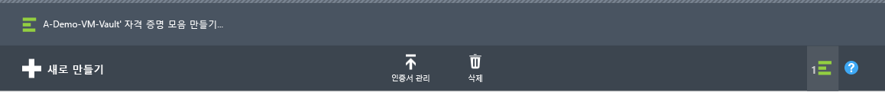

    자격 증명 모음이 성공적으로 만들어졌다는 메시지가 표시됩니다. **복구 서비스** 페이지에서 **활성**으로 표시됩니다.

    

8. **복구 서비스** 페이지의 자격 증명 모음 목록에서 만든 자격 증명 모음을 선택하여 **빠른 시작** 페이지를 시작합니다.

    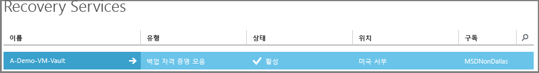

9. **빠른 시작** 페이지에서 **구성**을 클릭하여 저장소 복제 옵션을 엽니다. 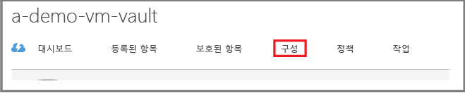

10. **저장소 복제** 옵션에서 사용자 자격 증명 모음에 대한 복제 옵션을 선택합니다.

    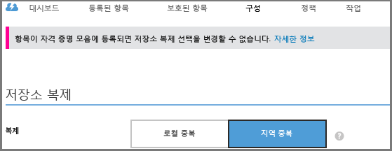

    기본적으로 사용자 자격 증명 모음에는 지역 중복 저장소가 있습니다. 기본 백업인 경우 지역 중복 저장소를 선택합니다. 오래 지속되지 않는 저렴한 옵션을 원하는 경우에는 로컬 중복 저장소를 선택합니다. 지역 중복 및 로컬 중복 저장소 옵션에 대한 자세한 내용은 [Azure Storage 복제 개요](../storage/storage-redundancy.md)를 참조하세요.

자격 증명 모음에 대한 저장소 옵션을 선택하면 자격 증명 모음이 있는 VM에 연결할 준비가 됩니다. 연결을 시작하려면 Azure 가상 컴퓨터를 검색하고 등록합니다.

## 2단계 - Azure 가상 컴퓨터 검색 및 등록
VM에 자격 증명 모음을 등록하기 전에, 검색 프로세스를 실행하여 새 VM이 있는지 식별합니다. 이 작업은 구독에 클라우드 서비스 이름 및 지역과 같은 추가 정보와 함께 가상 컴퓨터 목록을 반환합니다.

1. [Azure 클래식 포털](http://manage.windowsazure.com/)에 로그인

2. Azure 클래식 포털에서 **복구 서비스**를 클릭하여 복구 서비스 자격 증명 모음 목록을 엽니다. 

3. 자격 증명 모음 목록에서 VM을 백업할 자격 증명 모음을 선택합니다.

    자격 증명 모음을 선택하면 **빠른 시작** 페이지에 열립니다.

4. 자격 증명 모음 메뉴에서 **등록된 항목**을 클릭합니다.

    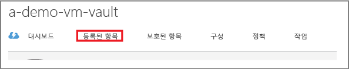

5. **형식** 메뉴에서 **Azure 가상 컴퓨터**를 선택합니다.

    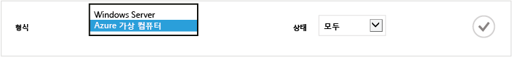

6. 페이지 맨 아래에서 **검색**을 클릭합니다. 

    검색 프로세스는 가상 컴퓨터를 표로 정리하는 동안 몇 분이 걸릴 수 있습니다. 화면 맨 아래에 있는 알림은 프로세스가 실행되고 있다는 것을 알려줍니다.

    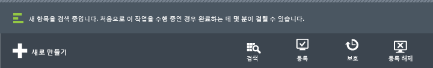

    프로세스가 완료되면 알림이 변경됩니다.

    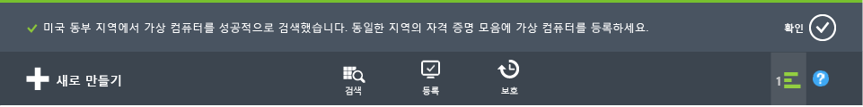

7. 페이지의 맨 아래에서 **등록**을 클릭합니다. 

8. **등록 항목** 바로 가기 메뉴에서 등록하려는 가상 컴퓨터를 선택합니다.

    >[AZURE.TIP] 한 번에 여러 가상 컴퓨터를 등록할 수 있습니다.

    선택한 각 가상 컴퓨터에 대한 작업이 만들어집니다.

9. 알림에서 **작업 보기**를 클릭하여 **작업** 페이지로 이동합니다.

    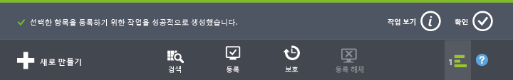

    또한 등록 작업의 상태와 함께 가상 컴퓨터가 등록된 항목 목록에 나타납니다.

    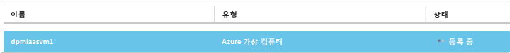

    작업이 완료되면 상태가 *등록된* 상태를 반영하도록 변경됩니다.

    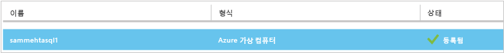

## 3단계 - 가상 컴퓨터에 VM 에이전트 설치

Azure VM 에이전트는 작업할 백업 확장을 위한 Azure 가상 컴퓨터에 설치되어야 합니다. Azure 갤러리에서 VM을 만든 경우 VM 에이전트는 이미 VM에 있습니다. [VM 보호](backup-azure-vms-first-look.md#step-4-protect-azure-virtual-machines)로 건너뛸 수 있습니다.

VM이 온-프레미스 데이터 센터에서 마이그레이션된 경우에는, VM에 VM 에이전트가 설치어 있지 않습니다. VM을 보호하도록 진행하기 전에 가상 컴퓨터에 VM 에이전트를 설치해야 합니다. VM 에이전트 설치에 대한 자세한 단계는 [VM 백업 문서의 VM 에이전트 섹션](backup-azure-vms-prepare.md#vm-agent)을 참조하세요.

## 4단계 - 백업 정책 만들기
초기 백업 작업을 트리거하기 전에, 백업 스냅숏을 생성하는 일정을 설정합니다. 백업 스냅숏을 생성하는 일정 및 스냅숏을 보존하는 기간이 백업 정책입니다. 보존 정보는 GFS(Grandfather-Father-Son) 백업 회전 체계를 기반으로 합니다.

1. Azure 클래식 포털의 **복구 서비스**에 있는 백업 저장소로 이동하여 **등록된 항목**을 클릭합니다.
2. 드롭다운 메뉴에서 **Azure 가상 컴퓨터**를 선택합니다.

    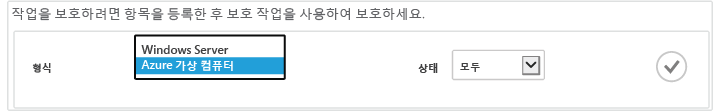

3. 페이지 맨 아래에 있는 **보호**를 클릭합니다. 

    **항목 마법사 보호**가 나타나고 등록되었지만 보호되지 않은 가상 컴퓨터*만* 나열됩니다.

    

4. 보호하려는 가상 컴퓨터를 선택합니다.

    동일한 이름으로 둘 이상의 가상 컴퓨터가 있는 경우 가상 컴퓨터 사이에서 구별하기 위해 클라우드 서비스를 사용합니다.

5. **보호 구성** 메뉴에서 기존 정책을 선택하거나 새 정책을 만들어서 식별한 가상 컴퓨터를 보호합니다.

    새 백업 자격 증명 모음에는 자격 증명 모음과 연결된 기본 정책이 있습니다. 이 정책은 매일 저녁 스냅숏을 생성하고, 일일 스냅숏은 30일간 보존됩니다. 각 백업 정책 정책에는 해당 정책과 연관된 여러 가상 컴퓨터가 있을 수 있습니다. 그러나 가상 컴퓨터는 한 번에 한 정책에만 연결될 수 있습니다.

    

    >[AZURE.NOTE] 백업 정책은 예약된 백업의 보존 체계를 포함합니다. 기존 백업 정책을 선택하면 다음 단계에서 보존 옵션을 수정할 수 없습니다.

6. **보존 범위**에서 특정 백업 지점에 대한 매일, 매주, 매월 및 매년 범위를 정의합니다.

    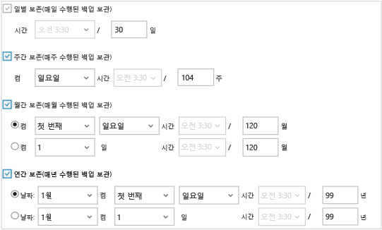

    보존 정책은 백업을 저장하는 시간을 지정합니다. 백업이 수행되는 시기에 따라 다른 보존 정책을 지정할 수 있습니다.

7. **작업**을 클릭하고 **보호 구성** 작업 목록을 봅니다.

    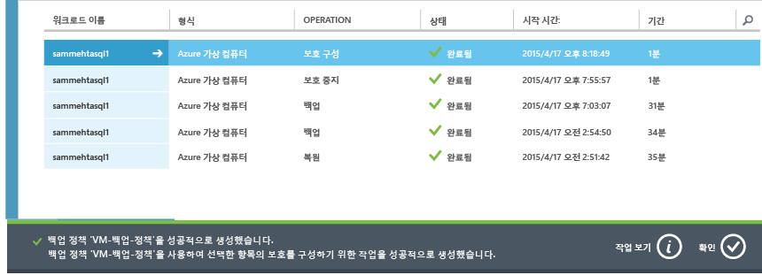

    정책을 설정했으므로 다음 단계로 이동하여 초기 백업을 실행합니다.

## 5단계 - 초기 백업

가상 컴퓨터가 정책으로 보호되면 **보호된 항목** 탭에서 해당 관계를 볼 수 있습니다. 초기 백업이 발생할 때까지 **보호 상태**는 **보호됨 - (초기 백업 보류 중)**으로 표시됩니다. 기본적으로 첫 번째 예약된 백업은 *초기 백업*입니다.

초기 백업을 지금 시작하려면:

1. **보호된 항목** 페이지의 아래쪽에서 **지금 백업**을 클릭합니다.

    Azure 백업 서비스는 초기 백업 작업에 대한 백업 작업을 만듭니다.

2. **작업** 탭을 클릭하여 작업 목록을 봅니다.

    

    초기 백업이 완료되면 **보호된 항목** 탭에서 가상 컴퓨터의 상태가 *보호됨*으로 표시됩니다.

    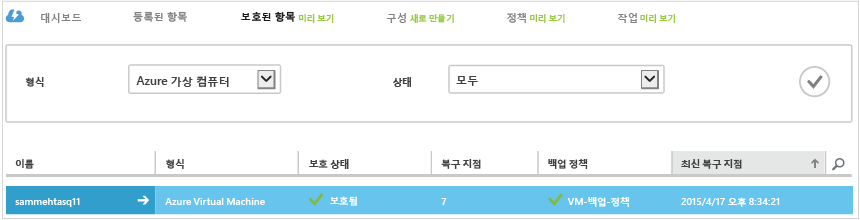

    >[AZURE.NOTE] 가상 컴퓨터 백업은 로컬 프로세스입니다. 한 지역에서 다른 지역의 백업 자격 증명 모음에 가상 컴퓨터를 백업할 수 없습니다. 따라서 백업해야 하는 VM이 있는 모든 Azure 지역의 경우, 해당 지역에 1개 이상의 백업 저장소가 만들어져야 합니다.

## 다음 단계
이제 VM을 성공적으로 백업하면 도움이 될 수 있는 다음 단계가 있습니다. 가장 논리적인 단계는 사용자 자신이 데이터를 VM에 복원하는 것과 친숙해지는 것입니다. 하지만 데이터를 안전하게 유지하고 비용을 최소화하는 방법을 이해하는 데 도움을 주는 관리 작업이 있습니다.

- [가상 컴퓨터 관리 및 모니터링](backup-azure-manage-vms.md)
- [가상 컴퓨터 복원](backup-azure-restore-vms.md)
- [문제 해결 지침](backup-azure-vms-troubleshoot.md)

## 질문이 있으십니까?
질문이 있거나 포함되었으면 하는 기능이 있는 경우 [의견을 보내 주세요](http://aka.ms/azurebackup_feedback).

<!---HONumber=AcomDC_0921_2016-->