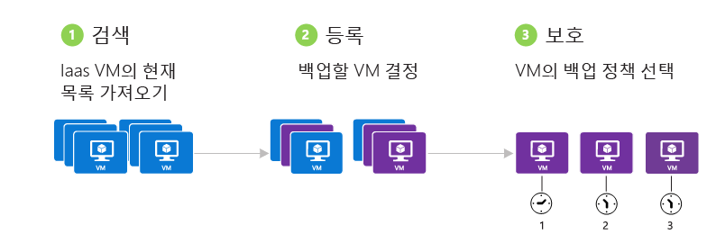
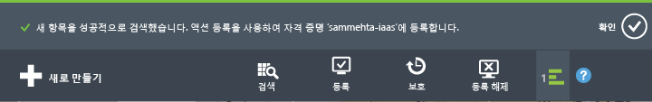
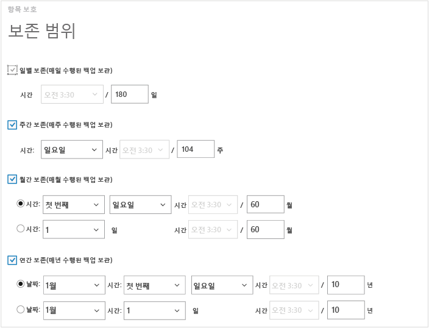
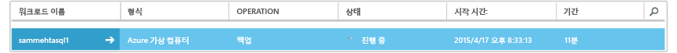
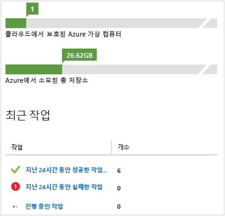

<properties
	pageTitle="Azure 가상 컴퓨터 백업 | Microsoft Azure"
	description="Azure 가상 컴퓨터 백업에 대한 이 절차를 사용하여 가상 컴퓨터 검색, 등록 및 백업합니다."
	services="backup"
	documentationCenter=""
	authors="markgalioto"
	manager="jwhit"
	editor=""
	keywords="가상 컴퓨터 백업; 가상 컴퓨터 백업 백업; 백업 및 재해 복구; VM 백업"/>

<tags
	ms.service="backup"
	ms.workload="storage-backup-recovery"
	ms.tgt_pltfrm="na"
	ms.devlang="na"
	ms.topic="article"
	ms.date="07/01/2016"
	ms.author="trinadhk; jimpark; markgal;"/>

# Azure 가상 컴퓨터 백업

> [AZURE.SELECTOR]
- [복구 서비스 자격 증명 모음에 VM 백업](backup-azure-arm-vms.md)
- [백업 자격 증명 모음에 VM 백업](backup-azure-vms.md)

이 문서는 클래식 배포 Azure VM(가상 컴퓨터)을 백업 자격 증명 모음에 백업하기 위한 절차를 제공합니다. Azure 가상 컴퓨터를 백업하기 전에 몇 가지 처리해야 하는 작업이 있습니다. 아직 수행하지 않은 경우 먼저 VM 백업용 환경을 준비하기 위한 [필수 구성 요소](backup-azure-vms-prepare.md)를 완료합니다.

자세한 내용은 [Azure에서 VM 백업 인프라 계획](backup-azure-vms-introduction.md) 및 [Azure 가상 컴퓨터](https://azure.microsoft.com/documentation/services/virtual-machines/)에 대한 문서를 참조하세요.

>[AZURE.NOTE] Azure에는 리소스를 만들고 작업하기 위한 두 가지 배포 모델인 [Resource Manager와 클래식](../resource-manager-deployment-model.md) 모델이 있습니다. 백업 자격 증명 모음은 클래식 배포 VM만 보호할 수 있습니다. 백업 자격 증명 모음을 사용하여 Resource Manager 배포 VM을 보호할 수 없습니다. 복구 서비스 자격 증명 모음을 사용하는 방법에 대한 자세한 내용은 [복구 서비스 자격 증명 모음에 VM 백업](backup-azure-arm-vms.md)을 참조하세요.

Azure 가상 컴퓨터 백업에는 3가지 주요 단계가 포함됩니다.

>[AZURE.NOTE] 가상 컴퓨터 백업은 로컬 프로세스입니다. 한 지역에서 다른 지역의 백업 자격 증명 모음에 가상 컴퓨터를 백업할 수 없습니다. 따라서 백업할 VM이 있는 각 Azure 지역에 백업 자격 증명 모음을 만들어야 합니다.

## 1단계 - Azure 가상 컴퓨터 검색
등록하기 전에 구독에 추가된 새 VM(가상 컴퓨터)이 식별되도록 하려면 검색 프로세스를 실행합니다. 프로세스는 클라우드 서비스 이름 및 지역과 같은 추가 정보와 함께 구독의 가상 컴퓨터 목록을 Azure에 쿼리합니다.

1. [클래식 포털](http://manage.windowsazure.com/)에 로그인 합니다.

2. Azure 서비스 목록에서 **복구 서비스**를 클릭하여 백업 및 사이트 복구 자격 증명 모음 목록을 엽니다. 

3. 백업 자격 증명 모음 목록에서 VM을 백업할 자격 증명 모음을 선택합니다.

    새 자격 증명 모음인 경우 포털에서 **빠른 시작** 페이지가 열립니다.

    

    이전에 자격 증명 모음을 구성한 경우 포털에서 가장 최근에 사용된 메뉴가 열립니다.

4. 자격 증명 모음 메뉴(페이지 맨 위에 있음)에서 **등록된 항목**을 클릭합니다.

    

5. **형식** 메뉴에서 **Azure 가상 컴퓨터**를 선택합니다.

    

6. 페이지 맨 아래에서 **검색**을 클릭합니다. 

    검색 프로세스는 가상 컴퓨터를 표로 정리하는 동안 몇 분이 걸릴 수 있습니다. 화면 맨 아래에 있는 알림은 프로세스가 실행되고 있다는 것을 알려줍니다.

    

    프로세스가 완료되면 알림이 변경됩니다. 검색 프로세스에서 가상 컴퓨터를 찾지 못한 경우 먼저 VM이 있는지 확인합니다. VM이 있는 경우 VM이 백업 자격 증명 모음과 동일한 지역에 있는지 확인합니다. VM이 동일한 지역에 있는 경우 VM이 백업 자격 증명 모음에 아직 등록되지 않았는지 확인합니다. VM이 백업 자격 증명 모음에 할당된 경우 다른 백업 자격 증명 모음에 할당할 수 없습니다.

    

    새 항목을 검색했으면 2단계로 이동하여 VM을 등록합니다.

##  2단계 - Azure 가상 컴퓨터 등록
Azure 가상 컴퓨터를 등록하여 Azure 백업 서비스와 연결합니다. 일반적으로 일회성 작업입니다.

1. Azure 포털의 **복구 서비스**에 있는 백업 저장소로 이동한 다음, **등록된 항목**을 클릭합니다.

2. 드롭다운 메뉴에서 **Azure 가상 컴퓨터**를 선택합니다.

    

3. 페이지의 맨 아래에서 **등록**을 클릭합니다. 

4. **등록 항목** 바로 가기 메뉴에서 등록하려는 가상 컴퓨터를 선택합니다. 동일한 이름을 가진 가상 컴퓨터가 두 개 이상 있는 경우 클라우드 서비스를 사용하여 가상 컴퓨터를 구분합니다.

    >[AZURE.TIP] 한 번에 여러 가상 컴퓨터를 등록할 수 있습니다.

    선택한 각 가상 컴퓨터에 대한 작업이 만들어집니다.

5. 알림에서 **작업 보기**를 클릭하여 **작업** 페이지로 이동합니다.

    

    또한 등록 작업의 상태와 함께 가상 컴퓨터가 등록된 항목 목록에 나타납니다.

    

    작업이 완료되면 상태가 *등록된* 상태를 반영하도록 변경됩니다.

    

## 3단계 - Azure 가상 컴퓨터 보호
이제 가상 컴퓨터에 대한 백업 및 보존 정책을 설정할 수 있습니다. 단일 보호 작업을 사용하여 여러 가상 컴퓨터를 보호할 수 있습니다.

2015년 5월 이후에 만든 Azure 백업 자격 증명 모음은 자격 증명 모음에 기본 제공되는 기본 정책을 사용합니다. 이 기본 정책을 30일의 기본 보존 기간 및 하루 한 번 백업 일정과 함께 제공됩니다.

1. Azure 포털의 **복구 서비스**에 있는 백업 저장소로 이동한 다음, **등록된 항목**을 클릭합니다.
2. 드롭다운 메뉴에서 **Azure 가상 컴퓨터**를 선택합니다.

    

3. 페이지 맨 아래에 있는 **보호**를 클릭합니다.

    **보호 항목 마법사**가 나타납니다. 이 마법사는 등록되고 보호되지 않은 가상 컴퓨터만을 나열합니다. 보호하려는 가상 컴퓨터를 선택합니다.

    동일한 이름으로 둘 이상의 가상 컴퓨터가 있는 경우 가상 컴퓨터 사이에서 구별하기 위해 클라우드 서비스를 사용합니다.

    >[AZURE.TIP] 한 번에 여러 가상 컴퓨터를 보호할 수 있습니다.

    

4. **백업 일정**을 선택하여 선택한 가상 컴퓨터를 백업합니다. 정책의 기존 집합에서 선택하거나 새로 정의할 수 있습니다.

    각 백업 정책 정책에는 해당 정책과 연관된 여러 가상 컴퓨터가 있을 수 있습니다. 그러나 가상 컴퓨터는 특정 시간에 한 정책에만 연관될 수 있습니다.

    

    >[AZURE.NOTE] 백업 정책은 예약된 백업의 보존 체계를 포함합니다. 기존 백업 정책을 선택하면 다음 단계에서 보존 옵션을 수정할 수 없습니다.

5. **보존 범위**를 선택하여 백업과 연관시킵니다.

    

    보존 정책은 백업을 저장하는 시간을 지정합니다. 백업이 수행되는 시기에 따라 다른 보존 정책을 지정할 수 있습니다. 예를 들어 매일 수행된 백업 지점(작업 복구 지점으로 사용됨)은 90일 동안 보존될 수도 있습니다. 반면에 각 분기 말에 수행된 백업 지점(감사 용도)은 수개월 또는 수년 동안 보존되어야 할 수 있습니다.

    

    이 예제 이미지에서

    - **일 단위 보존 정책**: 매일 수행된 백업이 30일 동안 저장됩니다.
    - **주 단위 보존 정책**: 매주 일요일에 수행된 백업이 104주 동안 유지됩니다.
    - **월 단위 보존 정책**: 매달 마지막 주 일요일에 수행된 백업이 120개월 동안 유지됩니다.
    - **월 단위 보존 정책**: 매년 1월 첫째 주 일요일에 수행된 백업이 99년 동안 유지됩니다.

    작업은 선택한 가상 컴퓨터 각각에 대해 보호 정책을 구성하고 가상 컴퓨터를 해당 정책과 연결합니다.

6. **보호 구성** 작업 목록을 보려면 자격 증명 모음 메뉴에서 **작업**을 클릭하고 **작업** 필터에서 **보호 구성**을 선택합니다.

    

## 초기 백업
가상 컴퓨터가 정책으로 보호되면, 이는 *보호됨 - (초기 백업 보류 중)* 상태로 **보호된 항목** 탭 아래에 표시됩니다. 기본적으로 첫 번째 예약된 백업은 *초기 백업*입니다.

보호를 구성한 후에 즉시 초기 백업을 트리거하려면.

1. **보호된 항목** 페이지 아래쪽에서 **지금 백업**을 클릭합니다.

    Azure 백업 서비스는 초기 백업 작업에 대한 백업 작업을 만듭니다.

2. **작업** 탭을 클릭하여 작업 목록을 봅니다.

    

>[AZURE.NOTE] 백업 작업 동안 Azure Backup 서비스는 각 가상 컴퓨터에서 백업 확장에 대한 명령을 발행하여 모든 쓰기 작업을 플러시하고 일관된 스냅숏을 만듭니다.

초기 백업이 완료되면 **보호된 항목** 탭에서 가상 컴퓨터의 상태가 *보호됨*으로 표시됩니다.

## 백업 상태 및 세부 정보 보기
보호되면 가상 컴퓨터 수가 **대시보드** 페이지 요약에서도 증가합니다. 또한 **대시보드** 페이지에서 지난 24시간 내의 *성공* 및 *실패*한 작업 수와 아직 *진행 중*인 작업 수를 보여 줍니다. **작업** 페이지에서 **상태**, **작업** 또는 **시작** 및 **끝** 메뉴를 사용하여 작업을 필터링합니다.

대시보드의 값은 24시간마다 한 번 새로 고쳐집니다.

## 문제 해결 오류
가상 컴퓨터를 백업하는 동안 문제를 실행하는 경우 도움말은 [VM 문제 해결 문서](backup-azure-vms-troubleshoot.md)를 살펴보세요.

## 다음 단계

- [가상 컴퓨터 관리 및 모니터링](backup-azure-manage-vms.md)
- [가상 컴퓨터 복원](backup-azure-restore-vms.md)

<!---HONumber=AcomDC_0803_2016-->