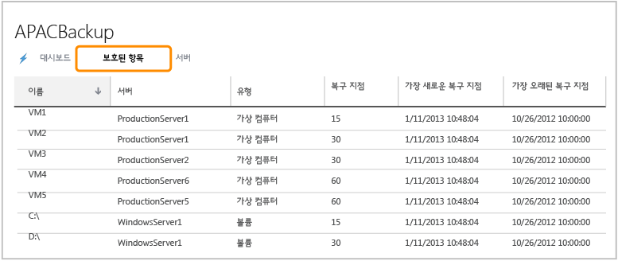

<properties 
	pageTitle="Windows Server를 빠르고 쉽게 백업하도록 Azure 백업 서비스 구성" 
	description="이 자습서를 통해 Microsoft Azure 클라우드 제품 내 백업 서비스를 사용하여 Windows Server를 클라우드에 백업하는 방법을 알아볼 수 있습니다." 
	services="backup" 
	documentationCenter="" 
	authors="markgalioto" 
	manager="jwhit" 
	editor="tysonn"/>

<tags 
	ms.service="backup" 
	ms.workload="storage-backup-recovery" 
	ms.tgt_pltfrm="na" 
	ms.devlang="na" 
	ms.topic="hero-article" 
	ms.date="06/03/2015" 
	ms.author="markgal"/>

#Windows Server를 빠르고 쉽게 백업하도록 Azure 백업 구성

이 자습서를 완료하려면 Azure 계정이 필요합니다. 이 자습서에서는 Azure 백업 기능을 사용하도록 설정하는 단계를 안내합니다.
>[AZURE.NOTE]이전에는 백업 서버를 등록하려면 X.509 v3 인증서를 만들거나 얻어야 했습니다. 인증서는 계속 지원되지만 이제는 Azure 저장소를 서버에 보다 간단히 등록할 수 있도록 하기 위해 빠른 시작 페이지에서 바로 저장소 자격 증명을 생성할 수 있습니다. 계정이 없는 경우 몇 분 만에 무료 평가판 계정을 만들 수 있습니다. 자세한 내용은 [Azure 무료 체험](https://azure.microsoft.com/pricing/free-trial/)을 참조하세요.

Windows Server의 파일과 데이터를 Azure에 백업하려면 데이터를 저장하려는 지역에 백업 자격 증명 모음을 만들어야 합니다. 이 자습서에서는 다음 과정을 안내합니다.

- 백업을 저장하는 데 사용할 자격 증명 모음 만들기
- 저장소 자격 증명 다운로드
- 백업 에이전트 설치
- 관리 포털을 통해 사용할 수 있는 백업 관리 작업의 개요

##백업 자격 증명 모음 만들기

1. [관리 포털](https://manage.windowsazure.com)에 로그인합니다.
2. **새로 만들기** > **데이터 서비스** > **복구 서비스** > **백업 자격 증명 모음** > **빠른 생성**을 클릭합니다.
3. **이름**에 백업 저장소를 식별할 이름을 입력합니다.
4. **지역**에서 백업 저장소의 지역을 선택합니다.

    

5. **자격 증명 모음 만들기**를 클릭합니다.

    백업 저장소름 만드는 데 시간이 걸릴 수 있습니다. 상태를 확인하려면 포털 화면의 아래쪽에서 알림을 모니터링할 수 있습니다. 백업 자격 증명 모음이 생성된 후 자격 증명 모음이 성공적으로 만들어졌으며 복구 서비스 리소스에 **활성** 상태로 나열됨을 알리는 메시지가 나타납니다.

    

6. 조직 계정과 연결된 구독이 여러 개인 경우 백업 자격 증명 모음과 연결할 올바른 계정을 선택합니다.

##저자격 증명 모음 자격 증명 다운로드

저자격 증명 모음 자격 증명은 Azure 서비스를 서버에 등록하는 방법으로서 인증서 대신 사용됩니다. 인증서도 계속해서 사용할 수 있지만 Azure 포털을 사용하여 저장소 자격 증명을 생성하고 다운로드하기 때문에 저장소 자격 증명을 사용하는 쪽이 더 편리합니다.

1. [관리 포털](https://manage.windowsazure.com)에 로그인합니다.
2. **복구 서비스**를 클릭한 후 서버에 등록하려는 백업 저장소를 선택합니다. 그러면 이 백업 자격 증명 모음의 빠른 시작 페이지가 나타납니다.
3. **빠른 시작 페이지**에서 **저장소 자격 증명 다운로드**를 클릭하여 백업 자격 증명 모음에 서버를 등록하는 데 사용할 저장소 자격 증명을 포털에서 생성 및 다운로드하도록 합니다.

    포털에서는 저장소 이름과 현재 날짜를 조합하여 저자격 증명 모음 자격 증명을 생성합니다.

4. **저장**을 클릭하여 저장소 자격 증명을 로컬 계정의 다운로드 폴더로 다운로드하거나, **저장** 메뉴에서 **다른 이름으로 저장**을 선택하여 저장소 자격 증명을 저장할 위치를 지정합니다. 저장소 자격 증명을 편집할 수는 없으므로 열기를 클릭할 이유는 없습니다. 자격 증명이 다운로드되면 폴더를 열 것인지 묻는 메시지가 나타납니다. **x**를 클릭하여 이 메뉴를 닫습니다.

##백업 에이전트 다운로드 및 설치

1. [관리 포털](https://manage.windowsazure.com)에서.
2. **복구 서비스**를 클릭한 후 백업 저장소를 선택하여 해당 빠른 시작 페이지를 표시합니다.
3. 빠른 시작 페이지에서 다운로드하려는 에이전트의 유형을 선택합니다. **Azure Backup Agent 다운로드**, **Windows Server 및 System Center Data Protection Manager** 또는 **Windows Server Essentials**를 선택할 수 있습니다. 자세한 내용은 다음을 참조하세요.

	* [Windows Server 2012 및 System Center 2012 SP1 - Data Protection Manager용 Azure 백업 에이전트 설치](http://technet.microsoft.com/library/hh831761.aspx#BKMK_installagent)
	* [Windows Server 2012 Essentials용 Azure 백업 에이전트 설치](http://technet.microsoft.com/library/jj884318.aspx)

에이전트가 설치된 후 해당 로컬 관리 인터페이스(예: Microsoft Management Console 스냅인, System Center Data Protection Manager Console 또는 Windows Server Essentials Dashboard)를 사용하여 서버에 대한 백업 정책을 구성할 수 있습니다.

##백업 자격 증명 모음 및 서버 관리

1. [관리 포털](https://manage.windowsazure.com)에 로그인합니다.
2. **복구 서비스**를 클릭한 후 백업 저장소의 이름을 클릭하여 빠른 시작 페이지를 표시합니다.
3. **대시보드**를 클릭하여 서버의 사용 개요를 확인합니다. 대시보드 아래쪽에서 수행할 수 있는 작업은 다음과 같습니다.

    - **인증서 관리**. 서버를 등록하는 데 인증서가 사용된 경우 이 옵션을 통해 인증서를 업데이트합니다. 저장소 자격 증명을 사용하는 경우에는 **인증서 관리**를 사용해서는 안 됩니다.
    - **삭제**. 현재 백업 저장소를 삭제합니다. 백업 자격 증명 모음이 더 이상 사용되지 않는 경우 삭제하여 저장소 공간을 확보할 수 있습니다. **삭제**는 등록된 모든 서버가 저장소에서 삭제된 후에만 사용할 수 있습니다.
    - **저장소 자격 증명**. 이 간략 상태 메뉴 항목을 사용하여 저장소 자격 증명을 구성합니다.

4. **보호된 항목**을 클릭하여 서버에서 백업된 항목을 표시합니다. 이 목록은 정보 제공 목적으로만 사용됩니다.

    

5. **서버**를 클릭하여 이 저장소에 등록된 서버의 이름을 표시합니다. 여기서 다음 작업을 수행할 수 있습니다.

    - **다시 등록 허용**. 서버에 대해 이 옵션이 선택된 경우 에이전트에서 등록 마법사를 사용하여 백업 저장소에 서버를 다시 등록할 수 있습니다. 인증서 오류로 인해 또는 서버를 다시 빌드해야 한 경우 다시 등록해야 할 수도 있습니다. 서버 이름당 한 번만 다시 등록할 수 있습니다.
    - **삭제**. 백업 저장소에서 서버를 삭제합니다. 서버와 관련해서 저장된 모든 데이터가 즉시 삭제됩니다.

        

##다음 단계

- Azure 백업에 대한 자세한 내용은 [Azure 백업 개요](http://go.microsoft.com/fwlink/p/?LinkId=222425)를 참조하세요. 
- [Azure 백업 포럼](http://go.microsoft.com/fwlink/p/?LinkId=290933)을 방문하세요.

 

<!---HONumber=August15_HO6-->