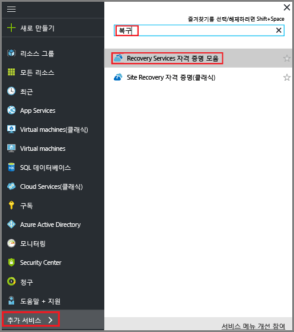
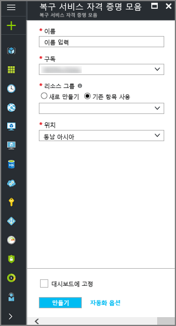
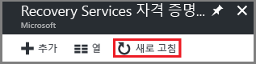
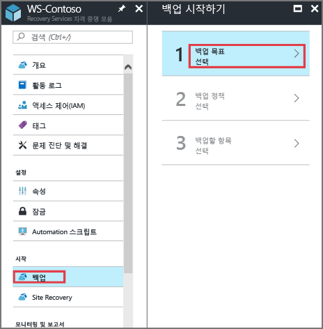
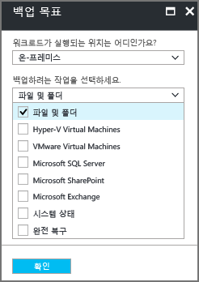
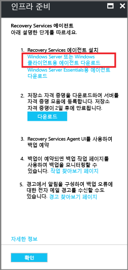
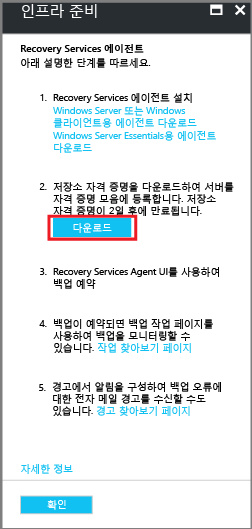

# Azure Backup MARS 에이전트를 사용 하 여 Windows 컴퓨터 백업

이 문서를 사용 하 여 Windows 컴퓨터를 백업 하는 방법에 설명 합니다 [Azure Backup](backup-overview.md) 서비스와 Microsoft Azure Recovery Services (MARS) 에이전트를 Azure Backup 에이전트를 라고도 합니다.

이 문서에서는 다음 방법을 알아봅니다.

> [!div class="checklist"]
> * 필수 구성 요소를 확인 하 고 Recovery Services 자격 증명 모음을 만듭니다.
> * MARS 에이전트 다운로드 및 설정
> * 백업 정책 및 일정을 만듭니다.
> * 임시 백업 수행 합니다.

## MARS 에이전트 정보

MARS 에이전트는 백업 Recovery Services 자격 증명 모음에 Azure에서 온-프레미스 컴퓨터 및 Azure Vm에서 파일, 폴더 및 시스템 상태를 백업 하려면 Azure Backup에서 사용 됩니다. 다음과 같이 에이전트를 실행할 수 있습니다.

- Azure에서 백업 Recovery Services 자격 증명에 직접 백업할 수 있도록 온-프레미스 Windows 컴퓨터에서 직접 에이전트를 실행 합니다.
- VM에서 특정 파일 및 폴더를 백업 하려면 (-side-by-side Azure VM 백업 확장과) Windows를 실행 하는 에이전트가 Azure Vm을 실행 합니다.
- MABS(Microsoft Azure Backup Server) 또는 System Center DPM(Data Protection Manager) 서버에서 에이전트를 실행합니다. 이 시나리오에서는 dpm/MABS에서 백업 컴퓨터 및 워크 로드 및 MABS/DPM 후 MARS 에이전트를 사용 하 여 Azure에 자격 증명 모음 백업.
에이전트가 설치된 위치에 따라 백업할 수 있는 항목이 달라집니다.

> [!NOTE]
> Azure Vm 백업에 대 한 기본 방법은 VM에서 Azure 백업 확장을 사용 하 여는 것입니다. 이 경우 전체 VM을 백업합니다. 설치 하 여 확장과 함께 MARS 에이전트를 사용 하 여 VM에서 특정 파일 및 폴더를 백업 하려는 경우이 좋습니다. [자세히 알아보기](backup-architecture.md#architecture-direct-backup-of-azure-vms).

## 시작하기 전에

- [에 대해 알아봅니다 어떻게](backup-architecture.md#architecture-direct-backup-of-on-premises-windows-server-machines-or-azure-vm-files-or-folders) Azure 백업에서는 MARS 에이전트를 사용 하 여 Windows 컴퓨터.
- [에 대 한 자세한](backup-architecture.md#architecture-back-up-to-dpmmabs) 백업 아키텍처 보조 DPM 또는 MABS 서버에서 MARS 에이전트를 실행 합니다.
- [검토](backup-support-matrix-mars-agent.md) 지원 되는 기능 및 새로운 MARS 에이전트를 사용 하 여를 백업할 수 있습니다.
- 백업 하려는 컴퓨터에서 인터넷 액세스를 확인 합니다.
- 서버 또는 클라이언트를 Azure에 백업하려면 Azure 계정이 필요합니다. 계정이 없는 경우 몇 분 만에 [무료 계정](https://azure.microsoft.com/free/) 을 만들 수 있습니다.

### 인터넷 액세스 확인

컴퓨터에서 인터넷을 제한 한 경우 방화벽 설정을 컴퓨터 또는 프록시를 허용 하는지 확인 이러한 Url 및 IP 주소:

**URL**

- www\.msftncsi.com
- *.Microsoft.com
- *.WindowsAzure.com
- *.microsoftonline.com
- *.windows.net

**IP 주소**

- 20.190.128.0/18
- 40.126.0.0/18

## Recovery Services 자격 증명 모음 만들기

모든 백업 및 복구 지점 이후에 만든 저장 하 고 백업된 머신에 적용할 백업 정책을 포함 하는 Recovery Services 자격 증명 모음. 다음과 같이 자격 증명 모음을 만듭니다.

1. Azure 구독을 사용하여 [Azure Portal](https://portal.azure.com/)에 로그인합니다.
2. 검색에서 입력 **Recovery Services** 누릅니다 **Recovery Services 자격 증명 모음**합니다.

    

3. 에 **Recovery Services 자격 증명 모음** 메뉴에서 클릭 **+ 추가**합니다.

    

4. **이름**에 자격 증명 모음을 식별하기 위한 이름을 입력합니다.

   - 이름은 Azure 구독에 대해 고유해야 합니다.
   - 2~50자를 포함할 수 있습니다.
   - 문자로 시작해야 하며, 문자, 숫자, 하이픈만 사용할 수 있습니다.

5. Azure 구독, 리소스 그룹 및 자격 증명 모음을 만들 지역을 선택 합니다. 백업 데이터는 자격 증명 모음으로 전송 됩니다. 그런 다음, **만들기**를 클릭합니다.

    

   - 자격 증명 모음을 만드는 데 시간이 걸릴 수 있습니다.
   - 포털의 오른쪽 위 영역에 있는 상태 알림을 모니터링합니다. 몇 분 후 자격 증명 모음을 표시 되지 않으면, 클릭 **새로 고침**합니다.

     

### 저장소 중복 설정

Azure Backup 자격 증명 모음에 대 한 저장소를 자동으로 처리합니다. 저장소 복제 되는 방식을 지정 해야 합니다.

1. **Recovery Services 자격 증명 모음** 블레이드에서 새 자격 증명 모음을 클릭합니다. 아래는 **설정을** 섹션에서 클릭 **속성**합니다.
2. **속성**아래에 있는 **Backup 구성**, 클릭 **업데이트**합니다.

3. 저장소 복제 유형을 선택 하 고 클릭 **저장할**합니다.

      

- 기본 백업 저장소 끝점으로 Azure를 사용 하는 경우에 계속 기본값을 사용 하는 것이 좋습니다 **지역 중복** 설정 합니다.
- Azure를 기본 백업 스토리지 엔드포인트로 사용하지 않는 경우 Azure Storage 비용이 감소되는 **로컬 중복**을 선택합니다.
- 에 대해 자세히 알아보세요 [geo](../storage/common/storage-redundancy-grs.md) 하 고 [로컬](../storage/common/storage-redundancy-lrs.md) 중복성입니다.

## MARS 에이전트를 다운로드 합니다.

백업 하려는 컴퓨터에 설치 MARS 에이전트를 다운로드 합니다.

- 모든 컴퓨터에서 에이전트를 이미 설치한 경우 최신 버전을 실행 중인지 확인 합니다.
- 최신 버전은 사용 하거나 포털에서 사용할 수는 [직접 다운로드](https://aka.ms/azurebackup_agent)

1. 자격 증명 모음에서 아래의 **Getting Started**, 클릭 **백업**합니다.

    

2. **작업이 실행 되는 위치?** 를 선택 **온-프레미스**합니다. Azure VM에서 MARS 에이전트를 설치 하려는 경우에이 옵션을 선택 해야 합니다.
3. **무엇을 백업 하 시겠습니까?** 를 선택 **파일 및 폴더** 및/또는 **시스템 상태**. 다양 한 다른 옵션을 사용할 수 있지만 보조 백업 서버를 실행 하는 경우 이러한가 지원만 합니다. 클릭 **인프라 준비**합니다.

      

4. 에 **인프라 준비**아래에 있는 **설치 하는 Recovery Services 에이전트**, MARS 에이전트를 다운로드 합니다.

    

5. 다운로드 팝업 메뉴에서 **저장**을 클릭합니다. 기본적으로 **MARSagentinstaller.exe** 파일이 다운로드 폴더에 저장됩니다.

6. 이제 확인 **이미 다운로드 하거나 최신 Recovery Services 에이전트를 사용 하 여**, 한 다음 자격 증명 모음 자격 증명을 다운로드 합니다.

    

7. **저장**을 클릭합니다. 파일은 다운로드 폴더로 다운로드 됩니다. 자격 증명 모음 자격 증명 파일을 열 수 없습니다.

## 에이전트 설치 및 등록

1. 실행 합니다 **MARSagentinstaller.exe** 백업 하려는 컴퓨터에서 파일입니다.
2. MARS 에이전트 설치 마법사에서 > **설치 설정을**, 캐시에 사용할 위치 및 에이전트를 설치 하려는 위치를 지정 합니다. 그런 후 **Next** 를 클릭합니다.
   - Azure Backup의 캐시를 사용 하 여 Azure에 전송 하기 전에 데이터 스냅숏 저장 합니다.
   - 캐시 위치를 백업 데이터의 크기를 5% 이상 여유 공간이 있어야 합니다.

     

2. **프록시 구성을**, Windows 컴퓨터에서 실행 되는 에이전트가 인터넷에 연결 하는 방법을 지정 합니다. 그런 후 **Next** 를 클릭합니다.

   - 사용자 지정을 사용 하는 경우 프록시 프록시 설정 및 필요한 경우 자격 증명을 지정 합니다.
   - 에이전트에 대 한 액세스를 해야 함을 기억 [이러한 Url](#verify-internet-access)합니다.

     

3. **설치가** 필수 구성 요소 검사를 검토 하 고 클릭 **설치**합니다.
4. 에이전트를 설치한 후 클릭 **등록 진행**합니다.
5. 에 **서버 등록 마법사** > **자격 증명 모음 식별**, 찾아보기 및 다운로드 한 자격 증명 파일을 선택 합니다. 그런 후 **Next** 를 클릭합니다.

    

6. **암호화 설정**를 암호화 하 고 컴퓨터에 대 한 백업을 암호 해독에 사용할 암호를 지정 합니다.

    - 암호화 암호를 안전한 위치에 저장합니다.
    - 암호를 잊거나 분실 하는 경우 Microsoft는 백업 데이터를 복구할 수 없습니다. 파일을 안전한 위치에 저장하세요. 백업을 복원 하는 데 필요 합니다.

7. 클릭 **완료**합니다. 이제 에이전트가 설치되었고 컴퓨터가 자격 증명 모음에 등록되었습니다. 백업을 구성하고 일정을 예약할 준비가 완료되었습니다.

## 백업 정책 만들기

백업 정책은 복구 지점을 만들 데이터의 스냅숏을 만드는 시기를 지정 합니다. 복구 지점 보존 기간을 하 고 있습니다.

- MARS 에이전트를 사용 하 여 백업 정책을 구성할 수 있습니다.
- 자동으로 azure Backup을 일광 절약 시간 (DST)를 고려 하지 않습니다. 실제 시간 및 예약 된 백업 시간 일부 차이가 발생할 수 있습니다.

다음과 같이 정책을 만듭니다.

1. 각 컴퓨터에서 MARS 에이전트를 엽니다. **Microsoft Azure Backup**에 대한 컴퓨터를 검색하여 찾을 수 있습니다.
2. **동작**, 클릭 **백업 일정**합니다.

    

3. Backup 예약 마법사에서 > **Getting started**, 클릭 **다음**합니다.
4. **백업할 항목 선택**, 클릭 **항목 추가**합니다.
5. **선택 항목**, 백업 대상을 선택 합니다. 그런 후 **OK**를 클릭합니다.
6. **백업할 항목 선택** 페이지에서 클릭 **다음**합니다.
7. **백업 일정 지정** 페이지에서 매일 또는 매주 백업을 수행 하려는 경우를 지정 합니다. 그런 후 **Next** 를 클릭합니다.

    - 백업을 수행할 때 복구 지점이 생성 됩니다.
    - 사용자 환경에서 만든 복구 지점의 수는 백업 일정에 따라 달라 집니다.

1. 하루에 3 번까지 매일 백업을 예약할 수 있습니다. 예를 들어 두 개의 일별 백업, 자정 및 오후 6 시 스크린샷에서 보여 줍니다.

    

9. 주별 백업 너무 실행할 수 있습니다. 예를 들어, 스크린샷은 모든 대체 일요일 & 수요일 오전 9:30 및 오전 1 시에 수행 된 백업을 보여 줍니다.

    

8. 에 **보존 정책 선택** 페이지에서 데이터의 기록 복사본을 저장 하는 방법을 지정 합니다. 그런 후 **Next** 를 클릭합니다.

   - 보존 설정은 복구 지점을 저장 하 고에 대 한 저장 기간을 지정 합니다.
   - 예를 들어, 매일 보존 값을 설정한 경우 있습니다 나타냅니다는 매일 보존에 대해 지정 된 경우 최신 복구 지점 보존 됩니다 지정 된 기간 (일). 또는 또 다른 예로, 12 개월간 매월 30에서 만들어진 복구 지점을 저장할지는 표시 하는 월간 보존 정책을 지정할 수 있습니다.
   - 매일 및 매주 복구 지점 보존의 백업 일정을 사용 하 여 일반적으로 일치합니다. 즉 백업 일정에 따라 트리거되면 매일 또는 매주 보존 정책에 지정 된 기간에 대 한 백업에서 만든 복구 지점이 저장 됩니다.
   - 예를 들어 다음 스크린 샷에서:
     - 매일 백업은 자정과 오후 6 시에는 7 일 동안 유지 됩니다.
     - On a 토요일 자정과 오후 6 시에 수행 된 백업이 4 주 동안 유지 됩니다.
     - 토요일 자정과 오후 6 시 매월 마지막 주에 수행 된 백업이 12 개월 동안 유지 됩니다. -3 월의 마지막 주 토요일에 수행 된 백업이 10 년 동안 유지 됩니다.

   

11. **초기 백업 유형 선택** 네트워크를 통해 또는 오프 라인 초기 백업을 수행 하는 방법을 지정 합니다. 그런 후 **Next** 를 클릭합니다.

10. **확인**에서 정보를 검토 하 고 클릭 **마침**합니다.
11. 마법사가 백업 일정 생성을 완료하면 **닫기**를 클릭합니다.

### 오프 라인 초기 백업 수행

실행할 수 있습니다 초기 백업을 자동으로 네트워크를 통해 또는 오프 라인으로. 초기 백업에 대 한 오프 라인 시 딩 하는 것은 많은 양의 데이터 전송할 네트워크 대역폭을 많이 해야 하는 경우에 유용 합니다. 오프 라인 전송을 다음과 같이 수행합니다.

1. 스테이징 위치에 백업 데이터를 작성합니다.
2. AzureOfflineBackupDiskPrep 도구를 사용 하 여 스테이징 위치에서 하나 이상의 SATA 디스크에 데이터를 복사 합니다.
3. 이 도구는 Azure 가져오기 작업을 만듭니다. [자세한](https://docs.microsoft.com/azure/storage/common/storage-import-export-service) Azure 가져오기 및 내보내기에 대 한 합니다.
4. SATA 디스크를 Azure 데이터 센터에 보냅니다.
5. 데이터 센터에서 디스크 데이터를 Azure storage 계정에 복사 됩니다.
6. Azure Backup 자격 증명 모음에 저장소 계정에서 데이터를 복사 하 고 증분 백업이 예약 됩니다.

[자세한](backup-azure-backup-import-export.md) 오프 라인 시 딩 하는 방법에 대 한 합니다.

### 네트워크 제한 사용

MARS 에이전트에 의해 네트워크 제한을 사용 하 여 네트워크 대역폭을 사용 하는 방법을 제어할 수 있습니다. 제한 근무 시간 동안 데이터를 백업 하지만 백업에 사용 되는 대역폭 양을 제어할 하려면, 복원 작업을 해야 하는 경우 도움이 됩니다.

- Azure Backup 네트워크 제한 사용 [서비스 품질 (QoS)](https://docs.microsoft.com/windows-server/networking/technologies/qos/qos-policy-top) 로컬 운영 체제에서.
- 백업에 대 한 제한을 네트워크는 Windows Server 2008 R2 이상, 및 Windows 7 이상에서 사용할 수 있습니다. 운영 체제를 최신 서비스 팩이 실행 되어야 합니다.

네트워크 제한 다음과 같이 사용 합니다.

1. MARS 에이전트, 클릭 **속성 변경**합니다.
2. 에 **제한** 탭 **인터넷 대역폭 사용 제한 백업 작업에 대 한**합니다.

    
3. 작업 중 및 작업 시간 외에 허용 되는 대역폭을 지정 합니다. 대역폭 값 512kbps에서 시작 하 고 최대 1023mbps(MBps를 이동 합니다. 그런 후 **OK**를 클릭합니다.

## 임시 백업 실행

1. MARS 에이전트, 클릭 **지금 백업**합니다. 이 네트워크를 통해 초기 복제 시작 됩니다.

    

2. **확인**에서 설정을 검토 하 고 클릭 **백업**합니다.
3. **닫기** 를 클릭하여 마법사를 닫습니다. 백업이 완료 되기 전에이 작업을 수행 합니다 마법사를 계속 백그라운드에서 실행 됩니다.

초기 백업 작업이 완료되면 Backup 콘솔에 **작업 완료** 상태가 표시됩니다.

## 다음 단계

[자세한 방법](backup-azure-restore-windows-server.md) 파일을 복원 합니다.
