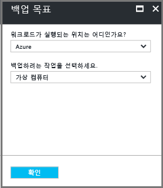
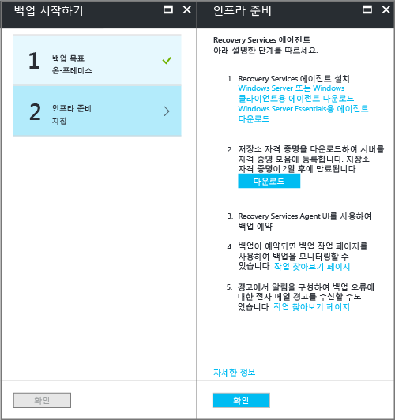
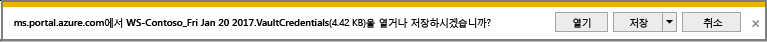
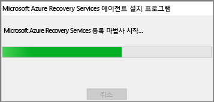

# Resource Manager 배포 모델을 사용하여 Azure로 Windows Server 또는 클라이언트 백업
이 문서는 Resource Manager 배포 모델을 사용하여 Azure Backup이 포함된 Azure에 Windows 서버(또는 Windows 클라이언트) 파일 및 폴더를 백업하는 방법을 설명합니다.

## 시작하기 전에
서버 또는 클라이언트를 Azure에 백업하려면 Azure 계정이 필요합니다. 계정이 없는 경우 몇 분 만에 [무료 계정](https://azure.microsoft.com/free/) 을 만들 수 있습니다.

## Recovery Services 자격 증명 모음 만들기
Recovery Services 자격 증명 모음은 시간이 경과되면서 만든 모든 백업과 복구 지점을 저장하는 엔터티입니다. Recovery Services 자격 증명 모음에는 보호된 파일과 폴더에 적용된 백업 정책이 포함됩니다. Recovery Services 자격 증명 모음을 만들 때는 적절한 저장소 중복 옵션도 선택해야 합니다.

### Recovery Services 자격 증명 모음을 만들려면
1. [Azure Portal](https://portal.azure.com/) 에 아직 로그인하지 않은 경우 Azure 구독을 사용하여 로그인합니다.
2. 허브 메뉴에서 **모든 서비스**를 클릭하고 리소스 목록에서 **Recovery Services**를 입력한 다음, **Recovery Services 자격 증명 모음**을 클릭합니다.

      

    구독에 복구 서비스 자격 증명 모음이 있는 경우 자격 증명 모음이 나열됩니다.

3. **Recovery Services 자격 증명 모음** 메뉴에서 **추가**를 클릭합니다.

    

    Recovery Services 자격 증명 모음 블레이드가 열리고 **이름**, **구독**, **리소스 그룹** 및 **위치**를 입력하라는 메시지가 표시됩니다.

    

4. **이름**에 자격 증명 모음을 식별하기 위한 이름을 입력합니다. 이름은 Azure 구독에 대해 고유해야 합니다. 이름을 2~50자 사이로 입력합니다. 문자로 시작해야 하며, 문자, 숫자, 하이픈만 사용할 수 있습니다.

5. **구독** 섹션에서 드롭다운 메뉴를 사용하여 Azure 구독을 선택합니다. 구독을 하나만 사용하면 해당 구독이 나타나고 다음 단계로 건너뛸 수 있습니다. 사용할 구독을 잘 모르는 경우 기본(또는 제안된) 구독을 사용합니다. 조직 계정이 여러 Azure 구독과 연결된 경우에만 여러 항목을 선택할 수 있습니다.

6. **리소스 그룹** 섹션에서:

    * 리소스 그룹을 새로 만들려면 **새로 만들기**를 선택합니다.
    또는
    * **기존 그룹 사용**을 선택하고 드롭다운 메뉴를 클릭하여 사용 가능한 리소스 그룹 목록을 봅니다.

  리소스 그룹에 대한 전체 정보는 [Azure Resource Manager 개요](../azure-resource-manager/resource-group-overview.md)를 참조하세요.

7. **위치** 를 클릭하여 자격 증명 모음에 대한 지리적 지역을 선택합니다. 선택에 따라 백업 데이터가 전송되는 지역이 결정됩니다.

8. Recovery Services 자격 증명 모음 블레이드의 하단에서 **만들기**를 클릭합니다.

  Recovery Services 자격 증명 모음을 만드는 데 몇 분 정도 걸릴 수 있습니다. 포털의 오른쪽 위 영역에 있는 상태 알림을 모니터링합니다. 자격 증명 모음이 생성되면 Recovery Services 자격 증명 모음 목록에 표시됩니다. 몇 분이 지나도 자격 증명 모음이 보이지 않으면 **새로 고침**을 클릭합니다.

   

  Recovery Services 자격 증명 모음 목록에 사용자의 자격 증명 모음이 보이면 저장소 중복을 설정할 준비가 된 것입니다.

### 저장소 중복 설정
처음으로 Recovery Services 자격 증명 모음을 만들 때 저장소가 복제되는 방식을 결정합니다.

1. **Recovery Services 자격 증명 모음** 블레이드에서 새 자격 증명 모음을 클릭합니다.

    

    자격 증명 모음을 선택하면 **Recovery Services 자격 증명 모음** 블레이드가 좁아지고 설정 블레이드(*맨 위에 자격 증명 모음 이름이 있음*) 및 자격 증명 모음 세부 정보 블레이드가 열립니다.

    

2. 새 자격 증명 모음의 설정 블레이드에서 세로 슬라이드를 사용하여 관리 섹션 쪽으로 아래로 스크롤하여 **Backup 인프라**를 클릭합니다.

  [Backup 인프라] 블레이드가 열립니다.

3. [Backup 인프라] 블레이드에서 **Backup 구성**을 클릭하여 **Backup 구성** 블레이드를 엽니다.

  

4. 자격 증명 모음에 대해 적절한 저장소 복제 옵션을 선택합니다.

  

  기본적으로 사용자 자격 증명 모음에는 지역 중복 저장소가 있습니다. Azure를 기본 백업 저장소 엔드포인트로 사용하는 경우 **지역 중복**을 계속 사용합니다. Azure를 기본 백업 저장소 엔드포인트로 사용하지 않는 경우 Azure Storage 비용이 감소되는 **로컬 중복**을 선택합니다. [지역 중복](../storage/common/storage-redundancy-grs.md) 및 [로컬 중복](../storage/common/storage-redundancy-lrs.md) 저장소 옵션에 대한 자세한 내용은 [저장소 중복 개요](../storage/common/storage-redundancy.md)를 참조하세요.

자격 증명 모음을 만들었으니, Microsoft Azure Recovery Services 에이전트를 다운로드하여 설치하고, 보관 자격 증명을 다운로드한 다음 그 자격 증명을 사용하여 에이전트를 자격 증명 모음에 등록하여, 파일과 폴더를 백업할 인프라를 준비하겠습니다.

## 자격 증명 모음 구성

1. Recovery Services 자격 증명 모음(방금 만든 자격 증명 모음) 블레이드의 [시작] 섹션에서 **Backup**을 클릭한 다음 **Backup 시작** 블레이드에서 **Backup 목표**를 선택합니다.

  

  **Backup 목표** 블레이드가 열립니다. Recovery Services 자격 증명 모음을 이전에 구성한 경우 Recovery Services 자격 증명 모음에서 **Backup**을 클릭하면 **Backup 목표** 블레이드가 열립니다.

  

2. **작업이 실행되는 위치** 드롭다운 메뉴에서 **온-프레미스**를 선택합니다.

  Windows Server 또는 Windows 컴퓨터가 Azure에 있지 않은 실제 컴퓨터이므로 **온-프레미스**를 선택합니다.

3. **백업할 항목** 메뉴에서 **파일 및 폴더**를 선택하고 **확인**을 클릭합니다.

  

  [확인]을 클릭하면 **백업 목표** 옆에 확인 표시가 나타나고 **인프라 준비** 블레이드가 열립니다.

  

4. **인프라 준비** 블레이드에서 **Windows Server 또는 Windows Client용 에이전트 다운로드**를 클릭합니다.

  

  Windows Server Essential을 사용하는 경우 Windows Server Essential 용 에이전트를 다운로드하도록 선택합니다. MARSAgentInstaller.exe를 실행하거나 저장하라는 팝업 메뉴가 나타납니다.

  

5. 다운로드 팝업 메뉴에서 **저장**을 클릭합니다.

  기본적으로 **MARSagentinstaller.exe** 파일이 다운로드 폴더에 저장됩니다. 설치 관리자가 완료되면 설치 관리자를 실행할지 아니면 폴더를 열지 묻는 팝업이 표시됩니다.

  

  에이전트를 아직 설치할 필요가 없습니다. 에이전트는 자격 증명 모음을 다운로드한 후에 설치할 수 있습니다.

6. **인프라 준비** 블레이드에서 **다운로드**를 클릭합니다.

  

  자격 증명 모음 자격 증명이 [다운로드] 폴더로 다운로드됩니다. 자격 증명 모음 다운로드가 완료되면 자격 증명을 열거나 저장할지 묻는 팝업이 나타납니다. **저장**을 클릭합니다. 실수로 **열기**를 클릭하면 자격 증명 모음 자격 증명을 열려고 하는 대화 상자가 나타나지 않습니다. 자격 증명 모음 자격 증명을 열 수 없습니다. 다음 단계를 진행합니다. 자격 증명 모음은 다운로드 폴더에 있습니다.   

  

[!INCLUDE [backup-upgrade-mars-agent.md](../../includes/backup-upgrade-mars-agent.md)]

## 에이전트 설치 및 등록

> [!NOTE]
> Azure Portal을 통한 백업 활성화는 아직 사용할 수 없습니다. Microsoft Azure Recovery Services 에이전트를 사용하여 파일과 폴더를 백업합니다.
>

1. 다운로드 폴더(또는 기타 저장 위치)에서 **MARSagentinstaller.exe**를 찾아서 두 번 클릭합니다.

  설치 관리자는 Recovery Services 에이전트를 추출, 설치 및 등록할 때 일련의 메시지를 제공합니다.

  

2. Microsoft Azure Recovery Services 에이전트 설치 마법사를 완료합니다. 마법사를 완료하려면 다음 작업을 수행해야 합니다.

  * 설치 및 캐시 폴더의 위치를 선택합니다.
  * 프록시 서버를 사용하여 인터넷에 연결하는 경우에는 프록시 서버 정보를 입력합니다.
  * 인증된 프록시를 사용하는 경우에는 사용자 이름 및 암호 세부 정보를 입력합니다.
  * 다운로드한 자격 증명 모음 제공
  * 암호화 암호를 안전한 위치에 저장합니다.

  > [!NOTE]
  > 암호를 분실하거나 잊어버린 경우 Microsoft에서 백업 데이터의 복구를 도와드릴 수 없습니다. 파일을 안전한 위치에 저장하세요. 백업을 복원할 때 필요합니다.
  >
  >

이제 에이전트가 설치되었고 컴퓨터가 자격 증명 모음에 등록되었습니다. 백업을 구성하고 일정을 예약할 준비가 완료되었습니다.

## 네트워크 및 연결 요구 사항

컴퓨터/프록시의 인터넷 액세스가 제한된 경우 컴퓨터/프록시의 방화벽 설정이 다음 URL을 허용하도록 구성되어 있는지 확인합니다.  
    1. www.msftncsi.com
    2. *.Microsoft.com
    3. *.WindowsAzure.com
    4. *.microsoftonline.com
    5. *.windows.net

## 백업 정책 만들기
백업 정책은 복구 지점이 만들어지는 일정이고 복구 지점이 유지되는 시간입니다. Microsoft Azure Backup 에이전트를 사용하여 파일과 폴더에 대한 백업 정책을 만듭니다.

### 백업 일정을 만들려면
1. Microsoft Azure Backup 에이전트를 엽니다. **Microsoft Azure Backup**에 대한 컴퓨터를 검색하여 찾을 수 있습니다.

    
2. Backup 에이전트의 **작업** 창에서 **백업 일정**을 클릭하여 백업 예약 마법사를 시작합니다.

    

3. Backup 예약 마법사의 **시작** 페이지에서 **다음**을 클릭합니다.
4. **백업할 항목 선택** 페이지에서 **항목 추가**를 클릭합니다.

  항목 선택 대화 상자가 열립니다.

5. 보호하려는 파일 및 폴더를 선택한 다음 **확인**을 클릭합니다.
6. **Backup할 항목 선택** 페이지에서 **다음**을 클릭합니다.
7. **Backup 일정 지정** 페이지에서 백업 일정을 지정하고 **다음**을 클릭합니다.

    매일(하루에 최대 속도로 3회) 또는 매주 백업을 예약할 수 있습니다.

    

   > [!NOTE]
   > 백업 일정을 지정하는 방법은 [Azure Backup을 사용하여 테이프 인프라 대체](backup-azure-backup-cloud-as-tape.md)문서를 참조하세요.
   >
   >

8. **보존 정책 선택** 페이지에서 백업 복사본에 대한 특정 보존 정책을 선택하고 **다음**을 클릭합니다.

    보존 정책은 백업이 저장되는 기간을 나타냅니다. 모든 백업 지점에 대한 "일반 정책"을 지정하는 대신 백업이 발생하는 시기에 따라 다른 보존 정책을 지정할 수 있습니다. 매일, 매주, 매월 및 매년 보존 정책을 요구 사항에 맞게 수정할 수 있습니다.
9. 초기 Backup 유형 선택 페이지에서 초기 백업 유형을 선택합니다. **네트워크를 통해 자동으로** 옵션이 선택된 상태로 두고 **다음**을 클릭합니다.

    네트워크를 통해 자동으로 백업하거나 오프라인으로 백업할 수 있습니다. 이 문서의 나머지 부분은 자동 백업 프로세스를 설명합니다. 오프라인 백업을 선호하는 경우 [Azure Backup의 오프라인 백업 워크플로](backup-azure-backup-import-export.md) 문서에서 자세한 내용을 참조하세요.
10. 확인 페이지에서 정보를 검토한 다음 **마침**을 클릭합니다.
11. 마법사가 백업 일정 생성을 완료하면 **닫기**를 클릭합니다.

### 네트워크 제한 사용
Microsoft Azure Backup 에이전트는 네트워크 제한 기능을 제공합니다. 제한 기능은 데이터 전송 중에 사용되는 네트워크 대역폭의 양을 제어합니다. 근무 시간에 데이터를 백업해야 하는데 백업 프로세스가 다른 인터넷 트래픽을 방해하지 말아야 할 때 유용한 기능입니다. 제한은 백업 및 복원 작업에 적용됩니다.

> [!NOTE]
> 네트워크 제한은 Windows Server 2008 R2 SP1, Windows Server 2008 SP2 또는 Windows 7(서비스 팩 포함)에서 사용할 수 없습니다. Azure Backup 네트워크 제한 기능은 로컬 운영 체제에 대한 QoS(서비스 품질)에 영향을 줍니다. Azure Backup이 이러한 운영 체제를 보호할 수 있지만 이러한 플랫폼에서 사용할 수 있는 QoS의 버전은 Azure Backup 네트워크 제한과 함께 작동하지 않습니다. 네트워크 제한은 다른 모든 [지원되는 운영 체제](backup-azure-backup-faq.md)에서 사용할 수 있습니다.
>
>

**네트워크 제한을 사용하려면**

1. Microsoft Azure Backup 에이전트에서 **속성 변경**을 클릭합니다.

    
2. **제한** 탭에서 **백업 작업에 인터넷 대역폭 사용 제한 사용** 확인란을 선택합니다.

    
3. 제한을 사용하도록 설정했으면 **근무 시간** 및 **휴무 시간** 중에 백업 데이터 전송에 허용되는 대역폭을 지정합니다.

    대역폭 값은 512Kbps(초당 킬로비트)에서 시작하여 최대 1023MBps(초당 메가바이트)까지 증가할 수 있습니다. 또한 **근무 시간**의 시작 및 완료 시간과 근무일로 간주되는 요일을 지정할 수도 있습니다. 지정된 작업 시간 이외의 시간은 비 작업 시간으로 간주됩니다.
4. **확인**을 클릭합니다.

### 처음으로 파일 및 폴더를 백업하려면
1. 백업 에이전트에서 **지금 백업** 을 클릭하여 네트워크를 통한 초기 시드 작업을 완료합니다.

    
2. 확인 페이지에서 컴퓨터를 백업하는 데 지금 백업 마법사가 사용할 설정을 검토합니다. 그런 다음 **백업**을 클릭합니다.
3. **닫기** 를 클릭하여 마법사를 닫습니다. 백업 프로세스가 완료되기 전에 이를 수행한 경우 마법사는 백그라운드에서 계속해서 실행할 수 있습니다.

초기 백업 작업이 완료되면 Backup 콘솔에 **작업 완료** 상태가 표시됩니다.

## 질문이 있으십니까?
질문이 있거나 포함되었으면 하는 기능이 있는 경우 [의견을 보내 주세요](https://aka.ms/azurebackup_feedback).

## 다음 단계
VM 또는 다른 워크로드를 백업하는 방법에 대한 자세한 내용은 다음을 참조하세요.

* 파일과 폴더를 백업했으므로 이제 [자격 증명 모음 및 서버](backup-azure-manage-windows-server.md)를 관리할 수 있습니다.
* 백업을 복원해야 하는 경우 이 문서를 참조하여 [Windows 컴퓨터에 파일을 복원](backup-azure-restore-windows-server.md)할 수 있습니다.
