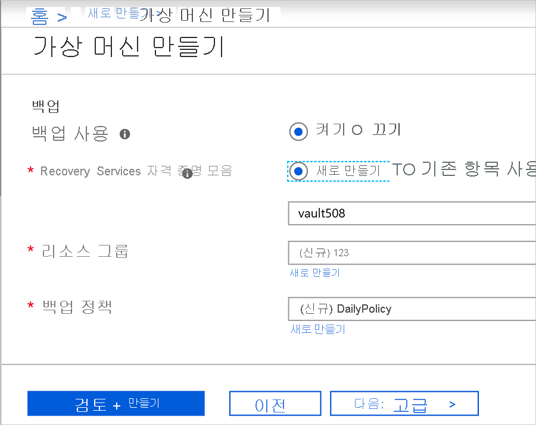
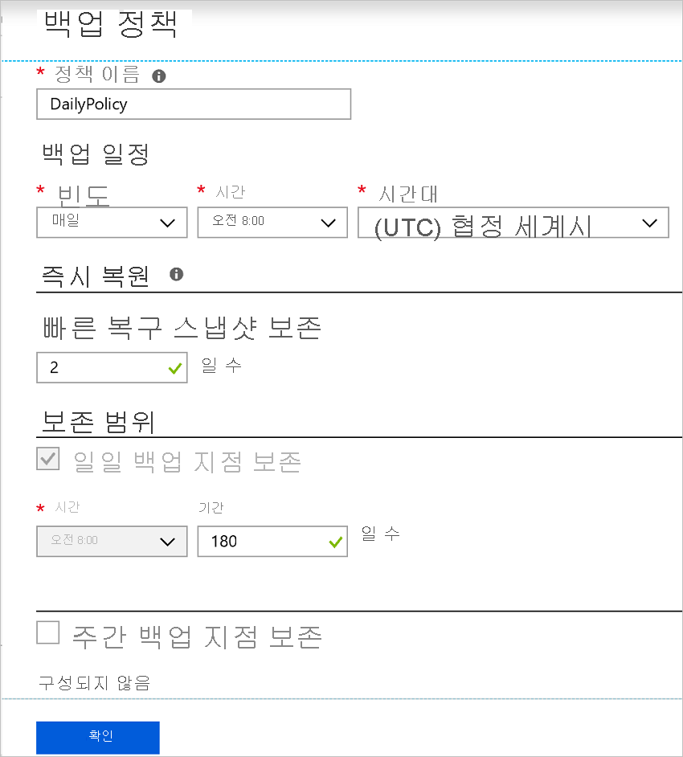

# Azure VM을 만들 때 백업 사용

Azure virtual machines (Vm)를 백업 하기 위해 Azure Backup 서비스를 사용 합니다. 백업 정책에 지정 된 일정에 따라 Vm 백업 및 백업에서 복구 지점이 생성 됩니다. 복구 지점은 Recovery Services 자격 증명 모음에 저장 됩니다.

이 문서에서는 Azure portal에서 가상 머신 (VM)를 만들 때 백업을 사용 하도록 설정 하는 방법을 자세히 설명 합니다.  

## 시작하기 전에

- [확인](backup-support-matrix-iaas.md#supported-backup-actions) VM을 만들 때 backup을 사용 하도록 설정 하면 지원 되는 운영 체제입니다.

## Azure에 로그인

계정에 로그인 이미 하지 않은 경우에 로그인 합니다 [Azure portal](https://portal.azure.com)합니다.

## 백업이 구성 된 VM 만들기

1. Azure portal에서 클릭 **리소스 만들기**합니다.

2. Azure Marketplace에서 클릭 **계산**, VM 이미지를 선택 하 고 있습니다.

3. 에 따라 VM을 설정 합니다 [Windows](https://docs.microsoft.com/azure/virtual-machines/windows/quick-create-portal) 하거나 [Linux](https://docs.microsoft.com/azure/virtual-machines/linux/quick-create-portal) 지침입니다.

4. 에 **관리** 탭의 **백업 사용**, 클릭 **에서**합니다.
5. Recovery Services 자격 증명 모음에 azure Backup 백업 합니다. 클릭 **새로 만들기** 기존 자격 증명 모음을 없는 경우.
6. 제안 된 자격 증명 모음 이름을 그대로 사용 하거나 사용자 고유의 지정 합니다.
7. 지정 하거나 자격 증명 모음을 배치 될 하는 리소스 그룹을 만듭니다. 리소스 그룹 자격 증명 모음의 VM 리소스 그룹에서 다를 수 있습니다.

    

8. 기본 백업 정책을 적용 하거나 설정을 수정 합니다.
    - 백업 정책을 해당 백업 복사본을 유지할 기간 및 VM의 백업 스냅숏을 작성 하는 빈도 지정 합니다.
    - 기본 정책 하루에 한 번 VM을 백업합니다.
    - 매일 또는 매주 백업을 수행 하는 Azure VM에 대 한 사용자 고유의 백업 정책을 사용자 지정할 수 있습니다.
    - [자세한](backup-azure-vms-introduction.md#backup-and-restore-considerations) Azure Vm에 대 한 backup 고려 사항에 대 한 합니다.
    - [자세한](backup-instant-restore-capability.md) 인스턴트에 대 한 기능을 복원 합니다.

      

> [!NOTE]
> Azure Backup 서비스는 명명 형식 사용 하 여 스냅숏을 저장 하려면 (VM 리소스 그룹)을 제외한 별도 리소스 그룹을 만듭니다 **AzureBackupRG_geography_number** (예: AzureBackupRG_northeurope_1). 이 리소스 그룹의 데이터를 기간 (일)에 지정 된 대로 유지 됩니다 *보관 인스턴트 복구 스냅숏을* Azure 가상 머신 백업 정책의 섹션입니다.  이 리소스 그룹에 잠금을 적용 하면 백업 오류가 발생할 수 있습니다. 
제한 정책을 다시 백업 실패를 유발에 리소스 지점 컬렉션을 만들 차단 하는 대로도이 리소스 그룹 이름/태그 제한에서 제외 해야 합니다.

## VM을 만든 후 백업 시작

VM 백업을 백업 정책에 따라 실행 됩니다. 그러나 초기 백업을 실행 하는 것이 좋습니다.

VM을 만든 후 다음을 수행 합니다.

1. VM 속성에서 클릭 **백업**합니다. 초기 백업이 실행 될 때까지 VM 상태는 초기 백업 보류
2. 클릭 **지금 백업** 주문형 백업을 실행할 합니다.

    

## Resource Manager 템플릿을 사용 하 여 보호 된 VM 배포

이전 단계는 가상 머신을 만들고 Recovery Services 자격 증명 모음에서 보호에 Azure portal을 사용 하는 방법에 설명 합니다. 하나 이상의 Vm을 배포 하 고 Recovery Services 자격 증명 모음에서 보호할 신속 하 게, 참조 템플릿을 [Windows VM을 배포 하 고 백업을 사용 하도록 설정](https://azure.microsoft.com/resources/templates/101-recovery-services-create-vm-and-configure-backup/)합니다.

## 다음 단계

VM을 보호 했으므로 이제는 관리 및 복원 하는 방법에 알아봅니다.

- [Vm 관리 및 모니터링](backup-azure-manage-vms.md)
- [VM 복원](backup-azure-arm-restore-vms.md)

문제가 발생 하는 경우 [검토](backup-azure-vms-troubleshoot.md) 문제 해결 가이드입니다.
